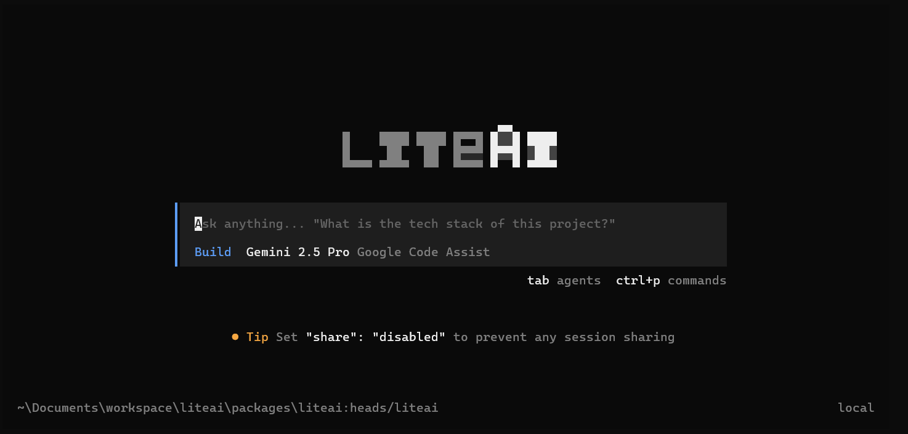

<h1 align="center">
  <a href="https://liteai.ai">
    <picture>
      <source srcset="packages/identity/mark.svg" media="(prefers-color-scheme: dark)">
      <source srcset="packages/identity/mark-light.svg" media="(prefers-color-scheme: light)">
      
    </picture>
  </a>
  LiteAI Agent
</h1>
<p align="center">
  <a href="https://github.com/liteaiagent/liteai/actions/workflows/ci.yml"></a>
</p>

[](https://github.com/liteaiagent/liteai/releases)

---

### Installation

**MacOS/Linux (Recommended):**
```bash
curl -fsSL https://github.com/liteaiagent/liteai/releases/latest/download/install | bash
```

**Homebrew (MacOS/Linux):**
```bash
brew install liteaiagent/tap/liteai
```

**Windows (Recommended):**
```powershell
irm https://github.com/liteaiagent/liteai/releases/latest/download/install.ps1 | iex
```

**Arch Linux (AUR):**
```bash
paru -S liteai-bin
```

**Docker:**
```bash
docker run -it --rm -v $(pwd):/workspace -w /workspace ghcr.io/liteaiagent/liteai
```

### Desktop App (BETA)

LiteAI is also available as a desktop application. Download directly from the [releases page](https://github.com/liteaiagent/liteai/releases).

| Platform              | Download                              |
| --------------------- | ------------------------------------- |
| macOS (Apple Silicon) | `liteai-desktop-darwin-aarch64.dmg` |
| macOS (Intel)         | `liteai-desktop-darwin-x64.dmg`     |
| Windows               | `liteai-desktop-windows-x64.exe`    |
| Linux                 | `.deb`, `.rpm`, or AppImage           |

```bash
# macOS (Homebrew)
brew install --cask liteai-desktop
# Windows (Scoop)
scoop bucket add extras; scoop install extras/liteai-desktop
```

#### Installation Directory

The install script respects the following priority order for the installation path:

1. `$LITEAI_INSTALL_DIR` - Custom installation directory
2. `$XDG_BIN_DIR` - XDG Base Directory Specification compliant path
3. `$HOME/bin` - Standard user binary directory (if it exists or can be created)
4. `$HOME/.liteai/bin` - Default fallback

```bash
# Examples
LITEAI_INSTALL_DIR=/usr/local/bin curl -fsSL https://github.com/liteaiagent/liteai/releases/latest/download/install | bash
XDG_BIN_DIR=$HOME/.local/bin curl -fsSL https://github.com/liteaiagent/liteai/releases/latest/download/install | bash
```

### Agents

LiteAI includes two built-in agents you can switch between with the `Tab` key.

- **build** - Default, full-access agent for development work
- **plan** - Read-only agent for analysis and code exploration
  - Denies file edits by default
  - Asks permission before running bash commands
  - Ideal for exploring unfamiliar codebases or planning changes

Also included is a **general** subagent for complex searches and multistep tasks.
This is used internally and can be invoked using `@general` in messages.

Learn more about [agents](https://liteai.ai/docs/agents).

### Documentation

For more info on how to configure LiteAI, [**head over to our docs**](https://liteai.ai/docs).

### Contributing

If you're interested in contributing to LiteAI, please read our [contributing docs](./CONTRIBUTING.md) before submitting a pull request.

### Building on LiteAI

If you are working on a project that's related to LiteAI and is using "liteai" as part of its name, for example "liteai-dashboard" or "liteai-mobile", please add a note to your README to clarify that it is not built by the LiteAI team and is not affiliated with us in any way.

### FAQ

#### How is this different from Claude Code?

It's very similar to Claude Code in terms of capability. Here are the key differences:

- 100% open source
- Not coupled to any provider. LiteAI can be used with Claude, OpenAI, Google, or even local models. As models evolve, the gaps between them will close and pricing will drop, so being provider-agnostic is important.
- Out-of-the-box LSP support
- Web and TUI Interfaces.
- A client/server architecture. This, for example, can allow LiteAI to run on your computer while you drive it remotely from a mobile app, meaning that the TUI frontend is just one of the possible clients.
