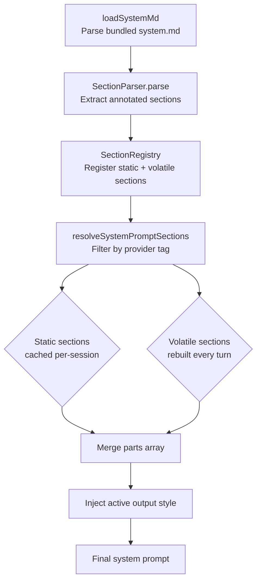
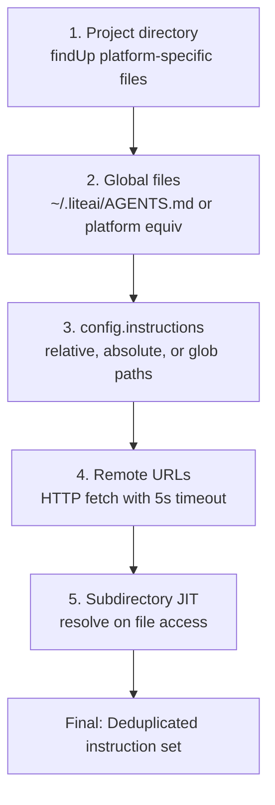

# Context & memory pipeline

> **Source:** `src/session/engine/section-registry.ts`, `src/session/engine/section-parser.ts`, `src/session/engine/instruction.ts`, `src/session/engine/system.ts`, `src/platform/`, `src/agent/memory.ts`

## System prompt assembly

The system prompt is built by `SystemPrompt.resolveSystemPromptSections()` in a multi-phase pipeline:



### Section registry

**Source:** `src/session/engine/section-registry.ts`

The `SectionRegistry` is a singleton that manages all system prompt sections. Each section is registered with a compute function and cached according to its scope:

| Method | Purpose |
|---|---|
| `register(section, compute)` | Register a **static** section (cached after first compute) |
| `DANGEROUS_uncachedSystemPromptSection(section, compute, reason)` | Register a **volatile** section (recomputed every turn). Requires an explicit justification string |
| `resolve(name, ctx?)` | Resolve a section by name — returns cached value for static, recomputes for volatile |
| `clearAll()` | Invalidate all static caches and fire registered clear callbacks |
| `all()` | Return all registered section entries in order |

Each `ParsedSection` has the following shape:

```typescript
interface ParsedSection {
  name: string                           // lowercase identifier (e.g., "environment")
  scope: "static" | "volatile"          // caching behavior
  providers: "all" | Set<ProviderTag>   // which providers see this section
  content: string                        // raw section content
  order: number                          // insertion order
}
```

#### Provider tags

Sections can target specific providers. The `resolveProviderTag()` function maps a model to one of:

| Tag | Matched when |
|---|---|
| `gemini` | Model ID contains `gemini-` |
| `anthropic` | Model ID contains `claude` |
| `openai` | Model ID contains `gpt-` / `o1` / `o3` |
| `codex` | Model ID contains `gpt-5` |
| `google-code-assist` | Provider ID is `google-code-assist` |
| `trinity` | Model ID contains `trinity` (case-insensitive) |
| `default` | No match — fallback |

#### Error taxonomy

The section registry defines 7 typed errors for strict validation:

| Error | When thrown |
|---|---|
| `SystemPromptLoadError` | Failed to load/parse the bundled system.md |
| `MissingSectionMarkerError` | Unclosed `<!-- section:... -->` tag |
| `SectionOrderError` | Static section appears after a volatile section |
| `InvalidSectionAttributeError` | Invalid scope or empty/unknown provider tag |
| `DuplicateSectionError` | Two sections registered with the same name |
| `InvalidVolatileReasonError` | Volatile section registered without a justification reason |
| `UnknownSectionError` | `resolve()` called with an unregistered section name |

### Section parser

**Source:** `src/session/engine/section-parser.ts`

The bundled `system.md` file uses HTML comment annotations to define sections:

```markdown
<!-- section:identity scope:static providers:all -->
You are LiteAI, an AI coding assistant...
<!-- /section -->

<!-- section:environment scope:volatile providers:all -->
{dynamic environment block}
<!-- /section -->

<!-- section:gemini-specific scope:static providers:gemini -->
Gemini-specific instructions...
<!-- /section -->
```

**Parser rules:**
- Section names must be lowercase `[a-z][a-z0-9-]*`
- Scope must be `static` or `volatile`
- Providers can be `all` or a comma-separated list of valid tags
- **Ordering constraint:** All static sections must appear before any volatile sections
- Unclosed sections throw `MissingSectionMarkerError`

### System prompt resolution

**Source:** `src/session/engine/system.ts`

`resolveSystemPromptSections(model, agent?)` assembles the final prompt:

1. If the agent has a custom `prompt`, inject it first and skip global static sections
2. Iterate all registered sections in order
3. For each section, check if its `providers` filter matches the current model's provider tag
4. Resolve matching sections (static from cache, volatile via recompute)
5. Track a `staticBoundary` index separating cacheable from volatile parts
6. Inject the active **output style** (if configured via `style/style.ts`)
7. Return `{ parts: string[], boundary: number }`

The **environment** section is the primary volatile section. It includes:
- Model ID and provider
- Working directory and workspace root
- Git repo status
- Platform and shell
- Current date
- Additional configured directories

---

## Instruction loading chain

**Source:** `src/session/engine/instruction.ts`

Instructions (AGENTS.md and equivalents) are loaded in priority order:



### Step 1: Project instructions

Search from `Instance.directory` up to `Instance.worktree` using `findUp()`. The filenames searched depend on the active platform profile (e.g., `AGENTS.md` for standard, `CLAUDE.md` for Claude Code). Stops at the first match.

### Step 2: Global instructions

Checked in order (first existing file wins):
1. `$LITEAI_CONFIG_DIR/AGENTS.md` (if `LITEAI_CONFIG_DIR` is set)
2. `~/.liteai/AGENTS.md`
3. Platform-specific global paths (e.g., `~/.claude/CLAUDE.md`)

### Step 3: Config-defined instructions

Paths in `config.instructions` array are resolved as:
- **Absolute paths:** Glob-expanded from the directory
- **Relative paths:** Resolved via `globUp()` from `Instance.directory`
- **`~/` prefix:** Expanded to home directory
- **HTTP/HTTPS URLs:** Skipped here (handled in step 4)

### Step 4: Remote URLs

URLs starting with `http://` or `https://` are fetched with a **5-second timeout** via `AbortSignal.timeout(5000)`. Failures are logged and silently skipped.

### Step 5: Subdirectory JIT loading

When the agent accesses files in subdirectories, `InstructionPrompt.resolve()` walks from the file's directory up to the project root, loading any intermediate instruction files that:
- Are not already in the system prompt
- Are not already loaded via tool results
- Have not been claimed for the current message (claim guard prevents duplicates)

### Claim guard

A per-message claim system (`isClaimed` / `claim`) prevents the same instruction file from being injected twice into a single message, even across multiple tool calls within the same turn.

---

## Platform profiles

**Source:** `src/platform/profile.ts`, `src/platform/profiles/`, `src/platform/index.ts`

LiteAI supports 4 platform profiles, selected via `LITEAI_PLATFORM` environment variable. When no platform is selected, LiteAI defaults to its own conventions.

| Profile | ID | Dirs | Instruction file | Global path | mcp.json | Schema compat |
|---|---|---|---|---|---|---|
| **Standard** | `standard` | `.agents` | `AGENTS.md` | `~/.agents/AGENTS.md` | No | No |
| **Claude Code** | `claude` | `.claude` | `CLAUDE.md` | `~/.claude/CLAUDE.md` | Yes | Yes |
| **Gemini CLI** | `gemini` | `.gemini` | `GEMINI.md` | `~/.gemini/GEMINI.md` | No | No |
| **Codex** | `codex` | `.codex` | `CODEX.md` | `~/.codex/CODEX.md` | No | No |

### PlatformProfile interface

```typescript
interface PlatformProfile {
  readonly id: string
  readonly name: string
  readonly dirs: string[]                              // directories to scan for agents/skills
  readonly instructionFiles: string[]                  // instruction file basenames
  globalInstructionPaths(home: string): string[]       // absolute global instruction paths
  readonly mcpJson: boolean                            // enable .mcp.json discovery
  readonly schemaCompat: boolean                       // enable provider-specific agent schema fields
  permissionTransform?(value: Config.Agent): Ruleset   // map agent frontmatter → permission rules
  readonly toolNameMap?: Record<string, string>        // map platform tool names → liteai tool IDs
}
```

### Claude Code compatibility

The `claude` profile enables full schema compatibility:

- **`permissionTransform`** — Maps Claude Code agent frontmatter fields to LiteAI permission rules:
  - `permissionMode: "dontAsk"` / `"bypassPermissions"` → `*: allow`
  - `permissionMode: "plan"` → `*: deny` + read-only tools allowed
  - `permissionMode: "acceptEdits"` → `edit: allow`, `write: allow`
  - `tools` → Allowed tool list (implies `*: deny` base)
  - `disallowedTools` → Denied tool list

- **`toolNameMap`** — Maps Claude Code PascalCase tool names to LiteAI IDs:

  | Claude Code | LiteAI |
  |---|---|
  | `Edit` | `edit` |
  | `Write` | `write` |
  | `Read` | `read` |
  | `Bash` | `run_command` |
  | `Agent` | `task` |
  | `ExitPlanMode` | `plan_exit` |
  | `Glob`, `Grep`, `List` | `glob`, `grep`, `list` |
  | `NotebookEdit` | `multiedit` |

### Platform selection

```typescript
// Returns active profile or undefined (LiteAI mode)
Platform.active(): PlatformProfile | undefined

// When no platform is active:
Platform.instructionFiles()  // → ["AGENTS.md"]
Platform.dirs()              // → []
```

---

## Agent memory

**Source:** `src/agent/memory.ts`

Per-agent, per-scope memory persisted as `MEMORY.md` files.

### Memory scopes

| Scope | Directory | Purpose |
|---|---|---|
| `user` | `~/.liteai/memory/<agent>/` | User-wide persistent memory |
| `project` | `<project>/.liteai/memory/<agent>/` | Project-specific memory |
| `local` | `<worktree>/.liteai/memory/<agent>/` | Worktree-local memory |

Priority: `local > project > user`

### Auto-memory enablement

`isAutoMemoryEnabled()` checks in order:

1. **Env var:** `LITEAI_DISABLE_AUTO_MEMORY` — if set (and not `"false"`), disabled
2. **Headless detection:** Disabled if `CI=true`, `SSH_CLIENT` is set, or `stdout` is not a TTY
3. **Config:** `experimental.agent_memory` setting
4. **Default:** Enabled

### Memory tools

Tools: `readMemory`, `writeMemory`, `editMemory` — with path traversal guards via `isAgentMemoryPath()`.

### Memory prompt injection

`loadAgentMemoryPrompt(agentType, scope)` reads the `MEMORY.md` file for the given scope and returns a formatted prompt block:

```
Agent memory is scoped to {scope} at {memDir}.
You can use Read/Write/Edit memory tools to persist context across sessions.
Current memory:
<memory>
{content or "(Empty)"}
</memory>
```

### Project-to-local snapshot

When `AGENT_MEMORY_SNAPSHOT=true`, the system can detect when project-scoped memory is newer than local memory and copy it down:

- `checkAgentMemorySnapshot()` — Returns `true` if project MEMORY.md exists and is newer than local
- `copyProjectSnapshotToLocal()` — Copies project MEMORY.md to local scope

### Planned: Unified memory

The per-agent model is being replaced with project-scoped memory under `~/.liteai/projects/<id>/memory/`. See [Context & memory roadmap](/roadmap/context-memory-roadmap).

## What's next?

- [**Instructions & memory**](/getting-started/memory) — User guide
- [**Session engine**](/architecture/session-engine) — How the pipeline feeds the loop
- [**Security model**](/architecture/security-model) — Permission system and sandbox modes
