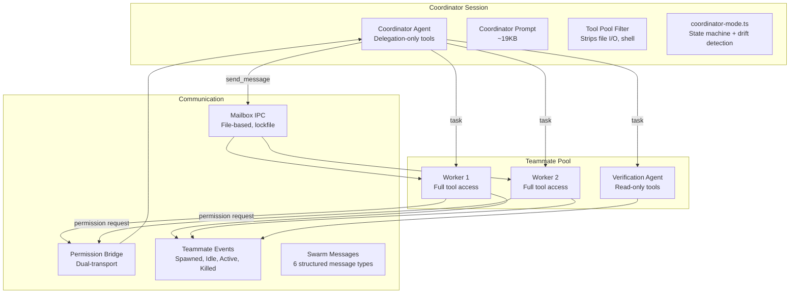
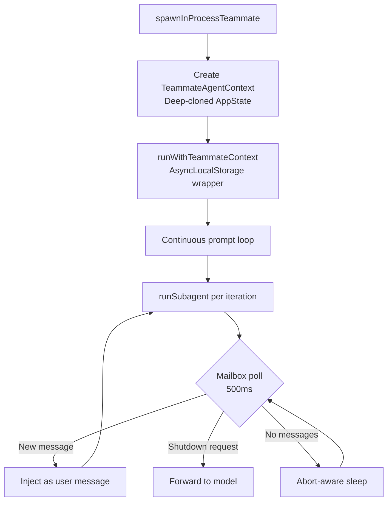
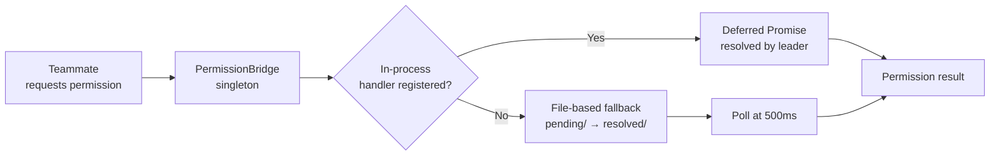

# Coordinator & swarms

> **Source:** `src/coordinator/` (17 modules)
> **Last verified against code:** 2026-05-13
> **Status:** 114/117 features implemented ✅

The coordinator system enables multi-agent orchestration where a lead agent delegates work to specialized teammate agents. This is LiteAI's most advanced execution model.

## Architecture overview



## Module inventory

| Module | Purpose |
|---|---|
| `coordinator-mode.ts` | State machine, mode detection, tool filtering |
| `coordinator-prompt.ts` | 19KB coordinator system prompt |
| `teammate-runner.ts` | Continuous prompt loop with mailbox polling |
| `teammate-spawn.ts` | Teammate creation and registration |
| `teammate-context.ts` | AsyncLocalStorage-based execution isolation |
| `teammate-types.ts` | Identity, task state, and utility types |
| `teammate-events.ts` | Bus events for teammate lifecycle |
| `teammate-mailbox.ts` | File-based messaging with lockfile concurrency |
| `teammate-prompt-addendum.ts` | Additional prompt context for teammates |
| `permission-bridge.ts` | Dual-transport permission forwarding |
| `permission-bridge-handler.ts` | Leader-side permission resolution |
| `permission-sync.ts` | Permission request creation and synchronization |
| `swarm-messages.ts` | 6 typed Zod-validated message schemas |
| `built-in-agents.ts` | Default worker and verification agent profiles |
| `verification-agent.ts` | Adversarial verification agent (6.9KB prompt) |
| `team-helpers.ts` | Scratchpad directory, team config, cleanup |
| `index.ts` | Public exports |

## Coordinator mode

### State machine

**Source:** `src/coordinator/coordinator-mode.ts`

Coordinator mode is **session-scoped** and set via `Flag.LITEAI_COORDINATOR_MODE`. Once enabled:

1. The agent's system prompt is replaced with the **coordinator prompt** (~19KB)
2. The tool pool is filtered to delegation-only tools
3. Fork mode is disabled (mutually exclusive)
4. Mode is persisted in session metadata and restored on resume

**Drift detection:** On session resume, `matchSessionMode()` detects if the coordinator flag has changed since the session was created. The session's stored mode is authoritative — the env var is synced to match, with a warning logged.

### Tool pool restriction

In coordinator mode, the agent can ONLY use:

| Tool | Purpose |
|---|---|
| `task` | Spawn a worker agent (or fork) |
| `send_message` | Send a message to a running/stopped worker |
| `task_stop` | Force-stop a worker |
| `team_create` | Create a team with multiple teammates |
| `team_delete` | Disband a team and force-kill all members |
| `yield_turn` | Wait for workers to complete |
| `structured_output` | Return structured data (when JSON schema mode active) |

All other tools (file I/O, shell, search, web) are stripped from the coordinator's pool. The coordinator also provides a **worker capabilities context** listing what tools workers have access to, including any connected MCP server tools.

## Teammate runner

### In-process execution

**Source:** `src/coordinator/teammate-runner.ts` (20KB)

Teammates run **in-process** using `AsyncLocalStorage` for context isolation:



### Teammate context isolation

**Source:** `src/coordinator/teammate-context.ts`

Each teammate gets an isolated execution context via `createTeammateContext()`:

| Property | Isolation level |
|---|---|
| `AppState` | Deep-cloned snapshot (no shared mutable state) |
| `AbortController` | Independent lifecycle controller |
| `readFileState` | Shallow-cloned from parent |
| `contentReplacementState` | Deep-cloned from parent |
| `shouldAvoidPermissionPrompts` | Forced `true` (background agent) |
| `setAppStateForTasks` | Punches through to root store for task registration |

### Teammate identity

**Source:** `src/coordinator/teammate-types.ts`

Teammates are identified by a composite ID: `agentName@teamName`. The `TeammateIdentity` includes:

```typescript
interface TeammateIdentity {
  agentId: string            // "researcher@alpha"
  agentName: string          // "researcher"
  teamName: string           // "alpha"
  color?: string             // UI color
  planModeRequired: boolean  // force plan mode
  parentSessionId: string    // leader session ID
}
```

### Teammate task state

Each teammate's runtime state is tracked in `TeammateTaskState`:

| Field | Purpose |
|---|---|
| `status` | `running` \| `idle` \| `completed` \| `failed` \| `killed` |
| `abortController` | Lifecycle controller (runtime-only, not persisted) |
| `currentWorkAbortController` | Per-turn controller |
| `messages` | Capped UI mirror (max 50 messages) |
| `pendingUserMessages` | External messages queued before next poll |
| `awaitingPlanApproval` | Plan mode approval state |
| `currentSessionId` | Child session ID for current iteration |

### Built-in agent profiles

| Profile | Description | Tool restrictions |
|---|---|---|
| **Default worker** | Full tool access, standard system prompt | None |
| **Verification agent** | Read-only, adversarial review (~6.9KB prompt) | Write/edit/delete/patch tools blocked |

The **verification agent** receives a dedicated adversarial prompt and reports findings as:
```
VERDICT: PASS | FAIL | PARTIAL
```

## Mailbox IPC

### File-based messaging

**Source:** `src/coordinator/teammate-mailbox.ts`

Teammates communicate through a file-based mailbox system with `proper-lockfile` concurrency guards:

| Operation | Description |
|---|---|
| `writeToMailbox()` | Append message to teammate's inbox |
| `readMailbox()` | Read all messages |
| `markMessageAsReadByIndex()` | Mark specific message as processed |
| `clearMailbox()` | Clear all messages |

### Message routing

| Target state | Behavior |
|---|---|
| **Running** | Message queued for delivery at next 500ms poll |
| **Stopped** | Auto-resume teammate with message as new prompt |
| **Broadcast (`to: "*"`)** | Message delivered to all teammates |

### Structured swarm messages

**Source:** `src/coordinator/swarm-messages.ts`

The swarm uses 6 typed Zod-validated message schemas with factory functions and type guards:

| Message type | Fields | Purpose |
|---|---|---|
| `idle_notification` | `agent_id`, `reason` (available/interrupted/failed/plan_completed), `detail?` | Worker reports it's waiting |
| `shutdown_request` | `reason?` | Coordinator asks worker to stop |
| `shutdown_approved` | `agent_id` | Worker accepts shutdown |
| `shutdown_rejected` | `agent_id`, `reason` | Worker declines shutdown |
| `plan_approval_request` | `request_id`, `plan_summary` | Worker requests plan sign-off |
| `plan_approval_response` | `request_id`, `approve`, `feedback?` | Coordinator responds to plan |

All messages can be detected via `isStructuredProtocolMessage()` aggregate type guard.

### Teammate lifecycle events

**Source:** `src/coordinator/teammate-events.ts`

Bus events published via `Bus.publish()` for SSE delivery to connected clients:

| Event | When fired | Payload |
|---|---|---|
| `teammate.spawned` | New teammate registered in AppState | teamName, agentId, agentName, color, taskId, parentSessionId |
| `teammate.idle` | Teammate enters idle polling loop | teamName, agentId, reason (available/interrupted/failed), summary |
| `teammate.active` | Teammate receives new prompt | teamName, agentId, prompt |
| `teammate.killed` | Teammate force or graceful shutdown | teamName, agentId, reason |

## Permission bridge

### Dual-transport design

**Source:** `src/coordinator/permission-bridge.ts`, `permission-bridge-handler.ts`, `permission-sync.ts`

Teammate permission requests are resolved through a dual-transport bridge:



| Transport | When used | Latency |
|---|---|---|
| **In-process** | Same-process teammates (default) | ~0ms (promise resolution) |
| **File-based** | Cross-process teammates (future) | 500ms polling |

### Permission flow

The full permission path for teammates:

1. **Teammate classifier** (`src/permission/teammate-classifier.ts`) — Pre-approval for command permissions (10s timeout)
2. **Permission bridge** — Forward to leader if classifier returns DANGEROUS/null
3. **Leader resolution** — Leader UI prompts or auto-resolves
4. **PrePermissionDeny hook** — Fallback if bridge is not registered

### Teammate classifier

**Source:** `src/permission/teammate-classifier.ts`

Before hitting the permission bridge, a classifier can **pre-approve** certain actions based on the coordinator's context:

1. Build a pseudo-transcript from the teammate's recent actions
2. Run the classifier (10s timeout)
3. If approved → skip bridge, execute directly
4. If denied → forward to bridge for leader decision

Pre-approval rules are scoped to the requesting teammate only — no team-wide propagation.

## Team helpers

**Source:** `src/coordinator/team-helpers.ts`

| Helper | Purpose |
|---|---|
| `teamScratchpadDir()` | Shared directory for team artifacts |
| Team name sanitization | Prevent path traversal in team names |
| Team config read/write | Persist team composition |
| Cleanup on session exit | Remove team directories |

## What's next?

- [**Run agent teams**](/build/agent-teams) — User guide for coordinator mode
- [**Security model**](/architecture/security-model) — Permission system internals
- [**Session engine**](/architecture/session-engine) — How the base loop works
