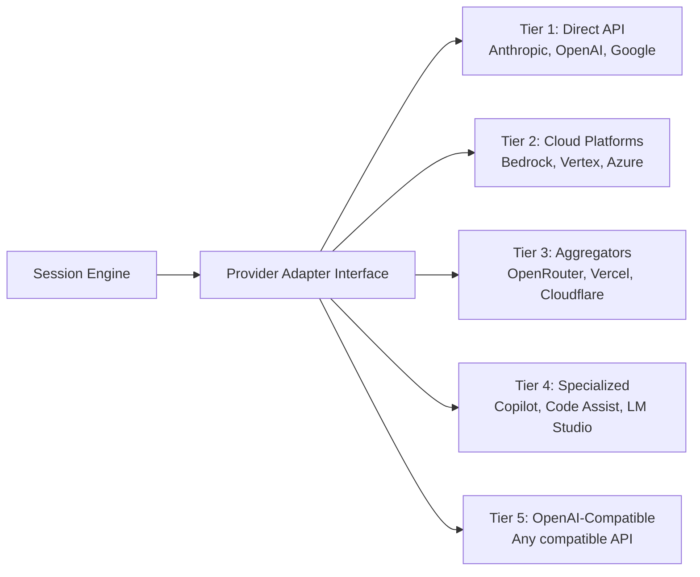
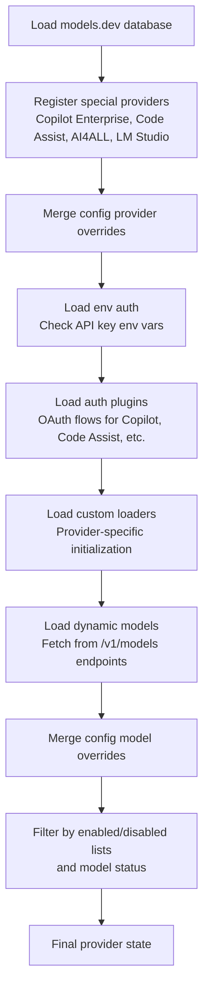

# Provider system

> **Source:** `src/provider/`
> **Last verified against code:** 2026-05-13

LiteAI uses an adapter pattern to normalize communication across different LLM providers. This lets users switch providers without changing their workflow.

## Adapter architecture



Each adapter implements a common interface that handles:

| Responsibility | Description |
|---|---|
| **Request normalization** | Convert LiteAI's internal message format to the provider's API schema |
| **Response streaming** | Parse provider-specific SSE streams into a unified event format |
| **Token counting** | Track token usage per request/response via model limits |
| **Tool formatting** | Convert tool definitions to provider-specific schemas |
| **Error mapping** | Normalize provider errors into LiteAI's error model |
| **Capability detection** | Report input/output modalities, reasoning, tool calling, and attachment support |

## Supported providers

LiteAI supports 20+ providers through its loader system. All loaders are registered in `src/provider/loaders/index.ts`.

### Tier 1 — Direct API providers

| Provider | Loader | Models | Auth | SDK |
|---|---|---|---|---|
| **Anthropic** | `anthropic.ts` | Claude 4, Sonnet, Haiku | `ANTHROPIC_API_KEY` | `@ai-sdk/anthropic` |
| **OpenAI** | `openai.ts` | GPT-5, o1, o3 | `OPENAI_API_KEY` (or Codex auth) | `@ai-sdk/openai` |
| **Google** | *(models.dev)* | Gemini 2.5, 3.0 | `GOOGLE_API_KEY` or OAuth | `@ai-sdk/google` |

### Tier 2 — Cloud platform providers

| Provider | Loader | Description | Auth |
|---|---|---|---|
| **AWS Bedrock** | `amazon-bedrock.ts` | Anthropic, Meta, Mistral models via AWS | `AWS_ACCESS_KEY_ID`, `AWS_SECRET_ACCESS_KEY`, `AWS_REGION` |
| **Google Vertex** | `google-vertex.ts` | Gemini models via GCP; also Anthropic models via Vertex | `GOOGLE_APPLICATION_CREDENTIALS` |
| **Azure** | `azure.ts` | OpenAI models via Azure OpenAI Service | `AZURE_OPENAI_API_KEY`, `AZURE_OPENAI_ENDPOINT` |
| **Azure Cognitive Services** | `azure.ts` | Azure AI Services | Azure AD / Managed Identity |

### Tier 3 — Aggregator & gateway providers

| Provider | Loader | Description | Auth |
|---|---|---|---|
| **OpenRouter** | `openrouter.ts` | Multi-provider router | `OPENROUTER_API_KEY` |
| **Vercel** | `vercel.ts` | Vercel AI Gateway | `VERCEL_API_KEY` |
| **Cloudflare Workers AI** | `cloudflare.ts` | Cloudflare-hosted models | Cloudflare API token |
| **Cloudflare AI Gateway** | `cloudflare.ts` | Cloudflare proxy gateway | Cloudflare API token |
| **Zenmux** | `zenmux.ts` | Model multiplexer | Provider-specific |
| **Kilo** | `kilo.ts` | Kilo AI platform | Provider-specific |

### Tier 4 — Specialized & enterprise providers

| Provider | Loader | Description | Auth |
|---|---|---|---|
| **GitHub Copilot** | `github-copilot.ts` | Copilot-hosted models | OAuth (via auth plugin) |
| **GitHub Copilot Enterprise** | `github-copilot.ts` | Enterprise Copilot | OAuth (via auth plugin) |
| **Google Code Assist** | `google-code-assist.ts` | Google's coding assistant API | OAuth (via auth plugin) |
| **GitLab** | `gitlab.ts` | GitLab AI provider | GitLab token |
| **SAP AI Core** | `sap-ai-core.ts` | SAP enterprise AI | SAP credentials |
| **AI4ALL** | `ai4all.ts` | AI4ALL platform | `AI4ALL_API_KEY` (via auth plugin) |
| **Opencode** | `opencode.ts` | Opencode API | Provider-specific |

### Tier 5 — Local & self-hosted

| Provider | Loader | Description | Auth |
|---|---|---|---|
| **LM Studio** | `lmstudio.ts` | Local model server | None (local) |
| **OpenAI-Compatible** | *(via config)* | Any API matching the OpenAI spec | `apiKey` in provider config |

## Provider resolution

The provider system uses a multi-phase resolution pipeline:



### Resolution phases

1. **Database initialization** — Load the `models.dev` model catalog as the base provider/model database
2. **Special registration** — Register providers that aren't in models.dev (Copilot Enterprise, Code Assist, AI4ALL, LM Studio)
3. **Config merge** — Apply user `settings.json` provider overrides (name, env, options, npm)
4. **Environment auth** — Scan environment variables for API keys matching each provider's `env` array
5. **Auth plugins** — Run registered auth plugins (Codex for OpenAI, Copilot OAuth, Code Assist OAuth, AI4ALL)
6. **Custom loaders** — Execute provider-specific loaders that may modify options, supply SDK factories, or define custom `getModel` resolvers
7. **Dynamic models** — For providers with `dynamicModels` config, fetch available models from their `/v1/models` endpoint
8. **Model overrides** — Apply per-model config overrides (cost, limits, capabilities, variants)
9. **Filtering** — Remove disabled providers, deprecated models, alpha models (unless enabled), and blacklisted models

### Provider sources

Each provider's `source` field indicates how it was activated:

| Source | Meaning |
|---|---|
| `env` | Activated via environment variable API key |
| `config` | Explicitly configured in `settings.json` |
| `api` | Authenticated via auth plugin (OAuth, etc.) |
| `custom` | Activated by a custom loader |

## Model capabilities

Each model reports its capabilities through a standardized interface:

```typescript
interface ModelCapabilities {
  temperature: boolean          // Supports temperature parameter
  reasoning: boolean            // Extended thinking / chain-of-thought
  attachment: boolean           // Supports file attachments
  toolcall: boolean             // Supports function/tool calling
  input: {
    text: boolean               // Text input
    audio: boolean              // Audio input
    image: boolean              // Image/vision input
    video: boolean              // Video input
    pdf: boolean                // PDF input
  }
  output: {
    text: boolean               // Text output
    audio: boolean              // Audio output
    image: boolean              // Image generation
    video: boolean              // Video generation
    pdf: boolean                // PDF generation
  }
  interleaved: boolean | {      // Interleaved reasoning content
    field: "reasoning_content" | "reasoning_details"
  }
}
```

The session engine uses these capabilities to:
- Enable/disable reasoning blocks in the system prompt
- Choose compaction strategy based on context window size
- Select the right tool format (JSON schema vs. XML)
- Determine if the model supports file attachments (images, PDFs)

## Model metadata

Each model carries additional metadata beyond capabilities:

```typescript
interface ModelMetadata {
  id: ModelID                   // Canonical model identifier
  providerID: ProviderID        // Parent provider
  name: string                  // Human-readable name
  family: string                // Model family (e.g., "claude-4")
  status: "alpha" | "beta" | "active" | "deprecated"
  release_date: string          // ISO date string
  cost: {
    input: number               // Cost per million input tokens
    output: number              // Cost per million output tokens
    cache: { read: number; write: number }
  }
  limit: {
    context: number             // Max input context tokens
    output: number              // Max output tokens
    input?: number              // Max input tokens (if different from context)
  }
  api: {
    id: string                  // API-level model identifier
    url: string                 // Provider API base URL
    npm: string                 // AI SDK package name
  }
  variants: Record<string, Record<string, any>>  // Model variants (e.g., search, thinking)
}
```

## Dynamic model discovery

Providers can enable automatic model discovery via `dynamicModels` in their config or custom loader. When enabled:

1. LiteAI fetches the provider's OpenAI-compatible `/v1/models` endpoint
2. Discovered model IDs are enriched with capability data from the models.dev database where available
3. The resulting models fully replace the static models.dev list for that provider
4. If the fetch fails, the system falls back to `fallbackModelIds` → static models → models.dev entries

```json
{
  "provider": {
    "my-provider": {
      "api": "https://api.example.com/v1",
      "dynamicModels": true,
      "options": {
        "apiKey": "sk-..."
      }
    }
  }
}
```

## Streaming

All providers use SSE (Server-Sent Events) for response streaming. The adapter layer normalizes provider-specific stream formats into a unified event model:

| Event type | Content |
|---|---|
| `text_delta` | Incremental text content |
| `tool_use_start` | Tool call initiated (name + ID) |
| `tool_use_delta` | Incremental tool arguments |
| `tool_use_end` | Tool call complete |
| `thinking_delta` | Thinking/reasoning content |
| `message_complete` | Response finished |
| `error` | Provider error |

## Authentication

### Environment variable auth

Most providers authenticate via API keys set in environment variables:

| Provider | Environment variable |
|---|---|
| Anthropic | `ANTHROPIC_API_KEY` |
| OpenAI | `OPENAI_API_KEY` |
| Google | `GOOGLE_API_KEY` |
| Bedrock | `AWS_ACCESS_KEY_ID`, `AWS_SECRET_ACCESS_KEY` |
| Vertex | `GOOGLE_APPLICATION_CREDENTIALS` |
| OpenRouter | `OPENROUTER_API_KEY` |
| AI4ALL | `AI4ALL_API_KEY` |

### Auth plugins

Four providers use dedicated auth plugins registered in `src/auth/registry.ts`:

| Plugin | Provider | Flow |
|---|---|---|
| `CodexAuth` | OpenAI | Codex-style authentication |
| `CopilotAuth` | GitHub Copilot / Enterprise | GitHub OAuth device flow |
| `CodeAssistAuth` | Google Code Assist | Google OAuth |
| `Ai4allAuth` | AI4ALL | API key auth |

### Config-based auth

Credentials can also be set in `settings.json` under the `provider` key:

```json
{
  "provider": {
    "anthropic": {
      "options": {
        "apiKey": "sk-ant-..."
      }
    }
  }
}
```

## SDK bridge

**Source:** `src/provider/sdk.ts`

LiteAI uses the [Vercel AI SDK](https://sdk.vercel.ai/) as its provider abstraction layer. Each provider maps to an AI SDK package (`npm` field on models) that is dynamically imported at runtime.

The SDK bridge (`src/provider/sdk.ts`) resolves `LanguageModelV2` instances from provider options, handling:

- Dynamic import of the correct `@ai-sdk/*` package
- Custom model loaders for providers with non-standard APIs
- SDK instance caching to avoid redundant initialization
- Variable injection for providers needing custom environment (e.g., `vars` loaders)

Bundled SDK packages are registered in `src/provider/loaders/bundled.ts` and include: `@ai-sdk/anthropic`, `@ai-sdk/openai`, `@ai-sdk/google`, `@ai-sdk/amazon-bedrock`, `@ai-sdk/azure`, `@ai-sdk/google-vertex`, `@ai-sdk/openai-compatible`, `@openrouter/ai-sdk-provider`, `@ai-sdk/cerebras`, `@ai-sdk/vercel`, `@gitlab/gitlab-ai-provider`, and more.

## What's next?

- [**Session engine & loop**](/architecture/session-engine) — How the engine uses providers
- [**Transport channels**](/architecture/transport-channels) — How responses reach clients
- [**Settings reference**](/configuration/settings) — Provider configuration options
