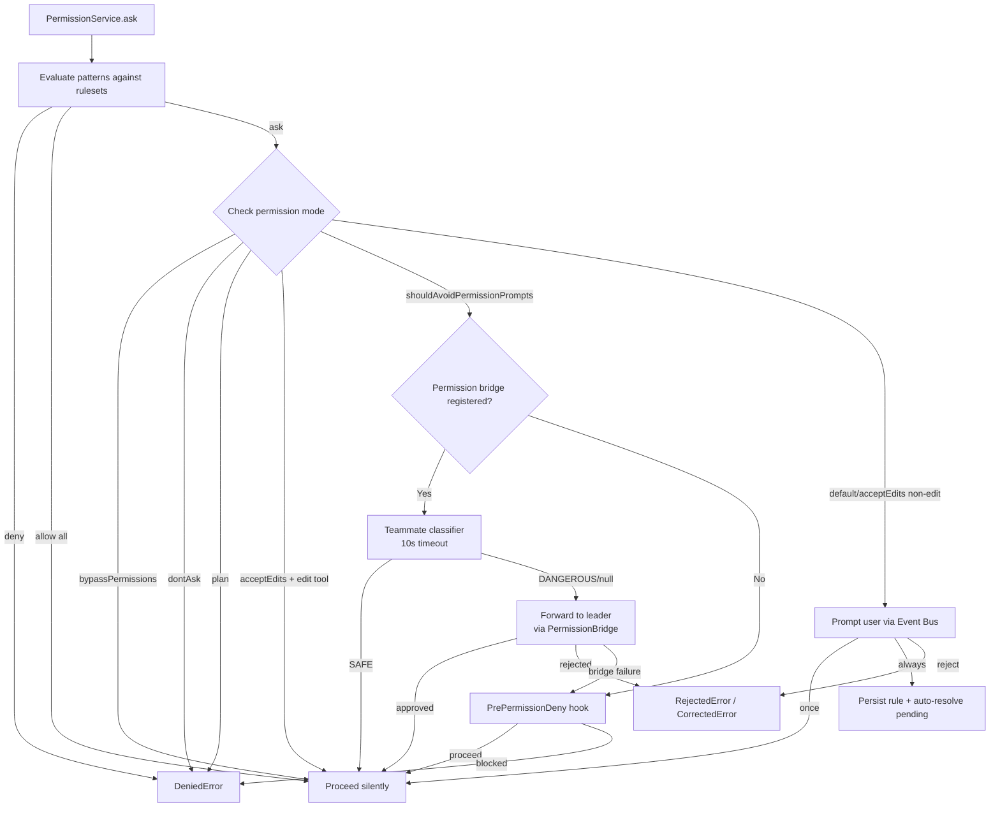
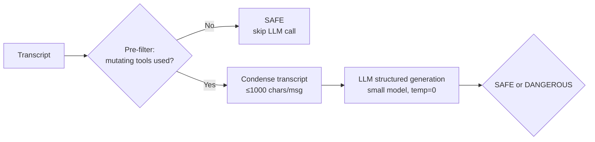

# Security model

> **Source:** `src/permission/`, `src/auth/`, `src/isolation/`, `src/server/middleware.ts`

## Middleware stack

Every HTTP request passes through 7 middleware layers:

| Order | Middleware | Purpose |
|---|---|---|
| 1 | `requestTracer()` | OpenTelemetry span creation (`liteai-server` tracer) |
| 2 | `requestLogger()` | Request/response audit logging with SSE-aware timer |
| 3 | `corsMiddleware()` | CORS headers — allows `localhost`, `127.0.0.1`, `tauri://localhost`, and custom origins |
| 4 | `csrfMiddleware()` | CSRF token validation via `Authorization: Bearer <token>` against `LITEAI_SERVER_CSRF_TOKEN` |
| 5 | `authMiddleware()` | HTTP Basic Auth (`LITEAI_SERVER_USERNAME` / `LITEAI_SERVER_PASSWORD`). OPTIONS bypass for CORS preflight |
| 6 | `projectContextMiddleware()` | Resolves `:projectID` → project → `Instance.provide()` with workspace context |
| 7 | `errorHandler()` | Structured error responses — `NamedError` → JSON with appropriate HTTP status |

---

## Permission service

**Source:** `src/permission/service.ts`

The `PermissionService` is an Effect-based service that manages tool-call authorization through a multi-phase pipeline.

### Permission pipeline



### Permission modes

| Mode | Rank | Behavior |
|---|---|---|
| `plan` | 1 | Deny all write/execute actions |
| `default` | 2 | Prompt for each new action type |
| `bubble` | 3 | Bubble permission to parent agent |
| `acceptEdits` | 4 | Auto-approve edit/write/multiedit/apply_patch; prompt for others |
| `dontAsk` | 5 | Deny all — no prompts, no approvals |
| `bypassPermissions` | 6 | Auto-approve everything |

### Ruleset evaluation

**Source:** `src/permission/service.ts` — `evaluate()`

Rules are evaluated with **last-match-wins** semantics using wildcard pattern matching:

```typescript
function evaluate(permission: string, pattern: string, ...rulesets: Ruleset[]): Rule
```

Each `Rule` has:
- `permission` — Tool name pattern (supports `*` wildcard)
- `pattern` — Path/argument pattern (supports `*` wildcard, `~/` expansion)
- `action` — `"allow"` | `"deny"` | `"ask"`

### Durable rules

When a user replies `"always"`, the approved rule is:
1. Added to the in-memory ruleset
2. Persisted to SQLite via `PermissionTable` (project-scoped)
3. Used to auto-resolve any other pending requests in the same session that now match

### Error types

| Error | When raised |
|---|---|
| `DeniedError` | A ruleset or mode explicitly blocks the action |
| `RejectedError` | The user (or leader) rejected the permission prompt |
| `CorrectedError` | The user rejected with feedback text |

---

## Permission arity

**Source:** `src/permission/arity.ts`

The `BashArity` module determines the "human-understandable command" from a shell command by extracting the meaningful prefix:

```
npm run dev  →  "npm run dev"  (arity 3)
git checkout main  →  "git checkout"  (arity 2)
touch foo.txt  →  "touch"  (arity 1)
```

This is used to create permission patterns that match at the right granularity — users approve `npm run` rather than every unique `npm run <script>` invocation.

The arity dictionary contains 60+ command mappings organized by ecosystem (system utils, package managers, cloud CLIs, container tools, language toolchains).

---

## Safety classifiers

### YOLO classifier

**Source:** `src/permission/classifier.ts`

A 3-step LLM-based safety classifier for evaluating sub-agent transcripts:



**Pre-filter** checks for these mutating tools: `run_command`, `write_to_file`, `multi_replace_file_content`, `replace_file_content`, `send_command_input`, `delete_file`. If none are found, returns `SAFE` without an LLM call.

**Transcript condensation:**
- Non-string content is JSON-serialized
- Read-only tool results (`read_file`, `view_file`, `list_dir`, `grep_search`, `search`) are replaced with `[tool result omitted — N chars]`
- Messages are truncated to 1,000 characters

**LLM classification:**
- Uses the provider's small model via `Provider.getSmallModel()`
- Structured output via `generateObject()` with a Zod schema
- 30-second timeout (`AbortSignal.timeout`)
- Temperature 0 for deterministic results

**Classification rules (from system prompt):**

| SAFE | DANGEROUS |
|---|---|
| Files within project directory | Scripts downloaded from internet (`curl \| bash`) |
| Build/test/lint commands | System file modifications |
| Task-relevant file changes | Data exfiltration via network |
| Designated temp/scratch dirs | Credential/SSH key modification |
| | Force-push without instruction |
| | System package installation |

### Teammate classifier

**Source:** `src/permission/teammate-classifier.ts`

Adapts the YOLO classifier for teammate pre-approval with tighter constraints:

- **Scope:** Only classifies command execution permissions (`run_command`, `bash`, `execute`, `shell`)
- **Timeout:** 10 seconds (vs. 30s for full classifier)
- **Input:** Builds a synthetic 2-message pseudo-transcript from the command metadata
- **Output:** `"SAFE"` (auto-approve), `"DANGEROUS"` (forward to leader), or `null` (unavailable/timeout — forward to leader)

---

## Permission sandbox

**Source:** `src/permission/sandbox.ts`

The `PermissionSandbox` controls how permission modes propagate from parent agents to child agents:

### Mode ranking & escalation

```
plan(1) < default(2) < bubble(3) < acceptEdits(4) < dontAsk(5) < bypassPermissions(6)
```

**Rule:** A child agent can never have a *less restrictive* mode than its parent. If the parent's rank is higher (more permissive), the child inherits the parent's mode.

### Async permission suppression

When `options.isAsync && !options.canShowPermissionPrompts`:
- `shouldAvoidPermissionPrompts` is set to `true`
- The agent cannot directly prompt the user
- Permission requests route through the teammate classifier → permission bridge → PrePermissionDeny hook chain

---

## Permission next resolver

**Source:** `src/permission/next.ts`

The `PermissionNext` namespace provides the public API for the permission system:

| Function | Purpose |
|---|---|
| `fromConfig(permission)` | Convert `Config.Permission` object → `Ruleset` array |
| `merge(...rulesets)` | Flatten multiple rulesets into one |
| `ask(input)` | Submit a permission request (with ruleset evaluation) |
| `reply(input)` | Respond to a pending permission prompt |
| `list()` | List all pending permission requests |
| `evaluate(permission, pattern, ...rulesets)` | Evaluate a single permission/pattern against rulesets |

**Path expansion:** Patterns starting with `~/` or `$HOME` are expanded to the user's home directory before evaluation.

---

## Auth module

**Source:** `src/auth/service.ts`, `src/auth/registry.ts`, `src/auth/providers/`

### Credential types

The `AuthService` stores credentials in `~/.liteai/data/auth.json` with three credential schemas:

| Type | Fields | Used by |
|---|---|---|
| `oauth` | `refresh`, `access`, `expires`, `accountId?`, `enterpriseUrl?`, `clientId?`, `clientSecret?`, `project?` | Codex, Copilot, CodeAssist |
| `api` | `key` | Direct API key providers |
| `wellknown` | `key`, `token` | Well-known endpoint auth |

### Auth service API

| Method | Purpose |
|---|---|
| `get(providerID)` | Retrieve credentials for a provider |
| `all()` | Return all stored credentials |
| `set(key, info)` | Store/update credentials (normalizes trailing slashes) |
| `remove(key)` | Delete credentials |

### Auth providers

**Source:** `src/auth/registry.ts`

4 auth providers are registered at daemon boot:

| Registry key | Provider class | Target |
|---|---|---|
| `openai` | `CodexAuth` | OpenAI API / Codex |
| `github-copilot` | `CopilotAuth` | GitHub Copilot |
| `google-code-assist` | `CodeAssistAuth` | Google Code Assist |
| `ai4all` | `Ai4allAuth` | Ai4all platform |

Each provider implements the `AuthProvider` interface:

```typescript
interface AuthProvider {
  provider: string
  setup?(): Promise<void>          // one-time setup at daemon boot
  auth: Omit<AuthHook, "provider"> // auth hook (same shape as plugin auth hooks)
  hooks?: Partial<Pick<Hooks, "chat.headers">> // optional non-auth hooks
}
```

Providers are initialized sequentially at server startup via `initializeAuthProviders()`, with `Promise.allSettled` to ensure one provider's failure doesn't block others.

---

## Sandbox modes

### Worktree isolation

**Source:** `src/worktree/`

Git worktree-based isolation creates a separate working copy for the agent:

| Feature | Detail |
|---|---|
| **Scope** | Git-level — isolated branch/worktree |
| **Lifecycle** | Create → mtime refresh (prevent GC races) → cleanup |
| **Safety** | Stale cleanup checks for uncommitted changes and unpushed commits before removal |

### Docker isolation

**Source:** `src/isolation/docker.ts`

Container-level isolation with mapped volumes:

| Feature | Detail |
|---|---|
| **Container naming** | `liteai-agent-<sanitizedId>` (alphanumeric + `_.-`) |
| **Project mount** | `<projectPath>:/workspace:ro` (read-only) |
| **Scratch space** | `<tmpdir>/liteai-scratch/<id>:/scratch` (read-write) |
| **Default image** | `node:20-alpine` (configurable via `containerImage`) |
| **Exec interface** | `ExecController.exec(cmd, args, options?)` — proxied via `docker exec` |
| **Cleanup** | Container removal (`docker rm -f`) + scratch directory deletion |

### Isolation artifact registry

**Source:** `src/isolation/registry.ts`

A persistent JSON registry at `~/.liteai/data/isolation_registry.json` tracks all active isolation artifacts:

| Function | Purpose |
|---|---|
| `registerWorktreeArtifact(agentId, directory)` | Register a worktree artifact with timestamp |
| `registerRemoteArtifact(agentId, containerId)` | Register a Docker container artifact |
| `deregisterArtifact(agentId, artifact)` | Immediate teardown + registry removal (used on agent setup failure) |
| `cleanupStaleIsolationArtifacts(maxAgeMs?)` | Periodic cleanup of artifacts older than TTL |

**Stale cleanup policy:**
- Default TTL: 1 hour (configurable via `LITEAI_ISOLATION_TTL_MS`)
- Worktrees: Skipped if uncommitted changes or unpushed commits detected
- Containers: Force-removed via `docker rm -f`

---

## Tenant isolation

- **Project instances** provide logical separation per project via `Instance.provide()`
- **Session state** is never shared between concurrent sessions
- **Coordinator teammates** use `AsyncLocalStorage` with deep-cloned `AppState` snapshots
- **Cache-safe params** use session-scoped LRU caches (max 256 entries) to prevent cross-tenant cache pollution
- **Workspace context** — `WorkspaceContext.provide()` scopes multi-workspace operations

## What's next?

- [**Permission modes**](/getting-started/permission-modes) — User guide for permission configuration
- [**Coordinator & swarms**](/architecture/coordinator-swarms) — How teammate permissions work
- [**Transport channels**](/architecture/transport-channels) — Middleware stack details
