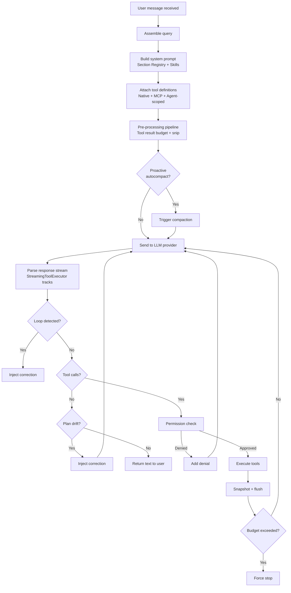

# Session engine & loop

> **Source:** `src/session/`, `src/session/engine/`
> **Last verified against code:** 2026-05-13

The session engine is the core runtime of LiteAI. It manages the agent loop — the cycle of assembling prompts, querying the LLM, executing tools, and managing conversation state.

## Architecture overview

The engine uses an **event-sourced architecture** with a clear separation between the generator (`queryLoop`) and the orchestrator (`runSession`):

| Component | File | Responsibility |
|---|---|---|
| **Orchestrator** | `loop.ts` | Session lifecycle, DB writes, event routing, cleanup |
| **Generator** | `query.ts` | Multi-turn async generator, zero DB writes, yields events |
| **Persister** | `persister.ts` | In-memory event accumulator, deferred write queue |
| **Pipeline** | `pipeline.ts` | Pre-processing: tool result budget + snip compaction |
| **Compaction** | `compaction-orchestrator.ts` | Context window management |
| **Correction** | `correction-injector.ts` | Loop recovery & notification injection |
| **Loop detection** | `loop-detection.ts` | Thinking, tool call, content chanting detection |
| **Stop drift** | `stop-drift.ts` | Plan mode enforcement |
| **Tool executor** | `streaming-tool-executor.ts` | Concurrency control & sibling abort |
| **System prompt** | `system.ts` | Section-based prompt assembly |

## Agent loop architecture

## Event-sourced design

The `queryLoop` generator yields `EngineEvent.Any` events. The orchestrator routes them:

| Event | Handler |
|---|---|
| `turn-start` | Create `EventPersister`, save assistant message |
| Stream events | Route to `persister.handleEvent()` |
| `turn-end` | Flush persister, drain write queue |
| `control:subtask` | Spawn subtask agent |
| `control:compaction-task` | Execute compaction |
| `control:loop-detected` | Inject correction, escalate |
| `control:step-pause` | Pause for step mode |

**Key invariant:** The generator performs zero SQLite writes. All persistence is deferred via the write queue.

## Query assembly

**Source:** `query.ts`

### 1. System prompt

Built via the **Section Registry** (`section-registry.ts`) from `system.md`:

| Section | Content | Caching |
|---|---|---|
| Static sections | Identity, behavioral rules | Cached per-session |
| Environment | OS, shell, cwd, model ID, date | Rebuilt every turn |
| Skills | Available skill descriptions | Rebuilt on change |
| Instructions | Project `liteai.md` / `AGENTS.md` | Cached, invalidated on file change |
| Output style | Active style from `.liteai/styles/` | Loaded on demand |

### 2. Conversation history

From the in-memory buffer (`msgsBuffer`). Loaded once from DB at session start — never re-read. Compaction resets buffer to `[marker, summary]`.

### 3. Tool definitions

Assembled from native tools (35+), MCP tools, and structured output tool (when `json_schema` format active). In coordinator mode, filtered to delegation-only tools.

## Pre-processing pipeline

**Source:** `pipeline.ts`

### Stage 1: Tool result budget

| Parameter | Value |
|---|---|
| Max aggregate output per turn | 200,000 characters |
| Strategy | Clear largest outputs first |
| Sentinel | `[Old tool result content cleared]` |

### Stage 2: Snip compact

Removes aborted assistant messages with no useful content and failed retry sequences.

## Tool dispatch

**Source:** `streaming-tool-executor.ts`

### Concurrency classification

| Category | Tools | Execution |
|---|---|---|
| **Concurrent-safe** | `glob`, `grep`, `read`, `ls`, `websearch`, `webfetch`, `codesearch`, `lsp` | Parallel |
| **Exclusive** | All others (`edit`, `write`, `run_command`, etc.) | Serialized |

When a mutating tool errors, the executor aborts all sibling tools via a child `AbortController`. Read-only tool failures are independent.

## Loop detection

**Source:** `loop-detection.ts`, `thinking-loop-detector.ts`

| Detector | Trigger | Threshold |
|---|---|---|
| **Thinking loop** | Repetitive reasoning hashes | Hash-based detection |
| **Tool call loop** | Identical `name:JSON(args)` hashes | 5 consecutive |
| **Content chanting** | Sliding-window chunk hashing | 10 repeated 50-char chunks |

Recovery: 1st → inject correction, 2nd → stronger correction, 3rd → force stop.

## Auto-compaction

**Source:** `compaction-orchestrator.ts`, `pipeline.ts`

| Parameter | Value |
|---|---|
| Trigger | Tokens ≥ `contextLimit - 33,000` |
| Circuit breaker | 3 consecutive failures → stop |
| Proactive | Before each LLM call |
| Reactive | After each turn (80% of context) |

Disable with `LITEAI_DISABLE_AUTOCOMPACT=true` or `compaction.auto: false`.

## Checkpointing

**Source:** `src/snapshot/`

After tool execution that modifies files, a checkpoint is saved to SQLite (file diffs, git state, metadata, timestamp). Enables `/undo` and `/revert`.

## Persistence architecture

**Source:** `persister.ts`, `loop/checkpointer.ts`

Zero DB writes in the hot path:

1. `handleEvent()` — Synchronous, enqueues write ops
2. `flush()` — Async, resolves snapshots, finalizes message
3. `drainWrites()` — Returns `PersistenceOp[]` for checkpointer

## Turn budgets

| Budget | Default | Configurable |
|---|---|---|
| Max steps | ∞ | `steps` in agent config |
| Wall-clock timeout | 30 min | `timeout` in agent config |
| Max tokens | Model-dependent | Provider setting |

## Session modes

| Mode | Tool access | Use case |
|---|---|---|
| **Normal** | Full | Default — everyday coding |
| **Plan** | Read-only + plan tools | Planning, code review |
| **Coordinator** | Delegation-only | Multi-agent orchestration |
| **Headless** | Full (non-interactive) | CI/CD, automation |

## Stop drift prevention

**Source:** `stop-drift.ts`

Plan mode requires `plan_exit` or `ask_user`. If model stops without them: inject `<system-correction>`, continue loop. Give up after 3 corrections.

## Step mode

Supports step-by-step execution via `stepMode: true`. After each turn: capture checkpoint → pause via `StepPauseLatch` → resume with payload. Used by IDE integration.

## Stop conditions

| Condition | Behavior |
|---|---|
| Text-only response | Normal completion |
| Max steps reached | Force text-only |
| Timeout | Force stop |
| User interrupt | Graceful abort |
| `yield_turn` called | Coordinator pause |
| Structured output captured | Normal completion |
| Loop detection (3rd) | Force stop |
| Unrecoverable error | Error response |

## What's next?

- [**Provider system**](/architecture/provider-system) — How LLM adapters normalize requests
- [**Context & memory pipeline**](/architecture/context-memory) — System prompt assembly details
- [**Coordinator & swarms**](/architecture/coordinator-swarms) — Multi-agent orchestration
