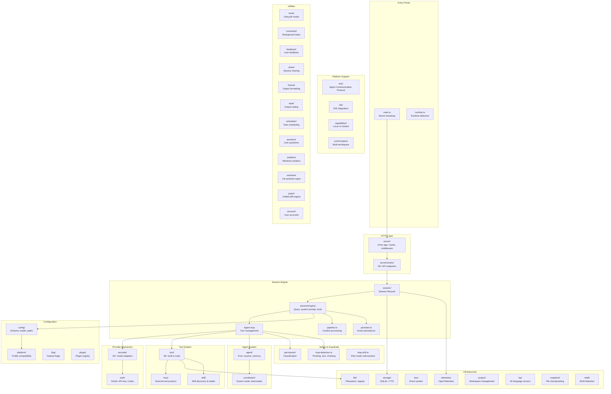
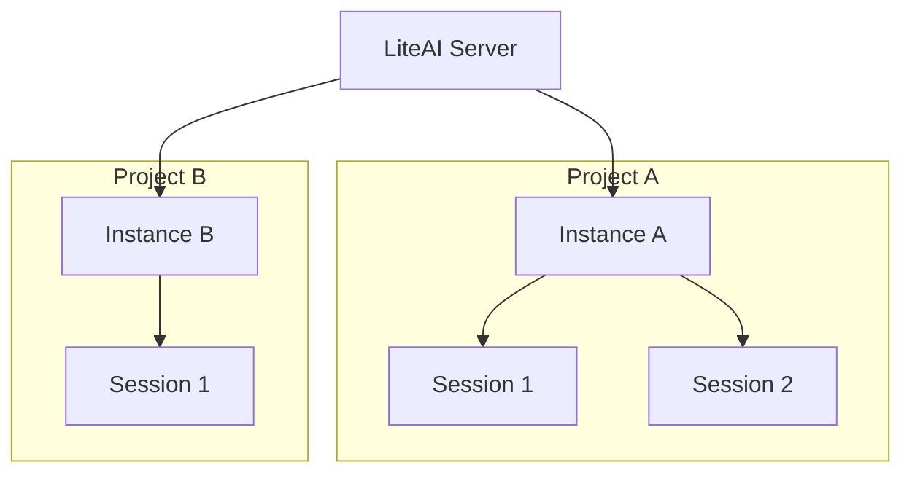
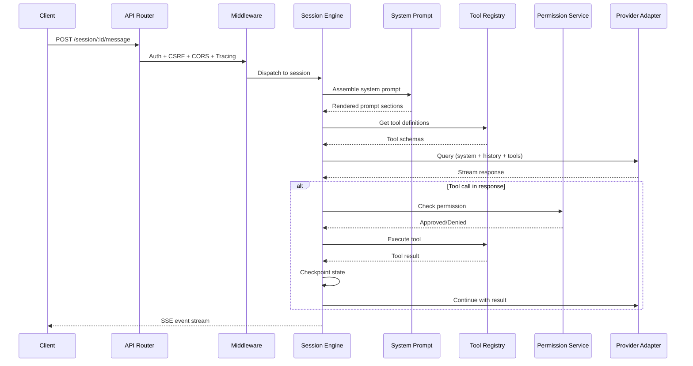

# System overview

> **Source:** `packages/core/src/`
> **Last verified against code:** 2026-05-13

This page provides a technical map of LiteAI's architecture for engineers who want to understand how the system is built. Each subsystem links to a dedicated deep-dive page.

## Module inventory

LiteAI's core engine (`packages/core/src/`) is organized into 47+ subsystems:

## Subsystem summary

| Subsystem | Source | Features | Deep dive |
|---|---|---|---|
| **Session engine** | `src/session/` | Agent loop, query assembly, compaction, checkpointing | [Session engine →](/architecture/session-engine) |
| **Provider system** | `src/provider/` | 20+ provider adapters, streaming, token counting | [Provider system →](/architecture/provider-system) |
| **Agent system** | `src/agent/`, `src/coordinator/` | Fork subagents, coordinator swarms, teammate runner | [Coordinator & swarms →](/architecture/coordinator-swarms) |
| **Tool system** | `src/tool/`, `src/mcp/` | 35+ native tools, MCP integration, skill system | [Tools reference →](/reference/tools-reference) |
| **Context pipeline** | `src/session/engine/` | System prompt assembly, section registry, instructions, plan reminders | [Context & memory →](/architecture/context-memory) |
| **Transport** | `src/server/`, `src/lsp/`, `src/acp/` | HTTP/SSE, LSP stdio, ACP, Extension Callbacks | [Transport channels →](/architecture/transport-channels) |
| **Storage** | `src/storage/` | SQLite, full-text search, session persistence | — |
| **Telemetry** | `src/telemetry/` | OpenTelemetry, Langfuse, Perfetto trace export | [Telemetry →](/architecture/telemetry) |
| **Security** | `src/permission/`, `src/server/middleware.ts` | Permission service, middleware stack, sandboxing | [Security model →](/architecture/security-model) |
| **Config** | `src/config/`, `src/flag/` | Layered merge, Zod schema, feature flags | [Settings →](/configuration/settings) |
| **Hooks** | `src/hook/` | Lifecycle event hooks (command, HTTP, prompt, agent) | [Hooks →](/build/hooks) |
| **Authentication** | `src/auth/` | OAuth (Copilot, Code Assist), Codex, AI4ALL | [Provider system →](/architecture/provider-system) |
| **Shell** | `src/shell/` | Shell detection and safe defaults | — |
| **Snapshot** | `src/snapshot/` | File state checkpointing for `/undo` | — |
| **Plugins** | `src/plugin/` | Plugin registry, install, marketplace | — |
| **Skills** | `src/skill/` | Skill discovery, loading, frontmatter parsing | — |
| **Scheduler** | `src/scheduler/` | Task scheduling infrastructure | — |
| **Isolation** | `src/isolation/`, `src/worktree/` | Git worktree isolation for parallel agents | — |
| **Infrastructure** | `src/project/`, `src/file/`, `src/lsp/` | Workspace management, filesystem, 40 LSP adapters | — |

## Multi-tenant design

LiteAI is a **multi-tenant, multi-session** server:

- **Tenant isolation** is achieved through **project instances** — each project gets its own runtime context with isolated configuration, storage, and session state
- **Session isolation** ensures concurrent sessions within the same project do not share mutable state
- **Coordinator teammate isolation** uses `AsyncLocalStorage` to provide each in-process teammate with its own execution context

## Data flow — a single turn

## Technology stack

| Layer | Technology |
|---|---|
| **Runtime** | Bun |
| **HTTP framework** | Hono |
| **Database** | SQLite (via bun:sqlite) |
| **Schema validation** | Zod |
| **Effect system** | Effect (typed errors, dependency injection) |
| **Telemetry** | OpenTelemetry SDK + Langfuse |
| **Package management** | Bun workspaces (monorepo) |
| **Testing** | Bun test runner |
| **Build** | TypeScript + Bun bundler |

## Feature completion

For a detailed breakdown of what's implemented vs. planned, see the [Feature status overview](/roadmap/feature-status).

## What's next?

- [**Session engine & loop**](/architecture/session-engine) — How the agent loop processes turns
- [**Provider system**](/architecture/provider-system) — Multi-provider adapter architecture
- [**Coordinator & swarms**](/architecture/coordinator-swarms) — Agent orchestration design
