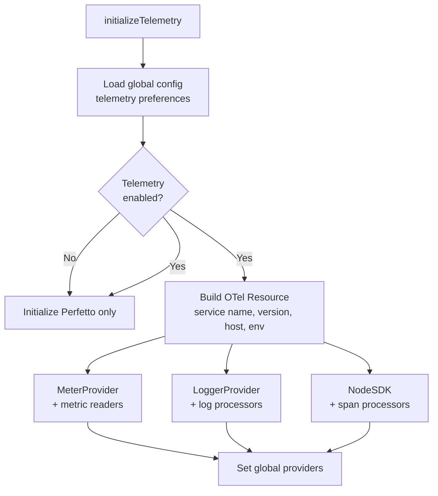

# Telemetry & observability

> **Source:** `src/telemetry/` (5 modules)
> **Last verified against code:** 2026-05-13

LiteAI uses OpenTelemetry for distributed tracing and metrics, Langfuse for LLM-specific observability, and Perfetto for visual trace analysis.

## Opt-out model

Telemetry is **enabled by default**. To opt out:

| Method | How |
|---|---|
| Config | `telemetry.disabled: true` in settings |
| Env var | `LITEAI_TELEMETRY_DISABLED=1` or `LITEAI_TELEMETRY_DISABLED=true` |

The telemetry preference is loaded from global config at startup via `applyConfigToEnv()`.

## Initialization pipeline

**Source:** `src/telemetry/instrumentation.ts`

`initializeTelemetry()` runs at server boot and sets up the full observability stack:

### Resource attributes

Every telemetry signal carries:

| Attribute | Value |
|---|---|
| `service.namespace` | `liteai` |
| `service.name` | `liteai` |
| `service.version` | `Installation.VERSION` |
| `deployment.environment.name` | `process.env.NODE_ENV` or `"development"` |
| `service.instance.id` | Process PID |
| Host arch, OS attributes | Auto-detected via OTel detectors |

## Exporter factories

**Source:** `src/telemetry/factories.ts`

LiteAI supports a three-tier exporter system for metrics, logs, and traces. Each tier independently supports multiple exporter types:

### Metric exporters

| Type | Module | Configured via |
|---|---|---|
| `console` | `@opentelemetry/sdk-metrics` | `telemetry.otel.metricExporter: "console"` |
| `otlp` (http/json) | `@opentelemetry/exporter-metrics-otlp-http` | `telemetry.otel.metricExporter: "otlp"` |
| `otlp` (http/protobuf) | `@opentelemetry/exporter-metrics-otlp-proto` | + `telemetry.otel.protocol: "http/protobuf"` |

Metric readers use `PeriodicExportingMetricReader` with configurable interval (default: 60s).

### Log exporters

| Type | Module | Configured via |
|---|---|---|
| `console` | `@opentelemetry/sdk-logs` | `telemetry.otel.logExporter: "console"` |
| `otlp` (http/json) | `@opentelemetry/exporter-logs-otlp-http` | `telemetry.otel.logExporter: "otlp"` |
| `otlp` (http/protobuf) | `@opentelemetry/exporter-logs-otlp-proto` | + `telemetry.otel.protocol: "http/protobuf"` |

Log processors use `BatchLogRecordProcessor` with configurable interval (default: 5s).

### Trace exporters

| Type | Module | Configured via |
|---|---|---|
| `console` | `@opentelemetry/sdk-trace-base` | `telemetry.otel.traceExporter: "console"` |
| `otlp` (http/json) | `@opentelemetry/exporter-trace-otlp-http` | `telemetry.otel.traceExporter: "otlp"` |
| `otlp` (http/protobuf) | `@opentelemetry/exporter-trace-otlp-proto` | + `telemetry.otel.protocol: "http/protobuf"` |

Trace processors use `BatchSpanProcessor` with configurable interval (default: 5s).

### OTLP configuration

| Config key | Env var fallback | Purpose |
|---|---|---|
| `telemetry.otel.endpoint` | `OTEL_EXPORTER_OTLP_ENDPOINT` | Collector URL (auto-appends `/v1/{metrics,logs,traces}`) |
| `telemetry.otel.protocol` | `OTEL_EXPORTER_OTLP_PROTOCOL` | `"http/json"` or `"http/protobuf"` |
| `telemetry.otel.exportIntervalMs` | `OTEL_METRIC_EXPORT_INTERVAL` | Export flush interval |
| `telemetry.otel.metricExporter` | `OTEL_METRICS_EXPORTER` | Comma-separated exporter types |
| `telemetry.otel.logExporter` | `OTEL_LOGS_EXPORTER` | Comma-separated exporter types |
| `telemetry.otel.traceExporter` | `OTEL_TRACES_EXPORTER` | Comma-separated exporter types |

## Langfuse integration

**Source:** `src/telemetry/instrumentation.ts`

LiteAI integrates with [Langfuse](https://langfuse.com) for LLM-specific observability via `LangfuseSpanProcessor`:

| Config key | Env var fallback | Purpose |
|---|---|---|
| `telemetry.langfuse.publicKey` | `LANGFUSE_PUBLIC_KEY` | Langfuse public API key |
| `telemetry.langfuse.secretKey` | `LANGFUSE_SECRET_KEY` | Langfuse secret API key |
| `telemetry.langfuse.baseUrl` | `LANGFUSE_BASE_URL` | Langfuse API endpoint |

**How it works:**
- `LangfuseSpanProcessor` maps OTel spans to Langfuse's native data model (Trace → Observation: Span / Generation / Event)
- Uses Langfuse's own REST API rather than OTLP, giving correct hierarchy out of the box
- **Span filter:** Only exports spans from `ai` or `liteai` instrumentation scopes — OTel infrastructure spans are excluded
- Flush settings: batch size 10, flush interval derived from `exportIntervalMs`

## Diagnostic exporters

**Source:** `src/telemetry/diagnostic.ts`

`DiagnosticMetricExporter` and `DiagnosticLogExporter` are thin wrappers around the real exporters that provide a hook point for observability of the export pipeline itself. They delegate all operations (`export`, `forceFlush`, `shutdown`) to the inner exporter.

## Perfetto trace export

**Source:** `src/telemetry/perfetto.ts`

Export traces as Perfetto-compatible JSON files for visual analysis in `chrome://tracing` or the Perfetto UI.

### Enabling

| Config key | Purpose |
|---|---|
| `telemetry.perfetto` | Set to `true` to enable Perfetto tracing |

### Trace output

Traces are written to `~/.liteai/traces/trace-<sessionId>.json` on process exit.

### Span types

| Function | Category | What it tracks |
|---|---|---|
| `startInteractionPerfettoSpan()` | `interaction` | Full interaction (user prompt → response) |
| `startLLMRequestPerfettoSpan()` | `api` | LLM API call with model info |
| `endLLMRequestPerfettoSpan()` | `api` | Completion with TTFT, TTLT, token counts, cache metrics |
| `startToolPerfettoSpan()` | `tool` | Individual tool execution |
| `registerPerfettoAgent()` | `agent` | Agent spawn (instant event) |
| `unregisterPerfettoAgent()` | `agent` | Agent cleanup (instant event) |

### Implementation details

- Uses Chrome Trace Event Format (B/E begin/end, i instant, X complete)
- Event buffer capped at **100,000 events** — evicts oldest half when exceeded
- Timestamps are microseconds relative to session start
- Independent of OTel — Perfetto runs even when `telemetry.disabled: true`

## Request tracing

**Source:** `src/server/middleware.ts`

Every HTTP request gets an OpenTelemetry span via the `requestTracer()` middleware:

| Span attribute | Value |
|---|---|
| `http.method` | Request method |
| `http.url` | Full URL |
| `http.target` | Path only |
| `http.status_code` | Response status |
| `liteai.client` | `x-liteai-client` header or user-agent |
| `liteai.workspace` | Workspace ID from query/header |

Span kind is `SpanKind.SERVER`. Status is set to `ERROR` for 5xx responses.

## Shutdown & flush

| Function | Behavior |
|---|---|
| `shutdownTelemetry()` | Gracefully shut down all providers with configurable timeout |
| `flushTelemetry()` | Force-flush metrics and logs (NodeSDK does not expose forceFlush) |

Both use `Promise.race` with a timeout to prevent blocking server shutdown.

## What's next?

- [**Configuration: settings.md**](/configuration/settings) — `telemetry` config block reference
- [**Environment variables**](/reference/environment-variables) — Telemetry-related env vars
