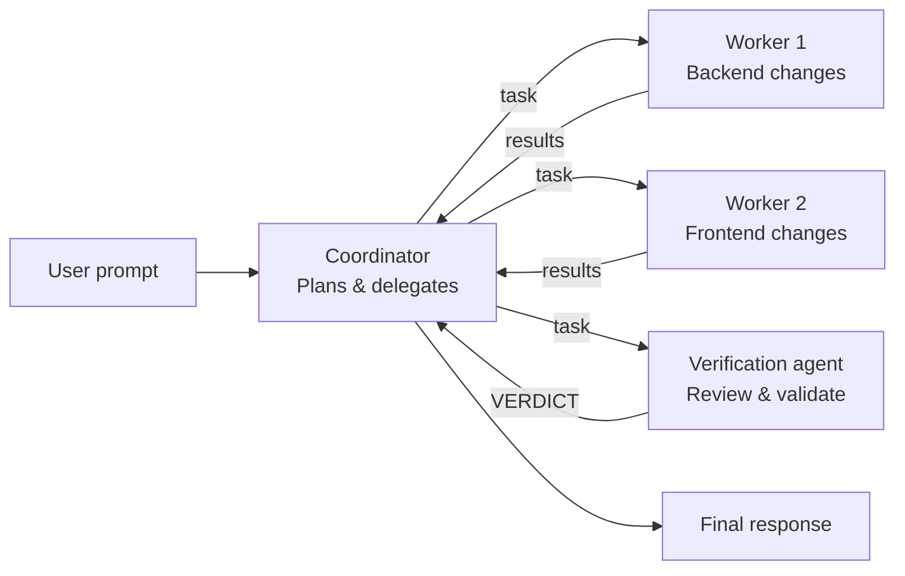

# Run agent teams

Coordinator mode turns LiteAI into an orchestrator that delegates work to specialized teammate agents. This is ideal for complex tasks that benefit from parallel execution.

## Enable coordinator mode

```bash
# Via environment variable
export LITEAI_COORDINATOR_MODE=true

# Via settings.json
{
  "coordinatorMode": true
}

# Via prompt tray (interactive mode)
# Toggle "Coordinator" in the mode selector
```

Or use the `/mode coordinator` command.

## How it works

In coordinator mode:

1. **The coordinator** receives your prompt and plans the work
2. **Workers** are spawned to handle individual tasks with full tool access
3. **Communication** happens via a mailbox system
4. **Verification** (optional) validates the work before completion



### What the coordinator can do

The coordinator only has delegation tools — it cannot directly read files, edit code, or run commands:

| Tool | Purpose |
|---|---|
| `task` | Spawn a worker for a specific task |
| `send_message` | Send instructions to a running worker |
| `task_stop` | Stop a running worker |
| `team_create` | Create a named team of workers |
| `team_delete` | Disband a team |
| `yield_turn` | Wait for workers to complete |

### What workers can do

Workers have full tool access (same as build mode), including file I/O, shell, search, and memory tools.

## Communication

### Mailbox messaging

Workers and the coordinator communicate through a mailbox system:

```
> Coordinator sends: "Please also add input validation for the email field."
> Worker receives the message and adjusts its work.
```

Messages can be sent to:
- A specific worker by name
- All workers via broadcast (`to: "*"`)
- Stopped workers (auto-resumes them with the message)

### Structured messages

The system uses typed message schemas for coordination:
- `idle_notification` — Worker reports it's done
- `shutdown_request` / `shutdown_approved` — Graceful termination
- `plan_approval_request` — Worker requests sign-off before executing

## Verification agent

The coordinator can spawn a **verification agent** that reviews all changes:

- Uses read-only tools (no write/edit/execute)
- Receives an adversarial prompt (~130 lines) focused on finding issues
- Reports findings with a verdict: `PASS`, `FAIL`, or `PARTIAL`

## Team scratchpad

Teams have a shared directory for temporary artifacts:

```
.liteai/teams/<team-name>/
├── scratchpad/          # Shared working directory
└── config.json          # Team composition
```

Workers can read/write to the scratchpad to share intermediate results.

## When to use coordinator mode

| Scenario | Recommendation |
|---|---|
| Simple bug fix | Build mode |
| Single file changes | Build mode |
| Multi-file refactoring | Coordinator mode ✅ |
| Cross-cutting concerns | Coordinator mode ✅ |
| Rename across codebase | Coordinator mode ✅ |
| New feature (many files) | Coordinator mode ✅ |

## What's next?

- [**Create custom subagents**](/build/custom-subagents) — Define specialized agents
- [**Architecture: Coordinator & swarms**](/architecture/coordinator-swarms) — Technical deep dive
- [**Permission modes**](/getting-started/permission-modes) — Teammate permission bridge
