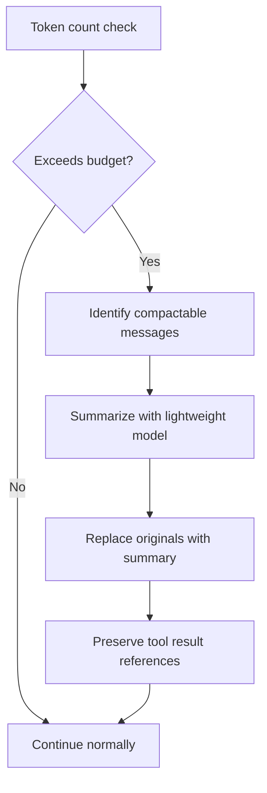

# Explore the context window

Every LLM has a finite context window — the maximum number of tokens it can process in a single request. LiteAI actively manages this window to maximize the useful information available to the model while staying within limits.

## What goes into the context window

Each request sent to the LLM contains these components, in order:

```
┌──────────────────────────────────────────────────┐
│  System Prompt                                   │
│  ├── Identity & capabilities                     │
│  ├── Tool descriptions                           │
│  ├── AGENTS.md instructions                      │
│  ├── Project context (active files, env)         │
│  └── Agent memory                                │
├──────────────────────────────────────────────────┤
│  Conversation History                            │
│  ├── User messages                               │
│  ├── Assistant responses                         │
│  ├── Tool calls & results                        │
│  └── Compaction summaries (if any)               │
├──────────────────────────────────────────────────┤
│  Current User Message                            │
│  └── Your latest prompt                          │
└──────────────────────────────────────────────────┘
```

## System prompt pipeline

The system prompt is assembled from multiple **sections** using a registry pattern:

| Phase | Sections | Volatility |
|---|---|---|
| **Static** | Identity, tool descriptions, behavioral rules | Cached across turns |
| **Project** | AGENTS.md instructions, platform profile | Cached per-session |
| **Dynamic** | Active file context, environment info, working directory | Rebuilt every turn |
| **Memory** | Agent memory content, conversation summaries | Loaded on demand |

Static sections are cached and reused across turns to minimize overhead. Dynamic sections are rebuilt for each query to ensure freshness.

### JIT instruction loading

LiteAI supports **just-in-time** instruction loading for subdirectory-specific rules. When the agent accesses a file in a subdirectory that contains its own `AGENTS.md`, those instructions are loaded and injected into the context on the fly.

```
project/
├── AGENTS.md              # Always loaded
├── src/
│   └── AGENTS.md          # Loaded when agent touches src/ files
└── tests/
    └── AGENTS.md          # Loaded when agent touches tests/ files
```

## Auto-compaction

When the conversation history approaches the model's context limit, LiteAI automatically compacts older messages:



### How compaction works

1. **Token counting** — After each turn, LiteAI estimates the total token count of the conversation
2. **Threshold** — When usage exceeds ~80% of the model's context window, compaction triggers
3. **Selection** — Older messages are selected for compaction (most recent messages are preserved)
4. **Summarization** — A lightweight model call summarizes the selected messages
5. **Replacement** — Original messages are replaced with the compact summary
6. **Reference preservation** — Tool result IDs are maintained so content can be expanded on demand

### Disabling compaction

```bash
# Via environment variable
export LITEAI_DISABLE_AUTOCOMPACT=true

# Via settings.json
{
  "autoCompact": false
}
```

:::caution
Disabling compaction may cause requests to fail when the conversation exceeds the model's context window.
:::

## Content optimization

For large tool results (e.g., reading a 500-line file), LiteAI can replace the full content with a preview and store the complete result on disk. The model sees a summary like:

```
[Content stored on disk — 487 lines, 12.3KB]
Preview: First 50 lines...
```

If the model needs the full content later, it can request expansion. This optimization significantly reduces token usage for file-heavy workflows.

## Token budget tips

| Strategy | Effect |
|---|---|
| **Be specific in prompts** | Reduces unnecessary tool calls and context growth |
| **Use Plan mode first** | Plan mode doesn't execute tools, keeping context lean |
| **Write focused AGENTS.md** | Shorter instructions = more room for conversation |
| **Use fork subagents** | Each fork gets its own context window |
| **Enable auto-compaction** | Keeps conversations running indefinitely |

## What's next?

- [**Architecture: Context & memory pipeline**](/architecture/context-memory) — Deep dive into the system prompt pipeline
- [**Instructions & memory**](/getting-started/memory) — How AGENTS.md and memory tools work
- [**Best practices**](/getting-started/best-practices) — Tips for effective prompt engineering
