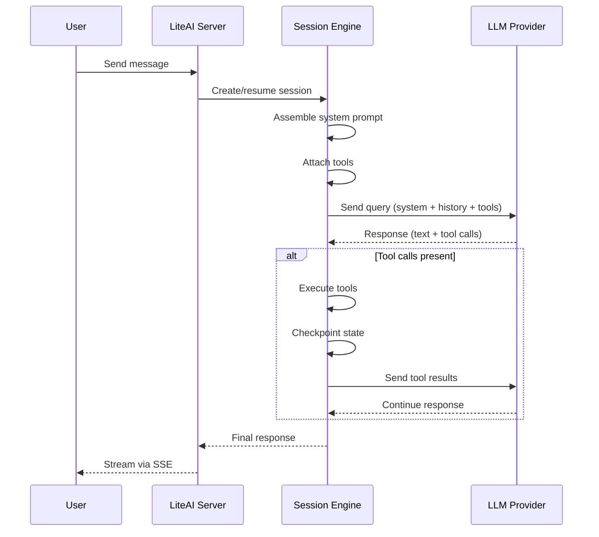
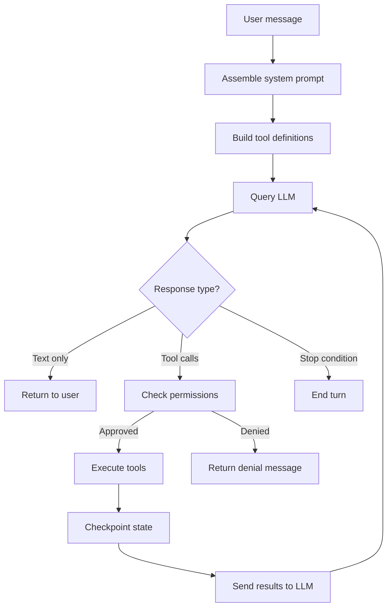

# How LiteAI works

This page explains what happens when you send a message to LiteAI — from prompt assembly through tool execution to response delivery. For a deeper technical dive, see the [Architecture](/architecture/system-overview) section.

## The session lifecycle

Every interaction with LiteAI happens inside a **session**. A session is a persistent conversation with its own history, tool state, and checkpoint trail.

### 1. System prompt assembly

Before each query, LiteAI builds a system prompt from multiple sources:

| Phase | Content | Source |
|---|---|---|
| **Static** | Identity, capabilities, tool descriptions | Built-in |
| **Project** | AGENTS.md instructions, project context | Your workspace |
| **Dynamic** | Active file context, environment info | Per-turn |
| **Memory** | Agent memory, platform profiles | `.liteai/` directory |

The system prompt pipeline uses a **section registry** that caches and deduplicates content across turns. See [Context & memory pipeline](/architecture/context-memory) for full details.

### 2. Tool execution

When the model decides to use a tool, LiteAI executes it locally and returns the result. The engine supports 35 built-in tools:

| Category | Tools |
|---|---|
| **File I/O** | Read, write, edit, search, list, glob |
| **Shell** | Execute commands, background processes |
| **Search** | Ripgrep full-text search, file content search |
| **Memory** | Read/write/edit persistent agent memory |
| **Web** | HTTP fetch, URL content extraction |
| **Agent** | Spawn subagents, send messages, create teams |
| **LSP** | Diagnostics, hover info, go-to-definition |

Each tool call goes through the [Permission service](/getting-started/permission-modes) before execution.

### 3. Auto-compaction

When the conversation grows close to the model's context window limit, LiteAI automatically compacts older messages. The compaction process:

1. Identifies messages beyond the token budget
2. Summarizes them using a lightweight model call
3. Replaces the originals with the summary
4. Preserves tool result references for reproducibility

You can disable this with `LITEAI_DISABLE_AUTOCOMPACT=true`.

### 4. Checkpointing

After each tool execution, LiteAI snapshots the state of modified files. This enables the **undo/revert** workflow — you can roll back any change the agent made.

Checkpoints are stored in SQLite and include:
- File diffs (before/after)
- Git state (if applicable)
- Session metadata

## Execution modes

LiteAI supports three session modes that control what the agent can do:

### Build mode (default)

The agent has full read/write/execute access. This is the standard mode for everyday coding tasks — writing code, fixing bugs, refactoring, running tests.

### Plan mode

The agent can only **read** and **suggest**. It cannot modify files, run commands, or execute tools with side effects. Use this when you want to:
- Explore different approaches before committing
- Get a detailed implementation plan
- Review code without risk of changes

Switch to plan mode via the `/mode plan` command or the prompt tray toggle.

### Coordinator mode

The agent becomes an **orchestrator** that delegates work to specialized teammates. In this mode:
- The agent's tool pool is restricted to delegation-only tools (`task`, `send_message`, `team_create`, `team_delete`, `yield_turn`)
- All file I/O, shell, and search tools are removed from the coordinator
- Worker agents execute the actual tasks with full tool access

Coordinator mode is ideal for complex, multi-file changes that benefit from parallel execution. See [Run agent teams](/build/agent-teams) for usage details.

## The agent loop in detail

Each turn of the agent loop follows this sequence:

**Stop conditions** include:
- Model returns text without tool calls
- Maximum turn budget reached (configurable, default 200)
- User interrupts the session
- Wall-clock timeout (30 minutes for background agents)
- Explicit stop token

## What's next?

- [**Extend LiteAI**](/getting-started/extend-liteai) — All the ways you can customize behavior
- [**Permission modes**](/getting-started/permission-modes) — How the permission system works
- [**Architecture: Session engine**](/architecture/session-engine) — Deep dive into the engine internals
