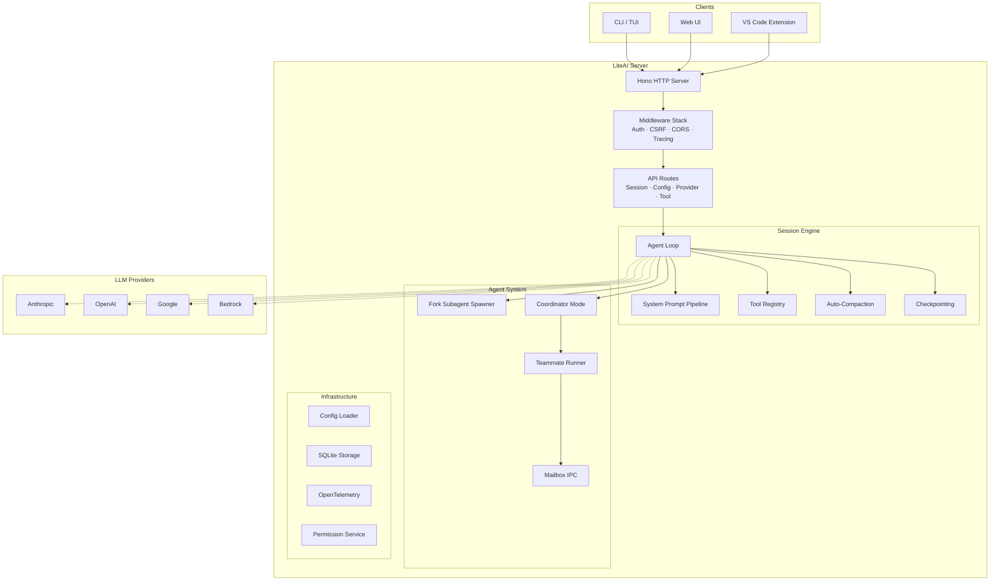

# Overview

LiteAI is an open-source AI coding agent built for professional development workflows. It runs as a local HTTP/SSE server, connects to any major LLM provider, and gives the model a rich set of tools to understand, modify, and execute code in your project.

## What makes LiteAI different

### Multi-session architecture
LiteAI runs as a persistent server, not a one-shot CLI. Multiple sessions can run concurrently — each with its own conversation history, tool state, and checkpoint trail. This enables parallel workflows across projects and agents.

### Agent orchestration
Beyond simple chat, LiteAI supports three distinct agent execution models:

- **Single agent** — One agent with full tool access (the default)
- **Fork subagents** — Spawn background agents that inherit the parent's prompt cache for cost-efficient parallel work
- **Coordinator swarms** — A dedicated orchestrator delegates work to specialized teammates with mailbox-based inter-agent communication

### Multi-platform deployment
LiteAI is not limited to the terminal. The same core engine powers:

| Platform | Transport | Status |
|---|---|---|
| CLI / TUI | Direct process | ✅ Stable |
| Web UI | HTTP/SSE | ✅ Stable |
| VS Code | Extension Callbacks + LSP | ✅ Stable |
| Remote control | HTTP/SSE + mDNS | ✅ Stable |

### Extensibility at every layer
Every layer of LiteAI is designed for extension:

- **AGENTS.md** — Project-specific instructions injected into the system prompt
- **Custom agents** — Define specialized personas in `.liteai/agents/`
- **Skills** — Task-focused instruction packages in `.liteai/skills/`
- **Plugins** — Runtime-loaded extensions with tool and hook access
- **MCP servers** — Connect external tools via the Model Context Protocol
- **Hooks** — Lifecycle callbacks for automation
- **Commands** — Custom slash commands

### Provider-agnostic
LiteAI works with any major LLM provider through a unified adapter layer:

- Anthropic (Claude)
- OpenAI (GPT, o-series)
- Google (Gemini)
- AWS Bedrock
- Google Cloud Vertex AI
- Any OpenAI-compatible API

## High-level architecture

## Feature highlights

| Category | Features |
|---|---|
| **Session engine** | Agent loop, auto-compaction, checkpointing, plan mode, context optimization |
| **Agent system** | Fork subagents, coordinator swarms, teammate mailbox, permission bridge, verification agent |
| **Tools** | 35 built-in tools (file I/O, shell, search, LSP diagnostics, memory, web fetch) |
| **MCP** | stdio/HTTP/SSE transports, OAuth, agent-scoped servers |
| **Configuration** | Layered merge (global → project), Zod schema validation, platform profiles |
| **Observability** | OpenTelemetry instrumentation, Perfetto trace export, request tracing |
| **Security** | CSRF protection, auth middleware, permission classification, Docker/worktree sandboxing |
| **Storage** | SQLite with full-text search, session persistence, conversation history |

## What's next?

- [**Quickstart**](/) — Get running in 3 minutes
- [**How LiteAI works**](/getting-started/how-liteai-works) — Understand the session lifecycle
- [**Reading paths**](/getting-started/reading-paths) — Find your learning path based on experience level
- [**Architecture: System overview**](/architecture/system-overview) — Deep dive into the technical design
