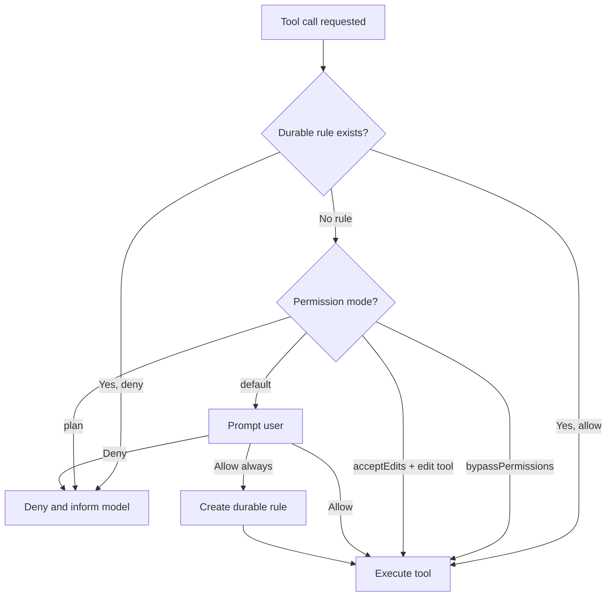

# Permission modes

LiteAI asks for your approval before performing actions that could modify your codebase or system. The permission system is configurable, letting you choose the right balance of safety and speed.

## How permissions work

When the agent wants to use a tool (e.g., write a file, run a command), it goes through the permission service:



## Permission modes

| Mode | Behavior | Best for |
|---|---|---|
| **plan** | Deny all write/execute actions | Planning and code review |
| **default** | Prompt for each new tool action | Daily development — review before execution |
| **bubble** | Forward permission prompts to the parent agent | Subagents and teammates |
| **acceptEdits** | Auto-approve edit/write tools; prompt for others | Trusted editing with command review |
| **dontAsk** | Deny all — no prompts, no approvals | Strict lockdown |
| **bypassPermissions** | Auto-approve everything without prompting | CI/CD pipelines, trusted automation |

### Setting the mode

```json
// settings.json
{
  "permission": "default"
}
```

Or via environment variable:

```bash
export LITEAI_PERMISSION_MODE=auto
```

Or via the prompt tray toggle in interactive mode.

## Durable rules

When you choose "Allow always" for a tool action, LiteAI creates a **durable rule** that persists for the session. This means you won't be prompted for the same tool pattern again.

Rules are scoped to:
- The specific tool (e.g., `write_file`)
- The path pattern (e.g., files in `src/`)
- The current session

### Rule examples

| Action | Rule created |
|---|---|
| Allow `write_file` on `src/utils.ts` | Allow all writes to `src/` |
| Allow `run_command` for `bun test` | Allow `bun test` commands |
| Allow `edit_file` on `*.md` | Allow editing markdown files |

## Tool categories

Tools are categorized by their risk level:

| Category | Tools | Default behavior |
|---|---|---|
| **Read-only** | `read_file`, `search`, `list_directory`, `glob` | Auto-approved |
| **Write** | `write_file`, `edit_file`, `multi_edit` | Requires approval |
| **Execute** | `run_command`, `background_command` | Requires approval |
| **System** | `web_fetch`, `memory tools` | Varies by mode |
| **Agent** | `agent`, `task`, `send_message` | Requires approval |

## Subagent permissions

When a subagent is spawned, its permission mode is inherited from the parent session with the following rules:

| Parent mode | Subagent mode |
|---|---|
| `default` | `bubble` — prompts are forwarded to the parent session |
| `auto` / `bypass` | Inherited — subagent auto-approves |
| `plan` | `plan` — subagent is read-only |

### Coordinator teammate permissions

In coordinator mode, teammate agents use a **dual-transport permission bridge**:

1. **In-process path** — The coordinator's permission handler resolves permissions directly
2. **File-based fallback** — Atomic writes to a pending/resolved directory for cross-process safety

A **teammate classifier** can pre-approve certain actions based on the coordinator's context, reducing permission prompt overhead.

## Sandbox modes

For additional isolation, LiteAI supports sandboxed execution:

| Sandbox | Isolation level | How it works |
|---|---|---|
| **Worktree** | Git-level | Agent operates in an isolated git worktree — changes are merged back |
| **Docker** | Container-level | Agent runs in a Docker container with mapped volumes |
| **None** | No isolation | Agent operates directly in the project directory (default) |

Enable sandboxing via:

```bash
export LITEAI_ISOLATION=worktree  # or "docker"
```

## What's next?

- [**How LiteAI works**](/getting-started/how-liteai-works) — Session lifecycle and agent loop
- [**Run agent teams**](/build/agent-teams) — Coordinator mode and permission bridge
- [**Architecture: Security model**](/architecture/security-model) — Technical deep dive into permissions
