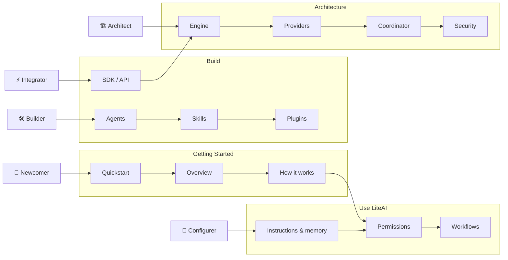

# Reading paths

LiteAI documentation is organized around progressive disclosure — you don't need to read everything. Find your persona below and follow the recommended path.

## Who are you?

### 👤 Newcomer

> *"I just heard about LiteAI. I want to install it, connect a provider, and have a useful coding session in under 10 minutes."*

**Your path:**
1. [Quickstart](/) — Install, configure, first session
2. [Overview](/getting-started/overview) — What LiteAI can do
3. [How LiteAI works](/getting-started/how-liteai-works) — Session lifecycle and modes
4. [Permission modes](/getting-started/permission-modes) — What to click when prompted
5. [Common workflows](/getting-started/common-workflows) — Plan → build, code review, debugging

---

### 🔧 Configurer

> *"I've been using LiteAI for a week. I want to tune the model, customize the system prompt, set up project rules, and discover built-in agents and skills."*

**Your path:**
1. [Instructions & memory](/getting-started/memory) — AGENTS.md and memory tools
2. [Settings](/configuration/settings) — Full settings.json reference
3. [Permission modes](/getting-started/permission-modes) — Auto, bypass, plan-only
4. [Explore the .liteai directory](/getting-started/explore-liteai-directory) — Directory structure
5. [Explore the context window](/getting-started/context-window) — Token budgets, compaction
6. [Best practices](/getting-started/best-practices) — Tips for effective use

---

### 🛠️ Builder

> *"I want to create my own subagents, skills, hooks, plugins, and MCP servers. I'm extending LiteAI for my team or project."*

**Your path:**
1. [Extend LiteAI](/getting-started/extend-liteai) — Overview of all extension points
2. [Create custom subagents](/build/custom-subagents) — Agent definition and spawning
3. [Run agent teams](/build/agent-teams) — Coordinator mode and swarms
4. [Create plugins](/build/create-plugins) — Plugin API and manifest
5. [Extend LiteAI with skills](/build/skills) — SKILL.md format
6. [Automate with hooks](/build/hooks) — Lifecycle and command hooks
7. [Model Context Protocol](/build/mcp) — MCP server configuration

---

### 🏗️ Architect

> *"I want to understand how the engine works, how memory is designed, how the provider abstraction works, how coordinator mode orchestrates agents."*

**Your path:**
1. [System overview](/architecture/system-overview) — Full architecture diagram
2. [Session engine & loop](/architecture/session-engine) — Query assembly, tool dispatch, compaction
3. [Provider system](/architecture/provider-system) — Adapter pattern, model capabilities
4. [Context & memory pipeline](/architecture/context-memory) — System prompt pipeline, instruction chain
5. [Coordinator & swarms](/architecture/coordinator-swarms) — State machine, mailbox IPC
6. [Security model](/architecture/security-model) — Middleware, permissions, sandboxing
7. [Telemetry & observability](/architecture/telemetry) — OpenTelemetry, Perfetto

---

### ⚡ Integrator / SDK Developer

> *"I want to embed LiteAI in my CI/CD pipeline, build a custom UI on top of it, or automate it via the API."*

**Your path:**
1. [Programmatic usage](/build/programmatic-usage) — SDK and headless mode
2. [Push external events](/build/external-events) — Injecting context into sessions
3. [Scheduled prompts](/build/scheduled-prompts) — Cron-like automation
4. [Channels reference](/reference/channels-reference) — Full API surface
5. [Architecture: Transport channels](/architecture/transport-channels) — HTTP/SSE, LSP stdio

---

### 🏢 Team Lead / Enterprise Admin

> *"I'm deploying LiteAI for a team. I need to understand auth, security, multi-tenant isolation, and governance."*

**Your path:**
1. [Project setup](/configuration/project-setup) — Multi-workspace configuration
2. [Settings](/configuration/settings) — Auth and security keys
3. [Permission modes](/getting-started/permission-modes) — Organizational defaults
4. [Architecture: Security model](/architecture/security-model) — Middleware, sandboxing
5. [Remote Control](/platforms/remote-control) — Remote server access

---

### 🖥️ Platform User (IDE / Web)

> *"I use LiteAI through VS Code or the web UI. I don't touch the terminal."*

**Your path:**
1. [Platforms overview](/platforms/overview) — Feature comparison matrix
2. [VS Code](/platforms/vscode) or [Web UI](/platforms/web) — Platform-specific setup
3. [Settings](/configuration/settings) — Platform-specific keys

---

### 🤝 Contributor

> *"I want to fix a bug or add a feature to LiteAI."*

**Your path:**
1. [Architecture: System overview](/architecture/system-overview) — Codebase orientation
2. [Architecture: Session engine](/architecture/session-engine) — Core loop internals
3. [Roadmap: Feature status](/roadmap/feature-status) — What's implemented vs planned

---

## Flow diagram

