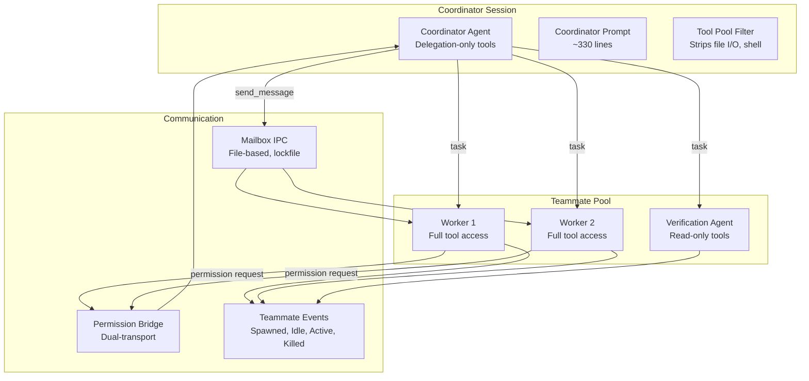
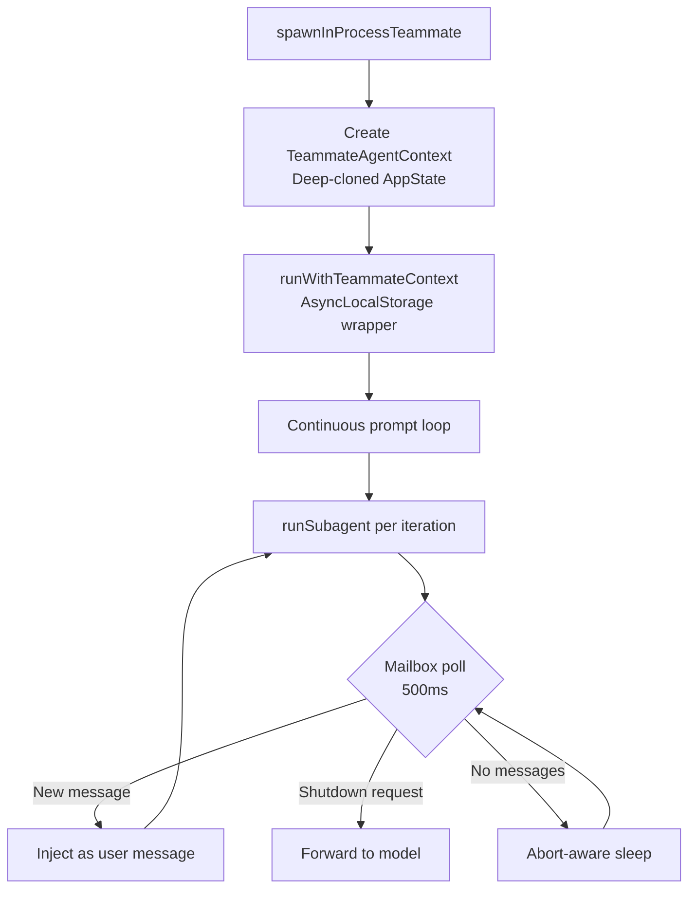
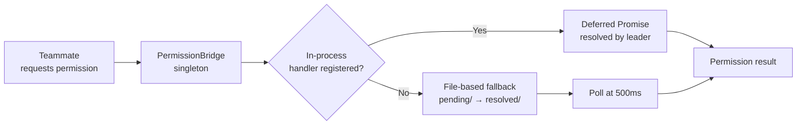

# Coordinator & swarms

> **Source:** `src/coordinator/`
> **Last verified against code:** 2026-05-10
> **Status:** 114/117 features implemented ✅

The coordinator system enables multi-agent orchestration where a lead agent delegates work to specialized teammate agents. This is LiteAI's most advanced execution model.

## Architecture overview



## Coordinator mode

### State machine

Coordinator mode is **session-scoped** and set via `Flag.LITEAI_COORDINATOR_MODE`. Once enabled:

1. The agent's system prompt is replaced with the **coordinator prompt** (~330 lines)
2. The tool pool is filtered to delegation-only tools
3. Fork mode is disabled (mutually exclusive)
4. Mode is persisted in session metadata and restored on resume

### Tool pool restriction

In coordinator mode, the agent can ONLY use:

| Tool | Purpose |
|---|---|
| `task` | Spawn a worker agent (or fork) |
| `send_message` | Send a message to a running/stopped worker |
| `task_stop` | Force-stop a worker |
| `team_create` | Create a team with multiple teammates |
| `team_delete` | Disband a team and force-kill all members |
| `yield_turn` | Wait for workers to complete |
| `structured_output` | Return structured data (when JSON schema mode active) |

All other tools (file I/O, shell, search, web) are stripped from the coordinator's pool.

## Teammate runner

### In-process execution

**Source:** `src/coordinator/teammate-runner.ts`

Teammates run **in-process** using `AsyncLocalStorage` for context isolation:



Each teammate gets:
- Its own `AbortController` (independent lifecycle)
- A deep-cloned `AppState` snapshot (no shared mutable state)
- Forced `shouldAvoidPermissionPrompts` (uses permission bridge instead)
- Per-turn `AbortController` linked to lifecycle

### Built-in agent profiles

| Profile | Description | Tool restrictions |
|---|---|---|
| **Default worker** | Full tool access, standard system prompt | None |
| **Verification agent** | Read-only, adversarial review | Write/edit/delete/patch tools blocked |

The **verification agent** receives a dedicated adversarial prompt (~130 lines) and reports findings as:
```
VERDICT: PASS | FAIL | PARTIAL
```

## Mailbox IPC

### File-based messaging

**Source:** `src/coordinator/teammate-mailbox.ts`

Teammates communicate through a file-based mailbox system with `proper-lockfile` concurrency guards:

| Operation | Description |
|---|---|
| `writeToMailbox()` | Append message to teammate's inbox |
| `readMailbox()` | Read all messages |
| `markMessageAsReadByIndex()` | Mark specific message as processed |
| `clearMailbox()` | Clear all messages |

### Message routing

| Target state | Behavior |
|---|---|
| **Running** | Message queued for delivery at next 500ms poll |
| **Stopped** | Auto-resume teammate with message as new prompt |
| **Broadcast (`to: "*"`)** | Message delivered to all teammates |

### Structured messages

The swarm uses typed message schemas:

| Message type | Purpose |
|---|---|
| `idle_notification` | Worker reports it's waiting for instructions |
| `shutdown_request` | Coordinator asks worker to stop |
| `shutdown_approved` / `shutdown_rejected` | Worker response to shutdown |
| `plan_approval_request` / `plan_approval_response` | Worker requests plan sign-off |

## Permission bridge

### Dual-transport design

**Source:** `src/coordinator/permission-bridge.ts`

Teammate permission requests are resolved through a dual-transport bridge:



| Transport | When used | Latency |
|---|---|---|
| **In-process** | Same-process teammates (default) | ~0ms (promise resolution) |
| **File-based** | Cross-process teammates (future) | 500ms polling |

### Teammate classifier

**Source:** `src/permission/teammate-classifier.ts`

Before hitting the permission bridge, a classifier can **pre-approve** certain actions based on the coordinator's context:

1. Build a pseudo-transcript from the teammate's recent actions
2. Run the classifier (10s timeout)
3. If approved → skip bridge, execute directly
4. If denied → forward to bridge for leader decision

Pre-approval rules are scoped to the requesting teammate only — no team-wide propagation.

## Team helpers

**Source:** `src/coordinator/team-helpers.ts`

| Helper | Purpose |
|---|---|
| `teamScratchpadDir()` | Shared directory for team artifacts |
| Team name sanitization | Prevent path traversal in team names |
| Team config read/write | Persist team composition |
| Cleanup on session exit | Remove team directories |

## What's next?

- [**Run agent teams**](/build/agent-teams) — User guide for coordinator mode
- [**Security model**](/architecture/security-model) — Permission system internals
- [**Session engine**](/architecture/session-engine) — How the base loop works
