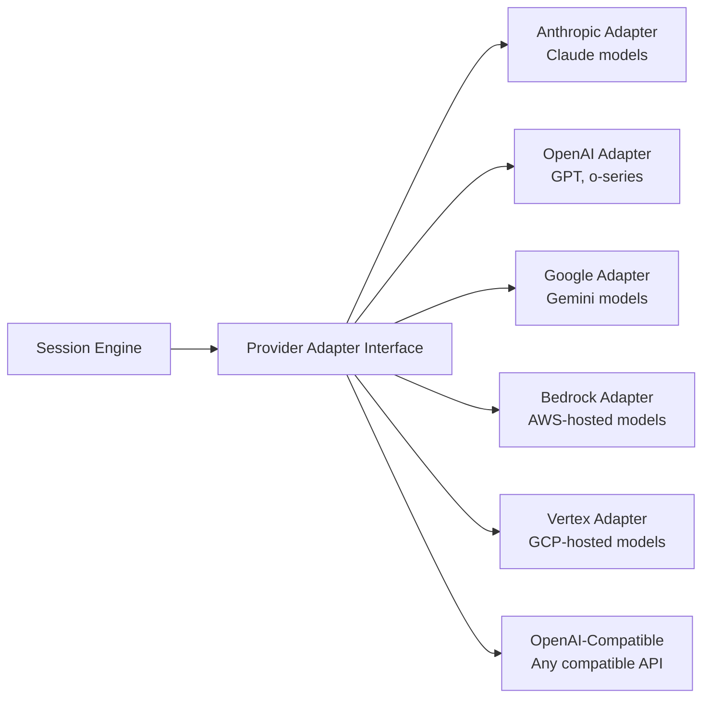
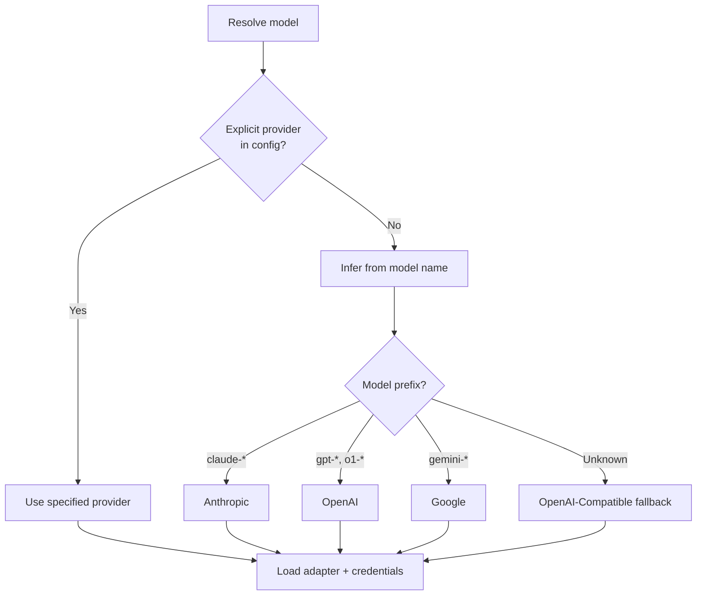

# Provider system

> **Source:** `src/provider/`
> **Last verified against code:** 2026-05-09

LiteAI uses an adapter pattern to normalize communication across different LLM providers. This lets users switch providers without changing their workflow.

## Adapter architecture



Each adapter implements a common interface that handles:

| Responsibility | Description |
|---|---|
| **Request normalization** | Convert LiteAI's internal message format to the provider's API schema |
| **Response streaming** | Parse provider-specific SSE streams into a unified event format |
| **Token counting** | Estimate token usage per request/response |
| **Tool formatting** | Convert tool definitions to provider-specific schemas |
| **Error mapping** | Normalize provider errors into LiteAI's error model |
| **Capability detection** | Report which features the model supports (vision, tool use, thinking, caching) |

## Supported providers

| Provider | Adapter | Models | Features |
|---|---|---|---|
| **Anthropic** | `anthropic.ts` | Claude 4, Sonnet, Haiku | Streaming, tools, vision, thinking, prompt caching |
| **OpenAI** | `openai.ts` | GPT-4o, o1, o3 | Streaming, tools, vision, JSON mode |
| **Google** | `google.ts` | Gemini 2.5, 3.0 | Streaming, tools, vision, grounding |
| **AWS Bedrock** | `bedrock.ts` | Anthropic, Meta, Mistral (via AWS) | Streaming, tools |
| **Google Vertex** | `vertex.ts` | Gemini (via GCP) | Streaming, tools |
| **OpenAI-Compatible** | `openai-compatible.ts` | Any API matching OpenAI spec | Streaming, tools |

## Model capabilities

Each model reports its capabilities through a standardized interface:

```typescript
interface ModelCapabilities {
  streaming: boolean           // Supports response streaming
  toolUse: boolean             // Supports function/tool calling
  vision: boolean              // Can process images
  thinking: boolean            // Extended thinking / chain-of-thought
  promptCaching: boolean       // Supports prompt cache sharing
  jsonMode: boolean            // Supports structured JSON output
  maxContextTokens: number     // Maximum input context size
  maxOutputTokens: number      // Maximum response size
}
```

The session engine uses these capabilities to:
- Decide whether to enable prompt caching (fork subagents)
- Choose compaction strategy based on context window size
- Enable/disable thinking blocks in the system prompt
- Select the right tool format (JSON schema vs. XML)

## Model loader

**Source:** `src/provider/loader.ts`

The model loader resolves provider and model from configuration:



## Streaming

All providers use SSE (Server-Sent Events) for response streaming. The adapter layer normalizes provider-specific stream formats into a unified event model:

| Event type | Content |
|---|---|
| `text_delta` | Incremental text content |
| `tool_use_start` | Tool call initiated (name + ID) |
| `tool_use_delta` | Incremental tool arguments |
| `tool_use_end` | Tool call complete |
| `thinking_delta` | Thinking/reasoning content |
| `message_complete` | Response finished |
| `error` | Provider error |

## Authentication

Each provider uses its own authentication method:

| Provider | Auth method | Environment variable |
|---|---|---|
| Anthropic | API key | `ANTHROPIC_API_KEY` |
| OpenAI | API key | `OPENAI_API_KEY` |
| Google | API key or OAuth | `GOOGLE_API_KEY` |
| Bedrock | AWS credentials | `AWS_ACCESS_KEY_ID`, `AWS_SECRET_ACCESS_KEY` |
| Vertex | GCP service account | `GOOGLE_APPLICATION_CREDENTIALS` |

Credentials can also be set in `settings.json` under the `provider` key.

## What's next?

- [**Session engine & loop**](/architecture/session-engine) — How the engine uses providers
- [**Transport channels**](/architecture/transport-channels) — How responses reach clients
- [**Settings reference**](/configuration/settings) — Provider configuration options
