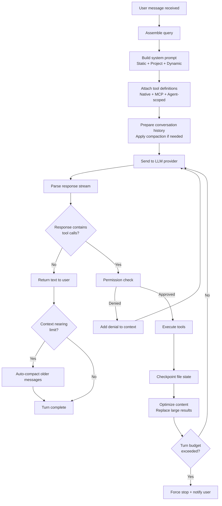

# Session engine & loop

> **Source:** `src/session/`, `src/session/engine/`
> **Last verified against code:** 2026-05-09

The session engine is the core runtime of LiteAI. It manages the agent loop — the cycle of assembling prompts, querying the LLM, executing tools, and managing conversation state.

## Agent loop architecture



## Query assembly

**Source:** `src/session/engine/query.ts`

Each query sent to the LLM is assembled from three components:

### 1. System prompt

The system prompt is built by the [system prompt pipeline](/architecture/context-memory) from registered sections:

| Section | Content | Caching |
|---|---|---|
| Identity | Agent name, capabilities, behavioral rules | Cached per-session |
| Environment | OS, shell, working directory, timestamps | Rebuilt every turn |
| Project | AGENTS.md instructions, platform profile | Cached, invalidated on file change |
| Tools | Tool descriptions and schemas | Cached until tool pool changes |
| Memory | Agent memory content | Loaded on demand |
| Custom | Agent-specific sections (coordinator prompt, fork boilerplate) | Varies |

### 2. Conversation history

The full conversation history, potentially compacted. Each message retains:
- Role (user/assistant)
- Content (text, tool calls, tool results)
- Content optimization metadata (for replaced large results)

### 3. Tool definitions

The tool pool is assembled from:
- **Native tools** (~30 built-in tools)
- **MCP tools** (from connected MCP servers)
- **Agent-scoped tools** (added by plugins)

In coordinator mode, the tool pool is filtered to delegation-only tools.

## Tool dispatch

**Source:** `src/session/engine/tool-dispatch.ts`

When the LLM returns tool calls, they're processed through this pipeline:

1. **Parse** — Extract tool name and parameters from the model response
2. **Validate** — Check against the tool registry and parameter schema
3. **Permission check** — Route through the [Permission service](/architecture/security-model)
4. **Execute** — Run the tool implementation
5. **Capture result** — Format the tool output for the model
6. **Checkpoint** — Snapshot modified files (if applicable)
7. **Optimize** — Replace large results with disk-backed references

### Parallel tool execution

When the model returns multiple tool calls in a single response, LiteAI executes them in parallel where safe. Read-only tools (search, list) can run concurrently; write tools are serialized to prevent conflicts.

## Auto-compaction

**Source:** `src/session/engine/compaction.ts`

Compaction prevents context window overflow by summarizing older messages:

| Parameter | Value |
|---|---|
| Trigger | ~80% of model's context limit |
| Strategy | Summarize oldest N messages as a group |
| Preservation | Most recent messages are never compacted |
| Model | Uses the same provider (lightweight call) |
| Metadata | Tool result references are preserved for expansion |

### Compaction flow

```
1. Count tokens in current context
2. If below threshold → skip
3. Select oldest messages (keeping recent 20%)
4. Generate summary via LLM call
5. Replace selected messages with summary block
6. Update content optimization state
```

Disable with `LITEAI_DISABLE_AUTOCOMPACT=true`.

## Checkpointing

**Source:** `src/snapshot/`

After each tool execution that modifies files, LiteAI creates a checkpoint:

| What's saved | Storage |
|---|---|
| File diffs (before/after) | SQLite |
| Git state (branch, commit) | SQLite |
| Session metadata | SQLite |
| Timestamp | SQLite |

Checkpoints enable `/undo` and `/revert` commands, letting users roll back any agent action.

## Turn budgets

| Budget | Default | Configurable |
|---|---|---|
| Max turns per session | 200 | `maxTurns` in agent config |
| Wall-clock timeout (background agents) | 30 minutes | `wallClockTimeout` |
| Max tokens per response | Model-dependent | Provider setting |

When a budget is exceeded, the engine force-stops the turn and notifies the user.

## Session modes

The engine supports four session modes that control tool availability:

| Mode | Tool access | Use case |
|---|---|---|
| **Normal** | Full | Default — everyday coding |
| **Plan** | Read-only | Planning, code review |
| **Coordinator** | Delegation-only | Multi-agent orchestration |
| **Headless** | Full (non-interactive) | CI/CD, automation |

Mode is set at session creation and persisted in session metadata. The engine applies the appropriate tool filter based on the mode.

## Content optimization

**Source:** `src/session/engine/content-optimization.ts`

For large tool results, the engine can:

1. **Persist** the full result to disk
2. **Replace** the in-context content with a preview
3. **Track** the replacement via a `contentReplacementId`
4. **Expand** on demand if the model requests the full content

This is critical for file-heavy workflows where reading multiple large files would exhaust the context window.

## Stop conditions

The agent loop terminates when any of these conditions are met:

| Condition | Behavior |
|---|---|
| Text-only response (no tool calls) | Normal completion |
| Max turns reached | Force stop with notification |
| Wall-clock timeout | Force stop with notification |
| User interrupt (Ctrl+C) | Graceful stop |
| Model returns stop token | Normal completion |
| Error (unrecoverable) | Error response to user |

## What's next?

- [**Provider system**](/architecture/provider-system) — How LLM adapters normalize requests
- [**Context & memory pipeline**](/architecture/context-memory) — System prompt assembly details
- [**Coordinator & swarms**](/architecture/coordinator-swarms) — Multi-agent orchestration
