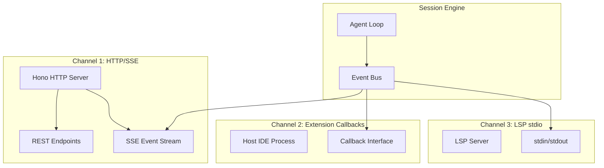
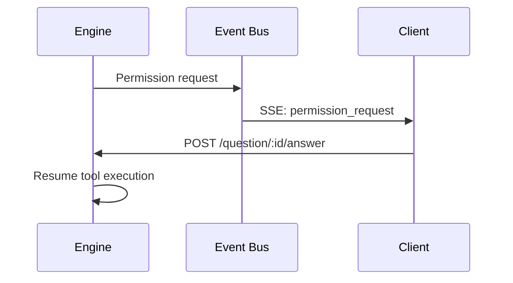

# Transport channels

> **Source:** `src/server/`, `src/lsp/`, `src/acp/`, `src/capabilities/`
> **Last verified against code:** 2026-05-09

LiteAI uses three transport channels to communicate with clients. Each channel serves different deployment contexts, but all share the same session engine underneath.

## Channel overview



## Channel 1: HTTP/SSE (Local & Remote)

**Used by:** CLI, Web UI, Remote Control

The primary channel for standalone deployments. LiteAI runs a Hono HTTP server that exposes REST endpoints for session management and SSE streams for real-time event delivery.

### Middleware stack

Every request passes through:

| Middleware | Purpose |
|---|---|
| `requestTracer()` | OpenTelemetry span creation |
| `requestLogger()` | Request/response logging |
| `corsMiddleware()` | CORS headers for web clients |
| `csrfMiddleware()` | CSRF token validation |
| `authMiddleware()` | Username/password or token auth |
| `projectContextMiddleware()` | Inject project context into request |
| `errorHandler()` | Structured error responses |

### API route tiers

Routes are organized in three tiers based on required context:

**Tier 1 — Server-level** (no project context needed):
| Route | Purpose |
|---|---|
| `GET /` | Server info |
| `GET /system` | System information |
| `POST /auth` | Authentication |
| `GET /provider` | Provider CRUD |
| `GET /doc` | OpenAPI specification |

**Tier 2 — Project CRUD** (no instance required):
| Route | Purpose |
|---|---|
| `GET /project` | List projects |
| `POST /project` | Create project |
| `/project/*` | Project management |

**Tier 3 — Project-scoped** (requires project instance):
| Route | Purpose |
|---|---|
| `/session` | Session CRUD & SSE streaming |
| `/config` | Project configuration |
| `/config/mcp` | MCP server management |
| `/config/plugin` | Plugin management |
| `/permission` | Permission management |
| `/question` | HITL question/answer |
| `/tool` | Tool registry |
| `/pty` | PTY terminal access |
| `/file` | File operations |

### SSE event stream

Session events are delivered via Server-Sent Events:

```
GET /session/:id/events

event: message
data: {"type": "text_delta", "content": "Here's the fix..."}

event: tool_use
data: {"type": "tool_start", "name": "write_file", "id": "call_123"}

event: tool_result
data: {"type": "tool_result", "id": "call_123", "content": "File written."}

event: permission_request
data: {"type": "permission_ask", "tool": "run_command", "args": {...}}
```

### HITL (Human-in-the-Loop)

Permission prompts flow through the question/answer system:



## Channel 2: Extension Callbacks (Hosted)

**Used by:** VS Code extension, IDE integrations

When LiteAI runs inside a host process (e.g., VS Code), it uses callback interfaces instead of HTTP. The host provides capability implementations:

| Capability | Local (HTTP) | Hosted (Extension) |
|---|---|---|
| File I/O | Direct filesystem | Host-mediated |
| Terminal | PTY subprocess | Host terminal API |
| Diagnostics | LSP client | Host diagnostics API |
| UI feedback | SSE events | Host notification API |

### Capability interface

```typescript
interface Capabilities {
  readFile(path: string): Promise<string>
  writeFile(path: string, content: string): Promise<void>
  runCommand(command: string): Promise<CommandResult>
  showDiagnostics(diagnostics: Diagnostic[]): void
  askPermission(request: PermissionRequest): Promise<boolean>
}
```

The `LocalCapabilities` implementation uses direct filesystem and process APIs. The `HostedCapabilities` implementation delegates to the extension host.

## Channel 3: LSP stdio

**Used by:** IDE language server integration

LiteAI can run as an LSP (Language Server Protocol) server communicating over stdin/stdout. This enables:

- Inline code completions
- Diagnostic integration
- Code action suggestions
- Hover documentation

### LSP adapters

LiteAI ships with 40 language server adapters for diagnostics and code intelligence:

TypeScript, Python (Pyright/Ty), Rust, Go, Java, Kotlin, C#, F#, C/C++, Dart, Elixir, Gleam, Haskell, Julia, Lua, Nix, OCaml, PHP, Ruby, Swift, Zig, Bash, Clojure, Vue, Svelte, Astro, Prisma, Terraform, Docker, YAML, LaTeX/TeX, Typst, Deno, ESLint, Biome, OxLint, RuboCop, and more.

## mDNS discovery

**Source:** `src/server/mdns.ts`

For remote access, LiteAI advertises itself via mDNS (multicast DNS), allowing clients on the same network to discover running instances automatically.

## What's next?

- [**Security model**](/architecture/security-model) — Middleware stack and auth details
- [**Platforms overview**](/platforms/overview) — Which platforms use which channel
- [**Channels reference**](/reference/channels-reference) — Complete endpoint listing
