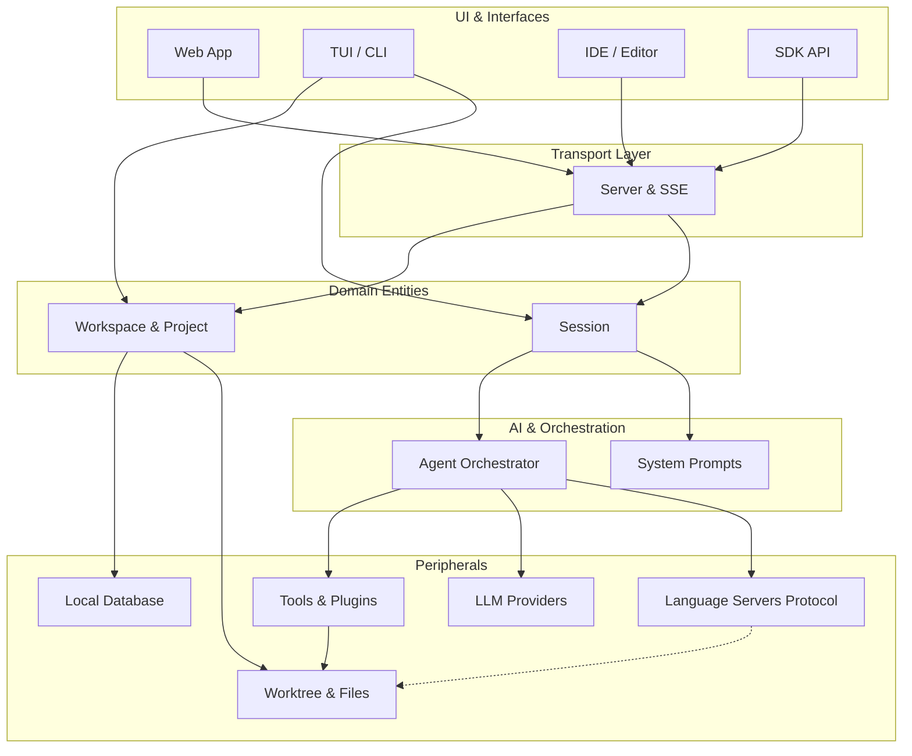

# LiteAI Documentation

Welcome to the internal documentation for **LiteAI**. This document serves as an entry point to understanding the high-level architecture, module organization, and feature guidelines of the project. 

Our codebase is highly modularized, where each core feature or sub-system has a dedicated physical directory within `src/` and a corresponding conceptual document in this `docs/` folder.

> **Note**: The documentation aims to describe the intended architecture. You might encounter temporary divergence between the docs and the main code; see individual docs for deeper dives.

---

## 🏗 High-Level Architecture

LiteAI fundamentally functions as a core engine for managing **Projects**, isolated **Sessions**, and interactions with various **LLMs** and **Tools**. 

The system leverages several interfaces to stream execution feedback to the user:
- **Web App**: Connects via HTTP API and Server-Sent Events (SSE).
- **IDE Extensions**: In production, integrates via HTTP/SSE for chat, HTTP callbacks for hosted fs/git, and LSP over stdio for AI editor features (inline completions).
- **TUI / CLI**: Integrates directly with the internal code (domain layer), bypassing the network API.
- **LSP (server role)**: Core exposes an LSP server on stdin/stdout (`--lsp`) alongside its HTTP server, enabling native editor features.

---

## 📚 Feature Directory

Below is an overview of the key subsystems within LiteAI. For each feature, you will find where its source code is located (`src/`) and the relevant documentation for deep-dives.

### 🧠 Agent & AI Orchestration
The core loop executing AI tasks, prompt resolution, and message state.
- **Source:** [`src/agent/`](../src/agent/), [`src/session/`](../src/session/)
- **Documentation:**
  - [**Agent Loop**](./agent.md) — How the core AI interaction flow is orchestrated.
  - [**Session Management**](./session.md) — How interactions and states are represented.
  - [**System Prompts & Pipeline**](./system-prompt-pipeline.md) — Construction phase for instructions.
  - [**Prompt Engineering**](./prompt-engineering.md) — Guidelines to formatting robust prompts.
  - [**Session Diff**](./session-diff.md) — Mechanics of observing side-effects during a session.

### 🔌 Providers & Models
Handles interfacing and normalizing API requests to various Large Language Models (LLMs) and platforms.
- **Source:** [`src/provider/`](../src/provider/)
- **Documentation:**
  - [**Providers Overview**](./provider.md) — Adding and configuring model adapters.

### 📂 Workspaces & Projects
State management, metadata, and local persistence for whatever source repository the AI is engaging with.
- **Source:** [`src/project/`](../src/project/), [`src/config/`](../src/config/), [`src/storage/`](../src/storage/)
- **Documentation:**
  - [**Database Schema**](./database.md) — Internal persistence representations.
  - [**Projects**](./project.md) & [**Workspace Structure**](./workspace-project-session.md) — Data isolation and structure.
  - [**Configuration**](./config.md) — Settings discovery and precedence.
  - [**Initialization**](./initialization.md) — Application boot and setup routines.

### 🛠️ Tools, Commands & Execution
Modules that allow the system to alter the host machine and parse CLI directives.
- **Source:** [`src/tool/`](../src/tool/), [`src/cli/`](../src/cli/), [`src/command/`](../src/command/), [`src/skill/`](../src/skill/)
- **Documentation:**
  - [**Commands Architecture**](./commands-architecture.md) — System entry and routing execution.
  - [**Shell & Tools**](./shell-tool.md) — Executing OS commands, rendering terminals, etc.
  - [**Skills & Extensions**](./skills.md) — Composable, domain-specific AI tasks.

### 🌲 Source Control & File Operations
Tracking differences, snapshotting project boundaries, and ensuring safe filesystem mutation.
- **Source:** [`src/worktree/`](../src/worktree/), [`src/snapshot/`](../src/snapshot/), [`src/file/`](../src/file/)
- **Documentation:**
  - [**Worktree**](./worktree.md) — Source control wrapper over user's repo.
  - [**Snapshots & Diff**](./snapshot-and-diff.md) — Checkpointing and delta generation.

### 📡 Server, APIs, and External Transports
How external actors subscribe to and control the core agent.
- **Source:** [`src/server/`](../src/server/), [`src/sdk/`](../src/sdk/), [`src/mcp/`](../src/mcp/)
- **Documentation:**
  - [**Communication Channels**](./channels.md) — All transports: HTTP/SSE (primary API), Extension Server callbacks (hosted mode), and LSP stdio (editor features). **Start here.**
  - [**SDK Implementation**](./sdk.md) — Integrating LiteAI into Node/Bun environments programmatically.
  - [**SSE Events**](./sse.md) — Server-Sent Events (SSE) provide real-time streaming updates over HTTP, essential for Web App reactivity.

### 🔍 Code Intelligence (LSP)
LiteAI has a dual role in the Language Server Protocol ecosystem:

**As an LSP client:** LiteAI spawns third-party Language Servers (like Pyright, TSServer, Clangd) as child processes to perform static analysis. This empowers the LLM to access rich references, diagnostics, and implementations from existing language tools.

**As an LSP server:** When started with `--lsp`, LiteAI exposes its own LSP server on stdin/stdout. VS Code's `LanguageClient` connects to this endpoint for AI-powered editor features:
- `textDocument/inlineCompletion` — ghost-text completions using the small model
- `textDocument/codeAction` — AI-powered fixes and refactors _(Phase 2)_
- `textDocument/hover` — AI-enhanced tooltips _(Phase 2)_

- **Source:** [`src/lsp/`](../src/lsp/)
- **Documentation:**
  - [**LSP Engine**](./lsp.md) — How LiteAI queries language servers for code intelligence (client role).
  - [**Communication Channels**](./channels.md) — All transports including the LSP server channel.

### 📊 Observability & Engineering
Tracking step-by-step executions for debugging regressions and providing the user with detailed audit logs.
- **Source:** [`src/trace/`](../src/trace/), [`src/bun/`](../src/bun/)
- **Documentation:**
  - [**Tracing**](./tracing.md) — Detailed event logging per agent invocation.
  - [**Build process**](./build.md) — Compilation strategy and optimizations.

---

> **Tip**: All standalone feature modules natively sit directly in the `src/` folder for flat composability. If you wish to understand a slice of behavior locally, refer to the folder path mapping above. 
