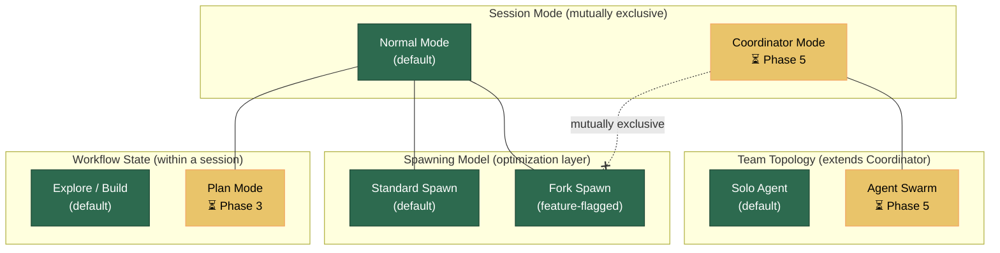

# Agent Execution Modes

This document is the **definitive guide** to understanding LiteAI's agent execution modes — the different ways agents can be configured to operate, how they differ, when to use each, and how to activate them.

> **Start here** if you're unsure which mode to use or how they relate to each other.

---

## Quick Reference

| Mode | Purpose | Activation | Implementation Status |
|---|---|---|---|
| [**Normal Mode**](#normal-mode) | Default single-agent interaction | Default (no flag needed) | ✅ Implemented |
| [**Fork Subagent**](#fork-subagent-mode) | Cost/latency optimization for sub-agent spawning | `LITEAI_FORK_SUBAGENT=true` | ✅ Implemented |
| [**Plan Mode**](#plan-mode) | Structured plan-then-build workflow | Tool-activated (`EnterPlanModeTool`) | ⏳ Not yet implemented (Phase 3) |
| [**Coordinator Mode**](#coordinator-mode) | Delegating orchestrator with restricted tool pool | `COORDINATOR_MODE=true` | ⏳ Not yet implemented (Phase 5) |
| [**Swarm Mode**](#swarm-mode) | Multi-agent teams with inter-agent messaging | Extension of Coordinator Mode | ⏳ Not yet implemented (Phase 5) |

### Mode Relationships



> **Key insight:** These are not all alternatives to each other. They operate on different axes:
> - **Session mode** (Normal vs Coordinator) — who does the work
> - **Spawning model** (Standard vs Fork) — how sub-agents are created
> - **Workflow state** (Explore/Build vs Plan) — what the agent is doing
> - **Team topology** (Solo vs Swarm) — how many agents collaborate

---

## Normal Mode

> **Status:** ✅ Fully implemented

Normal mode is LiteAI's default operating mode. A single root agent interacts with the user, has full access to all tools, and can spawn sub-agents to delegate tasks.

### How It Works

1. The user sends a prompt to a session.
2. The root agent processes the prompt using its full tool pool (file editing, shell, search, etc.).
3. When the agent needs to delegate, it spawns **sub-agents** via the `task` tool.
4. Sub-agents operate in isolated contexts (see [Sub-Agent Architecture](./subagent-architecture.md)):
   - Fresh conversation history (clean slate)
   - Freshly generated system prompt for the sub-agent's type
   - Sandboxed permissions
   - Sidechain transcripts (JSONL + SQLite)
5. The parent receives a dense result summary when the sub-agent completes.

### How to Activate

No action needed — this is the default.

### Advantages

- **Simplicity** — straightforward single-agent loop, easy to reason about
- **Full tool access** — the root agent can do everything
- **Clean sub-agent isolation** — each sub-agent starts fresh, no context bleed
- **Deterministic** — predictable behavior, no coordination overhead

### Limitations

- **No prompt cache sharing** — each sub-agent generates its own system prompt, meaning no cache reuse with the parent (see [Fork Subagent Mode](#fork-subagent-mode) for the optimization)
- **No structured workflow** — the agent decides ad-hoc whether to plan or execute (see [Plan Mode](#plan-mode) for structured planning)
- **Single orchestrator** — the root agent both thinks and does work (see [Coordinator Mode](#coordinator-mode) for delegation-only orchestration)

### Detailed Documentation

- [Sub-Agent Architecture](./subagent-architecture.md) — context forking, sidechain transcripts, permission sandboxing, cleanup lifecycle
- [System Prompt Pipeline](./system-prompt-pipeline.md) — how system prompts are resolved per agent

---

## Fork Subagent Mode

> **Status:** ✅ Fully implemented  
> **Feature flag:** `LITEAI_FORK_SUBAGENT=true`

Fork subagent mode is a **cost and latency optimization layer** that changes _how_ sub-agents are spawned. It is not a different "mode of operation" — it's an optimization on top of Normal Mode.

### How It Works

Instead of giving each sub-agent a clean slate, fork spawning makes the child inherit the parent's **exact** conversation context and system prompt (byte-for-byte). This means the upstream LLM provider's prompt cache is shared between parent and child, reducing per-spawn token costs by ≥80% and drastically improving time-to-first-token.

```
┌─────────────────────────────────────────────────────┐
│  System prompt (parent's byte-exact)                │  ═══╗
│  Parent conversation history                        │     ║ cache-
│  Assistant message (all tool_use blocks)            │     ║ compatible
│  User message:                                      │     ║ prefix
│    tool_result[0]: "Fork started — processing..."   │     ║
│    tool_result[1]: "Fork started — processing..."   │  ═══╝
│    text: <fork-boilerplate>RULES...</fork-boilerplate>  ← shared
│          Your directive: <per-child task>            │  ← differs
└─────────────────────────────────────────────────────┘
```

The only thing that differs between fork siblings is the final directive text.

### How to Activate

Set the environment variable before starting LiteAI:

```bash
LITEAI_FORK_SUBAGENT=true
```

Or use the `LITEAI_FORK_SUBAGENT` flag in your configuration.

### What Changes When Enabled

| Aspect | Standard Spawn | Fork Spawn |
|---|---|---|
| **Conversation history** | Clean (empty) | Parent's full context (byte-exact copy) |
| **System prompt** | Freshly generated per agent type | Parent's rendered prompt (byte-exact) |
| **Prompt cache** | No sharing with parent | Shared with parent (≥80% cost reduction) |
| **Execution mode** | Sync or async (per config) | **Always async** (all spawns forced to background) |
| **Sub-agent spawning** | Allowed (nested) | **Blocked** (recursion guard via `<fork-boilerplate>` sentinel) |
| **Output format** | Free-form | Strict 500-word structured report |
| **Project rules** | Per agent config (`omitLiteaiMd`) | Inherited from parent context |

### Advantages

- **Massive cost reduction** — prompt cache sharing reduces token costs ≥80%
- **Faster time-to-first-token** — cached prefix means instant prompt processing
- **Transparent** — from the agent's perspective, it still uses the `task` tool identically
- **Agent durability** — fork children have resume capability from persisted transcripts

### Limitations

- **No recursion** — fork children cannot spawn their own sub-agents
- **Strict output format** — fork children must follow a rigid report structure
- **Always async** — there is no synchronous fork spawn; all become background tasks
- **Mutually exclusive with Coordinator Mode** — cannot be active simultaneously

### Detailed Documentation

- [Fork Subagent & Agent Durability](./fork-subagent-durability.md) — full technical deep-dive on cache construction, resume pipeline, and system prompt recovery
- [Spawning Models Comparison](./spawning-models-comparison.md) — side-by-side comparison of standard vs fork spawning mechanics

---

## Plan Mode

> **Status:** ⏳ Not yet implemented (Phase 3 of [Agent Core Roadmap](../../../../roadmap/agents-core-roadmap.md))

> [!WARNING]
> Plan Mode is **not yet implemented**. This section describes the planned design. See the [Agent Core Architecture Roadmap — Phase 3](../../../../roadmap/agents-core-roadmap.md#phase-3-plan-mode) for the full specification and implementation timeline.

Plan mode is a **workflow state** within a session that enforces a structured plan-then-build cycle. Instead of the agent immediately executing changes, it first creates a plan, gets user approval, and only then proceeds to implementation.

### How It Will Work

1. The agent (or user) activates plan mode via the `EnterPlanModeTool`.
2. In plan mode, the agent drafts a plan document outlining what it intends to do.
3. The agent calls `ExitPlanModeTool` to submit the plan for approval.
4. An SSE event (`plan.approval_requested`) is sent to the UI, which displays an inline approval dock.
5. The user reviews and approves/rejects the plan.
6. On approval, the agent transitions to **build mode** with the full plan text injected into context, ensuring it stays on track.
7. A reminder system keeps the plan in the agent's context:
   - **Every turn:** sparse reminder ("Plan at {path}, staying on track?")
   - **Every 5 turns:** full plan text refresh (prevents model drift)

### How to Activate (Planned)

Plan mode will be activated **within a session** via the `EnterPlanModeTool` — not via an environment variable. The agent or user can invoke it at any time during a conversation.

```
User: "Plan how to refactor the auth module before making changes"
→ Agent invokes EnterPlanModeTool
→ Session enters plan mode
→ Agent drafts plan
→ Agent invokes ExitPlanModeTool
→ User approves via UI dock
→ Session transitions to build mode with plan in context
```

### Advantages (Planned)

- **User oversight** — explicit approval gate before any changes are made
- **Reduced wasted work** — misunderstandings caught at the plan stage, not after 50 file edits
- **Context persistence** — the plan stays in the agent's context throughout build mode via the attachment-based reminder system
- **Prompt cache friendly** — plan text is injected via attachments, not baked into the system prompt, preserving cache efficiency

### Key Differences from Normal Mode

| Aspect | Normal Mode | Plan Mode |
|---|---|---|
| **Workflow** | Ad-hoc (agent decides when to plan vs execute) | Structured (plan → approve → build) |
| **User approval** | Per-tool (file writes, shell commands) | Per-plan (approve the whole approach) |
| **Agent context** | No persistent plan awareness | Plan text kept in context via reminders |
| **Sub-agents** | General-purpose | Dedicated Plan/Explore sub-agents with restricted tool pools |

### Depends On

- **Phase 2 (Sub-Agent Architecture)** ✅ — Plan/Explore are specialized sub-agents
- **`disallowedTools` enforcement** — required for restricting Plan/Explore sub-agent tool pools

---

## Coordinator Mode

> **Status:** ⏳ Not yet implemented (Phase 5 of [Multi-Agent Platform Roadmap](../../../../roadmap/agents-platform-roadmap.md))

> [!WARNING]
> Coordinator Mode is **not yet implemented**. This section describes the planned design. See the [Multi-Agent Platform Roadmap — Phase 5](../../../../roadmap/agents-platform-roadmap.md#phase-5-coordinator-mode--agent-swarms) for the full specification and implementation timeline.

Coordinator mode fundamentally changes the role of the root agent. Instead of doing work directly, the root agent becomes a **pure orchestrator** that delegates ALL real work to worker sub-agents. It has a restricted tool pool (only orchestration tools) and a dedicated system prompt focused on task decomposition, worker management, and synthesis.

### How It Will Work

1. The session starts in coordinator mode (detected via environment variable).
2. The root agent receives a **coordinator-specific system prompt** (~370 lines) covering:
   - Role definition: delegate, don't execute
   - Worker lifecycle management (spawn → research → synthesis → implementation → verification)
   - Concurrency rules (read-only tasks parallelized, write-heavy tasks serialized)
   - Failure handling (continue existing workers via `SendMessage`, don't respawn)
3. The coordinator's tool pool is **restricted** to orchestration-only tools:
   - `Agent` — spawn workers
   - `SendMessage` — communicate with running/stopped workers
   - `TaskStop` — manage task lifecycle
   - `TeamCreate` / `TeamDelete` — manage agent teams
4. Worker capabilities are injected into the coordinator's context so it knows what each worker can do.
5. Workers run as background sub-agents with full tool access.

### How to Activate (Planned)

Set the environment variable before starting LiteAI:

```bash
COORDINATOR_MODE=true
```

### Advantages (Planned)

- **Parallelism** — multiple workers can operate concurrently on independent tasks
- **Separation of concerns** — the coordinator focuses on strategy; workers focus on execution
- **Better for large tasks** — complex multi-file changes can be decomposed and parallelized
- **Worker re-engagement** — stopped workers can be resumed via `SendMessage` instead of respawning

### Key Differences from Normal Mode

| Aspect | Normal Mode | Coordinator Mode |
|---|---|---|
| **Root agent role** | Does everything (thinks + executes) | Pure orchestrator (delegates only) |
| **Root agent tools** | Full tool pool | Restricted (Agent, SendMessage, TaskStop, TeamCreate, TeamDelete) |
| **System prompt** | General-purpose | Coordinator-specific (~370 lines of orchestration guidance) |
| **Sub-agent spawning** | On-demand, optional | Primary mechanism — all work delegated |
| **Concurrency** | Sequential by default | Designed for parallel worker execution |
| **Fork subagent** | Compatible (can be enabled alongside) | **Mutually exclusive** — fork is disabled when coordinator is active |

### Depends On

- **Phase 4 (Fork Subagent)** ✅ — coordinator mode is mutually exclusive with fork; requires agent resume for `SendMessage` re-engagement
- **Phase 3 (Plan Mode)** — `disallowedTools` enforcement needed for coordinator tool filtering

---

## Swarm Mode

> **Status:** ⏳ Not yet implemented (Phase 5 of [Multi-Agent Platform Roadmap](../../../../roadmap/agents-platform-roadmap.md))

> [!WARNING]
> Swarm Mode is **not yet implemented**. This section describes the planned design. See the [Multi-Agent Platform Roadmap — Phase 5](../../../../roadmap/agents-platform-roadmap.md#phase-5-coordinator-mode--agent-swarms) for the full specification and implementation timeline.

Swarm mode extends Coordinator Mode with a full **teammate system** — multiple agents running concurrently, communicating via file-based mailboxes, sharing task lists, and coordinating through structured protocols.

### How It Will Work

1. The coordinator spawns a **team** of agents via `TeamCreate`.
2. Teammates run in-process with `AsyncLocalStorage`-based context isolation.
3. Communication happens through a **file-based mailbox system**:
   - Each agent has a mailbox file
   - Messages are written/read via `writeToMailbox()` / `readMailbox()`
   - Supports structured messages: `shutdown_request`, `shutdown_response`, `plan_approval_response`
   - Broadcast to all teammates via `to: "*"`
4. Teammates can claim tasks from a shared task list.
5. Permission synchronization bridges worker permission requests to the leader's UI.

### Advantages (Planned)

- **True multi-agent collaboration** — agents can communicate and coordinate
- **Shared task management** — built-in task claiming and distribution
- **Structured protocols** — shutdown, approval, and messaging protocols prevent chaos
- **Scalable** — teams can be created and disbanded dynamically

### Key Differences from Coordinator Mode

| Aspect | Coordinator (Solo Workers) | Swarm |
|---|---|---|
| **Worker communication** | None (workers are independent) | File-based mailbox messaging |
| **Task distribution** | Coordinator assigns directly | Workers can self-claim from shared list |
| **Team management** | Individual spawn/kill | `TeamCreate` / `TeamDelete` for groups |
| **Shutdown protocol** | Abort signal | Structured request → approve/reject → cleanup |

---

## Decision Guide: Which Mode Should I Use?

### For Most Users

**Start with Normal Mode** (the default). It covers the vast majority of use cases. If you notice high token costs from frequent sub-agent spawning, enable Fork Subagent Mode.

### By Use Case

| Use Case | Recommended Mode |
|---|---|
| General coding assistance | Normal Mode |
| Cost-sensitive environments with frequent sub-agents | Normal Mode + Fork Subagent |
| Complex tasks requiring user approval before execution | Plan Mode ⏳ |
| Large multi-file refactors that benefit from parallelism | Coordinator Mode ⏳ |
| Multi-agent workflows with inter-agent communication | Swarm Mode ⏳ |

### Compatibility Matrix

| | Normal | Fork | Plan | Coordinator | Swarm |
|---|---|---|---|---|---|
| **Normal** | — | ✅ Compatible | ✅ Compatible | ❌ Exclusive | ❌ Exclusive |
| **Fork** | ✅ | — | ✅ Compatible | ❌ Exclusive | ❌ Exclusive |
| **Plan** | ✅ | ✅ | — | ✅ Compatible | ✅ Compatible |
| **Coordinator** | ❌ | ❌ | ✅ | — | ✅ Extension |
| **Swarm** | ❌ | ❌ | ✅ | ✅ | — |

> **Note:** Plan Mode operates on the workflow axis (plan vs build) and is compatible with both session modes (Normal and Coordinator). Fork operates on the spawning axis and is only compatible with Normal Mode.

---

## Feature Flags Summary

| Flag | Default | Effect | Status |
|---|---|---|---|
| `LITEAI_FORK_SUBAGENT` | `false` | Enable fork subagent spawning model | ✅ Implemented |
| `COORDINATOR_MODE` | `false` | Enable coordinator mode (delegating orchestrator) | ⏳ Phase 5 |

> [!NOTE]
> Plan Mode is not activated via a feature flag — it is activated dynamically within a session via the `EnterPlanModeTool`.

---

## Further Reading

- [Sub-Agent Architecture](./subagent-architecture.md) — context forking, sidechain transcripts, permission sandboxing
- [Fork Subagent & Agent Durability](./fork-subagent-durability.md) — cache optimization, agent resume, system prompt recovery
- [Spawning Models Comparison](./spawning-models-comparison.md) — side-by-side standard vs fork spawning mechanics
- [System Prompt Pipeline](./system-prompt-pipeline.md) — how system prompts are resolved per agent
- [Agent Core Roadmap](../../../../roadmap/agents-core-roadmap.md) — Phase 3 (Plan Mode) and Phase UI
- [Multi-Agent Platform Roadmap](../../../../roadmap/agents-platform-roadmap.md) — Phase 5 (Coordinator + Swarms) and Phase 6 (Specialized Agents)
