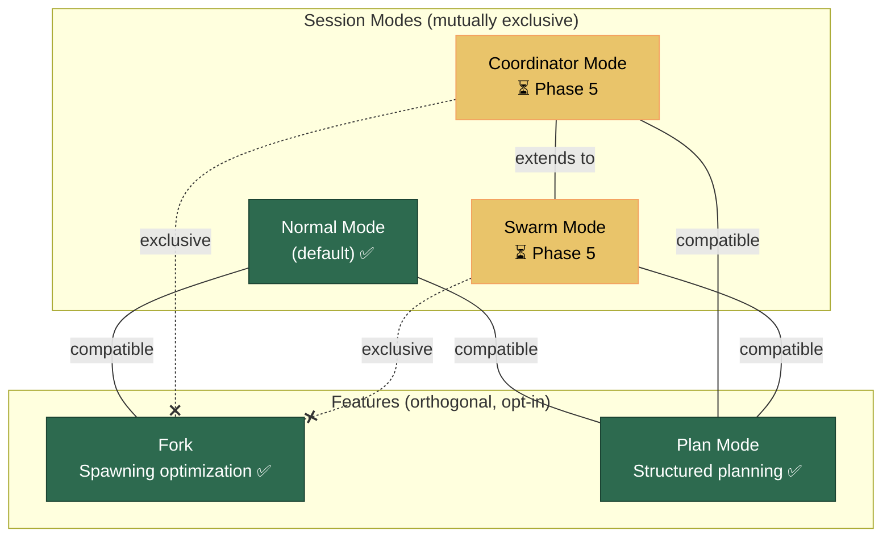

# Agent Execution Modes

This document is the **definitive guide** to understanding LiteAI's agent architecture — the session modes, optional features, and how they compose together.

> **Start here** if you're unsure how the system is structured or what the user can configure.

---

## Conceptual Framework

LiteAI's agent system is organized along **two independent dimensions**:

1. **Session Modes** — mutually exclusive choices for *how the session operates*
2. **Features** — orthogonal capabilities that can be enabled/disabled independently



> **Key insight:** Session modes and features are independent axes. You pick ONE session mode, then optionally enable Fork and/or Plan Mode on top of it.

---

## Quick Reference

### Session Modes

| Mode | Purpose | Status |
|---|---|---|
| [**Normal**](#normal-mode) | Root agent does everything — thinks, executes, optionally delegates | ✅ Default |
| [**Coordinator**](#coordinator-mode) | Root agent only orchestrates — delegates ALL work to workers | ⏳ Phase 5 |
| [**Swarm**](#swarm-mode) | Multi-agent teams with inter-agent messaging | ⏳ Phase 5 |

### Features

| Feature | Purpose | Status |
|---|---|---|
| [**Fork**](#fork-feature) | Cost/latency optimization for subagent spawning via cache sharing | ✅ Implemented |
| [**Plan Mode**](#plan-mode-feature) | Structured plan-then-build workflow with user approval gates | ✅ Implemented |

---

## The Root Agent (LiteAI)

In all session modes, there is a single **root agent** — the agent the user directly communicates with. This is:

- **Name:** `LiteAI` (display name), `liteai` internally
- **Definition:** [`bundled/agents/liteai.md`](../src/bundled/agents/liteai.md) (declarative frontmatter)
- **System prompt:** [`bundled/prompts/system/system.md`](../src/bundled/prompts/system/system.md) (injected by the session engine, NOT defined in the agent file)

The root agent is a **fully autonomous, general-purpose agent**. It can:

- Answer questions, explain concepts, have conversations
- Edit files, run commands, search code
- Use skills and MCP tools
- Search the web, fetch documentation
- All of this **without** invoking subagents or entering plan mode

Subagents and plan mode are **optional capabilities** the root agent *can* use when the task warrants it — they are not required for normal operation.

> [!NOTE]
> The agent definition file (`liteai.md`) contains only frontmatter (permissions, mode). Its body is intentionally empty because the system prompt comes from `system.md`, which is injected by the session engine. Subagents (e.g., `explore.md`, `plan.md`) define their own prompts in their body. See the YAML comments in `liteai.md` for details.

---

## Session Modes

### Normal Mode

> **Status:** ✅ Implemented (default)

The root agent handles everything directly. It has full access to all tools and can optionally spawn subagents to delegate tasks.

#### How It Works

1. The user sends a prompt to a session.
2. The root agent (LiteAI) processes the prompt using its full tool pool (file editing, shell, search, skills, etc.).
3. When the agent decides to delegate, it spawns **subagents** via the `task` tool.
4. Subagents operate in isolated contexts (see [Sub-Agent Architecture](./subagent-architecture.md)):
   - Fresh conversation history (clean slate, unless [Fork](#fork-feature) is enabled)
   - Freshly generated system prompt for the subagent's type
   - Sandboxed permissions
   - Sidechain transcripts (JSONL + SQLite)
5. The root agent receives a dense result summary when the subagent completes.

#### When to Use

This is the right choice for the vast majority of tasks. The root agent is fully capable of handling complex multi-file changes, code reviews, debugging, and research without any subagent delegation.

#### Activation

No action needed — this is the default.

#### Built-in Subagents (available in Normal Mode)

| Subagent | File | Purpose | Tool Restrictions |
|---|---|---|---|
| **Explore** | `explore.md` | Read-only codebase search specialist | Deny writes; allow grep, glob, read, bash (read-only), web |
| **Plan** | `plan.md` | Read-only architect for designing implementation strategies | Deny writes; allow read/search tools |
| **General** | `general.md` | General-purpose worker for parallel task execution | Full tools minus todo |

#### Detailed Documentation

- [Sub-Agent Architecture](./subagent-architecture.md) — context isolation, sidechain transcripts, permission sandboxing, cleanup lifecycle
- [System Prompt Pipeline](./system-prompt-pipeline.md) — how system prompts are resolved per agent

---

### Coordinator Mode

> **Status:** ⏳ Not yet implemented (Phase 5)

> [!WARNING]
> Coordinator Mode is **not yet implemented**. This section describes the planned design. See the [Multi-Agent Platform Roadmap](../../../../roadmap/agents-platform-roadmap.md#phase-5-coordinator-mode--agent-swarms) for the full specification.

The root agent becomes a **pure orchestrator** — it plans and delegates but never executes work directly. All real work is performed by worker subagents.

#### How It Will Work

1. The session starts in coordinator mode (selected via UI or environment variable).
2. The root agent receives a **coordinator-specific system prompt overlay** covering:
   - Role definition: delegate, don't execute
   - Worker lifecycle management (spawn → research → synthesis → implementation → verification)
   - Concurrency rules (read-only tasks parallelized, write-heavy tasks serialized)
   - Failure handling (continue existing workers via `SendMessage`, don't respawn)
3. The coordinator's tool pool is **restricted** to orchestration-only tools:
   - `Agent` — spawn workers
   - `SendMessage` — communicate with running/stopped workers
   - `TaskStop` — manage task lifecycle
   - `TeamCreate` / `TeamDelete` — manage agent teams (Swarm Mode)
4. Worker capabilities are injected into the coordinator's context so it knows what each worker can do.
5. Workers run as background subagents with full tool access.

#### Key Differences from Normal Mode

| Aspect | Normal | Coordinator |
|---|---|---|
| **Root agent role** | Does everything (thinks + executes) | Pure orchestrator (delegates only) |
| **Root agent tools** | Full tool pool | Restricted to orchestration tools |
| **System prompt** | General-purpose (`system.md`) | `system.md` + coordinator overlay |
| **Subagent spawning** | On-demand, optional | Primary mechanism — all work delegated |
| **Concurrency** | Sequential by default | Designed for parallel worker execution |
| **Fork feature** | ✅ Compatible | ❌ Mutually exclusive |

---

### Swarm Mode

> **Status:** ⏳ Not yet implemented (Phase 5)

> [!WARNING]
> Swarm Mode is **not yet implemented**. This section describes the planned design. See the [Multi-Agent Platform Roadmap](../../../../roadmap/agents-platform-roadmap.md#phase-5-coordinator-mode--agent-swarms) for the full specification.

Swarm mode extends Coordinator Mode with a full **teammate system** — multiple agents running concurrently, communicating via file-based mailboxes, sharing task lists, and coordinating through structured protocols.

#### How It Will Work

1. The coordinator spawns a **team** of agents via `TeamCreate`.
2. Teammates run in-process with `AsyncLocalStorage`-based context isolation.
3. Communication happens through a **file-based mailbox system**:
   - Each agent has a mailbox file
   - Messages are written/read via `writeToMailbox()` / `readMailbox()`
   - Supports structured messages: `shutdown_request`, `shutdown_response`, `plan_approval_response`
   - Broadcast to all teammates via `to: "*"`
4. Teammates can claim tasks from a shared task list.
5. Permission synchronization bridges worker permission requests to the leader's UI.

#### Key Differences from Coordinator

| Aspect | Coordinator (Solo Workers) | Swarm |
|---|---|---|
| **Worker communication** | None (workers are independent) | File-based mailbox messaging |
| **Task distribution** | Coordinator assigns directly | Workers can self-claim from shared list |
| **Team management** | Individual spawn/kill | `TeamCreate` / `TeamDelete` for groups |
| **Shutdown protocol** | Abort signal | Structured request → approve/reject → cleanup |

---

## Features

### Fork Feature

> **Status:** ✅ Implemented  
> **Activation:** Toggle in prompt tray, or `LITEAI_FORK_SUBAGENT=true`  
> **Compatible with:** Normal Mode only (exclusive with Coordinator/Swarm)

Fork is a **cost and latency optimization** that changes *how* subagents are spawned. Instead of giving each subagent a clean slate, fork spawning makes the child inherit the parent's **exact** conversation context and system prompt (byte-for-byte).

This means the upstream LLM provider's prompt cache is shared between parent and child, reducing per-spawn token costs by **≥80%** and drastically improving time-to-first-token.

#### Standard Spawn vs Fork Spawn

| Aspect | Standard Spawn (default) | Fork Spawn |
|---|---|---|
| **Conversation history** | Clean (empty) | Parent's full context (byte-exact copy) |
| **System prompt** | Freshly generated per agent type | Parent's rendered prompt (byte-exact) |
| **Prompt cache** | No sharing with parent | Shared with parent (≥80% cost reduction) |
| **Execution mode** | Sync or async (per config) | **Always async** (all spawns forced to background) |
| **Subagent spawning** | Allowed (nested) | **Blocked** (recursion guard via `<fork-boilerplate>` sentinel) |
| **Output format** | Free-form | Strict 500-word structured report |

#### Cache Construction

```
┌─────────────────────────────────────────────────────┐
│  System prompt (parent's byte-exact)                │  ═══╗
│  Parent conversation history                        │     ║ cache-
│  Assistant message (all tool_use blocks)            │     ║ compatible
│  User message:                                      │     ║ prefix
│    tool_result[0]: "Fork started — processing..."   │     ║
│    tool_result[1]: "Fork started — processing..."   │  ═══╝
│    text: <fork-boilerplate>RULES...</fork-boilerplate>  ← shared
│          Your directive: <per-child task>            │  ← differs
└─────────────────────────────────────────────────────┘
```

The only thing that differs between fork siblings is the final directive text.

#### Limitations

- **No recursion** — fork children cannot spawn their own subagents
- **Strict output format** — fork children must follow a rigid report structure
- **Always async** — there is no synchronous fork spawn; all become background tasks
- **Normal Mode only** — mutually exclusive with Coordinator/Swarm

#### Detailed Documentation

- [Fork Subagent & Agent Durability](./fork-subagent-durability.md) — full technical deep-dive on cache construction, resume pipeline, and system prompt recovery
- [Spawning Models Comparison](./spawning-models-comparison.md) — side-by-side comparison of standard vs fork spawning mechanics

---

### Plan Mode Feature

> **Status:** ✅ Implemented  
> **Activation:** Agent-driven with user approval, or user-initiated via `/plan` command  
> **Compatible with:** All session modes (Normal, Coordinator, Swarm)

Plan mode is a **workflow state** within a session that enforces a structured plan-then-build cycle. Instead of the agent immediately executing changes, it first explores the codebase, designs a plan, gets user approval, and only then proceeds to implementation.

#### How It Works

Plan mode is **not a different agent** — it is a permission and workflow state change on the **same continuous root agent**. The root agent stays the same throughout; there is no persona swap or context reset.

```
┌─────────────────────────────────────────────────────────────┐
│                 SINGLE ROOT AGENT (continuous)               │
│                                                              │
│  1. User: "Add billing feature"                              │
│  2. Root agent calls EnterPlanModeTool                       │
│     → shouldDefer: true → User approves                      │
│     → Permission context mutates to 'plan' mode              │
│     → 5-phase workflow injected as tool result text           │
│                                                              │
│  ┌──── Phase 1: Initial Understanding ─────────────────────┐ │
│  │ Root calls task(type="explore") × 1-3 IN PARALLEL       │ │
│  │ Explore subagents search code, read files, return report │ │
│  └─────────────────────────────────────────────────────────┘ │
│                                                              │
│  ┌──── Phase 2: Design ───────────────────────────────────┐  │
│  │ Root calls task(type="plan") × 1-3 IN PARALLEL         │  │
│  │ Plan subagents design implementation, return strategy   │  │
│  └────────────────────────────────────────────────────────┘  │
│                                                              │
│  Phase 3: Root reviews plans, reads critical files            │
│  Phase 4: Root writes final plan to plan file                 │
│  Phase 5: Root calls ExitPlanModeTool → approval → build      │
│                                                              │
│  Post-approval: SAME root agent continues with full tools     │
│  Plan text kept in context via attachment-based reminders      │
└─────────────────────────────────────────────────────────────┘
```

#### Activation

Plan mode can be activated in two ways:

1. **Agent-driven** (primary path) — The root agent autonomously decides a task is complex enough to warrant planning and calls `EnterPlanModeTool`. Because the tool has `shouldDefer: true`, the user sees an approval prompt: *"Agent wants to enter plan mode. Allow?"* The user approves or rejects.

2. **User-initiated** — The user types `/plan` (slash command) to manually enter plan mode, bypassing the `shouldDefer` approval.

#### Tool Profile: Plan vs Fast

The user can control whether the agent is even *allowed* to propose plan mode via the **Tool Profile** selector in the prompt tray:

| Profile | Effect |
|---|---|
| **Plan** (default) | `EnterPlanModeTool` is in the tool pool. Agent can propose plan mode. Explore and Plan subagents are available. |
| **Fast** | `EnterPlanModeTool` is removed from the tool pool. Agent executes directly, no planning phase. |

#### Reminder System

Once a plan is approved and the agent enters build mode, a reminder system ensures the plan stays within the context window:

| Interval | Content | Purpose |
|---|---|---|
| Every turn | Sparse: "Plan at {path}, staying on track?" | Prevent drift |
| Every 5 turns | Full plan text as attachment | Refresh model memory |
| On mode switch | Full plan text in tool result | Immediate orientation |

#### Key Differences: Plan On vs Off

| Aspect | Without Plan Mode | With Plan Mode |
|---|---|---|
| **Workflow** | Ad-hoc (agent decides when to plan vs execute) | Structured (explore → design → plan → approve → build) |
| **User approval** | Per-tool (file writes, shell commands) | Per-plan (approve the whole approach before any changes) |
| **Agent context** | No persistent plan awareness | Plan text kept in context via reminders |
| **Subagents** | General-purpose only | Dedicated Explore and Plan subagents with restricted tool pools |

#### Limitations

- **Not a guarantee** — even in "Plan" tool profile, the agent may choose not to enter plan mode for simple tasks. The tool description includes "When to Use" and "When NOT to Use" guidance.
- **Single plan file** — one active plan per session.

---

## Compatibility Matrix

|  | Fork ✅ | Plan ✅ | Coordinator ⏳ | Swarm ⏳ |
|---|---|---|---|---|
| **Normal ✅** | ✅ Compatible | ✅ Compatible | ❌ Exclusive | ❌ Exclusive |
| **Fork ✅** | — | ✅ Compatible | ❌ Exclusive | ❌ Exclusive |
| **Plan ✅** | ✅ Compatible | — | ✅ Compatible | ✅ Compatible |
| **Coordinator ⏳** | ❌ Exclusive | ✅ Compatible | — | ✅ Extension |
| **Swarm ⏳** | ❌ Exclusive | ✅ Compatible | ✅ Base | — |

> **Summary:** Plan Mode is compatible with everything. Fork is only compatible with Normal Mode. Coordinator and Swarm are exclusive with Normal Mode (and with Fork).

---

## User-Facing Controls (Prompt Tray)

The prompt tray exposes the following controls. See [prompt-tray-redesign-rfc.md](../../../../roadmap/prompt-tray-redesign-rfc.md) for the full design specification.

| Control | Values | Axis |
|---|---|---|
| **Agent Selector** | LiteAI (default), custom agents | Who runs |
| **Session Mode** | Normal, Coordinator ⏳, Swarm ⏳ | How the session operates |
| **Tool Profile** | Plan (default), Fast | What tools are available |
| **Fork Toggle** | On / Off | How subagents are spawned |
| **Model Selector** | Provider + model | Which LLM is used |
| **YOLO Toggle** | On / Off | Auto-accept permissions |

---

## Further Reading

- [Sub-Agent Architecture](./subagent-architecture.md) — context isolation, sidechain transcripts, permission sandboxing
- [Fork Subagent & Agent Durability](./fork-subagent-durability.md) — cache optimization, agent resume, system prompt recovery
- [Spawning Models Comparison](./spawning-models-comparison.md) — standard vs fork spawning mechanics
- [System Prompt Pipeline](./system-prompt-pipeline.md) — how system prompts are resolved per agent
- [Agent Core Roadmap](../../../../roadmap/agents-core-roadmap.md) — Phase 3 (Plan Mode) and Phase UI
- [Multi-Agent Platform Roadmap](../../../../roadmap/agents-platform-roadmap.md) — Phase 5 (Coordinator + Swarms)
- [Prompt Tray Redesign RFC](../../../../roadmap/prompt-tray-redesign-rfc.md) — UI controls for session modes, tool profiles, fork toggle
- [Plan Mode MVP Parity RFC](../../../../roadmap/plan-mode-mvp-parity-rfc.md) — backend correction of plan mode architecture
