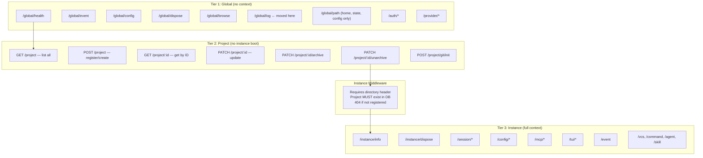
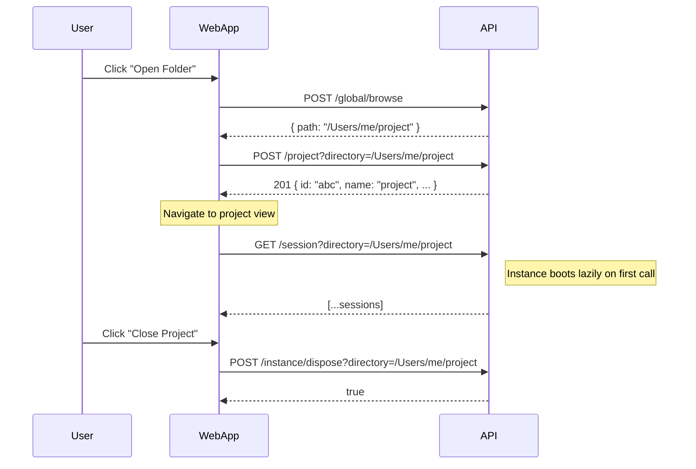
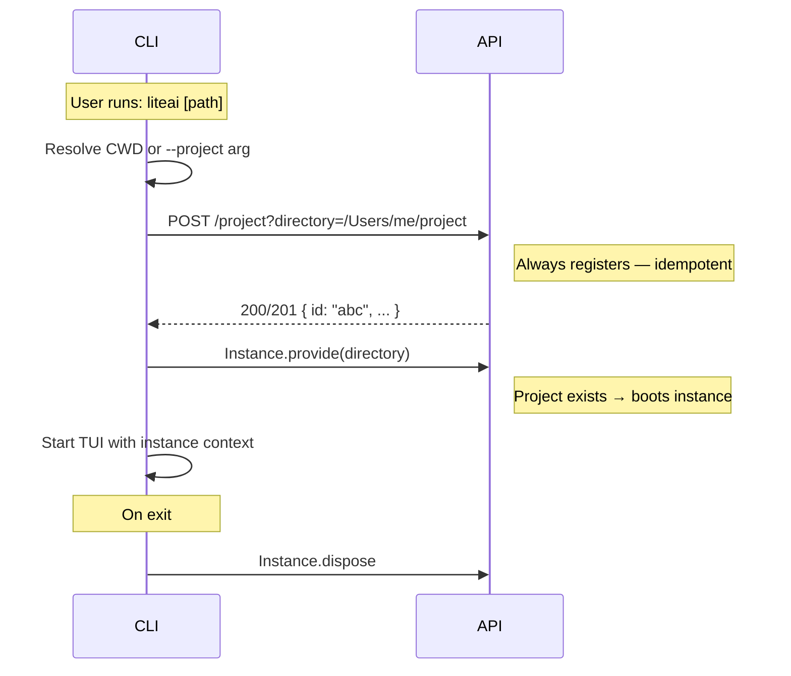
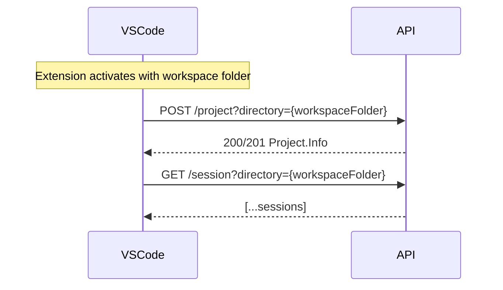

# Project & Instance Architecture Review

## Current Problems

### 1. `/project` endpoint is split and semantically confused

The `/project` routes live in **two different zones** with conflicting semantics:

| Route | Zone | What it does |
|-------|------|-------------|
| `GET /project` | Pre-instance | Lists all projects from DB — **global operation** ✓ |
| `POST /project` | Pre-instance | Registers a directory as a project (calls `fromDirectory` with `autoCreate: true`) |
| `GET /project/current` | Instance-scoped | Returns the project for the current directory context |
| `PATCH /project/:id` | Instance-scoped | Updates project properties |

The split is confusing: you have `/project` operations in two different tiers, the create endpoint is "pre-instance" but the update/archive endpoints require instance context (even though they operate on a `projectID`, not a directory).

### 2. `/path` endpoint is a hybrid mess

```typescript
// server.ts:147-163
async (c) => {
  let worktree = ""
  let directory = ""
  try {
    worktree = Instance.worktree   // ← might throw
    directory = Instance.directory  // ← might throw
  } catch {
    // expected when accessing globally outside an instance context
  }
  return c.json({
    home: Global.Path.home,     // ← always available
    state: Global.Path.state,   // ← always available
    config: Global.Path.config, // ← always available
    worktree,                   // ← empty string or value
    directory,                  // ← empty string or value
  })
}
```

**Problems:**
- Mixes global paths (always available) with instance paths (context-dependent)
- Returns empty strings instead of proper null/absent responses
- Uses try-catch for control flow — the API shape is inconsistent
- Client must guess whether `worktree: ""` means "no instance" or "literal empty string"

### 3. Instance middleware is a rigid binary gate

```typescript
// server.ts:167-191  — the "wall" between Tier 1 and Tier 2
.use(async (c, next) => {
  if (c.req.path === "/log") return next()  // ← HACK: bypass for /log
  const raw = c.req.query("directory") || c.req.header("x-liteai-directory")
  if (!raw) {
    throw new HTTPException(400, { message: "Missing required directory context..." })
  }
  // ... creates Instance.provide context
})
```

**Problems:**
- Forces a strict two-zone split: everything is either "no context" or "full context"
- `/log` needs a special bypass hack
- Provider routes were forced pre-instance even though they conceptually belong with the API
- Any new route that doesn't need instance context must be placed above the middleware wall
- Instance creation has side effects (bootstraps plugins, LSP, file watcher, etc.)

### 4. `Project.fromDirectory` does too much in one call

| Step | Side Effect |
|------|------------|
| Walk up tree to find `.git` | Filesystem I/O |
| Resolve git worktrees | Git subprocess |
| Generate/cache project ID | Writes to `.git/liteai` |
| Upsert project to database | DB write |
| Migrate sessions from global → project ID | DB write |
| Migrate sessions from dir-based → git-based ID | DB write |
| Discover icon | Filesystem scan + DB write |
| Emit bus event | Side effect |

This function is called from:
- `POST /project` handler (server.ts:113) — explicit, makes sense
- `Instance.boot()` (instance.ts:69) — implicit, part of lazy boot
- `initGit` (project.ts:393) — after git init
- TUI `thread.ts:183` — workaround pre-initialization

### 5. TUI must pre-create project as a workaround

```typescript
// thread.ts:182-185
// Explicitly initialize the project for this directory so Instance.provide won't 404
await Project.fromDirectory(cwd, { autoCreate: true }).catch((err) => {
  Log.Default.warn("project init failed", { error: String(err) })
})
```

This exists because `Instance.provide` → `Instance.boot` → calls `fromDirectory` with `autoCreate: false` — which would 404 if the project isn't already in the DB. The TUI must call `fromDirectory` with `autoCreate: true` first as a separate step. This is **implicit project creation hidden as a workaround**.

### 6. Project-scoped routes don't actually need full instance boot

Routes like `PATCH /project/:id/archive` operate on `projectID` — they don't need Instance context, LSP, file watchers, MCP servers, etc. But because they're behind the instance middleware, every request:
1. Requires a `directory` header
2. Triggers full instance bootstrap (if not booted)
3. Loads plugins, LSP, config, watchers, etc.

---

## Proposed Architecture

### Core Principle: **The backend API is explicit. Clients orchestrate the workflow.**

The API never implicitly creates projects. Different clients (Web App, TUI, VSCode extension) call the same explicit endpoints in their own order.

### Three-Tier Route Structure



### Key Changes

#### 1. `/path` → split into two

**`GET /global/path`** — always available:
```json
{
  "home": "/Users/me",
  "state": "/Users/me/.liteai/state",
  "config": "/Users/me/.liteai"
}
```

**`GET /instance/info`** — instance-scoped (Tier 3):
```json
{
  "directory": "/Users/me/my-project",
  "worktree": "/Users/me/my-project",
  "project": { "id": "abc123", "name": "my-project", ... }
}
```

> [!IMPORTANT]
> The current `/path` endpoint returns empty strings for instance fields when no context exists. This is bad API design — clients can't distinguish "no context" from "empty value". The split makes both endpoints always return correct, complete data.

#### 2. `POST /project` becomes the single entry point for project registration

**Request:** `POST /project?directory=/path/to/dir`

**Behavior:**
- Resolves directory → finds .git → computes project ID
- If project exists in DB → returns `200` with existing `Project.Info`
- If project is new → upserts to DB → returns `201` with new `Project.Info`
- Directory doesn't exist → `404`
- Missing directory param → `400`

**No `autoCreate` flag** — this endpoint's purpose IS to create/register.

#### 3. Project CRUD routes move to Tier 2 (no instance boot needed)

These routes operate on `projectID` — they don't need plugins, LSP, MCP, or any instance state:

```
PATCH /project/:projectID         — update name/icon/commands
PATCH /project/:projectID/archive — archive project
PATCH /project/:projectID/unarchive
POST  /project/git/init           — needs directory param, but not full boot
```

#### 4. Instance middleware becomes strict: no auto-creation

```typescript
// Proposed instance middleware
.use(async (c, next) => {
  const raw = c.req.query("directory") || c.req.header("x-liteai-directory")
  if (!raw) {
    throw new HTTPException(400, {
      message: "Missing required directory context"
    })
  }
  const directory = safeDecodeDirectory(raw)
  
  // Resolve project — NO DB writes, NO side effects
  const resolved = await Project.resolve(directory)
  
  // Verify project exists in DB
  const project = Project.get(resolved.id)
  if (!project) {
    throw new HTTPException(404, {
      message: `Project not registered for directory: ${directory}. Register via POST /project first.`
    })
  }
  
  // Boot instance with known-good project
  return Instance.provide({
    directory,
    project,
    worktree: resolved.worktree,
    init: InstanceBootstrap,
    fn: () => next(),
  })
})
```

#### 5. `Project.fromDirectory` → decompose into `resolve` + `register`

```typescript
// Pure resolution — no DB writes, no side effects
export async function resolve(directory: string): Promise<ResolvedProject> {
  // walk up to .git, compute ID, worktree, sandbox
  // return { id, worktree, sandbox, vcs }
}

// Register in DB — the write side
export async function register(resolved: ResolvedProject): Promise<Project.Info> {
  // upsert to DB, migrate sessions, emit event
  // return Project.Info
}

// Convenience: resolve + register (used by POST /project)
export async function fromDirectory(directory: string): Promise<{ project: Project.Info; sandbox: string }> {
  const resolved = await resolve(directory)
  const project = await register(resolved)
  return { project, sandbox: resolved.sandbox }
}
```

#### 6. `/log` moves to global routes

The `/log` POST endpoint just writes to a logger using a `service` name from the request body. It has no dependency on instance context. Move it to `/global/log` and remove the bypass hack from instance middleware.

---

## Client Orchestration

### Web App (VSCode-like UX)



**Key behaviors:**
- User explicitly selects a folder
- `POST /project` is explicit — creates if needed, returns existing if not
- Instance boots lazily on first instance-scoped request
- Close = dispose instance (project stays registered in DB)

### TUI (Gemini CLI / Claude Code-like UX)



**Key behaviors:**
- CLI silently calls `POST /project` — the user doesn't see this
- Instance.provide succeeds because project is registered
- No `autoCreate` workaround needed — the explicit call IS the creation

### VSCode Extension



Same pattern — `POST /project` is always the first call.

---

## Summary of Breaking Changes

| Current | Proposed | Migration |
|---------|----------|-----------|
| `GET /path` returns mixed global+instance fields | Split into `GET /global/path` (global) and `GET /instance/info` (instance) | Update SDK and all callers |
| `POST /project` inline in server.ts | Move to Tier 2 project routes file | Restructure route registration |
| `POST /log` behind instance middleware with bypass hack | Move to `POST /global/log` | Update SDK operation ID |
| `PATCH /project/:id` requires instance context | Move to Tier 2 (no instance boot) | Remove from instance routes |
| `Project.fromDirectory(dir, { autoCreate })` | Split into `resolve()` + `register()` | Refactor internal callers |
| Instance middleware auto-creates project (via boot) | Middleware requires project to exist | TUI/App must call `POST /project` first |
| TUI workaround: `Project.fromDirectory(cwd, { autoCreate: true })` | TUI calls `POST /project` via SDK | Clean up thread.ts |

> [!TIP]
> The migration can be done incrementally:
> 1. First: decompose `Project.fromDirectory` into `resolve` + `register`
> 2. Then: move routes to correct tiers
> 3. Then: update instance middleware
> 4. Finally: update all clients (web app, TUI, extension)
