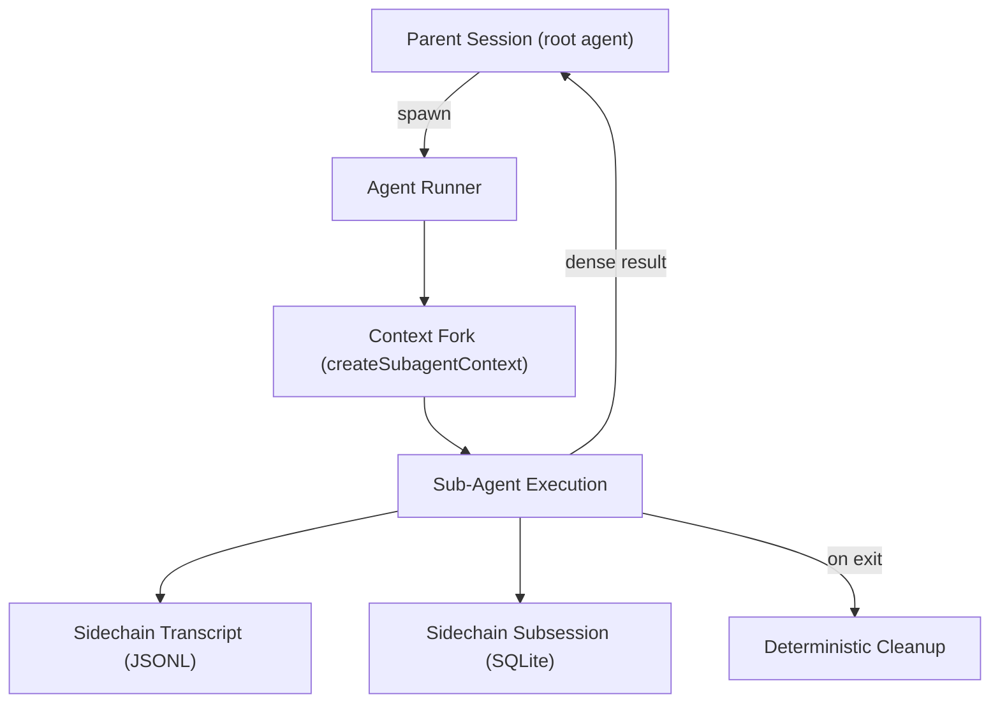
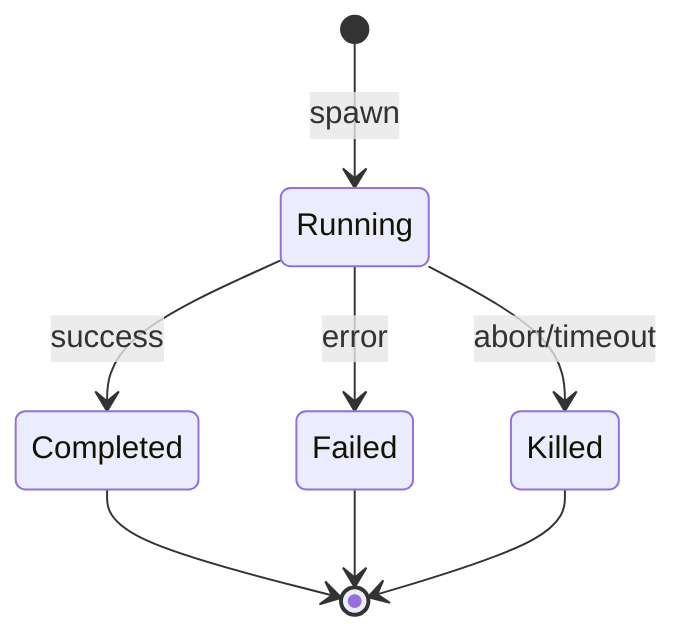

# Sub-Agent Architecture

This document describes LiteAI's sub-agent orchestration system — how agents are defined, spawned, isolated, observed, and cleaned up.

> **Related spec:** `specs/002-subagent-architecture/spec.md`  
> **Source:** [`src/agent/`](../src/agent/)

---

## Overview

LiteAI supports spawning **sub-agents** from an active session to delegate tasks such as exploration, code planning, and execution. Sub-agents operate with isolated execution contexts derived from the parent session's state, produce sidechain transcripts for debugging, run under sandboxed permissions, and are cleaned up deterministically on exit.



> [!NOTE]
> This document covers the **standard sub-agent spawning model** (Normal Mode). LiteAI supports additional execution modes that build on this foundation:
> - **Fork Subagent Mode** — a cost optimization that shares prompt cache between parent and child (see [Fork Subagent & Agent Durability](./fork-subagent-durability.md))
> - **Coordinator Mode** and **Agent Swarms** — not yet implemented; tracked under Phase 5 of the [Multi-Agent Platform Roadmap](../../../../roadmap/agents-platform-roadmap.md)
>
> For a comprehensive comparison of all modes, see [Agent Execution Modes](./agent-execution-modes.md).

---

## Agent Definition Type System

**Source:** [`src/agent/loader.ts`](../src/agent/loader.ts), [`src/agent/agent.ts`](../src/agent/agent.ts)

### Definition Sources

Agents are defined from multiple sources with deterministic priority ordering (later overrides earlier):

```
built-in < plugin < userSettings < projectSettings
```

| Source | Description |
|---|---|
| **Built-in** | Bundled with LiteAI (Explore, Plan, general-purpose) |
| **Plugin** | Provided by installed plugins |
| **User settings** | User-level `~/.liteai/agents/` directory |
| **Project settings** | Project-level `.liteai/agents/` directory |

Protected system agents (`hidden: true`) are immune to user-level overrides.

### Configuration Fields

All agent definitions support the following configuration surface:

| Field | Type | Default | Description |
|---|---|---|---|
| `tools` | `string[] \| "*"` | all available | Tool allow-list; `"*"` = full parent pool |
| `disallowedTools` | `string[]` | `[]` | Tool deny-list (supports glob `prefix*`) |
| `skills` | `string[]` | `[]` | Skills to preload at spawn |
| `mcpServers` | `(string \| inline)[]` | `[]` | MCP server declarations |
| `model` | `string \| "inherit"` | system default | `"inherit"` = use parent's model |
| `effort` | `string` | inherited | Override effort level at runtime |
| `permissionMode` | `string` | inherited | `"bubble"`, `"auto"`, `"plan"`, etc. |
| `maxTurns` | `number` | agent-specific | Maximum conversation turns |
| `timeout` | `number` | `1800000` (30 min) | Wall-clock timeout in ms |
| `memory` | `"user" \| "project" \| "local"` | — | Persistent memory scope |
| `background` | `boolean` | `false` | Run as background task |
| `isolation` | `"worktree" \| "remote"` | — | Execution isolation mode |
| `omitLiteaiMd` | `boolean` | `false` | Strip project config from context |
| `criticalSystemReminder` | `string` | — | Per-turn mode reinforcement text |
| `thinking` | `boolean` | `false` | Enable extended thinking |
| `thinkingBudget` | `number` | — | Token budget for thinking |
| `requiredMcpServers` | `string[]` | — | Required MCP servers (validated at load + spawn) |
| `hooks` | `object` | — | Agent-scoped lifecycle hooks |

### Agent Definition File Format

Custom agents are defined as `.md` files with YAML frontmatter:

```markdown
---
name: code-reviewer
tools: ["read", "search", "grep"]
model: inherit
permissionMode: plan
omitLiteaiMd: true
memory: project
---

You are a code review specialist...
```

---

## Context Forking

**Source:** [`src/agent/context.ts`](../src/agent/context.ts)

When a sub-agent is spawned, the system creates an isolated execution context via `createSubagentContext()`. The forking model carefully classifies state into four categories:

| Category | Fields | Behavior |
|---|---|---|
| **Cloned** | `readFileState`, `contentReplacementState` | Deep-copied. Sub-agent mutations do not affect parent. |
| **Linked** | `abortController` | Child linked to parent. Parent abort → child abort. Child abort ↛ parent abort. |
| **Wrapped** | `getAppState` | Wrapped to set `shouldAvoidPermissionPrompts` for background agents. |
| **Fresh** | `toolDecisions`, `messages`, `queryTracking` | New instances. Sub-agent starts with clean slate for mutable state. |

### Key Isolation Guarantees

- **Tool decisions** are never inherited — the sub-agent makes its own approval decisions
- **`setAppState`** is a no-op by default (mutations don't leak to parent), unless `shareSetAppState: true` is explicitly set via `SubagentContextOverrides`
- **`queryTracking.depth`** is incremented for recursion observability
- **`thinkingConfig`** is disabled by default for all sub-agents to control token costs, unless the agent definition sets `thinking: true`
- **`setAppStateForTasks`** provides a scoped root-store bypass for task registration operations only (`registerTask`, `killTask`, `deleteTodo`)

### Root vs Sub-Agent Discriminator

```typescript
// Root session:
toolUseContext.agentId === undefined

// Sub-agent:
toolUseContext.agentId === "explore-abc123"
```

This discriminator gates root-only behaviors: title generation, stop hooks, MCP lifecycle notifications, attachment filtering, compaction notifications, and memory extraction.

---

## Sidechain Transcripts

**Source:** [`src/session/transcript.ts`](../src/session/transcript.ts)

Sub-agent messages are recorded to **isolated transcript files** rather than polluting the parent session's message chain. The parent receives only the dense task result block.

### Storage Model: JSONL + SQLite

LiteAI uses a **dual-write** strategy for sub-agent data:

| Storage | Format | Purpose | Durability |
|---|---|---|---|
| **Sidechain Transcript** | `.jsonl` (append-only) | Audit log + resume source | Filesystem |
| **Sidechain Subsession** | SQLite (via drizzle-orm) | Full conversation messages for model context | Database |

The JSONL transcript is the authoritative audit log that survives independently of the database. The SQLite subsession stores structured conversation messages used by the model during active execution.

### JSONL Transcript Path

```
<projectDir>/<sessionId>/subagents/<agentType>/agent-<agentId>.jsonl
```

Each line is a JSON-serialized `TranscriptMessage`:

```typescript
interface TranscriptMessage {
  isSidechain: true
  uuid: string
  parentUuid?: string
  role: string
  content: string | Record<string, unknown> | unknown[]
  timestamp: number
}
```

### Recording Pattern

- Messages are recorded **incrementally** (append-only via `fs.appendFile`) — no re-serialization
- Recording errors are **logged but not propagated** (intentional exception to fail-fast — transcripts are observability side-channels whose failure must not disrupt the agent's primary task)
- Both `recordMessage()` (single) and `recordChain()` (batch) APIs are supported
- Parent directories are created lazily on first write

---

## Permission Sandboxing

**Source:** [`src/agent/context.ts`](../src/agent/context.ts)

### Background Agent Silencing

Background sub-agents never block on permission prompts. Operations requiring user permission receive an **immediate silent denial**, not a blocking prompt. This prevents background agents from hanging indefinitely.

### Permission Mode Inheritance

Elevated parent modes **always take precedence** over the sub-agent's declared mode:

```
Parent: auto     → Sub-agent gets auto (regardless of declared mode)
Parent: bypass   → Sub-agent gets bypass
Parent: default  → Sub-agent uses its own declared mode
```

### Tool Allow-List Isolation

When a sub-agent specifies a `tools` allow-list, session-level tool permissions are **replaced entirely**. Parent approvals do not leak through.

---

## Context Pruning

**Source:** [`src/agent/filter.ts`](../src/agent/filter.ts) — `pruneContext()`

Read-only agents (Explore, Plan) have unnecessary context automatically stripped:

| Stripped Field | Condition | Savings |
|---|---|---|
| `liteaiMd` | Agent has `omitLiteaiMd: true` AND no explicit `userContext` override | ~1–3k tokens |
| `gitStatus` | Agent type is `"explore"` or `"plan"` | ~500 tokens |

Both strips are gated by the `liteai_slim_subagent_liteaimd` feature flag (default: `true`). When set to `false`, full context is provided for all agents.

User-provided context overrides always take precedence over pruning rules.

---

## Dynamic MCP Server Lifecycle

Agents declare MCP servers in their configuration. Two types are supported:

| Type | Definition | Lifecycle |
|---|---|---|
| **String reference** | `"existing-server"` | Reuses existing project-wide connection (memoized). NOT cleaned up on agent exit. |
| **Inline definition** | `{ "name": { ... } }` | New connection created exclusively for this agent. Cleaned up on agent exit. |

Policy gating: `isRestrictedToPluginOnly('mcp')` blocks user-defined agents from declaring MCP servers; admin-trusted sources are always allowed.

---

## Execution Isolation Modes

### Worktree Isolation

When `isolation: "worktree"`, the agent gets a dedicated git worktree — a separate filesystem clone of the repository at `HEAD`. The agent's file modifications apply only to the worktree, not the parent's working directory.

The worktree is created from `HEAD` and does **not** inherit dirty working-directory state.

### Remote (Docker) Isolation

When `isolation: "remote"`, shell commands are routed into a Docker container via `docker exec`. The orchestration loop remains in the parent Node process — only shell tool commands are containerized.

- Project directory: mounted **read-only**
- Scratch workspace: mounted **read-write** at `<os.tmpdir()>/liteai-scratch/<agentId>`
- Custom images: configurable via `containerImage` (defaults to platform base image)

If Docker is not reachable, spawn fails fast with a structured `AgentSpawnError`.

### Artifact Retention & Garbage Collection

Both isolation modes use **retention-based cleanup**:

| Setting | Default | Description |
|---|---|---|
| `LITEAI_ISOLATION_TTL_MS` | `3600000` (1 hour) | Time-to-live for isolation artifacts after agent exit |

Stale artifacts are garbage collected lazily on the next session start. Worktree GC enforces safety guards: deletion is skipped if the worktree contains uncommitted changes or unpushed commits.

---

## Async Agent Lifecycle

**Source:** [`src/agent/lifecycle.ts`](../src/agent/lifecycle.ts)

Background agents follow a structured lifecycle:



### Progress Tracking

Each tool round produces a human-readable progress update with tool use count and activity description, derived from tool name mapping.

### Terminal Notifications

On completion, failure, or kill, a structured notification is enqueued with:
- Status (`completed` / `failed` / `killed`)
- Agent's final message or partial result
- Usage metrics (tokens consumed, tool calls, duration)
- Worktree info (if applicable)

### Partial Result Extraction

When an agent is killed mid-execution, the system extracts the last meaningful assistant text and includes it in the kill notification.

### Agent Execution Context (AsyncLocalStorage)

**Source:** [`src/agent/context.ts`](../src/agent/context.ts)

Multiple background agents can run concurrently in the same Node process. To prevent analytics cross-contamination, each agent's execution is wrapped in `runWithAgentContext()` using Node's `AsyncLocalStorage`, providing isolated identity tracking.

---

## Deterministic Cleanup Lifecycle

**Source:** [`src/agent/cleanup.ts`](../src/agent/cleanup.ts)

When a sub-agent exits (normally, via abort, or due to error), a deterministic cleanup sequence runs in a `finally` block:

1. **MCP cleanup** — Terminate agent-scoped inline connections
2. **Session hooks** — Clear agent-registered hooks
3. **Prompt cache tracking** — Release cache entry references
4. **File state cache** — Clear cloned file data from memory
5. **Context messages** — Release fork context message references
6. **Tracing** — Unregister from Perfetto tracing tree
7. **Transcript subdir** — Clean up subdir mapping
8. **Todos entry** — Delete pending agent todo (prevents memory leak in long sessions)
9. **Shell tasks** — Kill agent-registered shell processes (prevents zombie processes)
10. **Invoked skills** — Reset skill tracking

The cleanup is **idempotent** and **must not throw**.

---

## Hierarchical Tracing

Sub-agent execution trees maintain parent-child relationships for observability:

```
parentId = toolUseContext.agentId ?? getSessionId()
```

Each agent is registered in the Perfetto tracing tree with `registerPerfettoAgent(agentId, agentType, parentId)`.

---

## Agent Persistent Memory

Agents with `memory` configured gain access to a filesystem-backed knowledge store:

| Scope | Path | Sharing |
|---|---|---|
| `user` | `~/.liteai/agent-memory/<agentType>/MEMORY.md` | Global across all projects |
| `project` | `<cwd>/.liteai/agent-memory/<agentType>/MEMORY.md` | Shared via version control |
| `local` | `<cwd>/.liteai/agent-memory-local/<agentType>/MEMORY.md` | Machine-local only |

Memory is keyed by **agent type**, not by session. A sub-agent of type "explore" reads explore's own memory, not its parent's.

When `isAutoMemoryEnabled()` returns true (default), Read/Write/Edit tools are auto-injected and memory contents are appended to the system prompt.

---

## Concurrency Limits

| Limit | Default | Behavior |
|---|---|---|
| Max concurrent sub-agents per session | `8` | Spawn attempts exceeding the limit are rejected with a structured error |
| Max wall-clock timeout | `1,800,000` ms (30 min) | Hard kill via abort controller — no grace period |
| Nested depth | Unbounded | Practically limited by context window and token budget |
