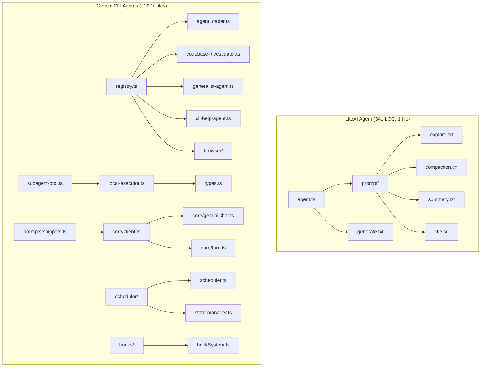
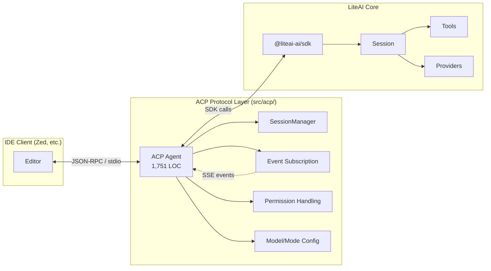
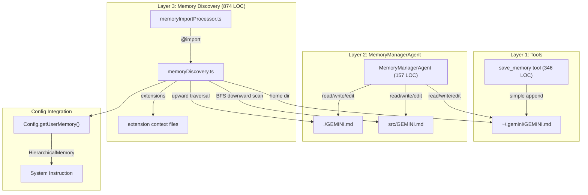

# Agent System Comparison: LiteAI vs Gemini CLI

## Architecture Overview



---

## The ACP Layer: LiteAI's Protocol Bridge

> [!IMPORTANT]
> LiteAI has a new `src/acp/` directory (1,751 LOC in `agent.ts` alone) implementing the [Agent Client Protocol](https://agentclientprotocol.com/). This is a **major architectural addition** that bridges many of the gaps identified vs Gemini CLI — but through a fundamentally different approach: a **standardized protocol layer** rather than an internal execution framework.



### What ACP Provides

| Feature | ACP Implementation | Gemini CLI Equivalent |
|---|---|---|
| **Session isolation** | Each ACP session maps to an internal liteai session via `ACPSessionManager` | `LocalAgentExecutor` creates isolated `GeminiChat` per subagent |
| **Streaming updates** | Real-time `session/update` notifications for text chunks, thought chunks, tool calls | `StreamEventType` chunks in `GeminiChat.sendMessageStream` |
| **Permission delegation** | `permission.asked` events → `requestPermission` → user approval/rejection flow | `PolicyEngine` + scheduler `confirmation.ts` |
| **Tool call visibility** | Full lifecycle: `pending → in_progress → completed/failed` with content | `SubagentActivityEvent` with `TOOL_CALL_START/END` |
| **Model/mode switching** | `setSessionModel`, `setSessionMode` per session | `ModelConfigService` with runtime overrides |
| **Session persistence** | `session/load`, `session/list`, `session/fork`, `session/resume` | `ChatRecordingService` with `ResumedSessionData` |
| **Usage tracking** | Token counts, costs, context window usage sent via `usage_update` | `uiTelemetryService` token count tracking |
| **Content types** | Text, images, resources, resource_links, diffs | `Content` parts with text/function calls |
| **Command routing** | `/compact`, custom commands via `command.list` | Direct method calls in `GeminiClient` |
| **MCP server management** | Client-provided MCP servers auto-registered per session | Static MCP configuration |
| **IDE integration** | Via ACP protocol (Zed, others) | Direct IDE context via `ideContextStore` |

### ACP Agent Architecture (1,751 LOC)

The `ACP.Agent` class is **by far the largest single file** in LiteAI's agent system. It implements:

1. **Protocol lifecycle**: `initialize` → `newSession`/`loadSession` → `prompt` → `cancel`
2. **Event bridge**: Long-running SSE subscription translating internal events to ACP updates:
   - `permission.asked` → permission request flow with once/always/reject options
   - `message.part.updated` → tool call lifecycle (pending/running/completed/error)
   - `message.part.delta` → streaming text and reasoning chunks
3. **Session management**: Create, load, fork, resume, list sessions with model/mode/variant state
4. **Content translation**: Bidirectional mapping between ACP content blocks (text, image, resource, resource_link) and internal parts
5. **Smart model resolution**: Waterfall logic selecting best model from providers (code-assist → best available → config default)
6. **Diff application**: Edit permissions trigger file content preview via `applyPatch`
7. **Todo/plan integration**: `todowrite` tool output → ACP plan entries

---

## Side-by-Side Comparison

| Dimension | **LiteAI** | **Gemini CLI** |
|---|---|---|
| **Total agent LOC** | ~341 lines (agent config) + 166 (TaskTool) + 1,751 (ACP) | ~3,500+ lines across 20+ files (agents dir alone), ~60k+ with prompts/core |
| **Language / Runtime** | TypeScript / Bun / Effect + Vercel AI SDK | TypeScript / Node.js / Google GenAI SDK |
| **Agent Definition** | Zod schema (`Agent.Info`) — plain object with name, mode, permissions, prompt | Rich interface hierarchy (`BaseAgentDefinition → LocalAgentDefinition / RemoteAgentDefinition`) with input/output schemas, configs |
| **Built-in Agents** | 6: `build`, `plan`, `general`, `explore`, `compaction`, `title`, `summary` | 5: `codebase_investigator`, `generalist`, `cli_help`, `browser`, `memory_manager (save_memory)` |
| **Custom Agent Loading** | Config-driven merge (`Config.agent` section) + markdown files with frontmatter | File-system scanning (`.gemini/agents/*.md` with YAML frontmatter + body) |
| **Agent Registry** | `Instance.state()` (lazy singleton via project instance) | `AgentRegistry` class with `Map<string, AgentDefinition>` |
| **Agent Execution** | `TaskTool` (166 LOC) creates child sessions with scoped permissions + tool restrictions per agent | `LocalAgentExecutor` (1,480 LOC) + `LocalSubagentInvocation` (351 LOC) — isolated agentic loop with own `GeminiChat`, turn management, timeouts, live progress |
| **Subagent Invocation** | `TaskTool` → creates child `Session` with parent link, resumable via `task_id` | `SubagentTool` wraps each agent as a tool; `LocalSubagentInvocation` creates isolated execution with `SubagentProgress` streaming |
| **Remote Agents** | Via ACP protocol (any ACP-compatible client) | ✅ A2A protocol support (`RemoteAgentDefinition`, `A2AClientManager`) with auth providers |
| **Agent Acknowledgement** | ❌ Not applicable | ✅ Hash-based trust system for project-level agents |
| **Permission System** | Rich rule-based (`PermissionNext.Ruleset`) — glob patterns per tool/directory/action | Policy engine (`PolicyDecision` + `PolicyRule`) + scheduler confirmation with 4 approval modes |
| **Tool Scoping** | Permission-based deny/allow per agent | Explicit `toolConfig.tools[]` list per agent |
| **Model Configuration** | Optional per-agent model override via `agent.model` config | `ModelConfig` with `model: 'inherit'` pattern, auto-routing strategy, model aliases (Flash/Pro) |
| **Agent Generation** | ✅ AI-powered `Agent.generate()` + CLI wizard (`liteai agent create`) | ❌ Not available |
| **Prompt Architecture** | Plain `.txt` files imported at build time | Code-based composition via `snippets.ts` (~765 LOC) with typed option structs |
| **Chat Compression** | `compaction` agent with simple prompt; `/compact` via ACP | `ChatCompressionService` + structured XML `<state_snapshot>` format |
| **Max Turns** | Configurable per agent via `steps` field | `RunConfig.maxTurns` (default 30) + `maxTimeMinutes` (default 10) |
| **Timeout / Recovery** | ❌ No dedicated timeout | ✅ `DeadlineTimer` + 1min grace period recovery turn |
| **Structured Output** | ❌ Agents produce free-text | ✅ `complete_task` tool with Zod-validated output schemas |
| **Telemetry** | Via OpenTelemetry + ACP `usage_update` (tokens, cost, context) | Dedicated agent start/finish/recovery event logging + plan execution metrics |
| **IDE Protocol** | ✅ ACP (Zed native, extensible) | Direct IDE context injection via `ideContextStore` |
| **Session Persistence** | ✅ Full CRUD: create/load/fork/resume/list | `ChatRecordingService` with resume |
| **Approval Modes** | Permission-based (allow/deny per tool) | 4 modes: `DEFAULT`, `AUTO_EDIT`, `YOLO`, `PLAN` |
| **Plan Mode** | ✅ `plan` agent (read-only, writes to plans dir) | ✅ `enter_plan_mode`/`exit_plan_mode` tools with approval workflow |
| **Memory Management** | ❌ Not available | ✅ `MemoryManagerAgent` — hierarchical GEMINI.md management |
| **Testing** | Minimal (no dedicated agent tests found) | Extensive (~109k LOC `local-executor.test.ts` alone, 51k `registry.test.ts`) |

---

## Key Architectural Differences

### 1. Agent as Mode vs Agent as Executor


#### **LiteAI: Agent = Config + Child Session**

Agents are **configuration objects** (permissions, prompt, model) + the `TaskTool` creates **isolated child sessions** for subagent execution:
- Parent creates a child `Session` with scoped permissions (deny todowrite, deny task recursion unless explicitly allowed)
- Child session gets its own conversation history, linked via `parentID`
- Child sessions are **resumable** — the AI can pass `task_id` to continue a prior subagent session
- Permission checks filter which agents are accessible to the caller

```typescript
// TaskTool creates an isolated child session
const session = await Session.create({
  parentID: ctx.sessionID,
  title: `${params.description} (@${agent.name} subagent)`,
  permission: [
    { permission: "todowrite", pattern: "*", action: "deny" },
    ...(hasTaskPermission ? [] : [{ permission: "task", pattern: "*", action: "deny" }]),
  ],
})
const result = await SessionPrompt.prompt({ sessionID: session.id, agent: agent.name, ... })
```

#### **Gemini CLI: Agent = Isolated Executor**

Agents in Gemini CLI are **full execution environments**. Each subagent gets:
- Its own `GeminiChat` instance
- Its own `ToolRegistry` (subset of parent's tools)
- Its own turn counter, deadline timer, compression service
- Structured output via `complete_task` tool

```typescript
// Gemini CLI creates an isolated executor
const executor = await LocalAgentExecutor.create(
  definition, runtimeContext, onActivity
);
const result = await executor.run(inputs, signal);
// Returns: { result: string, terminate_reason: AgentTerminateMode }
```

### 2. Permission vs Tool Scoping

- **LiteAI** uses a **permission rule engine** with glob patterns, priority-based merging, and fine-grained per-action control (read, edit, external_directory, grep, bash, plan_enter, plan_exit, etc.)
- **Gemini CLI** uses **explicit tool lists** per agent + a **4-mode approval system** (`DEFAULT` → confirm edits, `AUTO_EDIT` → auto-apply, `YOLO` → all auto-approved, `PLAN` → read-only planning)

### 3. Plan Mode

````carousel
**LiteAI: `plan` Agent Mode**

Plan mode is a **built-in agent** with permission-based enforcement:
- Defined as a primary agent named `plan` with `plan_exit: "allow"` permission
- All edit tools denied by default; writes only allowed to `plans/` directories
- Uses glob patterns: `{Brand.dir}/plans/*.md` and `{Global.Path.data}/plans/*.md`
- Permission rules: `plan_enter: "allow"` on general agent, `plan_exit: "allow"` on plan agent
- Mode switching happens by switching the active agent

```typescript
plan: {
  name: "plan",
  description: "Plan mode. Disallows all edit tools.",
  permission: [
    { permission: "plan_exit", action: "allow" },
    { permission: "edit", pattern: "{plans}/*.md", action: "allow" },
  ],
}
```
<!-- slide -->
**Gemini CLI: `enter_plan_mode` / `exit_plan_mode` Tools**

Plan mode is a **tool-driven state machine** with approval workflow:
- `enter_plan_mode` tool sets `ApprovalMode.PLAN` on the config
- In PLAN mode, `ToolRegistry` filters to only `PLAN_MODE_TOOLS` (read-only + `ask_user` + `codebase_investigator` + `cli_help`)
- `write_file` and `edit` tools get plan-restricted descriptions: "ONLY FOR PLANS"
- `exit_plan_mode` requires a `plan_path` pointing to a `.md` file in `{plansDir}/`
- Plan approval UI: approve → switches to AUTO_EDIT/DEFAULT/YOLO, reject → stays in PLAN with feedback
- Path validation: plan must be in designated plans directory, no traversal
- Telemetry: `PlanExecutionEvent` logged on approval
- Model routing: auto-routes to PRO model during PLAN mode for higher quality planning

```typescript
// Tool-driven state transition
this.config.setApprovalMode(ApprovalMode.PLAN);  // enter
this.config.setApprovalMode(newMode);              // exit
this.config.setApprovedPlanPath(resolvedPlanPath); // anchor to plan
```
````

### 4. Agent Discovery

- **LiteAI**: Agents are defined in code (built-ins) or in the user's config file (custom agents). No file-system scanning.
- **Gemini CLI**: Agents are discovered from markdown files in `~/.gemini/agents/` and `.gemini/agents/` directories, parsed from YAML frontmatter. Includes hash-based trust verification for project-level agents.

### 4. Prompt Engineering

- **LiteAI**: Simple `.txt` prompt templates (~89 lines total across 5 files). Lean and minimal.
- **Gemini CLI**: Code-composed prompt system via `snippets.ts` (765 lines) with typed option structs. Includes dedicated `renderPlanningWorkflow()` function (50+ lines) that generates adaptive planning prompts with explore/consult/draft/review phases.

---

## Notable Gemini CLI Features Absent in LiteAI

| Feature | Description |
|---|---|
| **Remote A2A Agents** | Support for calling agents via A2A protocol over HTTP, with OAuth2/API key/Google Credentials auth providers |
| **Browser Agent** | Built-in browser automation agent |
| **Codebase Investigator** | Specialized agent with scratchpad methodology, structured Zod-validated JSON reports, ThinkingLevel.HIGH |
| **Memory Manager Agent** | `save_memory` subagent that manages hierarchical GEMINI.md files (global/project/subdirectory) with routing, dedup, and organization |
| **CLI Help Agent** | Self-documentation agent that reads internal docs |
| **Agent Acknowledgement** | Hash-based trust verification for untrusted project agents |
| **Structured Output** | `complete_task` tool with Zod schema validation for agent outputs |
| **Deadline Timer + Recovery** | Time-bounded execution (default 10min) with 1min grace period and final recovery turn |
| **Subagent Live Progress** | `SubagentProgress` with `SubagentActivityItem` streaming (thoughts, tool calls, status) |
| **4 Approval Modes** | `DEFAULT`, `AUTO_EDIT`, `YOLO`, `PLAN` — tool-driven transitions with per-mode policy rules |
| **Plan Approval Workflow** | `exit_plan_mode` with plan file validation, user approval/rejection with feedback, and automatic mode transition |
| **Plan Model Routing** | Auto-routes to PRO model during PLAN mode for higher quality planning |
| **Hook System** | Before/After agent execution hooks (hookSystem, hookRunner, hookRegistry, hookAggregator — 20 files) |
| **Loop Detection** | `LoopDetectionService` to detect and break infinite tool-calling loops |
| **IDE Context** | Full/delta IDE context injection (active file, cursor, selection) |
| **Tracker Tools** | Built-in task tracker tools (create_task, update_task, get_task, list_tasks, add_dependency, visualize) |
| **Prompt Compression** | Structured XML `<state_snapshot>` compression with security injection protection |
| **MCP Servers in Agents** | Agents can declare inline MCP server configs |

## Notable LiteAI Features Absent in Gemini CLI

| Feature | Description |
|---|---|
| **ACP Protocol** | Standard Agent Client Protocol enabling IDE integration (Zed, etc.) via JSON-RPC/stdio |
| **Agent Generation** | AI-powered `Agent.generate()` creates new agent configs from natural language descriptions |
| **Permission Rule Engine** | Fine-grained glob-based permission system with priority merging (vs simple tool lists) |
| **Config-Driven Customization** | Agents customizable via config file without writing markdown |
| **Hidden Agents** | Support for internal-only agents (`hidden: true`) like compaction/title/summary |
| **Agent Variants** | Variant system for agent configuration |
| **Agent Colors** | Visual theming for agents |
| **Session Fork** | Fork a session at any point to explore alternative paths |
| **MCP Server Injection** | Clients can inject MCP servers per-session at runtime |
| **Model Variant System** | Provider models with named variants (e.g., `/high`, `/low`) |

---

## Explore Agent vs Codebase Investigator

````carousel
**LiteAI: `explore` agent (19-line prompt)**

A lightweight search specialist with restricted permissions:
- Tools: `grep`, `glob`, `list`, `bash`, `webfetch`, `websearch`, `codesearch`, `read`
- No structured output
- Caller specifies thoroughness level (quick/medium/thorough)
- Cannot modify files
<!-- slide -->
**Gemini CLI: `codebase_investigator` (193 LOC)**

A heavyweight investigation agent:
- Tools: `ls`, `read_file`, `glob`, `grep` (4 read-only tools)
- **Structured JSON output** with `SummaryOfFindings`, `ExplorationTrace`, `RelevantLocations`
- Detailed scratchpad methodology with checklist management
- High thinking level with temperature 0.1
- Time-bounded (3 min, 10 turns)
- Uses Gemini Flash model for speed
````

---

## Gemini CLI Memory System (`save_memory`)

Gemini CLI has a **3-layer memory system** that LiteAI does not have. It enables the agent to persist facts, preferences, and project context across sessions via `GEMINI.md` files.

### Architecture



### Layer 1: `save_memory` Tool (346 LOC)

The **basic tool** that appends a single fact to the global `~/.gemini/GEMINI.md` file:

- Appends entries under a `## Gemini Added Memories` section header
- **Sanitizes input** — collapses newlines, strips markdown injection attempts
- Shows a **diff-based confirmation UI** before writing
- Supports "Always Allow" to skip confirmation for repeated saves
- Supports **user modification** — user can edit the proposed content before saving
- Implements `ModifiableDeclarativeTool` for IDE editor integration

```
## Gemini Added Memories
- User prefers tabs over spaces
- Project uses PostgreSQL 15 with pgvector
```

### Layer 2: `MemoryManagerAgent` (157 LOC)

A **subagent** (`save_memory` agent name) that replaces the basic `save_memory` tool for richer operations:

- **Routing logic** — decides where a memory belongs:
  - **Global** (`~/.gemini/GEMINI.md`): User preferences, personal info, cross-project habits
  - **Project root** (`./GEMINI.md`): Architecture, conventions, workflows, team info
  - **Subdirectory** (`src/GEMINI.md`, `docs/GEMINI.md`): Detailed, domain-specific context
- **Operations**: Add, remove stale entries, de-duplicate semantically similar entries, organize/restructure
- **Ambiguity handling**: Uses `ask_user` tool to clarify when a memory could be global vs project
- **Efficiency rules**: Minimize file reads, use parallel tool calls, don't explore the codebase
- Tools: `read_file`, `edit`, `write_file`, `ls`, `glob`, `grep`, `ask_user`
- Uses **Gemini Flash** model for speed, bounded to 5 min / 10 turns
- Gets the **current memory content** injected into its initial context

### Layer 3: Memory Discovery (874+ LOC)

The infrastructure that **discovers and loads** all `GEMINI.md` files:

- **Hierarchical memory model** (`HierarchicalMemory`):
  - `global`: From `~/.gemini/GEMINI.md`
  - `extension`: From active extension context files
  - `project`: From workspace `GEMINI.md` files
- **Discovery strategy**:
  - Upward traversal from CWD to project root (git boundary)
  - BFS downward scan for subdirectory `GEMINI.md` files (max 200 dirs)
  - Deduplication by file identity (device + inode) for case-insensitive filesystems
  - Symlink-aware via `fs.stat()` (follows symlinks)
- **Import processor**: Supports `@import` directives for composing memory files
- **JIT subdirectory memory**: Lazy-loads context from subdirectories when tools access files in them
- **Commands**: `/memory show`, `/memory add <text>`, `/memory refresh`, `/memory files`
- **MCP instructions** merged into project memory at load time
- **Events**: `CoreEvent.MemoryChanged` emitted on refresh

### LiteAI Equivalent

**LiteAI has no memory system.** There is no equivalent to `GEMINI.md` files, memory discovery, or cross-session persistence of user preferences. This is a significant gap for repeat users who want the agent to remember their coding style, project conventions, or personal preferences.

---

## Summary

> [!IMPORTANT]
> LiteAI's agent system takes a **two-layer approach**: a lean 341-line agent config layer (`src/agent/`) + a substantial 1,751-line protocol bridge (`src/acp/`). The internal agent model is simple (agents = permission modes), but the ACP layer adds session isolation, streaming, permission flows, and IDE integration through a **standardized protocol**. Gemini CLI builds all of this into its **internal execution framework**. The tradeoff: LiteAI gets protocol-level interop (any ACP client works); Gemini CLI gets tighter internal control.

### Key Takeaways

1. **Architecture philosophy**: LiteAI uses a **thin core + protocol bridge** pattern. Gemini CLI uses a **thick core** pattern. LiteAI's real complexity lives in ACP (1,751 LOC) and `TaskTool` (166 LOC), not agent config (341 LOC)
2. **Subagent isolation**: Both create isolated sessions — LiteAI via `TaskTool` (child `Session` with scoped permissions + resumability), Gemini CLI via `LocalAgentExecutor` (isolated `GeminiChat` + `ToolRegistry` + deadline timer). Gemini CLI adds timeout/recovery mechanics that LiteAI doesn't have
3. **Gemini CLI's prompt system** is ~10x more detailed, with structured sections for security, workflows, planning, and operational guidelines
4. **LiteAI's permission system** is more elegant than Gemini CLI's tool-list approach — glob-based rules that compose and merge, plus ACP delegates permissions to the IDE client
5. **LiteAI's ACP** is a unique differentiator — no equivalent in Gemini CLI. It enables Zed integration and any future ACP-compatible editor
6. **LiteAI's `Agent.generate()`** and **session fork** are unique features Gemini CLI doesn't offer
6. **Plan mode**: Both have it, but architecturally different — LiteAI uses agent-based permission switching, Gemini CLI uses tool-driven state machine with approval workflow and model routing
7. **Testing coverage** is vastly different — Gemini CLI has ~109k LOC in `local-executor.test.ts` alone vs minimal coverage in LiteAI
