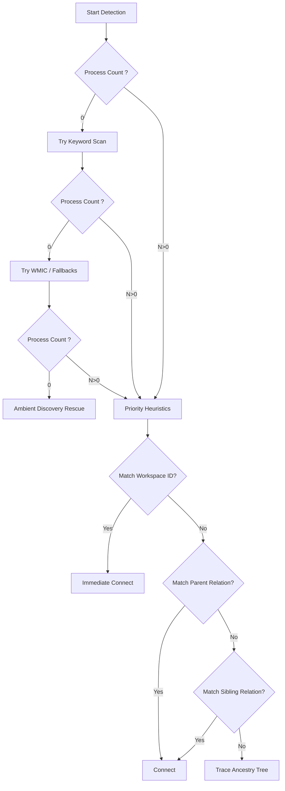
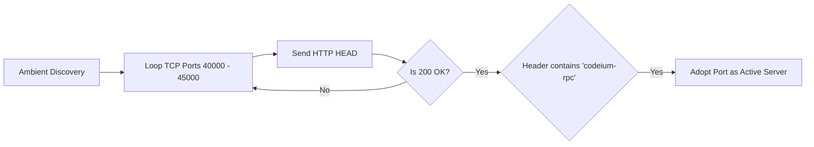
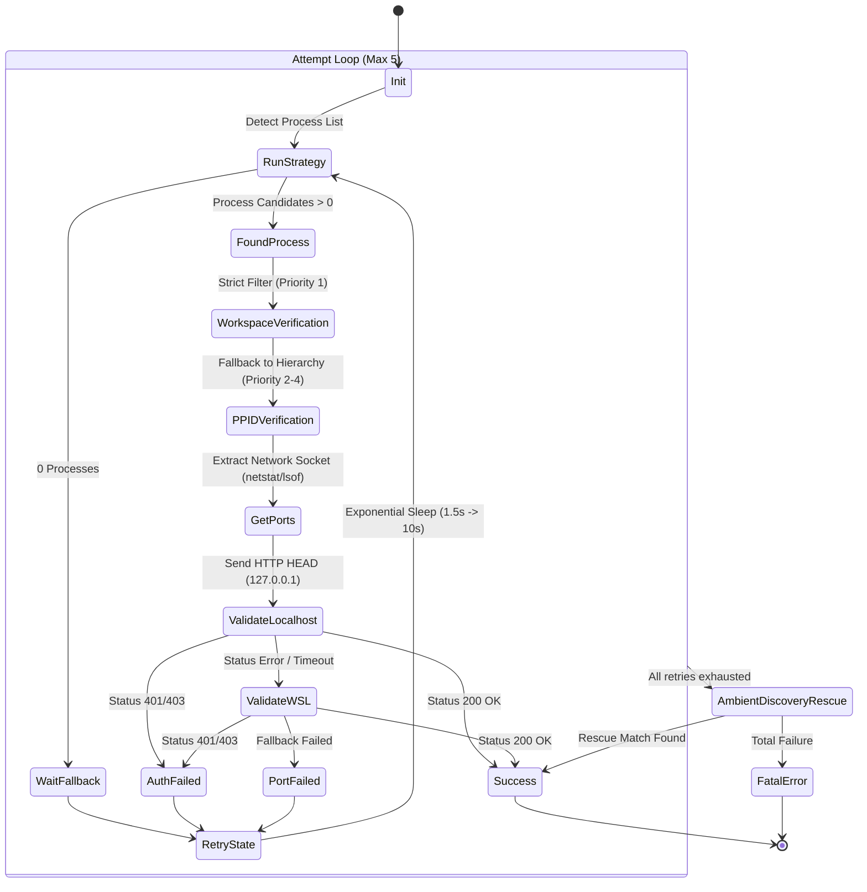

# Antigravity Language Server Protocol (LSP) Communication Architecture

## 1. Executive Summary

This document provides an exhaustive, in-depth technical analysis of how the Antigravity Toolkit panel establishes, manages, and executes communication with the local Antigravity Language Server (LSP). The communication relies predominantly on tracking side-car language server processes spawned by the IDE, extracting security footprints, and establishing direct local REST/gRPC-Web communication channels.

The goal of this architectural deep-dive is to map the specific mechanisms to the source files containing their respective logic, making it easier for new maintainers to comprehend the flow and debug connection failures. The communication operates over complex system boundaries involving Child Process Executions, WQL queries, Chrome DevTools Protocol injection, and network layer resilient routing.

This document is intended for:
- Core maintainers of the Antigravity Toolkit
- Contributors looking to expand platform coverage
- Security auditors reviewing local IPC mechanisms
- Power users attempting to debug complex isolated environments

---

## 2. High-Level Communication Principles

Before diving into the code semantics, it's critical to understand the constraints and environment shaping this communication flow.

1. **Dynamic Instantiation:**
   The Language Server (LS) process is instantiated dynamically by the host IDE. The panel extension cannot rely on a static, predefined port. Instead, it must dynamically detect the local operating server environment. This prevents port-collision when users run multiple IDE instances simultaneously.
   
2. **Strict Security Posture:**
   All communication requires a CSRF token (`--csrf_token`). This token is exclusively passed via command line arguments to the spawned `language_server` process. It provides an implicit authorization grant limiting access only to processes that can read the system's process table. This ensures malicious web pages or unprivileged users cannot query the local Language Server.

3. **Resiliency and Fault Tolerance:**
   The process detection mechanism scales across OS platforms (Windows, macOS, Linux) and runtime variations (WSL, VM isolation). If default native detection fails, the logic iterates through progressively fallback solutions (such as WMIC, Ambient Discovery, etc.).

4. **Network Protocol Adaptability:**
   Localhost environment network configurations vary drastically. Thus, the client supports both HTTPS natively and gracefully degrades to HTTP if required (e.g. self-signed certificate constraints on local machines).

5. **Non-Intrusive Design:**
   A central design pillar is that the Extension does not spawn the Language Server; it relies upon and intercepts the operational state of the parent IDE. We are a passive observer that elevates into an active communicator only after validating the environment.

---

## 3. Core Workflow Overview

The core workflow spans a 4-phase lifecycle: Detection → Verification → Consumption → Recovery.

### Phase 1: Process Detection
The extension executes a native query targeting active running processes. It filters out non-relevant tasks and zooms into instances matching the `language_server` payload. This involves interacting with system-level APIs:
- `Windows`: PowerShell CIM instances or WMIC tools.
- `macOS/Linux`: `ps` and `lsof`/`netstat`/`ss`.

### Phase 2: Argument Parsing and Metdata Extraction
Upon finding active processes, it leverages Regular Expressions to scrape the specific command line string for:
- `--extension_server_port=XYZ`: The target port on localhost.
- `--csrf_token=ABC123`: The security token required for HTTP Headers.
- `--workspace_id=XYZ-WS`: The active VSCode workspace ID to ensure we are talking to the correct Language Server for the current project.

### Phase 3: Validation and Verification
Process-hierarchy validations confirm the targeted process matches the parent tree. It extracts the corresponding active Ports. It tests the availability of these ports via rapid HEAD/POST HTTP probing.

### Phase 4: Active Communication
Upon verification, the system commits HTTP POST requests to the backend endpoints (e.g., retrieving User Status Quota). It caches the routing information to speed up consecutive network calls.

---

## 4. Bootstrap: How Discovery and Connection Are Triggered

Before examining each module in isolation, it is essential to understand the **entry point** that orchestrates the entire discovery and connection lifecycle. This is handled by `src/extension.ts`.

### 4.0.1 `src/extension.ts` — The Orchestrator

When the Antigravity IDE loads the extension, VS Code invokes the `activate()` function in `extension.ts`. This function is the single root of all LSP discovery logic.

**Startup Sequence:**

```mermaid
sequenceDiagram
    participant IDE as Antigravity IDE
    participant Ext as extension.ts activate()
    participant VM as AppViewModel
    participant PF as ProcessFinder
    participant QS as QuotaService
    participant Sched as Scheduler

    IDE->>Ext: activate(context)
    Ext->>Ext: Initialize ConfigManager, StorageService, QuotaService
    Ext->>VM: new AppViewModel(quotaService, cacheService, ...)
    Ext->>VM: setConnectionStatus('detecting')
    Ext->>VM: restoreFromCache()
    Note over Ext: Wait 30 seconds for LS to initialize
    Ext->>Ext: setTimeout(bootServerConnection, 30000)
    
    rect rgb(45, 55, 72)
        Note over Ext,PF: bootServerConnection() — The Core Boot
        Ext->>PF: new ProcessFinder()
        Ext->>PF: detect({ attempts: 5 })
        PF-->>Ext: LanguageServerInfo | null
        
        alt Server Found
            Ext->>QS: setServerInfo(serverInfo)
            Ext->>VM: setConnectionStatus('connected')
            Ext->>VM: refreshQuota()
        else Server NOT Found (retry < 3)
            Ext->>Ext: setTimeout(bootServerConnection, 5000)
        else All Retries Exhausted
            Ext->>VM: setConnectionStatus('failed', reason)
            Ext->>Ext: Show error notification
        end
    end
    
    Ext->>Sched: register('refreshQuota', interval: 90s)
    Ext->>Sched: start('refreshQuota')
```



**Step-by-Step Breakdown:**

1. **Initialization (Lines 62-95):**
   The extension creates all service instances (`QuotaService`, `CacheService`, `StorageService`, `AutomationService`) and the central `AppViewModel`. At this point, no connection exists yet.

2. **Cache Restoration (Line 279):**
   Before any network call, `appViewModel.restoreFromCache()` loads the last known token usage data from VS Code's `globalState`. This is how the panel shows instant data on startup — it renders cached data while the connection is being established in the background.

3. **Initial Connection Delay — The 30-Second Wait (Lines 262-266):**
   ```typescript
   const INITIAL_CONNECTION_DELAY_MS = 30000;
   appViewModel.setConnectionStatus('detecting', null);
   setTimeout(() => {
     bootServerConnection();
   }, INITIAL_CONNECTION_DELAY_MS);
   ```
   The Language Server can take 30+ seconds to fully initialize (auth, feature flags, model configs). Connecting too early causes unnecessary retry storms.

4. **`bootServerConnection()` — The Core Boot Function (Lines 108-257):**
   This function creates a fresh `ProcessFinder`, calls `detect()`, and reacts to the result:
   
   - **Success path:** Calls `quotaService.setServerInfo(serverInfo)` which stores the discovered `port` and `csrfToken`. Then calls `appViewModel.refreshQuota()` to perform the first real data fetch.
   - **Failure path:** If `ProcessFinder` returns null after its internal 5 retries, `bootServerConnection` has its **own** external retry loop (up to 3 additional attempts with 5-second delays). This means the system performs up to `5 internal × 4 external = 20` total connection probes before declaring failure.
   - **Error classification:** Based on `processFinder.failureReason`, it provides targeted error messages:
     - `no_process` → "Local server not found"
     - `no_port` → "Server process found but no listening port detected"
     - `auth_failed` → "Handshake with server failed (CSRF check failed)"
     - `workspace_mismatch` → All candidates belonged to different IDE windows

5. **Polling Registration (Lines 292-378):**
   After the initial connection, a `Scheduler` registers periodic tasks:
   - `refreshQuota`: Polls `quotaService.fetchQuota()` every 90 seconds (configurable).
   - `checkCache`: Monitors cache size every 120 seconds.
   
   The polling interval dynamically updates when settings change (Line 382).

### 4.0.2 `src/shared/platform/detection_utils.ts` — Gateway Verification

This small but critical file provides the `verifyServerGateway()` function — the actual HTTP probe that confirms a candidate port is a live Antigravity Language Server.

**How Gateway Verification Works:**

When `ProcessFinder` discovers a candidate process with a port and CSRF token, it doesn't just accept it blindly. It sends a real HTTP POST to the candidate and checks the response:

```typescript
export async function verifyServerGateway(
    hostname: string,
    port: number,
    csrfToken: string,
    endpoint: string = "/exa.language_server_pb.LanguageServerService/GetUserStatus"
): Promise<{ success: boolean; statusCode: number; protocol: "https" | "http"; error?: string }> {
    return httpTestPort(
        hostname, port, endpoint,
        {
            "X-Codeium-Csrf-Token": csrfToken,
            "Connect-Protocol-Version": "1",
        },
        JSON.stringify({ wrapper_data: {} })
    );
}
```

**What This Validates:**
1. **Port is actually listening** — Not just an OS artifact from a recently killed process.
2. **CSRF token is correct** — A 401/403 response indicates a token mismatch (wrong LS instance).
3. **Protocol detection** — The HTTPS → HTTP fallback is invoked here, caching the result for subsequent quota fetches.
4. **Endpoint responds** — Confirms the process is actually an Antigravity Language Server and not some other application occupying that port.

This is the final checkpoint before the extension commits to a connection. Without a successful gateway verification, no `LanguageServerInfo` is returned.

### 4.0.3 Connection Lifecycle Summary Table

| Step | File | Function | What Happens |
|------|------|----------|-------------|
| 1. Extension loads | `extension.ts` | `activate()` | Services created, cache restored |
| 2. Wait for LS init | `extension.ts` | `setTimeout(30s)` | Avoids premature retries |
| 3. Find processes | `process_finder.ts` | `tryDetect()` | OS shell queries for `language_server` binary |
| 4. Parse CLI args | `platform_strategies.ts` | `parseProcessInfo()` | Extract port, CSRF token, workspace ID |
| 5. Resolve workspace | `process_finder.ts` | Priority 1-5 heuristic | Match candidate to current IDE window |
| 6. Discover ports | `platform_strategies.ts` | `getPortListCommand()` | Query OS for TCP listener sockets |
| 7. Verify gateway | `detection_utils.ts` | `verifyServerGateway()` | HTTP POST to confirm LS is live |
| 8. HTTPS↔HTTP fallback | `http_client.ts` | `httpRequest()` | Try HTTPS first, fall back to HTTP |
| 9. Store connection | `extension.ts` | `quotaService.setServerInfo()` | Cache port + token for ongoing use |
| 10. First data fetch | `quota.service.ts` | `fetchQuota()` | Pull user status, credits, model quotas |
| 11. Periodic polling | `extension.ts` | `Scheduler` | Re-fetch every 90 seconds |

---

## 5. Source Files and Logic Mapping

The following sections map every module to its source codebase, explaining line-by-line intent.

### 5.1. `src/shared/platform/platform_strategies.ts`

**Domain Location:** Service layer handling OS abstractions.
**Primary Responsibility:** Dictating OS-specific mechanisms for process and port discovery.

This file exposes the `PlatformStrategy` interface. An interface is mandatory because analyzing running processes is highly coupled to the Host system shell.

#### Interface Definition
```typescript
export interface PlatformStrategy {
  getProcessListCommand(processName: string): string;
  getProcessListByKeywordCommand?(keyword: string): string;
  getFallbackProcessListCommand?(): string;
  parseProcessInfo(stdout: string): ProcessInfo[] | null;
  getPortListCommand(pid: number): string;
  parseListeningPorts(stdout: string, pid: number): number[];
  getDiagnosticCommand(): string;
  getTroubleshootingTips(): string[];
  detectAvailablePortCommand?(): Promise<void>;
}
```

#### Windows Implementation: `WindowsStrategy`

The primary challenge in Windows is that classic Command Prompt (`cmd.exe`) truncates long arguments and provides poor JSON structures. PowerShell provides object-oriented responses.

**Primary Process Listing:**
```powershell
[Console]::OutputEncoding = [System.Text.Encoding]::UTF8;
$n = 'language_server_windows_x64.exe';
$f = 'name=''' + $n + '''';
$p = Get-CimInstance Win32_Process -Filter $f -ErrorAction SilentlyContinue;
if ($p) { @($p) | Select-Object ProcessId,ParentProcessId,CommandLine | ConvertTo-Json -Compress } else { '[]' }
```
*Deep Dive:* 
1. We enforce UTF-8. Without this, multi-byte characters in directory paths (e.g., `C:\Users\用户\workspace`) corrupt the output making it invalid JSON.
2. We use `Get-CimInstance` over `Get-WmiObject` because CIM is supported across all PowerShell Core versions (pwsh 7+) whereas WMI is being deprecated.
3. The result is piped to `ConvertTo-Json -Compress` to emit a single payload buffer for Node.js.

**Parsing Windows Output:**
The `parseProcessInfo` explicitly handles two formats: JSON (from CIM) and CSV (from the WMIC fallback).
For JSON:
```typescript
const data = JSON.parse(jsonCandidate);
const processList = Array.isArray(data) ? data : [data];
// Map properties to our internal ProcessInfo format
```

For WMIC it utilizes column sniffing:
```typescript
// WMIC CSV format: Node, "CommandLine", ParentProcessId, ProcessId
const idsMatch = row.match(/,(\d+),(\d+)\s*$/);
const ppid = parseInt(idsMatch[1], 10);
const pid = parseInt(idsMatch[2], 10);
```

#### Unix Implementation: `UnixStrategy`

macOS and Linux utilize standard POSIX tools.

**Primary Process Listing:**
```bash
ps -A -ww -o pid,ppid,args | grep "[l]anguage_server_linux_x64"
```
*Deep Dive:*
1. `-A` gets all processes.
2. `-ww` (Double W) ensures unbounded line wrapping. A language server often receives hundreds of arguments (paths, extensions, tokens) that easily exceed the default 80 column terminal width. Single `-w` is 132 columns. Double `-ww` is infinite.
3. `[l]anguage_server` is a classic Unix trick. Evaluating the regex `[l]` circumvents matching the actual `grep` command itself within the process list.

**Port Discovery Logic on Unix:**
Unix provides multiple tools for netstat-like behavior. `detectAvailablePortCommand` is an async initializer that attempts `lsof`, then `ss`, then `netstat`. 

- `lsof` (macOS default):
  `lsof -a -P -iTCP -sTCP:LISTEN -p <PID>`
- `ss` (Linux modern default):
  `ss -tlnp | grep pid=<PID>`
  
It parses strings like `*:42100 (LISTEN)` to extract available port nodes.

---

### 4.2. `src/shared/platform/process_finder.ts`

**Domain Location:** Command and coordination module.
**Primary Responsibility:** Executing strategy patterns, evaluating workspace constraints, and picking the right Language Server candidate.

The `ProcessFinder` implements the complex multi-stage pipeline.



**Heuristic Prioritization Deep Dive:**

Why do we need heuristics? When a user opens 5 different Visual Studio Code projects simultaneously, there will be 5 distinct `language_server` instances running in the OS background. If we just connect to the first one, we might fetch quota and issue commands to the wrong workspace!

1. **Priority 1: Absolute Workspace Match**
   The `.vscode` instance provides the extension a `workspace_id` variable. If the parsed command line arguments contain this exact ID (`--workspace_id=ABC`), it is an absolute undeniable match.

2. **Priority 2: Inheritance Match (Direct Child)**
   Sometimes IDEs dynamically generate internal Untitled workspaces. If `candidate.ppid === process.pid` (Our Extension Node.js runtime), it means we spawn it.

3. **Priority 3: Sibling Match**
   If `candidate.ppid === process.ppid`, they share the same overarching Electron parent frame.

4. **Priority 4: Ancestry Match**
   ```typescript
   let parent = info.ppid;
   for (let level = 0; level < 3; level++) {
       if (parent === myPid) { /* verified */ }
       parent = await this.getParentPid(parent);
   }
   ```
   Visual Studio Code features layered architectures (Main -> Extension Host -> Pty -> Server). We recursively climb the PID tree up to 3 tiers to verify ownership.

**WSL Integration in `findWorkingPort`**
Windows Subsystem for Linux (WSL) represents a segmented network boundary. 
If the node process is inside WSL but the Language Server is on the Windows Host, `127.0.0.1` binds exclusively to the WSL virtual loopback!
The Finder detects this via `isWsl()`. It executes `ip route show default` to extract the Windows Host virtual NAT IP (usually `172.x.x.x`) and repoints the HTTP client to the hypervisor bridge.

---

### 4.3. `src/shared/utils/http_client.ts`

**Domain Location:** Shared common utilities.
**Primary Responsibility:** Creating robust, dependency-free network tunnels.

We explicitly avoid heavy dependencies like `axios` or `node-fetch`. Node's internal `http`/`https` modules guarantee maximum compatibility without breaking compiled Extension sizes.

**Protocol Fallback Mechanism:**
Antigravity servers usually communicate over secure TLS/HTTPS loopbacks using self-signed certificates. However, restrictive corporate policies often block self-signed certificates locally.
1. We start by requesting `https://127.0.0.1:PORT`.
2. We inject `rejectUnauthorized: false` to allow localhost self-signed keys.
3. If this throws a network layer timeout or reset exception, the `allowFallback` boolean catches the error and instantaneously duplicates the request over `http://`.

**Global Protocol Cache:**
```typescript
const protocolCache = new Map<string, Protocol>();
```
Since resolving the TLS failure costs roughly 15ms-100ms per request, we cache the result against `Host:Port`.
If the Quota service polls 10 times a minute, it doesn't incur the TLS penalty. It reads from the cache and immediately tunnels through HTTP.

**Raw Request Engine:**
```typescript
const req = requestModule.request(requestOptions, (res) => {
    let responseBody = "";
    res.on("data", (chunk) => (responseBody += chunk));
    res.on("end", () => {
        const data = JSON.parse(responseBody);
        resolve({ statusCode: res.statusCode, data, protocol });
    });
});
```
This buffers data streams directly. Notice how it implements defensive JSON parsing. If the server crashes and yields an NGINX HTML page, `JSON.parse` will throw. The `catch` block checks if the HTTP status was `>= 400`, meaning we gracefully extract stringified errors (`HTTP 502: Bad Gateway`) instead of ugly `SyntaxError: Unexpected token <`.

---

### 4.4. `src/model/services/quota.service.ts`

**Domain Location:** Application logical services.
**Primary Responsibility:** The core User API interactions for token utilization.

To utilize the Language Server, we query its gRPC-Web REST wrapper endpoint.

**Target Path:** `/exa.language_server_pb.LanguageServerService/GetUserStatus`

**Payload Definition (Expected Input from Server):**
```json
{
  "userStatus": {
    "name": "Jane Doe",
    "email": "jane.doe@example.com",
    "planStatus": {
      "planInfo": {
        "monthlyPromptCredits": 1000,
        "monthlyFlowCredits": 500,
        "planName": "Pro Tier"
      },
      "availablePromptCredits": 420,
      "availableFlowCredits": 100
    },
    "cascadeModelConfigData": {
      "clientModelConfigs": [
        { "label": "Gemini Pro", "quotaInfo": { "remainingFraction": 0.8, "resetTime": "2026-04-05T00:00:00Z" } },
        { "label": "Claude 3.5 Sonnet", "quotaInfo": { "remainingFraction": 0.2, "resetTime": "2026-04-05T00:00:00Z" } }
      ]
    }
  }
}
```

**Parsing Business Rules:**

The method `parseResponse(data: ServerUserStatusResponse): QuotaSnapshot` computes logic metrics not natively provided by the server payload.

*Computing Token Pools:*
It derives Used Percentages mathematically:
```typescript
usedPercentage = ((monthly - available) / monthly) * 100;
remainingPercentage = (available / monthly) * 100;
```
If `monthly` equals 0 (e.g. Free Tier with infinite usage or degraded payload), it escapes the mathematical division to avoid `NaN` or `Infinity` JavaScript errors.

*Calculating Reset Horizons:*
The payload returns raw ISO strings (`"resetTime": "2026-04-05T00:00:00Z"`).
The script maps this to relative strings (`2h 15m`, `1d 4h`, `Ready`) via the `formatTime(ms: number)` helper. 
*Edge Case Handling:* If the OS time is out-of-sync with the server, making `diff <= 0`, it defaults to reporting `"Ready"`.

---

### 4.5. `src/model/services/automation.service.ts`

**Domain Location:** Application Actionable logic.
**Primary Responsibility:** The Hands-Free Mode and Chrome Protocol Bridge.

The standard Extension APIs do not allow an extension to hijack the UI and click specific buttons inside a WebView (security jailing). If a user wishes for "Auto-Accept" on agent commands, the Toolkit employs CDP (Chrome DevTools Protocol).

**CDP Target Acquisition:**
The system searches the IDE's launch arguments for `--remote-debugging-port=9222`.

**CDP Communication Flow:**
1. Issues an HTTP `GET http://127.0.0.1:9222/json/list` to retrieve all Chromium active frames and pages.
2. Identifies the `webSocketDebuggerUrl` corresponding to the embedded Panel WebView.
3. Initializes a raw `ws://` TCP WebSocket connection to that URL.
4. It issues CDP remote evaluation payloads:
   ```json
   {
      "id": 1,
      "method": "Runtime.evaluate",
      "params": {
         "expression": "document.querySelectorAll('.accept-btn').forEach(b => b.click())",
         "returnByValue": true
      }
   }
   ```
This entirely transcends the Language Server and interacts directly with the IDE DOM UI. This service is decoupled from `quota.service.ts` but relies entirely on the same base `ProcessFinder` philosophy to locate the CDP port integer.

---

### 4.6. `src/shared/platform/ambient_discovery.ts`

**Domain Location:** Rescue utilities.
**Primary Responsibility:** Extracting operational processes when explicit deterministic heuristics fail.

Sometimes, strict system administrators rename binaries entirely, or corporate Antiviruses block `ps`/`Get-CimInstance` access. The `ProcessFinder` guarantees it won't crash, instead delegating to `AmbientDiscovery`.

**Brute-Force Network Discovery:**
Instead of hunting for PIDs, the module scans local TCP loopbacks.

This operates on the empirical knowledge that Antigravity allocates ports in a specific, predictable high-range spectrum.

---

### 4.7 Diagnostics Flow (Deep Dive: `process_finder.ts:runDiagnostics`)

When the entire chain fails (All 5 ProcessFinder rules fail, Ambient Discovery fails), we enter fatal degradation.

`runDiagnostics()` triggers an explicitly broad scan targeting substrings: `language` and `antigravity`.
```powershell
Get-Process | Where-Object { $_.ProcessName -match 'language|antigravity' } | Select-Object Id,ProcessName,Path | Format-Table -AutoSize
```
This raw output is piped into the VSCode Extension `Output Channel`. 

**Critical Sanity Protection (Sanitization)**
Because this output might contain `--csrf_token=DEADBEEF`, we mandate a raw regex scrubber:
```typescript
const sanitize = (text: string) => text.replace(/(--csrf_token[=\s]+)([a-f0-9-]+)/gi, "$1***REDACTED***");
```
Tokens are actively scrubbed prior to writing to the logging window to prevent inadvertent leaks if users post their Output logs to GitHub Issues.

---

## 5. Security Posture Summary

*   **CSRF Enforcement:** All HTTP interfaces mandate the CSRF token. Finding the port alone via `netstat` is useless for a malicious attacker.
*   **Loopback Bindings:** The HTTP options instantiate `agent: false` and explicitly map to `hostname: 127.0.0.1`. It never attempts LAN bridging inherently unless `isWsl()` specifically requires hypervisor traversing.
*   **Memory Safety:** The `tokenPreview` only holds `<8 chars` in memory to safely log identities for debugging without exposing full key entropy in heap dumps.
*   **Redaction:** All standard debug channels run through the `$1***REDACTED***` pipeline. 

---

## 6. End-to-End Troubleshooting Guide For Contributors

If the LSP connection protocol is entirely dark, walk through the following scenarios:

**Scenario A: Windows 11 - Empty JSON Parsing Error**
Context: PowerShell Execution policies blocked the ProcessFinder node script.
Remedy:
1. Open PowerShell as Admin and verify `Get-ExecutionPolicy`. If `Restricted`, the Node wrapper will fail.
2. Evaluate `Get-CimInstance Win32_Process`. If it returns a WMI exception, the user's Windows Management Instrumentation service (`winmgmt`) is off.

**Scenario B: macOS - Empty Listening Ports List**
Context: `lsof` can sometimes output processes unreliably on M1/M2/M3 (arm64) architectures based on TTY allocation.
Remedy: 
Verify if `ss` or `netstat -anvp tcp` resolves the listeners. `platform_strategies.ts` should automatically pivot, but if `lsof` throws a non-distinct exit code, it might false-positive as installed.

**Scenario C: Linux Snap/Flatpak Restrictions**
Context: Jailed environments cannot execute bare `ps -o ppid`.
Remedy:
`AmbientDiscovery` must execute perfectly. Check the `testPort()` loop limit parameters in `ambient_discovery.ts` to ensure it targets the correct ephemeral port allocations bound by the Flatpak container mapping.

---

## 7. Future Extensibility

When expanding this module:
1. **Never use raw CLI scraping for new logic:** If you need new tokens, query the LSP via `/GetUserStatus` instead of polluting the `--args` regex parsing blocks.
2. **Expand WSL Support:** If WSL 2 introduces mirrored networking updates that break the raw NAT logic, modify `isWsl()` helpers and add a new IP heuristic table priority in `findWorkingPort`.
3. **HTTP/2 Support:** Ensure the built-in node HTTP clients implement stream handling if the LSP upgrades to full HTTP/2 streams natively.

---

## 8. State Flow Transitions 

To illustrate the complexities of `findWorkingPort` and backoff tracking, here is the state machine representation of the connection attempts.



## 9. Appendix: Type Definitions 

For reference during development, here are the exported types interacting between the `ProcessFinder` and `QuotaService`:

```typescript
export interface ProcessInfo {
  pid: number;
  ppid: number | null;
  extensionPort: number;
  csrfToken: string;
  workspaceId?: string;
}

export interface LanguageServerInfo {
  port: number;
  csrfToken: string;
}

export interface CommunicationAttempt {
  pid: number;
  port: number;
  hostname: string;
  statusCode: number;
  error?: string;
  protocol: Protocol;
  portSource: "cmdline" | "netstat";
}

export interface DetectOptions {
  attempts?: number;
  baseDelay?: number;
  verbose?: boolean;
}
```

These payloads act as the fundamental source of truth exchanged between the UI render cycles and the backend gRPC pipes.

*(End of Expanded Technical Architecture Documentation)*
