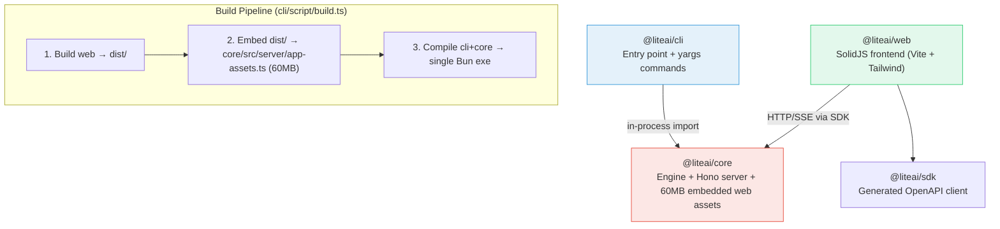
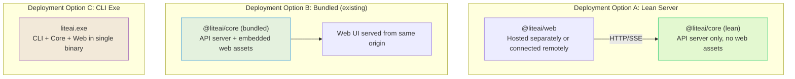

# Core as Standalone Server — Architecture Analysis & Recommendation

## Current Architecture



### How things work today

| Aspect | Current Behavior |
|---|---|
| **Core ↔ Web** | Core's Hono server either proxies to Vite dev server (`:3000`) or serves embedded base64 assets from `app-assets.ts` |
| **Web → Core** | Web connects via `@liteai/sdk` over HTTP/SSE — already a client/server model |
| **CLI → Core** | CLI directly imports core modules in-process (`@liteai/core/server/server`, `@liteai/core/project/instance`, etc.) |
| **Production build** | Everything compiles into one ~60MB+ Bun executable via `bun build --compile` |
| **`app-assets.ts`** | **60.58 MB** — the entire web frontend base64-encoded into a TypeScript module, embedded at build time |

> [!IMPORTANT]
> Web already talks to core as a remote server via HTTP/SSE. The "standalone server" capability is 80% there — the main work is around build separation and making the asset embedding optional.

---

## What You're Asking For

1. **Core runs as a standalone server** — separate process, not necessarily embedded with CLI
2. **Web connects to it** — ✅ already works, no changes needed
3. **CLI can connect to it** — needs development (currently in-process imports)
4. **Two build modes:**
   - **Bundled** — Core + Web embedded (current behavior, self-contained)
   - **Lean** — Core server only, no web assets (for remote/container deployment)
5. **CLI can still produce single-exe** bundles with core

---

## Recommendation: Conditional Asset Loading

> [!TIP]
> The cleanest approach: keep core as a single package, but make the web asset embedding **optional** via a build-time flag and lazy loading.

### Target Architecture



### Implementation Plan

#### Phase 1: Make web assets optional in core (Minimal changes)

**1.1 — Create `app-assets-stub.ts`**

A zero-weight stub that replaces the 60MB real file:

```typescript
// core/src/server/app-assets-stub.ts
export const assets = new Map<string, { content: string; type: string }>()
```

**1.2 — Make the server fallback-aware**

Modify [server.ts](file:///c:/Users/aghassan/Documents/workspace/liteai/packages/core/src/server/server.ts#L177-L206) to gracefully handle empty assets:

```diff
 // ─── Static assets / dev proxy (must be last) ───────────────────
 .all("/*", async (c) => {
   const p = c.req.path === "/" ? "/index.html" : c.req.path

   // Dev mode: proxy to local Vite dev server
   if (Installation.isLocal()) {
     return proxy(`${DEV_SERVER_URL}${p}`, { ... })
   }

   // Production: serve from embedded assets
   const { assets } = await import("./app-assets")
+  
+  // Lean mode: no embedded assets, return API-only response
+  if (assets.size === 0) {
+    if (p === "/index.html" || p === "/") {
+      return c.json({
+        mode: "api",
+        message: "LiteAI API server running (no web UI bundled). Connect web client separately.",
+        docs: "/doc",
+      })
+    }
+    return c.notFound()
+  }
+
   const entry = assets.get(p)
   // ... existing SPA fallback logic
 })
```

**1.3 — Add build scripts for core standalone**

Create `core/script/build-standalone.ts`:

```typescript
// Two modes:
// --lean     → copies app-assets-stub.ts → app-assets.ts, builds core only
// --bundled  → runs web build + asset embedding (existing logic from cli/script/build.ts)
```

Also add to `core/package.json`:

```json
{
  "scripts": {
    "build:lean": "bun run script/build-standalone.ts --lean",
    "build:bundled": "bun run script/build-standalone.ts --bundled",
    "start": "bun run --conditions=browser ./src/server/standalone.ts"
  }
}
```

**1.4 — Create standalone entry point for core**

Create `core/src/server/standalone.ts` — a minimal entry point that boots the server without CLI/yargs:

```typescript
// core/src/server/standalone.ts
import { Server } from "./server"
import { Database } from "../storage/db"
import { Log } from "../util/log"
import { Installation } from "../installation"
import { Instance } from "../project/instance"

await Log.init({
  print: true,
  level: process.env.LOG_LEVEL as Log.Level ?? "INFO",
})

Database.Client()

const port = Number(process.env.LITEAI_PORT ?? 9000)
const hostname = process.env.LITEAI_HOST ?? "0.0.0.0"

const server = Server.listen({
  port,
  hostname,
  cors: process.env.LITEAI_CORS?.split(","),
})

console.log(`LiteAI server listening on http://${server.hostname}:${server.port}`)

for (const signal of ["SIGTERM", "SIGINT"] as const) {
  process.on(signal, async () => {
    console.log(`Received ${signal}, shutting down...`)
    Server.shutdown()
    await Instance.disposeAll().catch(() => {})
    process.exit(0)
  })
}
```

#### Phase 2: Extract web build logic from CLI

Currently, [cli/script/build.ts](file:///c:/Users/aghassan/Documents/workspace/liteai/packages/cli/script/build.ts#L62-L104) handles:
1. Building web frontend (`bun run --cwd ../web build`)
2. Scanning the dist folder and embedding as base64 into `app-assets.ts`
3. Compiling the final executable

**Extract steps 1-2** into a shared script (e.g., `core/script/embed-web-assets.ts`) that both `cli/script/build.ts` and `core/script/build-standalone.ts --bundled` can invoke.

#### Phase 3: Dockerfile for lean core (future)

```dockerfile
# Lean core server — no embedded web assets
FROM oven/bun:latest AS base
WORKDIR /app
COPY packages/core ./
RUN bun install --production
EXPOSE 9000
CMD ["bun", "run", "start"]
```

#### Phase 4: CLI → Core remote connection (future, per your note)

For CLI to connect to a remote core server instead of running in-process:

```bash
# Current (in-process)
liteai run "some prompt"

# Future (remote)
liteai --server http://my-core:9000 run "some prompt"
```

This would involve:
- Adding a `--server` global flag to yargs
- Creating a "remote mode" that uses `@liteai/sdk` instead of direct core imports
- Wrapping key commands to dispatch either locally or remotely

> [!WARNING]
> Phase 4 is the most complex. Many CLI commands directly call core internals (Instance, Project, etc.). A full remote CLI would need the SDK to cover all those operations. I'd recommend doing this incrementally, command by command.

---

## Summary of Changes by Scope

| File/Module | Change | Risk |
|---|---|---|
| `core/src/server/server.ts` | Handle empty assets gracefully | 🟢 Low |
| `core/src/server/app-assets-stub.ts` | New — zero-weight asset stub | 🟢 Low |
| `core/src/server/standalone.ts` | New — standalone entry point | 🟢 Low |
| `core/script/embed-web-assets.ts` | New — extracted from cli build | 🟡 Medium (refactor) |
| `core/package.json` | Add build scripts, start command | 🟢 Low |
| `cli/script/build.ts` | Import shared embed logic | 🟡 Medium |
| `core/Dockerfile` | Update for lean mode | 🟢 Low |

---

## What You Get

| Scenario | How it works |
|---|---|
| **`bun run start` in core (lean)** | Core boots as API-only server. Web connects from elsewhere (e.g., `vite dev` or hosted SPA). |
| **`bun run start` in core (bundled)** | Core boots with embedded web UI, same as today's `liteai web`. |
| **`liteai web` (CLI exe)** | Same as today — single exe with everything baked in. |
| **`liteai serve` (CLI exe)** | Headless server from CLI, web connects remotely. |
| **Docker lean deployment** | Small container, web served separately (e.g., Vercel/CDN). |

---

## Alternative Considered: Separate `@liteai/server` package

Creating a thin `@liteai/server` package that wraps core + assets was considered but **rejected** because:
- Adds another package to maintain
- Build pipeline becomes more complex
- The conditional loading approach achieves the same result with less overhead
- Core already *is* the server — a wrapper adds no value

> [!NOTE]
> **Bottom line**: The architecture is already 80% there. Web already uses HTTP/SDK. The main work is making the 60MB asset embedding optional and creating a standalone entry point for core. This is a ~1-2 day effort for Phases 1-2, with Phase 4 (remote CLI) being a longer-term project.
