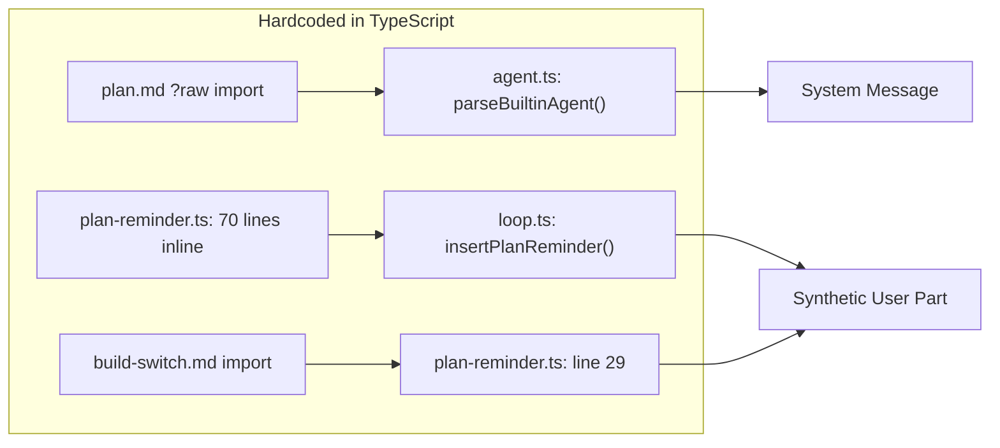
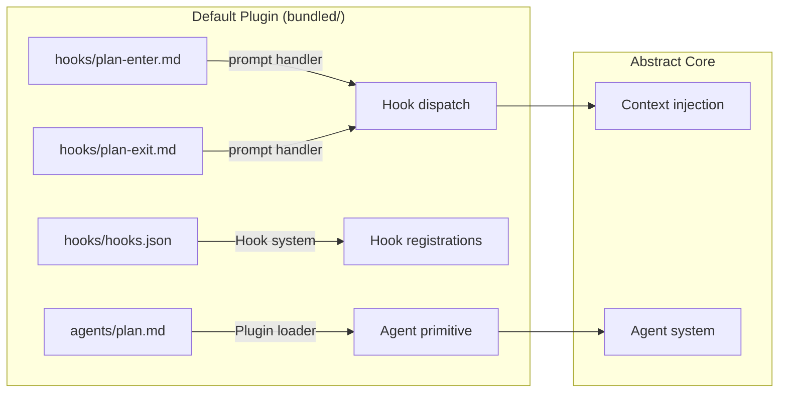

# Vision: Core as Abstract Primitives + Default Plugin

## The Idea

The core system should only know about **abstract primitives**: agents, skills, hooks, commands, plugins. It should not have hardcoded behavior for plan mode, system prompt injection, or any specific workflow.

Everything "built-in" becomes a **default plugin** — using the exact same mechanisms as third-party plugins like Superpowers:

```
src/bundled/                          ← ships as the "default plugin"
├── agents/plan.md                    ← agent definition (frontmatter + prompt)
├── skills/debug/SKILL.md             ← skill
├── commands/init.md                  ← command
├── hooks/
│   ├── hooks.json                    ← hook registrations
│   ├── plan-enter.md                 ← prompt injected on plan agent enter
│   ├── plan-exit.md                  ← prompt injected on plan_exit tool call
│   └── build-switch.md              ← prompt injected on plan→build transition
└── prompts/
    ├── default.md                    ← system prompt for generic models
    ├── gemini.md                     ← system prompt for Gemini
    ├── anthropic.md                  ← system prompt for Claude
    └── ...
```

---

## How Superpowers Does It (The Pattern to Follow)

The Superpowers (C:\Users\aghassan\.liteai\plugins\cache\anthropics-claude-plugins-official\superpowers\latest) plugin uses `SessionStart` hook to inject its core prompt — exactly the pattern we'd follow:

```json
// hooks/hooks.json
{
  "hooks": {
    "SessionStart": [{
      "matcher": "startup|clear|compact",
      "hooks": [{
        "type": "command",
        "command": "\"${CLAUDE_PLUGIN_ROOT}/hooks/run-hook.cmd\" session-start"
      }]
    }]
  }
}
```

The hook script reads skill `.md` files and returns them as `additionalContext` — injected into the system prompt. No hardcoded TypeScript, just primitives.

---

## Plan Mode Today vs. Future

### Today: Hardcoded in 3 places



### Future: Expressed Through Hooks



### What This Looks Like Concretely

```json
// bundled/hooks/hooks.json
{
  "hooks": {
    "SubagentStart": [{
      "matcher": "plan",
      "hooks": [{
        "type": "prompt",
        "prompt": "{{file:plan-enter.md}}"
      }]
    }],
    "PostToolUse": [{
      "matcher": "plan_exit",
      "hooks": [{
        "type": "prompt",
        "prompt": "{{file:plan-exit.md}}"
      }]
    }],
    "SessionStart": [{
      "matcher": "startup|clear",
      "hooks": [{
        "type": "prompt",
        "prompt": "{{file:session-start.md}}"
      }]
    }]
  }
}
```

**Key insight**: The `matcher` field already supports regex matching on tool names and event sources. We just need to enrich the hook context with `agent_id`/`agent_type` so matchers can target specific agents.

---

## What's Needed in the Hook System

### 1. Agent Context in Hook Input

Today's `Hook.Input` doesn't carry agent info:

```typescript
// Current
export type Input = {
  session_id?: string
  cwd: string
  hook_event_name: string
  tool_name?: string
  // ... no agent info
}
```

We'd need:
```typescript
// Future
export type Input = {
  session_id?: string
  cwd: string
  hook_event_name: string
  tool_name?: string
  agent_id?: string       // ← "plan", "build", "explore"
  agent_type?: string     // ← "primary", "subagent"
  // ...
}
```

This is **backwards-compatible with Claude Code** — Claude Code's hook protocol uses `[key: string]: unknown` for extra fields, so adding `agent_id` won't break anything.

### 2. New Hook Events (or enriched existing ones)

| Event | When | Matcher Target | Use Case |
|---|---|---|---|
| `SubagentStart` | ✅ Already exists | Agent name | Plan-enter prompt injection |
| `PostToolUse` | ✅ Already exists | Tool name (`plan_exit`) | Plan-exit prompt, build switch |
| `SessionStart` | ✅ Already exists | `startup\|clear` | Default system prompt injection |
| `InstructionsLoaded` | ✅ Already exists | — | System prompt transforms |

> [!TIP]
> We likely don't need entirely new events — the existing ones already cover the plan mode lifecycle if we enrich them with agent context.

### 3. "prompt" Hook Type With File References

Superpowers uses a bash script to read files and return JSON. For the default plugin, we'd want a simpler path — the `prompt` handler type already exists but only supports inline strings. Adding file references (e.g. `{{file:plan-enter.md}}`) resolved relative to the plugin root would make this clean:

```json
{
  "type": "prompt",
  "prompt": "{{file:plan-enter.md}}"
}
```

Or we keep using the `command` type and provide a lightweight resolver script, just like Superpowers does.

---

## System Prompt Selection

The provider-specific system prompts (`anthropic.md`, `gemini.md`, etc.) are trickier — they're selected based on model ID in [system.ts](file:///c:/Users/aghassan/Documents/workspace/liteai/packages/core/src/session/engine/system.ts#L22-L31):

```typescript
export function provider(model: Provider.Model) {
  if (model.api.id.includes("gemini-")) return [PROMPT_GEMINI]
  if (model.api.id.includes("claude")) return [PROMPT_ANTHROPIC]
  // ...
}
```

This could be expressed as an `InstructionsLoaded` hook with model-based matchers, but the matcher would need to operate on model ID rather than tool name. Two approaches:

1. **Enriched matchers**: Add `model_id` to hook context, let matchers target it
2. **Agent frontmatter**: Move the provider prompt into each agent's `.md` file as a model-conditional section

This is the one area where the pure-plugin approach gets complex. Probably fine to keep this as a last-phase item.

---

## Claude Code Compatibility

This approach is **fully compatible** because:

1. `hooks.json` follows the exact Claude Code schema
2. Adding `agent_id` to hook input is additive (Claude Code ignores unknown fields)
3. The `command` hook type is the universal escape hatch — works everywhere
4. Matchers are already regex-based, same as Claude Code

A user running Claude Code instead of LiteAI would simply have the default plugin's hooks fire through the same protocol.

---

## Phased Migration

### Phase 1: Unified Directory (now)
Move all scattered files into `src/bundled/` with convention-based loading. **No behavioral changes.**

### Phase 2: Agent Context in Hooks (small)
Add `agent_id` and `agent_type` to `Hook.Input`. Backward compatible. Enables agent-targeted hooks.

### Phase 3: Plan Mode via Hooks (medium)
- Extract `plan-reminder.ts` inline string → `bundled/hooks/plan-enter.md`
- Wire up `SubagentStart` hook with `matcher: "plan"`
- Wire up `PostToolUse` hook with `matcher: "plan_exit"` for build-switch
- Delete `insertPlanReminder()` function
- The plan agent `.md` file still defines permissions/mode — that's the agent primitive's job

### Phase 4: System Prompts via Hooks (larger)
- Move provider-specific prompts to hook-based injection
- `InstructionsLoaded` or `SessionStart` with model-based matching
- Delete `SystemPrompt.provider()` hardcoded logic

### Phase 5: Default Plugin Fully Self-Contained
- `src/bundled/` is indistinguishable from a marketplace plugin
- Core has zero hardcoded prompts — only abstract primitives
- Users can override any bundled behavior by installing a plugin that registers the same hooks with higher priority

---

## Summary

The vision is sound and achievable. The hook system already has most of the infrastructure — the main gaps are:
1. **Agent context** in hook input (trivial to add)
2. **File-reference support** in prompt handlers (nice-to-have, can use command type as fallback)
3. **Phased extraction** of hardcoded prompts into hook-registered `.md` files

The end state: the core becomes a pure runtime for abstract primitives, and everything "opinionated" lives in the default plugin — overridable, inspectable, and following the same rules as Superpowers or any community plugin.
