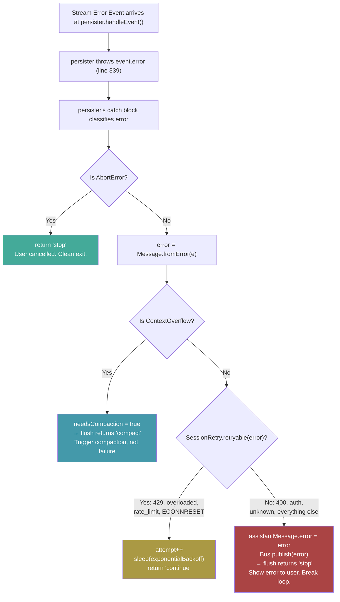

# Engine Error Handling: Full Path Analysis & Fix Design

## Overview: The 4-Layer Pipeline

Errors flow through 4 layers. Each layer has a specific role:

| Layer | File | Role |
|-------|------|------|
| **1. Stream** | `processor.ts` (`streamGenerator`) | Wraps AI SDK. Catches ALL throws. Yields `{type:"error", kind:"stream"}`. Never throws. |
| **2. Generator** | `query.ts` (`queryLoop`) | Multi-turn `while(true)` loop. Yields events to orchestrator. |
| **3. Orchestrator** | `loop.ts` (`runSessionInner`) | Consumes events. Routes to persister. Manages buffer & DB writes. |
| **4. Persister** | `persister.ts` (`EventPersister`) | Classifies errors. Decides: retry, compact, stop, or fatal. |

## Tracing Every Error Path (Current Code)

### Path A: Normal stream events ✅ Works
```
streamGenerator yields [start/delta/end/call/result/finish]
  → queryLoop yields to orchestrator
    → orchestrator routes to persister.handleEvent()
      → persister processes (updates DB)
        → returns undefined → continue reading events
```

### Path B: Tool errors ✅ Works
```
streamGenerator yields { type:"error", kind:"tool" }
  → queryLoop: kind !== "stream", so yields it through
    → orchestrator routes to persister.handleEvent()
      → persister marks tool as errored
        → returns undefined → continue
```

### Path C–H: ALL stream errors ❌ BROKEN (the bug)
This covers: AbortError, 400 Bad Request, 429 Rate Limit, Context Overflow, Auth failures, ECONNRESET, etc.

```
streamGenerator yields { type:"error", kind:"stream", error }
  → queryLoop: if (kind === "stream") throw event.error  ← INTERCEPTS HERE
    → catch block: yields { type:"tombstone" }  ← CONVERTS TO TOMBSTONE
      → orchestrator: tombstone handler → calls persister.flush()  ← BYPASSES handleEvent!
        → flush(): assistantMessage.error never set → returns "continue"
          → queryLoop also yields turn-end → orchestrator calls flush() AGAIN (double flush)
            → while(true) loops → IMMEDIATE RETRY → INFINITE DOOM LOOP
```

> [!CAUTION]
> **The tombstone pattern completely bypasses `persister.handleEvent()`'s error classification pipeline.** This means:
> 1. `Message.fromError()` never classifies the error
> 2. Retryable errors (429) never get exponential backoff
> 3. Fatal errors (400) never set `assistantMessage.error`
> 4. Context overflow never triggers compaction
> 5. AbortError never returns `"stop"`
> 6. `flush()` is called twice (once from tombstone, once from turn-end)
> 7. The loop runs forever with 0ms delay

## What SHOULD Happen (Correct Path Through Persister)

The persister already has the correct logic — it's just never reached. Here's what `handleEvent`'s catch block does:



## The If/Else Design

After every LLM turn, the engine must answer: **what happened?**

```
if (event is a normal stream event):
    → persist it, continue reading events. EXPECTED.

else if (event is a tool error):
    → mark that tool as errored, continue.
      Model will see the error on next turn and adapt. EXPECTED.

else if (event is a stream-level error):
    → Route to persister for classification:
    
        if (AbortError):
            → STOP. User cancelled. Clean exit immediately.
        
        else if (ContextOverflow):
            → COMPACT. Not a failure — context is too large.
              Trigger compaction pipeline, continue after.
        
        else if (retryable — 429, overloaded, rate_limit, ECONNRESET):
            → RETRY with exponential backoff.
              Sleep, then try again on next while() iteration.
        
        else (400, auth failure, unknown, ANYTHING else):
            → FATAL. Set assistantMessage.error.
              Publish to UI. Break the loop.
              User sees the error. No silent swallowing.

else (truly unexpected — bug in queryLoop itself):
    → Treat as FATAL stream error.
      Route through the same persister pipeline.
      Never silently continue. Never tombstone.
```

> [!IMPORTANT]
> **Core principle:** The `else` (default) is always **fatal**. We never silently continue on an unknown condition. The persister's catch block already implements this — its final `else` branch sets `assistantMessage.error` unconditionally.

## Root Causes & Proposed Fixes

### Bug 1: queryLoop intercepts stream errors before persister sees them

**File:** [query.ts](file:///c:/Users/aghassan/Documents/workspace/liteai/packages/core/src/session/engine/query.ts#L375-L377)

**Current (broken):**
```typescript
if (event.type === "error" && event.kind === "stream") {
  throw event.error  // ← intercepts, converts to tombstone
}
```

**Fix:** Remove these 3 lines. Let the event flow through `yield event` like every other event. The orchestrator routes it to `persister.handleEvent()`, which already has the complete classification pipeline.

---

### Bug 2: queryLoop's catch block produces a tombstone instead of a real error

**File:** [query.ts](file:///c:/Users/aghassan/Documents/workspace/liteai/packages/core/src/session/engine/query.ts#L381-L390)

**Current (broken):**
```typescript
catch (streamError) {
  toolExecutor.discard()
  yield { type: "tombstone", ... }  // ← bypasses everything
}
```

**Fix:** The catch block now only fires for truly unexpected errors (bugs in queryLoop, not stream errors). Yield a proper `{type:"error", kind:"stream"}` event so the persister can still classify it defensively:
```typescript
catch (unexpectedError) {
  toolExecutor.discard()
  log.error("queryLoop: unexpected error during stream", { error: unexpectedError, sessionID })
  yield {
    type: "error",
    kind: "stream",
    error: unexpectedError,
    isAbortError: unexpectedError instanceof DOMException && unexpectedError.name === "AbortError"
  } satisfies EngineEvent.BlockEvent
}
```

---

### Bug 3: No exit condition after fatal errors

**File:** [query.ts](file:///c:/Users/aghassan/Documents/workspace/liteai/packages/core/src/session/engine/query.ts#L406-L427)

After `yield turn-end`, there is no check for `assistantMessage.error`. Since each `while(true)` iteration creates a fresh `assistantMessage`, the error flag on the previous message doesn't carry forward. The loop runs forever.

**Fix:** Add an explicit guard after `yield turn-end`:
```typescript
if (assistantMessage.error) {
  log.info("queryLoop: ending due to fatal error", { sessionID })
  break
}
```

This breaks the `while(true)` naturally, which correctly runs the Stop hook dispatch at lines 435-448.

---

### Cleanup: Remove TombstoneEvent

**Files:** [events.ts](file:///c:/Users/aghassan/Documents/workspace/liteai/packages/core/src/session/events.ts#L86-L96), [loop.ts](file:///c:/Users/aghassan/Documents/workspace/liteai/packages/core/src/session/engine/loop.ts#L476-L488)

Remove `TombstoneEvent` from the type union and remove the tombstone case from the orchestrator's switch. It was a dangerous bypass mechanism that should never have existed alongside an event-sourced error pipeline.

---

## Files Changed

| File | Change |
|------|--------|
| [query.ts](file:///c:/Users/aghassan/Documents/workspace/liteai/packages/core/src/session/engine/query.ts) | Remove stream error interception. Fix catch block. Add error exit guard. |
| [events.ts](file:///c:/Users/aghassan/Documents/workspace/liteai/packages/core/src/session/events.ts) | Remove `TombstoneEvent` type. |
| [loop.ts](file:///c:/Users/aghassan/Documents/workspace/liteai/packages/core/src/session/engine/loop.ts) | Remove tombstone case from orchestrator switch. |

> [!NOTE]
> No changes needed in `persister.ts` or `processor.ts`. The persister already has the correct error classification logic — it was just never being reached. The processor's `streamGenerator` correctly wraps all errors as events — that was never the problem.

## Verification Plan

### Manual Testing
1. **Fatal error (400):** Configure a model with an invalid API key → should show error in UI, stop after 1 attempt
2. **Retryable error (429):** Hit rate limit → should show "retrying" status, exponential backoff, then succeed
3. **User cancel:** Click stop mid-stream → should abort cleanly, no error shown
4. **Context overflow:** Send a very long conversation → should trigger compaction, not crash
