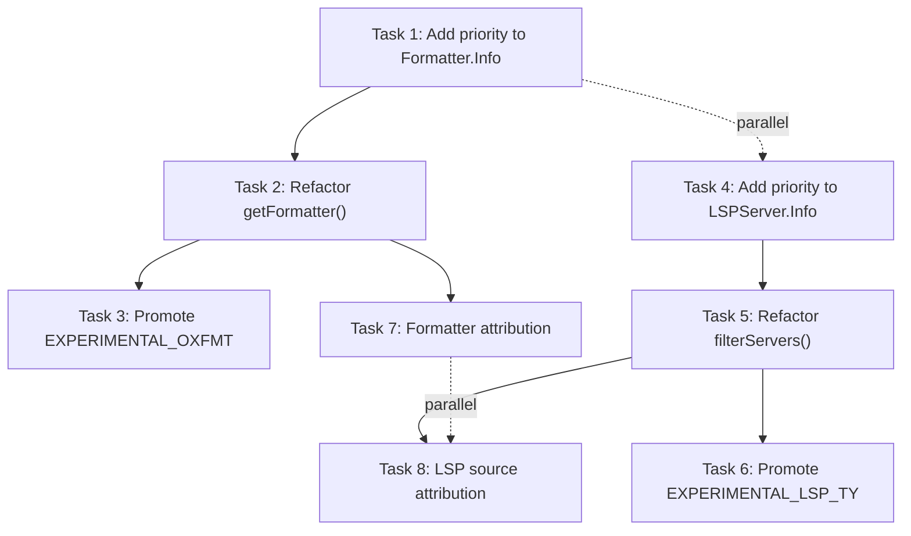

# Phase 1b: Formatter & LSP Mutex-per-Extension Refactor

> **Status:** Not Started
> **Risk:** Medium
> **Depends on:** Phase 1 (Flag Cleanup) ✅ COMPLETED
> **Blocks:** `EXPERIMENTAL_OXFMT` promotion, `EXPERIMENTAL_LSP_TY` promotion
> **Verification:** `bun typecheck` + `bun lint:fix` after each task. Scoped tests per task.

---

## Problem Statement

The current formatter system runs **ALL** matching formatters for a given file extension. If both `oxfmt` and `prettier` support `.ts`, both run sequentially on the same file — causing conflicts, wasted cycles, and non-deterministic output.

**Evidence in code:**

```ts
// format/index.ts:76-87 — getFormatter() returns Info[] (multiple formatters)
async function getFormatter(ext: string) {
  const formatters = await state().then((x) => x.formatters)
  const result = []
  for (const item of Object.values(formatters)) {
    if (!item.extensions.includes(ext)) continue
    if (!(await isEnabled(item))) continue
    result.push(item)          // ← accumulates ALL matches
  }
  return result                // ← returns array, not single winner
}

// format/index.ts:110 — init() iterates and runs ALL formatters
for (const item of await getFormatter(ext)) {   // ← runs each one
  const proc = Process.spawn(...)
}
```

The LSP system avoids this via a crude flag-based global exclusion (`filterServers()`), but this is not per-extension and doesn't generalize:

```ts
// lsp/index.ts:79-100 — filterServers() uses flag swap, not priority
const filterServers = (servers: Record<string, LSPServer.Info>) => {
  if (Flag.LITEAI_EXPERIMENTAL_LSP_TY) {
    delete servers.pyright        // ← global exclusion, not per-extension
  } else {
    delete servers.ty
  }
  if (servers.biome) {
    delete servers.eslint         // ← hardcoded preference
    delete servers.oxlint
  }
}
```

---

## Goal

Both formatters and LSP servers must use a **priority-based, per-extension mutex** selection model. For each file extension, only the highest-priority tool runs.

---

## Design: Priority-Based Mutex Selection

### Priority Model

Lower numeric value = higher priority. This follows UNIX convention (nice values, process priorities).

**Formatter priority tiers:**

| Priority | Tier | Examples | Rationale |
|----------|------|----------|-----------|
| 10 | Language-native | `gofmt`, `rustfmt`, `zig fmt`, `dart format` | Built into the language toolchain, canonical |
| 20 | Ecosystem-specialist (Rust-based) | `oxfmt`, `biome`, `ruff` | Fast, opinionated, project-specific |
| 30 | Ecosystem-specialist (other) | `ktlint`, `mix format`, `rubocop` | Project-specific but slower |
| 40 | General-purpose | `prettier` | Broad coverage, slower, last resort |
| 50 | Fallback | `uv format` (defers to ruff if present) | Explicitly lower priority |

**LSP priority tiers:**

| Priority | Tier | Examples | Rationale |
|----------|------|----------|-----------|
| 10 | Rust-based specialist | `ty`, `biome` | Fastest, newest generation |
| 20 | Established specialist | `pyright`, `rust-analyzer`, `gopls` | Mature, full-featured |
| 30 | General-purpose linter | `eslint`, `oxlint` | Supplementary, overlapping coverage |

### Conflict Matrix

Extensions with multiple formatter/LSP candidates (the only cases where priority matters):

| Extension | Formatter candidates | Winner (default) |
|-----------|---------------------|-------------------|
| `.ts`, `.tsx`, `.js`, `.jsx`, `.mjs`, `.cjs`, `.mts`, `.cts` | `oxfmt` (20), `biome` (20), `prettier` (40) | `oxfmt` or `biome` (tie → first enabled) |
| `.html`, `.css`, `.scss`, `.sass`, `.less`, `.vue`, `.svelte` | `biome` (20), `prettier` (40) | `biome` |
| `.json`, `.jsonc`, `.yaml`, `.yml`, `.toml`, `.xml`, `.md`, `.mdx`, `.graphql`, `.gql` | `biome` (20), `prettier` (40) | `biome` |
| `.py`, `.pyi` | `ruff` (20), `uv format` (50) | `ruff` |
| `.rb`, `.rake`, `.gemspec`, `.ru` | `rubocop` (30), `standardrb` (30) | Tie → first enabled |

| Extension | LSP candidates | Winner (default) |
|-----------|---------------|-------------------|
| `.py`, `.pyi` | `ty` (10), `pyright` (20) | `ty` |
| `.ts`, `.tsx`, `.js`, `.jsx` (linting) | `biome` (10), `eslint` (30), `oxlint` (30) | `biome` |

### Config Override

Users override priority via existing config `disabled` flag (no new schema needed):

```json
{
  "formatter": {
    "oxfmt": { "disabled": true }
  },
  "lsp": {
    "ty": { "disabled": true }
  }
}
```

This is sufficient — disabling the higher-priority tool automatically promotes the next one. Adding explicit priority override to config is deferred unless user feedback demands it.

---

## Implementation Tasks

### Task 1: Add `priority` field to `Formatter.Info` interface

**File:** [`format/formatter.ts`](../../../src/format/formatter.ts)

**Changes:**
1. Add `priority: number` to the `Info` interface (line 12-18)
2. Assign priority values to all 24 formatter definitions

**Priority assignments:**

| Formatter | Priority | Tier |
|-----------|----------|------|
| `gofmt` | 10 | Language-native |
| `mix` | 10 | Language-native |
| `zig` | 10 | Language-native |
| `dart` | 10 | Language-native |
| `rustfmt` | 10 | Language-native |
| `gleam` | 10 | Language-native |
| `terraform` | 10 | Language-native |
| `ocamlformat` | 10 | Language-native |
| `ormolu` | 10 | Language-native |
| `oxfmt` | 20 | Ecosystem-specialist (Rust) |
| `biome` | 20 | Ecosystem-specialist (Rust) |
| `ruff` | 20 | Ecosystem-specialist (Rust) |
| `shfmt` | 20 | Ecosystem-specialist |
| `nixfmt` | 20 | Ecosystem-specialist |
| `rlang` (air) | 20 | Ecosystem-specialist (Rust) |
| `clang` | 20 | Ecosystem-specialist |
| `ktlint` | 30 | Ecosystem-specialist (other) |
| `rubocop` | 30 | Ecosystem-specialist (other) |
| `standardrb` | 30 | Ecosystem-specialist (other) |
| `htmlbeautifier` | 30 | Ecosystem-specialist (other) |
| `pint` | 30 | Ecosystem-specialist (other) |
| `cljfmt` | 30 | Ecosystem-specialist (other) |
| `dfmt` | 30 | Ecosystem-specialist (other) |
| `latexindent` | 30 | Ecosystem-specialist |
| `prettier` | 40 | General-purpose |
| `uvformat` | 50 | Fallback |

---

### Task 2: Refactor `getFormatter()` to return single winner per extension

**File:** [`format/index.ts`](../../../src/format/index.ts)

**Current signature:** `async function getFormatter(ext: string): Promise<Info[]>`
**New signature:** `async function getFormatter(ext: string): Promise<Info | undefined>`

**Algorithm:**
1. Collect all formatters whose `extensions` array includes `ext`
2. Filter to only those whose `enabled()` returns `true`
3. Sort by `priority` (ascending — lower number wins)
4. Return the first one (or `undefined` if none match)

**Caller update** (line 110):
```ts
// Before:
for (const item of await getFormatter(ext)) { ... }

// After:
const item = await getFormatter(ext)
if (!item) return
// run single formatter
```

**Return type for `status()`:** No change needed — `status()` still reports all formatters and their enabled state. Only the execution path changes.

---

### Task 3: Promote `EXPERIMENTAL_OXFMT` — remove flag gate

**Files:**
- [`format/formatter.ts:94`](../../../src/format/formatter.ts#L94) — Remove `if (!Flag.LITEAI_EXPERIMENTAL_OXFMT) return false`
- [`flag/flag.ts:56`](../../../src/flag/flag.ts#L56) — Remove `LITEAI_EXPERIMENTAL_OXFMT` definition

**Behavior change:** `oxfmt` now auto-detects via `package.json` dependency presence (same pattern as biome, prettier). The mutex ensures only the highest-priority formatter runs — no risk of double-formatting.

**Cleanup:** Remove `Flag` import from `formatter.ts` if no other flags are used there (currently only `EXPERIMENTAL_OXFMT` uses it).

---

### Task 4: Add `priority` field to `LSPServer.Info` interface

**File:** [`lsp/server/types.ts`](../../../src/lsp/server/types.ts)

**Changes:**
1. Add `priority?: number` to the `Info` interface (optional — defaults to 20 for backward compat with config-defined servers)
2. Also update the re-exported `LSPServer.Info` in [`lsp/server/index.ts`](../../../src/lsp/server/index.ts) (line 46-52) to match

**Priority assignments for built-in servers:**

| Server | Priority | Rationale |
|--------|----------|-----------|
| `ty` | 10 | Rust-based, fastest Python LSP |
| `biome` | 10 | Rust-based, fastest JS/TS linter |
| `pyright` | 20 | Established, full-featured |
| All others | 20 | Default tier (no conflicts) |
| `eslint` | 30 | Supplementary linter |
| `oxlint` | 30 | Supplementary linter |

Each server file (`ty.ts`, `biome.ts`, `pyright.ts`, `eslint.ts`, `oxlint.ts`) needs a `priority` field added to its export.

---

### Task 5: Refactor `filterServers()` → priority-based per-extension selection

**File:** [`lsp/index.ts`](../../../src/lsp/index.ts)

**Current behavior:** `filterServers()` (line 79-100) does global exclusion based on flags — deletes entire servers from the registry.

**New behavior:** Replace `filterServers()` with per-extension priority selection in `getClients()` (line 201-293).

**Algorithm change in `getClients()`:**

1. Collect all servers whose `extensions` array includes the target extension
2. Filter out broken servers  
3. **Sort by priority** (ascending — lower number wins)
4. **Return only clients from the highest-priority server** for this extension
5. If two servers have the same priority and same extension, first-registered wins

**Key change:** The server registry (`state.servers`) still contains ALL servers. Filtering happens at query time, not at init time. This allows different extensions to use different servers from the same registry (e.g., `biome` for `.ts` linting, `pyright` for `.py` types).

**Delete:** The `filterServers()` function entirely. Remove its call site at line 122.

---

### Task 6: Promote `EXPERIMENTAL_LSP_TY` — remove flag gate and double-gate

**Files:**
- [`lsp/server/ty.ts:21`](../../../src/lsp/server/ty.ts#L21) — Remove `if (!Flag.LITEAI_EXPERIMENTAL_LSP_TY) return undefined` guard in `spawn()`
- [`lsp/index.ts:80`](../../../src/lsp/index.ts#L80) — Already removed by Task 5 (filterServers deletion)
- [`flag/flag.ts:57`](../../../src/flag/flag.ts#L57) — Remove `LITEAI_EXPERIMENTAL_LSP_TY` definition

**Behavior change:** `ty` now auto-detects via binary availability (same pattern as all other LSP servers). Priority-based selection (Task 5) picks the winner — if both `ty` and `pyright` are available, `ty` wins (priority 10 vs 20). Users can disable `ty` via config to fall back to `pyright`.

**Cleanup:** Remove `Flag` import from `ty.ts`.

---

### Task 7: Add formatter attribution to tool results

**Files:**
- [`tool/write.ts`](../../../src/tool/write.ts) — Line 74: `let output = "Wrote file successfully."`
- [`tool/edit.ts`](../../../src/tool/edit.ts) — Line 148: `let output = "Edit applied successfully."`
- [`tool/apply_patch.ts`](../../../src/tool/apply_patch.ts) — Line 253: `let output = "Success. Updated the following files:..."`

**Design:**

The formatter runs inside `Bus.publish(File.Event.Edited)` (triggered at write/edit/apply_patch). Currently, the bus handler in `format/index.ts:init()` runs the formatter but returns nothing — success/failure is only logged.

**Required changes:**

1. **`format/index.ts`:** Modify the `Bus.subscribe(File.Event.Edited)` handler to return a structured result via a new export:
   - Add a module-scoped `lastFormatResult` map: `Map<string, { name: string; exitCode: number }>`
   - After formatting, store: `lastFormatResult.set(filepath, { name: item.name, exitCode: exit })`
   - Export a function: `getLastFormatResult(filepath: string): { name: string; exitCode: number } | undefined`

2. **Tool files:** After the `Bus.publish(File.Event.Edited)` call, query the format result:
   ```ts
   const formatResult = Format.getLastFormatResult(filepath)
   if (formatResult) {
     if (formatResult.exitCode === 0) {
       output += `\nFormatted by ${formatResult.name}.`
     } else {
       output += `\n${formatResult.name} failed (exit ${formatResult.exitCode}).`
     }
   }
   ```

**Alternative considered:** Making `Bus.publish` return handler results. Rejected — the bus is fire-and-forget by design. A side-channel (module-scoped map) is simpler and doesn't change bus semantics.

---

### Task 8: Add LSP source attribution to tool results

**Files:**
- [`tool/write.ts:86`](../../../src/tool/write.ts#L86) — `"LSP errors detected"`
- [`tool/edit.ts:158`](../../../src/tool/edit.ts#L158) — `"LSP errors detected"`
- [`tool/apply_patch.ts:267`](../../../src/tool/apply_patch.ts#L267) — `"LSP errors detected"`

**Design:**

The tools call `LSP.diagnostics()` which returns `Record<string, LSPClient.Diagnostic[]>`. Each `Diagnostic` comes from a specific LSP client, but the source is lost in aggregation.

**Required changes:**

1. **`LSPClient.Diagnostic` type:** Verify if it already has a `source` field. LSP protocol diagnostics include an optional `source` field (e.g., `"pyright"`, `"ty"`, `"biome"`). If the type doesn't expose it, add it.

2. **`LSP.diagnostics()` in `lsp/index.ts`:** Currently aggregates across all clients. After per-extension priority selection (Task 5), each extension only has ONE client, so the aggregation is cleaner. No merge conflicts.

3. **Tool output strings:** Change diagnostic tag to include source:
   ```
   Before: <diagnostics file="path">
   After:  <diagnostics file="path" source="ty">
   ```

   If source varies across diagnostics for the same file (e.g., type checker + linter), use the source from each diagnostic's `.source` field.

4. **Output text:** Change `"LSP errors detected"` → `"LSP errors detected by 'ty'"` when a single source, or keep generic when mixed.

---

## Dependency Graph



**Execution order:**
1. Tasks 1 & 4 (parallel — independent interfaces)
2. Tasks 2 & 5 (parallel — independent modules)  
3. Tasks 3 & 6 (parallel — flag removal)
4. Tasks 7 & 8 (parallel — attribution)

---

## Verification Plan

### Automated Tests

```bash
# After Tasks 1-3 (formatter refactor):
bun test test/format          # ← needs test creation (no test/format/ exists yet)

# After Tasks 4-6 (LSP refactor):
bun test test/lsp             # ← existing tests: client.test.ts, lsp-handler-integration.test.ts, lsp-handler.test.ts

# After all tasks:
bun typecheck                 # ← full type verification
bun lint:fix                  # ← formatting compliance
```

### Test Cases to Create/Update

**Formatter tests (`test/format/`):**
- Single formatter per extension — verify only one runs
- Priority ordering — verify `oxfmt` (20) beats `prettier` (40) for `.ts`
- Config `disabled: true` — verify fallback to next priority
- No formatter available — verify graceful `undefined` return
- Non-conflicting extensions (`.go`, `.py`) — verify single match without priority logic

**LSP tests (`test/lsp/`):**
- Update existing tests to remove `LITEAI_EXPERIMENTAL_LSP_TY` flag usage
- Per-extension priority — verify `ty` (10) beats `pyright` (20) for `.py`
- Config `disabled: true` — verify fallback
- Multiple extensions same server — verify no regression

### Manual Verification
- Run in a project with both `oxfmt` and `prettier` as dependencies → verify only `oxfmt` runs
- Set `LITEAI_EXPERIMENTAL_OXFMT` → verify it no longer has any effect (flag removed)
- Set `LITEAI_EXPERIMENTAL_LSP_TY` → verify it no longer has any effect (flag removed)
- Check tool output includes `"Formatted by oxfmt."` or `"LSP errors detected by 'ty'"`

---

## Risk Assessment

| Risk | Likelihood | Impact | Mitigation |
|------|-----------|--------|------------|
| Formatter priority wrong for a specific ecosystem | Medium | Low | Priority is configurable via `disabled: true`. Users can override |
| LSP server priority causes regression in diagnostics | Low | Medium | `pyright` remains available as fallback. Config override exists |
| `Bus.publish` timing issue with format result map | Low | Low | Map is written synchronously in the bus handler. Read happens after `await Bus.publish()` returns |
| Breaking for users who set `EXPERIMENTAL_OXFMT` or `EXPERIMENTAL_LSP_TY` env vars | High (expected) | Low | v-Next allows breaking changes. Document in migration guide |

---

## References

- [Main Plan — Phase 1b](./main-plan.md#phase-1b-formatter--lsp-mutex-per-extension-refactor-medium-risk)
- [Design Decisions — DR-1](../spec/deign-decisions.md#dr-1-formatter--lsp-feedback-via-tool-results-not-system-injected-messages)
- [Experimental Audit — §1](../spec/experimental-audit.md#1-environment-flags)
- [Env Flags Evaluation — §8, §9](../spec/env-flags-evaluation.md#8-promote-experimental_oxfmt)
