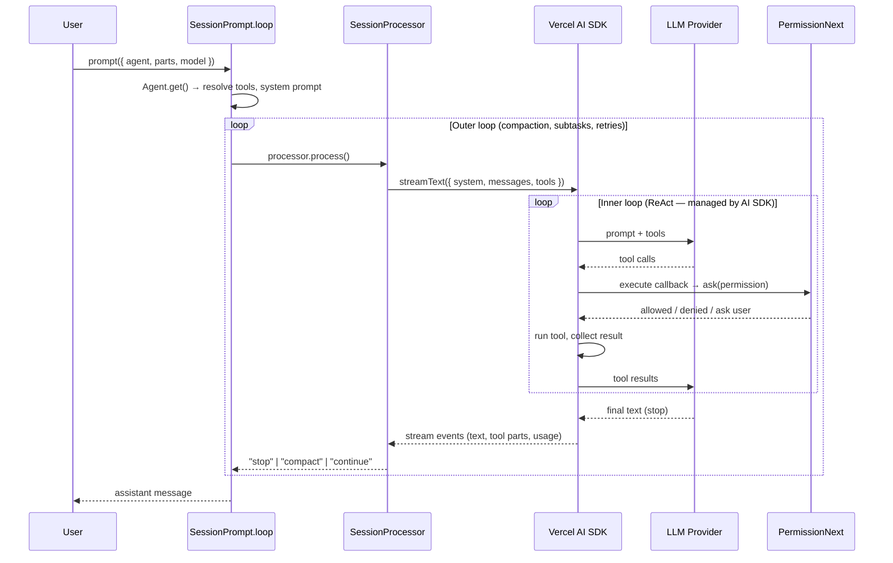

# LiteAI — Agent System (`src/agent/`)

The agent system defines **what the LLM is allowed to do** and **how it behaves**. Each agent is a bundle of a name, a system prompt, a permission ruleset, and optional model/temperature overrides. The session layer picks the active agent, resolves which tools are visible, builds the system prompt, and runs the LLM loop.

---

## File Layout

```
src/agent/
├── agent.ts            # Agent namespace — definitions, lookup, config merging, LLM-powered generation
├── generate.txt        # Prompt for generating new agent configs on the fly
└── prompt/
    ├── compaction.txt   # Summarises conversation for context compaction
    ├── explore.txt      # Read-only codebase exploration persona
    ├── summary.txt      # PR-style "what was done" summary
    └── title.txt        # Short conversation-title generator
```

---

## Core Concept — `Agent.Info`

Every agent is represented by a single `Agent.Info` object (defined in `agent.ts`):

| Field          | Type                               | Purpose |
|----------------|-------------------------------------|---------|
| `name`         | `string`                            | Unique identifier (e.g. `"build"`, `"explore"`) |
| `description`  | `string?`                           | User-facing usage hint shown in the `@` menu and task tool |
| `mode`         | `"primary" \| "subagent" \| "all"`  | Determines where the agent can appear (see [Modes](#modes)) |
| `native`       | `boolean?`                          | `true` for the 7 built-in agents |
| `hidden`       | `boolean?`                          | Exclude from autocomplete (e.g. `compaction`, `title`, `summary`) |
| `prompt`       | `string?`                           | Custom system prompt that **replaces** the provider-default prompt |
| `model`        | `{ providerID, modelID }?`          | Pin this agent to a specific model |
| `variant`      | `string?`                           | Default model variant |
| `temperature`  | `number?`                           | Override temperature |
| `topP`         | `number?`                           | Override top-p |
| `color`        | `string?`                           | Hex or theme colour for the TUI badge |
| `permission`   | `PermissionNext.Ruleset`            | Ordered list of allow/deny/ask rules |
| `options`      | `Record<string, any>`               | Extra pass-through provider options |
| `steps`        | `number?`                           | Max agentic iterations before forcing stop |

---

## Built-in vs User-Defined Agents — Same Loop, Same Shape

All agents — built-in and user-defined — are stored in a single `Record<string, Agent.Info>` and executed by the **same code path**. There is no separate loop or special handling for built-in agents.

**How it works in `agent.ts`:**

1. The 7 built-in agents are created as default entries in the record (lines 77–203) with `native: true`.
2. User config (`liteai.json`, markdown files in `.liteai/agents/`) is merged into the same record (lines 206–233). New keys create new agents with `native: false`; existing keys override fields of the built-in agent.
3. `Agent.get(name)` returns the same `Agent.Info` type regardless of origin.

**The common execution loop** is `SessionPrompt.loop()` in `session/prompt.ts` (line 276). It calls `Agent.get(lastUser.agent)` to fetch the agent — it does not check `native` or distinguish built-in from user-defined. The same `resolveTools()`, `LLM.stream()`, and permission checks run for every agent.

| | Built-in (e.g. `build`) | User-defined (e.g. `my-reviewer`) |
|---|---|---|
| Data shape | `Agent.Info` | `Agent.Info` |
| Where defined | Hardcoded defaults in `agent.ts` | Config / markdown merged at startup |
| `native` flag | `true` | `false` (cosmetic only) |
| Execution loop | `SessionPrompt.loop()` | **Same** `SessionPrompt.loop()` |
| Tool resolution | `resolveTools()` | **Same** `resolveTools()` |
| LLM call | `LLM.stream()` | **Same** `LLM.stream()` |

---

## Built-in Agents

Seven agents are hard-coded as defaults in `agent.ts`. Users can override any of them via config.

### Primary Agents (User-facing)

| Name       | Description | Key Permissions |
|------------|-------------|-----------------|
| **build**  | The default agent. Executes tools with configured permissions. | All tools allowed; `question` and `plan_enter` enabled |
| **plan**   | Plan mode. Disallows all edit tools. | Edits denied (`*.md` plan files excepted); `plan_exit` enabled |

Primary agents drive ordinary conversations. The user selects one via keyboard (`Tab` cycles) or the `@` menu.

### Subagents (Dispatched via Task Tool)

| Name        | Description | Notable Restrictions |
|-------------|-------------|---------------------|
| **general** | General-purpose agent for multi-step research and parallel work. | `todoread`/`todowrite` denied |
| **explore** | Fast read-only codebase explorer. | Only `grep`, `glob`, `list`, `bash`, `read`, web fetch/search, `codesearch` allowed; all other tools denied |

Subagents are spawned by the **Task tool** inside a child session. They inherit the caller's model unless they have their own `model` override.

### Hidden / Internal Agents

| Name           | Purpose | Special Behaviour |
|----------------|---------|-------------------|
| **compaction** | Summarises conversation when message history overflows the context window. | All tools denied; uses `compaction.txt` prompt |
| **title**      | Generates a ≤ 50-character conversation title. | All tools denied; `temperature: 0.5`; uses `title.txt` prompt |
| **summary**    | Writes a 2-3 sentence PR-style summary of the session. | All tools denied; uses `summary.txt` prompt |

Hidden agents never appear in the `@` menu and are called programmatically by the session layer.

---

## Modes

The `mode` field determines where an agent can appear:

| Mode        | Visible in `@` menu? | Available to Task tool? | Can be `default_agent`? |
|-------------|:--------------------:|:-----------------------:|:-----------------------:|
| `primary`   | ✅                   | ❌                       | ✅                       |
| `subagent`  | ✅ (unless `hidden`)  | ✅                       | ❌                       |
| `all`       | ✅                   | ✅                       | ✅                       |

- `primary` — top-level conversation agents (build, plan).
- `subagent` — spawned inside child sessions by the Task tool.
- `all` — can act as either; used for user-defined agents without a `mode` field.

---

## Permission System

Permissions are the mechanism that **constrains which tools an agent can call** and what files it can touch. The system lives in `src/permission/next.ts`.

### Rule Structure

```ts
{ permission: string; pattern: string; action: "allow" | "deny" | "ask" }
```

- `permission` — a tool name (e.g. `"bash"`, `"edit"`, `"task"`) or the wildcard `"*"`.
- `pattern` — a file glob (for `read`/`edit`/`external_directory`) or agent name (for `task`) or `"*"`.
- `action`:
  - `"allow"` — execute silently.
  - `"deny"` — throw `DeniedError`; the tool is removed from the tool list entirely.
  - `"ask"` — pause and prompt the user for one-time or permanent approval.

### Evaluation Order

Rules are stored as a flat array and evaluated **last-match-wins** using `PermissionNext.evaluate()`. The merge function (`PermissionNext.merge()`) simply concatenates arrays, so later rulesets take precedence.

The construction order for each built-in agent is:

```
defaults → agent-specific overrides → user config (from liteai.json / .liteai/)
```

### Default Permission Rules

All agents start with the same base (`defaults`):

- `"*": "allow"` — all tools allowed by default.
- `doom_loop: "ask"` — asks before repeating failing patterns.
- `external_directory: { "*": "ask" }` — asks before touching files outside the project.
- `question: "deny"` — disabled by default (only enabled in build/plan).
- `read: { "*.env": "ask", "*.env.*": "ask", "*.env.example": "allow" }` — guards `.env` files.

Each agent then applies its own overrides on top.

---

## Prompts

### Agent-Specific Prompts

When `agent.prompt` is set, it **replaces** the provider-default system prompt. Otherwise the session layer selects a provider-specific prompt from `src/session/prompt/` (one for Anthropic, OpenAI/GPT, Gemini, etc.).

| File                    | Used By       | Purpose |
|-------------------------|---------------|---------|
| `prompt/compaction.txt` | compaction    | Summarise the conversation for context compaction |
| `prompt/explore.txt`    | explore       | Read-only codebase navigation persona |
| `prompt/summary.txt`    | summary       | PR-description style session summary |
| `prompt/title.txt`      | title         | ≤ 50-char conversation title, strict format rules |
| `generate.txt`          | `Agent.generate()` | Instructs the LLM to generate a new agent config (identifier, whenToUse, systemPrompt) |

### System Prompt Assembly (in `session/system.ts` → `session/llm.ts`)

The full system prompt sent to the LLM is assembled as:

1. **Agent prompt** (if set) _or_ **provider-specific base prompt** (Anthropic, GPT, Gemini, etc.).
2. **Environment block** — working directory, platform, git status, date.
3. **Skills block** — lists available skills with descriptions.
4. **Instruction prompts** — any per-message instructions.
5. **User system prompt** — if the user attached a `system:` field.
6. **Plugin transforms** — plugins can mutate the system prompt array.

---

## Subagent Dispatch — The Task Tool (`src/tool/task.ts`)

The **Task tool** is how agents spawn subagents. When the primary agent (e.g. `build`) calls the Task tool:

1. **Permission check** — the caller's `task` permission determines which subagents it can invoke. The explore agent, for instance, has `task: "deny"` (can't spawn further subagents).
2. **Agent lookup** — `Agent.get(params.subagent_type)` resolves the target agent.
3. **Child session** — a new session is created with `parentID` pointing to the caller's session. Todo tools are denied by default in child sessions.
4. **Task resumption** — if `task_id` is provided, the existing child session is resumed instead of creating a new one.
5. **Prompt execution** — `SessionPrompt.prompt()` runs a full LLM loop inside the child session.
6. **Result** — the last text part of the subagent's response is wrapped in `<task_result>` tags and returned to the calling agent.

The `@` autocomplete invocation (e.g. `@explore find all API endpoints`) also flows through the Task tool but bypasses the permission check (`bypassAgentCheck`).

---

## Skills

Skills are reusable instruction sets (markdown files) that extend what agents can do.
They are listed in the system prompt and loaded on-demand via the `skill` tool.

See [skills.md](file:///docs/skills.md) for full documentation on creating and
configuring skills.

### How Skills Relate to Agents

- **System prompt**: when available, skill names and descriptions are included in the
  system prompt so the LLM knows they exist.
- **Permission filtering**: the `skill` permission key controls which skills an agent
  can load. If `skill: deny`, the entire skills block is hidden from the system prompt.
  Pattern-based rules (e.g. `skill: { "deploy": allow, "*": deny }`) restrict to
  specific skills.
- **Skill tool**: the LLM calls `skill({ name: "..." })` to load the full instructions.
  The loaded content is returned as tool output, not injected into the system prompt.

---

## Configuration

Agents can be customised in three ways:

### 1. `liteai.json` — `agent` field

```jsonc
{
  "agent": {
    "build": {
      "model": "anthropic/claude-sonnet-4-20250514",
      "temperature": 0.3,
      "permission": { "bash": "ask" }
    },
    "my-reviewer": {
      "description": "Code review specialist",
      "mode": "subagent",
      "prompt": "You are an expert code reviewer..."
    }
  }
}
```

Key config options per agent:

| Field          | Type | Notes |
|----------------|------|-------|
| `model`        | `"provider/model"` | Pin to a specific model |
| `variant`      | `string` | Default model variant |
| `temperature`  | `number` | Override |
| `top_p`        | `number` | Override |
| `prompt`       | `string` | Custom system prompt |
| `description`  | `string` | When-to-use hint |
| `mode`         | `"primary" \| "subagent" \| "all"` | Where it appears |
| `hidden`       | `boolean` | Hide from `@` menu |
| `color`        | `"#hex"` or theme name | TUI badge colour |
| `steps`        | `number` | Max agentic iterations |
| `disable`      | `boolean` | Remove built-in agent entirely |
| `permission`   | `Permission` | Rule overrides |
| `options`      | `object` | Pass-through provider options |

Unknown keys are automatically folded into `options`.

### 2. Markdown Agent Files

Place `.md` files in `.liteai/agents/` (or `agents/`) with YAML frontmatter.
The filename (minus extension) becomes the agent name. The markdown body becomes the
system prompt.

```markdown
---
description: CI/CD specialist that deploys and tests but cannot edit source code
mode: subagent
model: anthropic/claude-sonnet-4-20250514
permission:
  # Start by denying all tools
  "*": deny
  # Allow read-only exploration
  read: allow
  grep: allow
  glob: allow
  list: allow
  # Allow shell, but only specific commands
  bash:
    "npm test*": allow
    "npm run build*": allow
    "docker *": allow
    "kubectl *": allow
    "*": deny
  # Allow only the deploy skill
  skill:
    "deploy": allow
    "*": deny
  # Allow reading Kubernetes manifests outside the project
  external_directory:
    "/etc/kubernetes/*": allow
    "*": deny
---
You are a CI/CD specialist. You can run tests, build, and deploy
but you cannot edit source code. Use the `deploy` skill when asked
to deploy the application.
```

### 3. LLM-Generated Agents — `Agent.generate()`

The `Agent.generate()` function sends the user's description to the LLM along with `generate.txt` and returns a structured `{ identifier, whenToUse, systemPrompt }` object. This powers the "create agent" UI flow.

---

## The Execution Loop — A Plain ReAct Pattern

LiteAI's agent loop is a straightforward **ReAct** (Reason → Act → Observe) loop — there is no graph, no state machine, and no orchestration framework. The architecture is two nested loops, one provided by the Vercel AI SDK and one by LiteAI itself.

### Two-Level Loop Architecture

```
┌─────────────────────────────────────────────────────────────┐
│  OUTER LOOP — SessionPrompt.loop()  (session/prompt.ts:276) │
│  while (true) {                                             │
│    • reload message history                                 │
│    • handle pending subtasks / compactions                  │
│    • resolve agent, tools, system prompt                    │
│                                                             │
│    ┌─────────────────────────────────────────────────────┐  │
│    │  INNER LOOP — Vercel AI SDK  (streamText)           │  │
│    │  The SDK calls the LLM, which returns either:       │  │
│    │    • text  → stream it to the UI                    │  │
│    │    • tool calls → execute them, feed results back   │  │
│    │  This repeats until the model emits a stop reason.  │  │
│    │  Each tool-call→result round-trip is one "step".    │  │
│    └─────────────────────────────────────────────────────┘  │
│                                                             │
│    • if model stopped → break                               │
│    • if context overflowed → trigger compaction, continue   │
│    • if steps limit hit → inject MAX_STEPS warning, break   │
│  }                                                          │
└─────────────────────────────────────────────────────────────┘
```

**Inner loop** (`processor.process()` in `session/processor.ts`): Calls `LLM.stream()` which wraps the Vercel AI SDK's `streamText()`. The SDK itself implements the multi-step ReAct loop — it sends the prompt + tools to the LLM, the model responds with tool calls, the SDK executes them (via the `execute` callbacks registered in `resolveTools()`), feeds the results back to the model, and repeats until the model returns a `stop` finish reason. LiteAI's processor consumes the stream events (text deltas, tool calls, tool results, reasoning, etc.) and persists them as message parts.

**Outer loop** (`SessionPrompt.loop()` in `session/prompt.ts`): Wraps the inner loop to handle concerns the AI SDK doesn't cover:
- **Context compaction**: if the model's token usage approaches the context limit, the outer loop triggers a compaction (summarises history with the `compaction` agent) and re-enters.
- **Subtask resumption**: if a pending subtask or command is queued, the outer loop dispatches it before re-entering the inner loop.
- **Error recovery & retries**: retryable errors (rate limits, transient failures) are caught and retried with exponential backoff.
- **Permission blocking**: if the user rejects a tool permission, the loop can stop or continue based on config.

### Streaming & Reasoning/Thinking

The processor in `session/processor.ts` consumes the Vercel AI SDK's `fullStream` — a stream of typed events — and persists each event as a `Message.Part` in real time. This is what powers the live-updating TUI and web UI.

| Stream Event | What the Processor Does |
|---|---|
| `reasoning-start` / `reasoning-delta` / `reasoning-end` | Creates a **reasoning part** and streams thinking tokens to the UI as deltas. Models that support extended thinking (Claude, o1/o3, Gemini thinking) emit these. The full reasoning text is persisted with timestamps. |
| `text-start` / `text-delta` / `text-end` | Creates a **text part** and streams the model's visible response word by word. Plugin hooks (`experimental.text.complete`) can transform the final text. |
| `tool-input-start` / `tool-call` / `tool-result` / `tool-error` | Tracks the full tool lifecycle as a **tool part**: pending → running → completed/error. Each state transition is persisted and broadcast. |
| `start-step` / `finish-step` | Marks step boundaries. On `start-step`, a git snapshot is taken. On `finish-step`, a diff patch is computed and stored, and token usage is recorded. |

Everything streams — the user sees reasoning tokens appear in real time (if the model supports it), followed by text or tool calls, all before the model finishes its response.

### What Happens in a Single Step

Each iteration of the inner loop follows this sequence:

1. **Reason** — The LLM receives the full message history + system prompt + available tools and generates a response.
2. **Act** — If the response contains tool calls, each tool's `execute` function runs. Before execution, `PermissionNext.ask()` checks whether the agent is allowed to use that tool with those arguments.
3. **Observe** — Tool results are fed back into the model as `tool-result` messages.
4. **Repeat** — The model sees the tool results and either calls more tools or produces a final text response.

This is a textbook ReAct loop. The model itself decides when to stop — LiteAI doesn't impose any routing logic, conditional branching, or graph transitions.

### Why Not LangGraph?

LiteAI's use case — a coding agent that reasons, calls tools, and loops — maps directly to a single ReAct loop. This is the simplest possible agent architecture, and frameworks like LangGraph are designed for fundamentally different problems:

| Concern | LiteAI's Approach | When you'd need LangGraph |
|---|---|---|
| **Routing** | The LLM decides which tool to call; no explicit routing logic | Multiple specialised nodes with conditional edges (e.g. "if sentiment is negative, route to escalation node") |
| **Multi-agent orchestration** | Flat subagent dispatch via the Task tool — each subagent runs its own independent ReAct loop in a child session | Complex agent topologies: supervisor → worker graphs, debate loops, hierarchical delegation with shared state |
| **State management** | Message history in SQLite, replayed on each iteration | Custom state channels, reducers, and cross-node data flow |
| **Control flow** | `while (true)` + the model's stop signal | Explicit graph edges: cycles, fan-out/fan-in, map-reduce, human-in-the-loop checkpoints |
| **Persistence / resumption** | Session table + abort/resume signals | Built-in checkpointing with graph-level snapshot and replay |

In short: LiteAI's agent system is a **single-agent ReAct loop with declarative tool permissions**, not a multi-agent graph. The only "orchestration" is subagent dispatch, which is just a recursive ReAct call in a child session. This keeps the code simple (~300 lines for the loop + ~430 lines for the processor) and easy to reason about.

### Sequence Diagram


