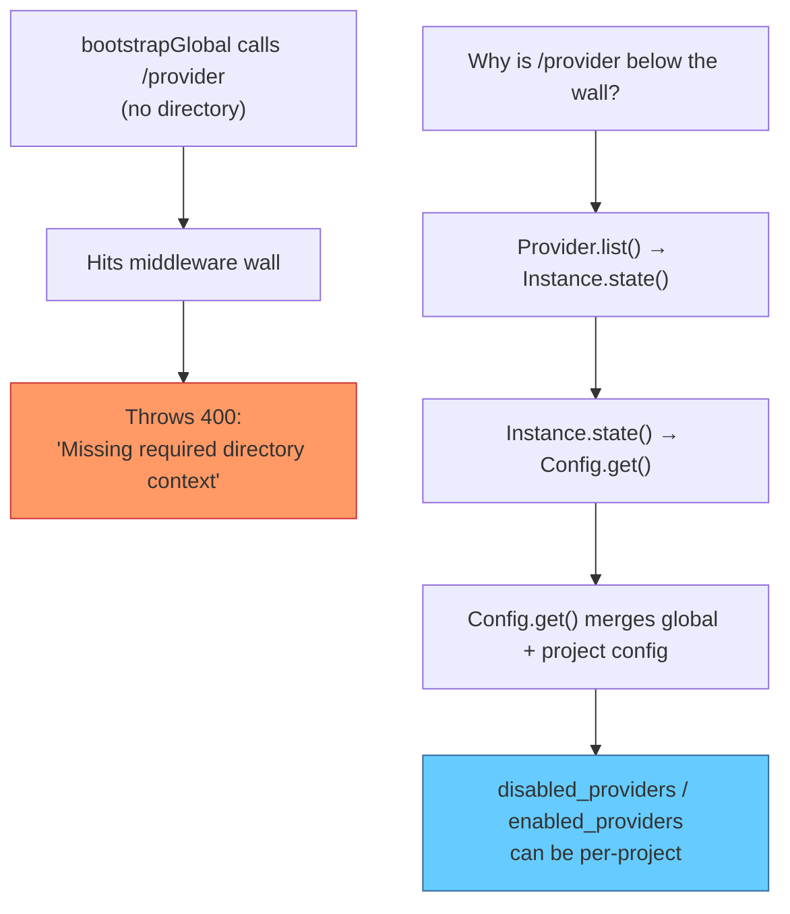

# Server Architecture Analysis

## Core Problem

The server has a **binary middleware wall** — everything is either "no directory" or "directory required". This doesn't match reality. There are actually **three scopes** of data:

| Scope | Examples | Directory Needed? |
|-------|----------|:--:|
| **Global** | Health, auth credentials, project list, provider auth methods | ❌ |
| **Scope-adaptive** | Provider list (global view + per-project filtering) | Optional |
| **Instance-bound** | Sessions, PTY, MCP, LSP, files, VCS, commands | ✅ |

The current wall forces scope-adaptive data into one zone, causing the provider 400 errors.

## Root Cause Chain



The problem isn't that provider "needs" instance context, it's that **`provider/state.ts` conflates global provider discovery with per-project config filtering** inside a single `Instance.state()` call.

## `Instance.state()` — The Coupling Bottleneck

> [!IMPORTANT]
> **20 modules** use `Instance.state()`. It's the only state management primitive in the system.

`Instance.state(init)` creates a per-directory lazy singleton. The `init` function runs inside `AsyncLocalStorage` context so it can read `Instance.directory`. There is no equivalent for global state that participates in the same lifecycle.

**Consumers of `Instance.state()`:**

| Module | Truly needs project scope? |
|--------|:---:|
| `config/loader.ts` | ✅ Reads project config files |
| `provider/state.ts` | ⚠️ **Mixed** — discovery is global, filtering is per-project |
| `agent/agent.ts` | ✅ Reads project agent configs |
| `skill/skill.ts` | ✅ Project-scoped skills |
| `session/*` | ✅ Sessions are per-project |
| `command/index.ts` | ✅ Project commands |
| `bus/index.ts` | ✅ Per-project event bus |
| `mcp/`, `lsp/`, `format/` | ✅ Per-project services |
| `file/*`, `pty/` | ✅ Per-project filesystem |
| `env/index.ts` | ⚠️ Env vars are process-global but cached per-directory |
| `plugin/index.ts` | ✅ Plugin state per project |

Provider is the **only module** where the scope mismatch causes a real problem today. But the design makes it impossible to add any future "scope-adaptive" API without hitting the same wall.

## Provider State — The Mixed Concern

[provider/state.ts](file:///c:/Users/aghassan/Documents/workspace/liteai/packages/liteai/src/provider/state.ts#L496-L563) does all of this in ONE `Instance.state()`:

```diff
  Instance.state(async () => {
+   // GLOBAL — same for all projects
    const config = await Config.get()         // ← this forces Instance context
    const modelsDev = await ModelsDev.get()
    const database = mapValues(modelsDev, fromModelsDevProvider)
    registerCopilotEnterprise(database)
    registerCodeAssist(database)
    registerAi4all(database)
    mergeConfigModels(database, ...)
    await loadEnvAuth(database, ...)
    await loadPlugins(database, ...)
    await loadCustom(database, ...)

+   // PER-PROJECT — only this part needs project config
    for (const [id, provider] of configProviders) {
      merge(providerID, partial)
    }
    filterProviders(providers, config, allowed)  // uses disabled_providers, enabled_providers
  })
```

80% of the work is global — it loads the ModelsDev catalog, discovers auth credentials, loads plugin providers. Only the final filtering step uses per-project config.

## Proposed Backend Refactoring

### Change 1: Optional Context Middleware + Guard Pattern

Replace the single "throw if no directory" middleware with two separate concerns:

```diff
  // BEFORE: one middleware that throws
- .use(async (c, next) => {
-   const raw = c.req.query("directory") || c.req.header("x-liteai-directory")
-   if (!raw) {
-     throw new HTTPException(400, { message: "Missing required directory context" })
-   }
-   // ... set up Instance.provide
- })
- .route("/provider", ProviderRoutes())  // trapped behind the wall
- .route("/config", ConfigRoutes())

  // AFTER: optional setup + explicit guard
+ .use(async (c, next) => {
+   // Set up Instance context if directory is provided, no-op otherwise
+   const raw = c.req.query("directory") || c.req.header("x-liteai-directory")
+   if (!raw) return next()
+   const directory = Filesystem.resolve(decodeURIComponent(raw))
+   return WorkspaceContext.provide({
+     workspaceID: ...,
+     fn: () => Instance.provide({ directory, init: InstanceBootstrap, fn: next })
+   })
+ })
+ .route("/provider", ProviderRoutes())   // works with or without directory
+ .use(requireInstance())                  // guard: throws 400 if no directory
+ .route("/config", ConfigRoutes())        // protected by guard
+ .route("/session", SessionRoutes())      // protected by guard
```

The `requireInstance()` guard:

```typescript
function requireInstance() {
  return async (c: HonoContext, next: Next) => {
    const raw = c.req.query("directory") || c.req.header("x-liteai-directory")
    if (!raw) {
      throw new HTTPException(400, {
        message: "Missing required directory context: set the 'directory' query parameter or 'x-liteai-directory' header",
      })
    }
    return next()
  }
}
```

### Change 2: Split Provider State into Global + Scoped

```typescript
// provider/state.ts

// Extract the core logic — takes config as parameter
export async function resolveProviders(config: Config.Info) {
  const modelsDev = await ModelsDev.get()
  const database = mapValues(modelsDev, fromModelsDevProvider)
  // ... all the existing discovery + filtering logic
  // ... but using the passed-in config instead of Config.get()
  return { providers, models, sdk, modelLoaders, varsLoaders }
}

// Global version — no Instance needed
const _globalState = lazy(async () => {
  const config = await Config.getGlobal()
  return resolveProviders(config)
})

export function globalState() {
  return _globalState()
}

// Instance-scoped version — merges project config
export const state = Instance.state(async () => {
  const config = await Config.get()
  return resolveProviders(config)
})
```

### Change 3: Update Provider Namespace

```typescript
// provider/provider.ts
export namespace Provider {
  // Existing — uses Instance context
  export async function list() {
    return state().then((s) => s.providers)
  }

  // New — global fallback, no Instance needed
  export async function globalList() {
    return globalState().then((s) => s.providers)
  }
}
```

### Change 4: Adapt Provider Routes

```typescript
// routes/provider.ts

import { Instance } from "../../project/instance"

.get("/", async (c) => {
  const hasInstance = !!(c.req.query("directory") || c.req.header("x-liteai-directory"))

  // Use project-scoped if directory available, global otherwise
  const config = hasInstance ? await Config.get() : await Config.getGlobal()
  const disabled = new Set(config.disabled_providers ?? [])
  const enabled = config.enabled_providers ? new Set(config.enabled_providers) : undefined

  const allProviders = await ModelsDev.get()
  // ... rest of existing logic using the resolved config
})
```

Or more simply, using the split state:

```typescript
.get("/", async (c) => {
  const hasInstance = !!(c.req.query("directory") || c.req.header("x-liteai-directory"))
  const providers = hasInstance
    ? await Provider.list()        // project-scoped
    : await Provider.globalList()  // global config only

  const connected = Object.keys(providers)
    .filter(id => providers[id].source !== "custom" || providers[id].key)
  
  return c.json({
    all: Object.values(providers),
    default: mapValues(providers, (item) => Provider.sort(Object.values(item.models))[0]?.id),
    connected,
  })
})
```

## Route Layout After Refactoring

```
server.ts route registration order:
│
├─ Zone 1: Global (no directory needed)
│   ├─ /global/*         — health, events, global config, dispose, browse, logs
│   ├─ PUT /auth/:id     — set auth credentials
│   ├─ DELETE /auth/:id  — remove auth credentials
│   └─ GET /project      — list all projects
│
├─ [Optional Directory Middleware]
│   — Sets up Instance.provide() if directory header/query present
│   — No-op if absent (does NOT throw)
│
├─ Zone 2: Scope-adaptive (works with or without directory)
│   ├─ /provider         — list providers (global or project-filtered)
│   └─ /provider/auth    — auth methods (always global)
│
├─ [Required Directory Guard]
│   — Throws 400 if no directory was provided
│
└─ Zone 3: Instance-bound (directory required)
    ├─ /doc, /config, /project/current, /project/:id
    ├─ /session, /trace
    ├─ /pty, /mcp, /plugin, /tui
    ├─ /path, /vcs, /command, /agent, /skill
    ├─ /lsp, /formatter, /permission, /question
    ├─ /event (SSE), /log, /instance/dispose
    └─ /* (SPA fallback)
```

## Impact Summary

| File | Change |
|------|--------|
| [server.ts](file:///c:/Users/aghassan/Documents/workspace/liteai/packages/liteai/src/server/server.ts) | Split middleware into optional + guard; move `/provider` between them |
| [provider/state.ts](file:///c:/Users/aghassan/Documents/workspace/liteai/packages/liteai/src/provider/state.ts) | Extract `resolveProviders(config)`, add `globalState()` |
| [provider/provider.ts](file:///c:/Users/aghassan/Documents/workspace/liteai/packages/liteai/src/provider/provider.ts) | Add `globalList()` |
| [routes/provider.ts](file:///c:/Users/aghassan/Documents/workspace/liteai/packages/liteai/src/server/routes/provider.ts) | Adapt `GET /` to pick global vs scoped |

> [!NOTE]
> **No changes needed to**: Instance, Config, State, Context, Auth, any other route file, or any other domain module. The web app changes can happen separately.

## Future Considerations

- If more "scope-adaptive" endpoints appear in the future, they just go in Zone 2 with a similar pattern.
- `Config.getGlobal()` already exists and is cached — no performance concern.
- The `lazy()` cache for `globalState()` should be reset when global config changes (same as how `Config.global` is reset in `updateGlobal`).
- Eventually, `Instance.state()` could be complemented with a `Global.state()` primitive for truly global singletons with lifecycle management, but that's a larger refactor not needed right now.
