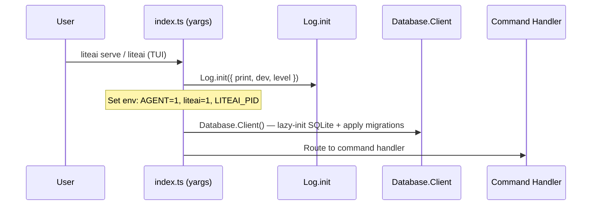
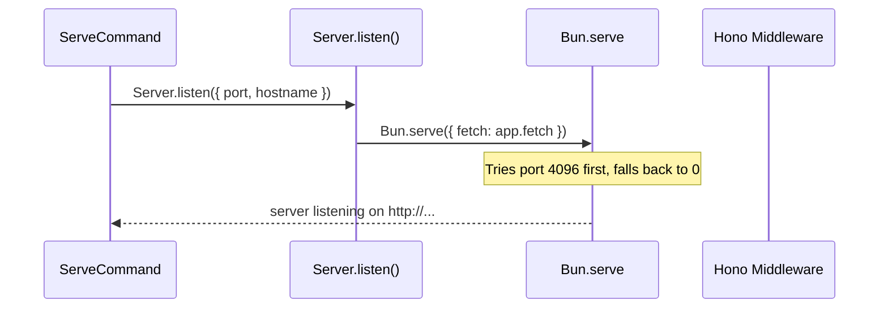
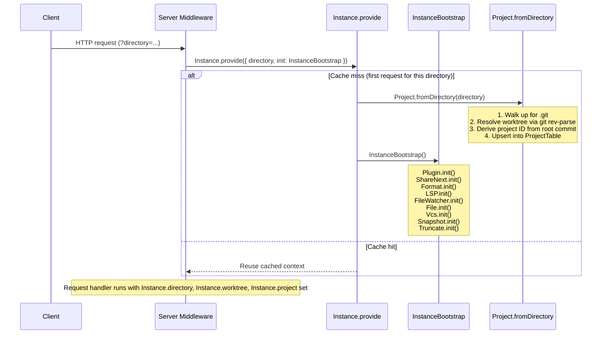
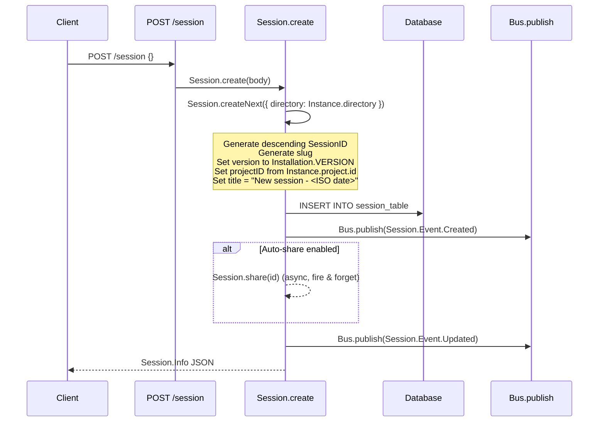

# LiteAI — Initialization & Runtime Flow

This document traces what happens inside the `liteai` package from process start through three key user interactions:
1. **Creating (detecting) a project**
2. **Creating a session**
3. **Sending a "Hi" message**

---

## Key Source Modules

| Module | Path | Responsibility |
|---|---|---|
| **CLI Entry** | `src/index.ts` | Yargs CLI parser, global middleware, process lifecycle |
| **Database** | `src/storage/db.ts` | SQLite via bun:sqlite + Drizzle ORM, WAL mode |
| **Global** | `src/global/` | Platform-aware paths (`~/.local/share/liteai`, etc.) |
| **Instance** | `src/project/instance.ts` | Per-directory context provider — caches project + worktree |
| **InstanceBootstrap** | `src/project/bootstrap.ts` | One-time subsystem init (Plugin, LSP, FileWatcher, etc.) |
| **Project** | `src/project/project.ts` | Git-based project detection, ID generation, DB persistence |
| **Config** | `src/config/config.ts` | Layered config loading (remote → global → project → `.liteai/`) |
| **Server** | `src/server/server.ts` | Hono HTTP/WS API, per-request Instance provisioning |
| **Session** | `src/session/index.ts` | Session CRUD, message/part storage, bus events |
| **Agent** | `src/agent/agent.ts` | Agent definitions (build, plan, explore, etc.) |
| **SessionPrompt** | `src/session/prompt.ts` | Prompt orchestration: user message → LLM loop → tool dispatch |
| **SessionProcessor** | `src/session/processor.ts` | Streams LLM response, routes tool calls, tracks snapshots |
| **LLM** | `src/session/llm.ts` | Vercel AI SDK `streamText` wrapper — model params, middleware |
| **Bus** | `src/bus/` | In-process event bus for SSE broadcasting |

---

## 1. Process Start → CLI Middleware



The **yargs middleware** runs before any command:

1. **`Log.init`** — configures structured logging (file + optional stderr).
2. **Environment markers** — sets `AGENT=1`, `liteai=1`, `LITEAI_PID`.
3. **Database** — initializes the SQLite database via `Database.Client()`.

### Database Initialization (`Database.Client`)

The singleton `Database.Client()` lazy-initializes on first access:

- Opens SQLite at `~/.local/share/liteai/liteai.db` (or channel-specific variant)
- Sets pragmas: **WAL mode**, `synchronous = NORMAL`, `busy_timeout = 5000`, `cache_size = -64000`, `foreign_keys = ON`
- Applies Drizzle ORM schema migrations (bundled SQL or from `migration/` directory)

---

## 2. Server Start & Instance Provisioning

When `liteai serve` or the TUI starts, the server binds via `Server.listen()`:



### Per-Request Instance Creation

Every incoming HTTP request passes through a Hono middleware that creates or reuses an **Instance** for the request's working directory:



**`Instance.provide()`** does three things:
1. Resolves the directory to an absolute path
2. Checks a `Map<string, Promise<Context>>` cache — creates if missing
3. Wraps the request handler in a `Context.provide()` so `Instance.directory`, `Instance.worktree`, and `Instance.project` are available synchronously anywhere in the call stack

---

## 3. Creating / Detecting a Project

**`Project.fromDirectory(directory)`** is the core project detection function:

```mermaid
flowchart TD
    A[fromDirectory(dir)] --> B{Find .git upward}
    B -->|Found| C[git rev-parse --git-common-dir]
    B -->|Not found| D[Return global project ID='/']
    C --> E{Cached ID in .git/liteai?}
    E -->|Yes| F[Use cached ID]
    E -->|No| G[git rev-list --max-parents=0 --all]
    G --> H[Use first root commit hash as ID]
    H --> I[Cache ID → .git/liteai]
    F --> J[git rev-parse --show-toplevel]
    I --> J
    J --> K[Upsert into ProjectTable]
    K --> L[Emit project.updated event]
    L --> M[Return {project, sandbox}]
```

Key details:
- **Project ID** is deterministic — derived from the first root commit hash of the git repo
- **Worktree** is the git common directory (`git rev-parse --git-common-dir`), supporting git worktrees
- **Sandbox** is the toplevel of the current worktree (`git rev-parse --show-toplevel`)
- **Global fallback** — non-git directories get `ProjectID.global` with worktree `/`

---

## 4. Creating a Session

### API Route

```
POST /session
Body: { parentID?, title?, permission?, workspaceID? }  (all optional)
```

### Flow



Key properties of each session:
- **`id`** — descending ULID (ensures newest sessions sort first by ID)
- **`slug`** — human-readable short identifier
- **`projectID`** — links to the detected project
- **`directory`** — the working directory at creation time
- **`version`** — liteai version that created the session

---

## 5. Sending a "Hi" Message

### API Route

```
POST /session/:sessionID/message
Body: { parts: [{ type: "text", text: "Hi" }], model?: {...}, agent?: "build" }
```

### Full Flow

```mermaid
sequenceDiagram
    participant Client
    participant Route as POST /session/:id/message
    participant Prompt as SessionPrompt.prompt
    participant Session as Session
    participant Loop as SessionPrompt.loop
    participant Agent as Agent.get
    participant Provider as Provider.getModel
    participant Processor as SessionProcessor
    participant LLM as LLM.stream
    participant Tool as ToolRegistry
    participant Bus as Bus

    Client->>Route: POST { parts: [{ type: "text", text: "Hi" }] }
    Route->>Prompt: SessionPrompt.prompt({ sessionID, parts })
    Prompt->>Session: SessionRevert.cleanup (clear any pending reverts)
    Prompt->>Session: createUserMessage (persist user message + parts)
    Prompt->>Session: Session.touch(sessionID)
    Prompt->>Loop: SessionPrompt.loop({ sessionID })
    Loop->>Loop: start(sessionID) — create AbortController
    Loop->>Session: Load message history via Message.stream
    Loop->>Loop: Find lastUser, lastAssistant
    Note over Loop: Step 1 → ensureTitle (async, fire & forget)
    Loop->>Agent: Agent.get("build")
    Loop->>Provider: Provider.getModel(providerID, modelID)
    Loop->>Loop: insertReminders (AGENTS.md, instructions, etc.)
    Loop->>Processor: SessionProcessor.create({ assistantMessage, model, abort })
    Loop->>Loop: resolveTools({ agent, session, model })
    Note over Loop: Builds Vercel AI SDK tool objects from ToolRegistry<br>Each tool wraps permission checking via PermissionNext.ask
    Loop->>Loop: Build system prompt (environment + skills + instructions)
    Loop->>Processor: processor.process({ messages, tools, model, system })
    Processor->>LLM: LLM.stream({ messages, tools, model, system, agent })
    LLM->>LLM: Provider.getLanguage (get AI SDK language model)
    LLM->>LLM: Build system messages, set temperature/topP
    LLM->>LLM: streamText({ model, messages, tools, ... })
    LLM-->>Processor: Async stream of events

    loop For each stream event
        alt text-start / text-delta / text-end
            Processor->>Session: updatePart (TextPart)
            Processor->>Bus: PartDelta events (real-time SSE)
        else tool-call
            Processor->>Session: updatePart ({ status: "running" })
            Note over Processor: Tool executes with permission checks
        else tool-result
            Processor->>Session: updatePart ({ status: "completed", output })
        else finish-step
            Processor->>Session: updatePart (StepFinish — tokens, cost)
            Processor->>Session: updateMessage (accumulate cost/tokens)
            Processor->>Session: Snapshot.patch → save file diffs
        end
    end

    Processor-->>Loop: "continue" | "stop" | "compact"
    alt "continue" (tool-calls finish reason)
        Loop->>Loop: Next iteration (LLM sees tool results, continues)
    else "stop" (model finished or error)
        Loop->>Loop: Break out of loop
    end
    Loop->>Session: Return final assistant WithParts
    Route-->>Client: Streamed JSON response
```

### Step-by-step breakdown

#### 5a. User Message Creation
`SessionPrompt.prompt()` persists the user's message by calling `createUserMessage()`:
- Creates a `Message.User` with ascending MessageID
- Stores the user's `parts` (text, files, agent references) as `Part` rows
- Resolves the model using `Provider.defaultModel()` or explicit `model` parameter
- Resolves the agent (defaults to `"build"`)

#### 5b. The Agentic Loop (`SessionPrompt.loop`)
The loop is the core agentic engine. It runs in a `while(true)` loop:

1. **Load messages** — streams all messages for the session (applying compaction filters)
2. **Find last user/assistant** — determines if the assistant has finished or needs to continue
3. **Title generation** (`ensureTitle`) — on step 1, fires an **async fire-and-forget LLM call** using the `"title"` agent with a small/cheap model (`Provider.getSmallModel`). This is a **separate LLM request** from the main conversation — it sends the user's first message and asks the model to generate a short title. Only runs if the session still has the default title and it's the first real user message.
4. **Summary / diff computation** (`SessionSummary.summarize`) — also fires on step 1, but this does **not** make an LLM call. It computes git-based file diffs using `Snapshot.diffFull()` and updates the session's summary metadata (additions, deletions, file count). This is purely a git diff computation.
5. **Resolve agent & model** — loads `Agent.Info` (build/plan/explore/custom) and `Provider.Model`
6. **Build tools** — `resolveTools()` loads from `ToolRegistry` (bash, read, edit, glob, grep, lsp, task, etc.) and wraps each with permission checking
7. **Build system prompt** — `SystemPrompt.environment()` + skills + instruction prompts
8. **Process** — `SessionProcessor.create()` + `processor.process()` streams the LLM response

> **Note:** On the first user message, **two concurrent actions** are triggered alongside the main LLM call: title generation (1 extra LLM request to a small model) and summary computation (git diff only, no LLM). This means the first message results in **2 total LLM requests** — one for the title and one for the actual conversation.

#### 5c. LLM Streaming (`LLM.stream`)
Wraps Vercel AI SDK's `streamText()`:
- Joins agent prompt + system prompt + user system prompt into system messages
- Applies provider-specific transforms (token limits, options, message formatting)
- Sends to the configured LLM provider via the AI SDK language model
- Returns an async iterable of stream events

#### 5d. Processing Stream Events (`SessionProcessor`)
Consumes the LLM stream event by event:
- **`text-start/delta/end`** — accumulates text parts, publishes real-time deltas via bus
- **`reasoning-start/delta/end`** — tracks reasoning tokens (for models that support it)
- **`tool-call`** — marks tool as "running", checks for doom loop (3 identical consecutive calls)
- **`tool-result`** — marks tool as "completed" with output
- **`tool-error`** — marks tool as "error", may block the loop if permission was rejected
- **`finish-step`** — records token usage/cost, creates snapshot diffs, triggers summarization
- **`error`** — handles retries (rate limits), context overflow (triggers compaction), or fatal errors

The processor returns one of:
- **`"continue"`** — tool calls were made, loop back for the LLM to see results and continue
- **`"stop"`** — model finished (said "stop"), an error occurred, or permission was rejected
- **`"compact"`** — context window overflow, needs compaction before continuing

#### 5e. Post-Loop Cleanup
After the loop exits:
- `SessionCompaction.prune()` — cleans up old compaction data
- Resolves any queued callers waiting on the same session
- Returns the final `Message.WithParts` (assistant message + all parts)

---

## Event System

Throughout all flows, the **Bus** publishes events that are broadcast to clients via SSE (`GET /event`):

| Event | When |
|---|---|
| `project.updated` | Project created or updated |
| `session.created` | New session created |
| `session.updated` | Session metadata changed |
| `session.deleted` | Session removed |
| `session.error` | Error during processing |
| `message.updated` | Message created/updated |
| `message.part.updated` | Part created/updated |
| `message.part.delta` | Streaming text delta |
| `message.part.removed` | Part deleted |
| `server.connected` | Client connects to SSE |
| `server.heartbeat` | Keep-alive every 10s |

This enables real-time UI updates — the web app and TUI subscribe to `GET /event` and reactively update as messages stream in.

---

## Config Loading Precedence

Config is loaded lazily on first access via `Config.state` (Instance-scoped):

```
Remote (.well-known/liteai)     ← lowest
  ↓
Global (~/.config/liteai/liteai.json)
  ↓
Custom (LITEAI_CONFIG env var)
  ↓
Project (liteai.json in project root)
  ↓
.liteai directories (agents/, commands/, plugins/)
  ↓
Inline (LITEAI_CONFIG_CONTENT env var)
  ↓
Account/Org config (from liteai.ai console)
  ↓
Managed config (/etc/liteai or ProgramData)  ← highest
```

Additionally, `.liteai/` directories are scanned for:
- **`agents/*.md`** — markdown agent definitions (frontmatter + prompt)
- **`commands/*.md`** — custom slash commands
- **`plugins/*.{ts,js}`** — local plugin files
