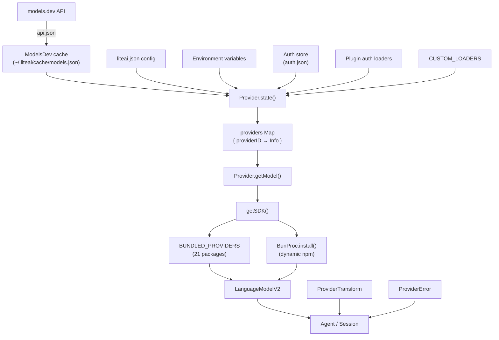
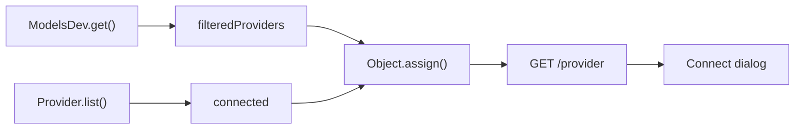

# Provider System — Deep Dive

The **provider** layer (`packages/liteai/src/provider/`) is the adapter that sits between the agent runtime and 20+ LLM APIs. It handles model discovery, credential management, SDK instantiation, message transformation, and error normalization so the rest of the codebase can work with a single `LanguageModelV2` interface.

---

## Directory Layout

| File | Responsibility |
|---|---|
| [`schema.ts`](file:///c:/Users/aghassan/Documents/workspace/liteai/packages/liteai/src/provider/schema.ts) | Branded `ProviderID` / `ModelID` types plus well-known constants |
| [`models.ts`](file:///c:/Users/aghassan/Documents/workspace/liteai/packages/liteai/src/provider/models.ts) | Fetching and caching upstream model catalog from **models.dev** |
| [`provider.ts`](file:///c:/Users/aghassan/Documents/workspace/liteai/packages/liteai/src/provider/provider.ts) | Core orchestrator — state initialization, credential loading, SDK factory, model resolution |
| [`auth.ts`](file:///c:/Users/aghassan/Documents/workspace/liteai/packages/liteai/src/provider/auth.ts) | OAuth / API-key flows backed by the plugin system |
| [`transform.ts`](file:///c:/Users/aghassan/Documents/workspace/liteai/packages/liteai/src/provider/transform.ts) | Per-provider message normalization, caching hints, reasoning variants, schema sanitization |
| [`error.ts`](file:///c:/Users/aghassan/Documents/workspace/liteai/packages/liteai/src/provider/error.ts) | Context-overflow detection and API error parsing |
| [`sdk/copilot/`](file:///c:/Users/aghassan/Documents/workspace/liteai/packages/liteai/src/provider/sdk/copilot) | Custom GitHub Copilot OpenAI-compatible SDK fork |

---

## Architecture Overview



---

## How Supported Models Are Detected

Model discovery happens during `Provider.state()` initialization and follows a **multi-phase merge** pipeline:

### Phase 1 — Upstream Catalog (`ModelsDev`)

The [`ModelsDev`](file:///c:/Users/aghassan/Documents/workspace/liteai/packages/liteai/src/provider/models.ts) namespace loads the canonical provider + model catalog:

1. **Cached file** — reads `~/.liteai/cache/models.json` (or `Flag.LITEAI_MODELS_PATH`).
2. **Bundled snapshot** — if the cache misses, tries importing a build-time `models-snapshot` module.
3. **Live fetch** — fetches `https://models.dev/api.json` as a last resort (unless `LITEAI_DISABLE_MODELS_FETCH` is set).

The file is **refreshed in the background** on startup and every 60 minutes. Each provider entry has an `id`, `name`, `env` array (environment variable names for the API key), an optional `npm` package, an `api` base URL, and a `models` map keyed by model ID.

Every upstream model is parsed with the `ModelsDev.Model` Zod schema which captures capabilities (reasoning, tool-call, attachments, modalities), cost tiers, context/output limits, release date, and optional headers/options.

### Phase 2 — Config Overlay

Providers defined in `liteai.json` under the `provider` key are merged on top of the upstream catalog. Config entries can:

- **Add new providers** not in models.dev (custom OpenAI-compatible endpoints).
- **Add new models** to an existing provider.
- **Override model properties** — cost, limits, capabilities, npm package, API URL, options/headers, variants.
- **Set an npm package** (`provider.npm`) that overrides the upstream default SDK.
- **Blacklist / whitelist** specific models.

### Phase 3 — Credential Detection

For each provider in the merged database, credentials are probed in order:

| Priority | Source | How it works |
|---|---|---|
| 1 | **Environment variables** | The provider's `env` array is scanned against `process.env`. The first match activates the provider with `source: "env"`. |
| 2 | **Auth store** | `Auth.all()` reads `~/.liteai/data/auth.json`. Entries with `type: "api"` supply an API key; `type: "oauth"` supply an access token. |
| 3 | **Plugin loaders** | Plugins that register an `auth.loader` hook (e.g. the GitHub Copilot plugin) can provide dynamic options. |

If a provider has *any* credential source, it becomes a **connected** provider.

### Phase 4 — Custom Loaders

The `CUSTOM_LOADERS` map contains provider-specific initialization logic for 18 providers (anthropic, openai, liteai, amazon-bedrock, azure, google-vertex, github-copilot, gitlab, cloudflare, etc.). Each loader:

- Returns `{ autoload: boolean }` — if `true`, the provider is activated even without explicit env/auth credentials (useful for providers that detect credentials through external means like AWS credential chains).
- Can supply `options` merged into the provider config.
- Can supply a custom `getModel` function for SDK-specific model creation (e.g. choosing between `sdk.chat()`, `sdk.responses()`, or `sdk.languageModel()`).
- Can supply a `vars` function for URL template interpolation (e.g. replacing `${AZURE_RESOURCE_NAME}` in base URLs).

### Phase 5 — Filtering

After merging, final filtering removes:

- Providers in `disabled_providers` or not in `enabled_providers` (if set).
- Models with `status: "deprecated"`.
- Models with `status: "alpha"` (unless `LITEAI_ENABLE_EXPERIMENTAL_MODELS` is set).
- Blacklisted models or models not in a whitelist.
- Providers whose model list becomes empty after filtering.

---

## Branded ID Types (`schema.ts`)

`ProviderID` and `ModelID` are Effect-branded strings with Zod compatibility. Well-known constants are pre-defined:

```ts
ProviderID.liteai      // "liteai"
ProviderID.anthropic      // "anthropic"
ProviderID.openai         // "openai"
ProviderID.google         // "google"
ProviderID.googleVertex   // "google-vertex"
ProviderID.githubCopilot  // "github-copilot"
ProviderID.amazonBedrock  // "amazon-bedrock"
ProviderID.azure          // "azure"
ProviderID.openrouter     // "openrouter"
ProviderID.mistral        // "mistral"
```

---

## SDK Instantiation (`getSDK`)

When the agent needs a `LanguageModelV2`, the path is:

```
Provider.getLanguage(model)
  → getSDK(model)
    → resolve options (baseURL, apiKey, headers, URL template vars)
    → check BUNDLED_PROVIDERS[model.api.npm]
       → if found: call factory directly
       → if not:  BunProc.install(npm, "latest") → dynamic import → find create* export
    → wrap fetch with SSE chunk timeout (default 120s)
    → cache SDK instance by hash(providerID + npm + options)
  → call modelLoader or sdk.languageModel(model.api.id)
  → cache LanguageModelV2 by "providerID/modelID"
```

### Bundled Providers

21 SDK packages are statically imported and mapped in `BUNDLED_PROVIDERS`:

| npm Package | Provider |
|---|---|
| `@ai-sdk/anthropic` | Anthropic |
| `@ai-sdk/openai` | OpenAI |
| `@ai-sdk/azure` | Azure OpenAI |
| `@ai-sdk/google` | Google Gemini |
| `@ai-sdk/google-vertex` | Vertex AI |
| `@ai-sdk/google-vertex/anthropic` | Vertex AI (Anthropic models) |
| `@ai-sdk/amazon-bedrock` | Amazon Bedrock |
| `@ai-sdk/xai` | xAI (Grok) |
| `@ai-sdk/mistral` | Mistral |
| `@ai-sdk/groq` | Groq |
| `@ai-sdk/deepinfra` | DeepInfra |
| `@ai-sdk/cerebras` | Cerebras |
| `@ai-sdk/cohere` | Cohere |
| `@ai-sdk/gateway` | Vercel AI Gateway |
| `@ai-sdk/togetherai` | Together AI |
| `@ai-sdk/perplexity` | Perplexity |
| `@ai-sdk/vercel` | Vercel |
| `@ai-sdk/openai-compatible` | Generic OpenAI-compatible |
| `@openrouter/ai-sdk-provider` | OpenRouter |
| `@gitlab/gitlab-ai-provider` | GitLab Duo |
| `@ai-sdk/github-copilot` | GitHub Copilot (custom fork) |

If a model references an npm package **not** in this list, the system dynamically installs it at runtime using `BunProc.install()` and imports its `create*` export.

---

## Custom Provider Loaders

Each entry in `CUSTOM_LOADERS` handles provider-specific initialization. Notable examples:

### `amazon-bedrock`
- Resolves credentials via the full AWS provider chain (profiles, access keys, bearer tokens, web identity, container creds).
- Handles cross-region inference prefixes (`us.`, `eu.`, `global.`, `jp.`, `apac.`, `au.`) based on the AWS region.
- Supports custom endpoints and region configuration.

### `google-vertex`
- Requires `GOOGLE_CLOUD_PROJECT` to autoload.
- Injects Google Application Default Credentials via a custom `fetch` wrapper.
- Handles location-based endpoint resolution.

### `github-copilot` / `github-copilot-enterprise`
- Selects between `sdk.chat()` and `sdk.responses()` APIs based on model ID (GPT-5+ uses Responses API).
- Enterprise variant inherits the same model list with a separate provider ID and auth.

### `liteai`
- If no API key is found, filters out paid models and uses `apiKey: "public"` for free-tier models.
- Autoloads when any models remain after filtering.

### `azure`
- Selects between `sdk.chat()` and `sdk.responses()` based on the `useCompletionUrls` option.
- Supports `AZURE_RESOURCE_NAME` for URL template interpolation.

### `gitlab`
- Uses `@gitlab/gitlab-ai-provider` with agentic chat mode.
- Supports instance URL override and custom AI gateway headers.
- Passes feature flags for `duo_agent_platform_agentic_chat`.

### `cloudflare-ai-gateway`
- Dynamically imports `ai-gateway-provider` package.
- Uses Unified API format (`provider/model`) for model IDs.
- Supports caching, logging, and metadata options.

---

## Message Transformation (`ProviderTransform`)

The [`ProviderTransform`](file:///c:/Users/aghassan/Documents/workspace/liteai/packages/liteai/src/provider/transform.ts) namespace adapts messages and options per-provider before they reach the SDK.

### `ProviderTransform.message()`
Pipeline: `unsupportedParts → normalizeMessages → applyCaching → remapProviderOptions`

| Step | What it does |
|---|---|
| **unsupportedParts** | Replaces file/image/audio attachments with error text if the model doesn't support that modality |
| **normalizeMessages** | *Anthropic*: strips empty text/reasoning parts. *Claude*: normalizes tool-call IDs to `[a-zA-Z0-9_-]`. *Mistral*: 9-char alphanumeric tool IDs, injects filler assistant messages between tool→user sequences. *Interleaved reasoning*: moves reasoning parts into `providerOptions.openaiCompatible.*` fields |
| **applyCaching** | Marks first 2 system messages and last 2 conversation messages with cache-control hints (ephemeral for Anthropic/OpenRouter/Copilot, cache-point for Bedrock) |
| **remapProviderOptions** | Re-keys `providerOptions` from the internal provider ID to the SDK-expected key (e.g. `"amazon-bedrock"` → `"bedrock"`) |

### `ProviderTransform.variants()`
Generates reasoning effort variants per provider/model:
- **OpenAI/Azure**: `none`, `minimal`, `low`, `medium`, `high`, `xhigh` via `reasoningEffort`
- **Anthropic**: `high`/`max` via thinking budget tokens, or `low`/`medium`/`high`/`max` for adaptive models
- **Google/Vertex**: `high`/`max` via `thinkingBudget` or `low`/`medium`/`high` via `thinkingLevel`
- **Bedrock**: `reasoningConfig` with effort levels or budget tokens
- **OpenRouter**: `reasoning.effort`
- **Copilot**: `reasoningEffort` + `reasoningSummary` + encrypted content

### `ProviderTransform.options()`
Sets default provider options per session:
- OpenAI: `store: false`, prompt cache key
- Google: `thinkingConfig.includeThoughts: true`
- OpenRouter: `usage.include: true`
- Gateway: `caching: "auto"`
- Various providers: per-model reasoning / thinking toggles

### `ProviderTransform.temperature()` / `topP()` / `topK()`
Returns model-family-specific sampling defaults (e.g. Qwen → temp 0.55, Gemini → temp 1.0, Claude → `undefined`).

### `ProviderTransform.schema()`
Sanitizes JSON schemas for Google/Gemini — converts integer enums to strings, strips invalid `properties`/`required` from non-object types, ensures array `items` always has a type.

---

## Error Handling (`ProviderError`)

[`ProviderError`](file:///c:/Users/aghassan/Documents/workspace/liteai/packages/liteai/src/provider/error.ts) parses raw API errors into two categories:

| Type | Description |
|---|---|
| `context_overflow` | Detected via 13+ regex patterns matching overflow error messages from different providers (Anthropic, Bedrock, OpenAI, Google, xAI, Groq, GitHub Copilot, llama.cpp, etc.) plus HTTP 413 status |
| `api_error` | All other errors, with extracted message, status code, retryability flag, response headers/body. OpenAI 404s are treated as retryable (model availability flakiness) |

Additionally, `parseStreamError` handles SSE stream errors like Anthropic's `context_length_exceeded`, `insufficient_quota`, and `usage_not_included` codes.

---

## Authentication (`ProviderAuth`)

[`ProviderAuth`](file:///c:/Users/aghassan/Documents/workspace/liteai/packages/liteai/src/provider/auth.ts) bridges the plugin system with the credential store:

- **`methods()`** — returns available auth methods per provider (from plugins that register `auth.methods`).
- **`authorize()`** — initiates OAuth flow: starts the plugin's `authorize()`, stores pending result, returns URL + method (`"auto"` or `"code"`).
- **`callback()`** — completes OAuth: calls `match.callback(code?)`, stores resulting token (API key or OAuth refresh/access pair) via `Auth.set()`.
- **`api()`** — directly stores an API key for a provider.

The CLI `providers login` command provides the interactive frontend for this flow.

---

## GitHub Copilot SDK (`sdk/copilot/`)

A custom fork of the OpenAI-compatible SDK specifically for GitHub Copilot. The `createOpenaiCompatible()` factory produces a provider with three model constructors:

- **`chat(modelId)`** — `OpenAICompatibleChatLanguageModel` (Chat Completions API)
- **`responses(modelId)`** — `OpenAIResponsesLanguageModel` (Responses API)
- **`languageModel(modelId)`** — alias for `chat()`

The custom loader selects between `chat()` and `responses()` based on the model: GPT-5+ (excluding gpt-5-mini) uses the Responses API.

---

## Server API

The [`ProviderRoutes`](file:///c:/Users/aghassan/Documents/workspace/liteai/packages/liteai/src/server/routes/provider.ts) Hono router exposes four endpoints:

| Method | Path | Description |
|---|---|---|
| `GET` | `/` | Lists all available providers, default models, and connected provider IDs |
| `GET` | `/auth` | Returns auth methods per provider |
| `POST` | `/:providerID/oauth/authorize` | Initiates OAuth for a provider |
| `POST` | `/:providerID/oauth/callback` | Completes OAuth callback |

---

## Key Public API

```ts
Provider.list()              // → { [providerID]: Info }
Provider.getModel(pid, mid)  // → Model (with fuzzy suggestions on miss)
Provider.getLanguage(model)  // → LanguageModelV2
Provider.getSmallModel(pid)  // → small/fast model for the same provider
Provider.defaultModel()      // → { providerID, modelID } from config or MRU
Provider.sort(models)        // → priority-sorted models (gpt-5, claude-sonnet-4, etc.)
Provider.parseModel(str)     // → { providerID, modelID } from "provider/model" string
Provider.closest(pid, query) // → first model matching any query substring
```

---

## Adding a Custom Provider

There are three ways to add a provider, from most to least permanent:

### 1. Hardcoded in `provider.ts`

Add the provider directly to the `database` map during `Provider.state()` initialization. This is baked into the binary and available to all users. Example — GitHub Copilot Enterprise (line 866) and Google Code Assist (line 880):

```ts
database["google-code-assist"] = {
  id: ProviderID.make("google-code-assist"),
  name: "Google Code Assist",
  env: ["CODE_ASSIST_API_KEY"],
  options: {},
  source: "custom",
  models: Object.fromEntries(ids.map((id) => [id, model(id)])),
}
```

Each model entry must satisfy the full `Model` type with: `id`, `providerID`, `name`, `family`, `status`, `headers`, `options`, `api` (with `id`, `npm`, `url`), `capabilities`, `limit`, `cost`, `release_date`, and `variants`.

### 2. Project config (`liteai.json`)

Users can define providers under the `provider` key. These are parsed during Phase 2 of initialization and merged into the database. The `Config.Provider` schema extends `ModelsDev.Provider.partial()`, so all fields are optional:

```json
{
  "provider": {
    "my-provider": {
      "name": "My Provider",
      "api": "http://localhost:8000/v1",
      "env": ["MY_API_KEY"],
      "models": {
        "my-model": {
          "name": "My Model",
          "reasoning": true,
          "tool_call": true,
          "limit": { "context": 128000, "output": 8192 }
        }
      }
    }
  }
}
```

Config providers are force-activated via `mergeProvider()` at Phase 5 (`source: "config"`), so they appear even without credentials. However, `liteai.json` is per-project — it won't be available after deployment.

### 3. Custom provider via the UI

Users can add OpenAI-compatible endpoints through the "Connect provider" dialog in the web UI. This stores credentials in the auth store (`~/.liteai/data/auth.json`).

### Provider Activation Flow

A provider must be **activated** (moved from `database` into `providers`) to be usable. Activation happens through multiple passes:

| Pass | Trigger | Source |
|---|---|---|
| Env vars | `provider.env` matches a `process.env` key | `"env"` |
| Auth store | Key/token exists in `auth.json` | `"api"` |
| Plugin loader | Plugin's `auth.loader` returns options | `"custom"` |
| Custom loader | `CUSTOM_LOADERS` entry returns `autoload: true` | `"custom"` |
| Config | `liteai.json` defines the provider | `"config"` |

---

## Auth Plugins

The plugin system (`packages/liteai/src/plugin/`) provides authentication methods for the "Connect provider" dialog. Each auth plugin registers:

- **`auth.provider`** — the provider ID it handles
- **`auth.methods`** — array of auth methods (`"api"` for API key entry, `"oauth"` for OAuth flow)
- **`auth.loader`** _(optional)_ — dynamic options factory called when the provider is used

### Plugin Loading Architecture

Plugins are loaded in [`plugin/index.ts`](file:///c:/Users/aghassan/Documents/workspace/liteai/packages/liteai/src/plugin/index.ts) via two tiers:

| Tier | Constant | Mechanism | When |
|---|---|---|---|
| **Internal** | `INTERNAL_PLUGINS` | Directly `import`ed from source — bundled into the binary | Always loaded on startup |
| **Builtin** | `BUILTIN` | Installed from npm via `BunProc.install()` at runtime, then dynamically `import()`ed | Loaded unless `LITEAI_DISABLE_DEFAULT_PLUGINS` is set |

User-configured plugins (from `config.plugin` in `liteai.json`) are appended after `BUILTIN` and follow the same npm-install-then-import path. Legacy plugin names (`liteai-openai-codex-auth`, `liteai-copilot-auth`) are skipped since those are now internal.

### Auth Plugin Registry

| Plugin | Source | Provider | Auth Type |
|---|---|---|---|
| `CopilotAuthPlugin` | Internal — [`copilot.ts`](file:///c:/Users/aghassan/Documents/workspace/liteai/packages/liteai/src/plugin/copilot.ts) | `github-copilot` | OAuth (GitHub device flow) |
| `CodexAuthPlugin` | Internal — [`codex.ts`](file:///c:/Users/aghassan/Documents/workspace/liteai/packages/liteai/src/plugin/codex.ts) | `openai` / `codex` | OAuth |
| `GitlabAuthPlugin` | Internal — `@gitlab/liteai-gitlab-auth` | `gitlab` | OAuth |
| `CodeAssistAuthPlugin` | Internal — [`code-assist.ts`](file:///c:/Users/aghassan/Documents/workspace/liteai/packages/liteai/src/plugin/code-assist.ts) | `google-code-assist` | API key |
| `liteai-anthropic-auth` | Builtin — npm (`liteai-anthropic-auth@0.0.13`) | `anthropic` | OAuth |

### Creating an Auth Plugin

Minimal API key plugin:

```ts
import type { Hooks, PluginInput } from "@liteai-ai/plugin"

export async function MyAuthPlugin(_input: PluginInput): Promise<Hooks> {
  return {
    auth: {
      provider: "my-provider",
      methods: [{ type: "api", label: "Enter API Key" }],
    },
  }
}
```

For OAuth, implement `authorize()` and `callback()` methods — see `copilot.ts` for the full device flow pattern.

---

## Connect Provider Dialog

The web UI's "Connect provider" dialog (`/provider` route) shows providers available for connection.

### Data Flow



The `GET /provider` endpoint returns:

| Field | Content |
|---|---|
| `all` | All providers (models.dev + connected) |
| `default` | Default model ID per provider |
| `connected` | Array of connected provider IDs |

The UI displays providers from `all` that are **not** in `connected` as available for connection. Connected providers appear in the model picker instead.

### Example: Google Code Assist

This is a real-world custom provider that proxies Gemini models through an OpenAI-compatible endpoint ([liteai-api](file:///C:/Users/aghassan/Documents/workspace/liteai/apps/liteai-api)):

```
LiteAI ──(OpenAI API + JWT)──► liteai-api :9000 ──(Code Assist API)──► cloudcode-pa.googleapis.com
```

Implementation required:
1. **Provider definition** in [`provider.ts`](file:///c:/Users/aghassan/Documents/workspace/liteai/packages/liteai/src/provider/provider.ts#L880-L924) — hardcoded database entry with model definitions
2. **Auth plugin** in [`code-assist.ts`](file:///c:/Users/aghassan/Documents/workspace/liteai/packages/liteai/src/plugin/code-assist.ts) — API key auth method
3. **Plugin registration** in [`index.ts`](file:///c:/Users/aghassan/Documents/workspace/liteai/packages/liteai/src/plugin/index.ts) — added to `INTERNAL_PLUGINS`

