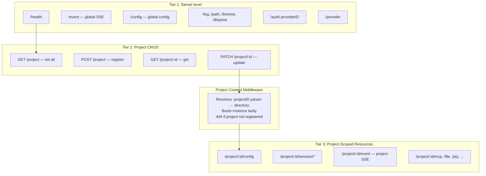

# API Path Refactor: Project-Scoped URLs

## Problem

The current API uses a header/query-based scoping pattern (`x-liteai-directory` / `?directory=`) to distinguish project-scoped resources. This creates two issues:

1. **Route collisions** — `/config` and `/event` exist at both global and project scope, forcing the global variants under a `/global` prefix
2. **Non-self-documenting URLs** — `GET /config` means different things depending on whether a header is present; you can't share or read a URL and know its scope

The industry standard (GitHub, Kubernetes, Google Cloud, Stripe) is **path-based resource scoping**: the project identity is part of the URL, not a header.

## Current vs Proposed

### Current Structure

```
# Global (no context required)
GET  /global/health
GET  /global/event          ← collision with instance /event
GET  /global/config         ← collision with instance /config
PATCH /global/config
POST /global/dispose
POST /global/browse
GET  /global/log
POST /global/log
GET  /global/path

# Pre-instance (no boot required)
GET  /project
POST /project
GET  /project/:projectID
PATCH /project/:projectID
...

# Instance-scoped (requires x-liteai-directory header → full boot)
GET    /config              ← collision with global /config
PATCH  /config
GET    /config/providers
GET    /event               ← collision with global /event
GET    /session
POST   /session
GET    /session/:id/...
GET    /mcp
...
```

### Proposed Structure

```
# Server-level (no project context)
GET  /health
GET  /event                 ← global event stream (no collision)
GET  /config                ← global config (no collision)
PATCH /config
POST /dispose
POST /browse
GET  /log
POST /log
GET  /path

# Project management (no instance boot)
GET    /project
POST   /project
GET    /project/:projectID
PATCH  /project/:projectID
PATCH  /project/:projectID/archive
PATCH  /project/:projectID/unarchive
POST   /project/git/init

# Project-scoped resources (requires projectID in path)
GET    /project/:projectID/config
PATCH  /project/:projectID/config
GET    /project/:projectID/config/providers
GET    /project/:projectID/event
GET    /project/:projectID/session
POST   /project/:projectID/session
GET    /project/:projectID/session/:sessionID
GET    /project/:projectID/session/:sessionID/message
POST   /project/:projectID/session/:sessionID/message
GET    /project/:projectID/mcp
POST   /project/:projectID/mcp
GET    /project/:projectID/file
GET    /project/:projectID/plugin
GET    /project/:projectID/pty
GET    /project/:projectID/vcs
GET    /project/:projectID/command
GET    /project/:projectID/agent
GET    /project/:projectID/skill
GET    /project/:projectID/lsp
GET    /project/:projectID/formatter
...
```

> [!IMPORTANT]
> The `directory` header/query param is **still needed** for instance boot — the server must know which filesystem directory to load. But the project identity moves from a header to a URL param, and the directory is resolved from the projectID's registered directory in the database.

## Architecture



## Key Design Decisions

### 1. Project ID is the URL anchor, not directory path

Directory paths are filesystem-specific, encoding-prone, and platform-dependent. The `ProjectID` (a hashed string already generated by `Project.resolve()`) is a clean, stable URL component:

```
GET /project/a1b2c3d4/session      ✓ Clean
GET /project/C%3A%5CUsers%5C.../session    ✗ Ugly, fragile
```

### 2. Directory is still needed — but derived, not user-facing

The middleware resolves `projectID → directory` from the project database:

```typescript
// Proposed middleware for /project/:projectID/*
.use("/project/:projectID/*", async (c, next) => {
  const projectID = ProjectID.make(c.req.param("projectID"))
  const project = Project.get(projectID)
  if (!project) {
    throw new HTTPException(404, { message: "Project not found" })
  }

  // The directory comes from the registered project, not a header
  return Instance.provide({
    directory: project.directory,
    init: InstanceBootstrap,
    fn: () => next(),
  })
})
```

> [!NOTE]
> The `x-liteai-directory` header and `?directory=` query param can be **removed** from all project-scoped routes. The directory is an internal detail resolved from the registered project. This eliminates the biggest source of API confusion.

### 3. Workspace context can remain as a query param or header

The `?workspace=` / `x-liteai-workspace` param is for multi-worktree support — it selects a worktree within a project. This can stay as a query param since it's a modifier, not the primary resource identity:

```
GET /project/:projectID/session?workspace=feature-branch
```

### 4. Global routes get the clean root paths

Since global operations are the minority and don't have a scoping parent, they get the short paths:

```
GET /health            (not /global/health)
GET /config            (not /global/config)
GET /event             (not /global/event)
```

No collision because project config is at `/project/:id/config`.

## Migration Plan

### Phase 1: Add new path-based routes alongside old ones

- Add `/project/:projectID/config`, `/project/:projectID/event`, etc.
- Keep old `?directory=` routes working
- Both old and new routes hit the same handlers
- Update OpenAPI spec to include both

### Phase 2: Update SDK and clients

- Regenerate SDK from new OpenAPI spec
- Update `liteai-app` to use `sdk.client.project.config()` with projectID
- Update `liteai-vscode` to use projectID-based routes
- Update TUI sync context

### Phase 3: Migrate global routes to root

- Move `/global/health` → `/health`, `/global/config` → `/config`, etc.
- Remove old `/global/*` routes
- Regenerate SDK

### Phase 4: Remove legacy routes

- Remove `x-liteai-directory` header support from project-scoped routes
- Remove `?directory=` query param from project-scoped routes
- Remove old directory-middleware
- Clean up OpenAPI spec

### Phase 5: Update operationIds

- `global.health` → `health`
- `global.config.get` → `config.get`
- `config.get` → `project.config.get`
- `event.subscribe` → `project.event.subscribe`
- `global.event` → `event.subscribe`
- etc.

## Impact Assessment

| Area | Changes |
|------|---------|
| `server.ts` | Restructure route mounting, replace directory middleware with projectID middleware |
| `routes/global.ts` | Move to root mount, rename file to `server-routes.ts` |
| `routes/config.ts` | Mount under `/project/:projectID/config` |
| `routes/instance.ts` | Mount under `/project/:projectID`, event route stays as `/event` |
| `routes/session.ts` | Mount under `/project/:projectID/session` |
| `routes/mcp.ts` | Mount under `/project/:projectID/mcp` |
| All other instance routes | Mount under `/project/:projectID/` |
| `middleware.ts` | Remove directory-based middleware, add projectID-based middleware |
| `liteai-sdk` | Full regeneration — new URL paths, updated types |
| `liteai-app` | Update all SDK calls to pass projectID instead of directory |
| `liteai-vscode` | Update SDK calls |
| TUI sync context | Update to use projectID-based URLs |

> [!WARNING]
> This is a **breaking API change**. The SDK must be regenerated and all clients updated. The phased approach (adding new routes alongside old ones) allows incremental migration, but the full transition requires coordinated changes across all packages.

> [!TIP]
> Much of the groundwork is already done from the project-architecture-review refactor:
> - `Project.resolve()` and `Project.register()` are already split
> - ProjectID is already a first-class type with path param validation
> - Tier 2 project routes already use `:projectID` in the path
> - Instance middleware already resolved directory → project in a clean way
>
> The main work is restructuring URL paths and updating all SDK consumers.
