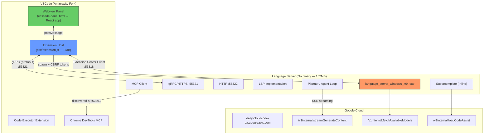
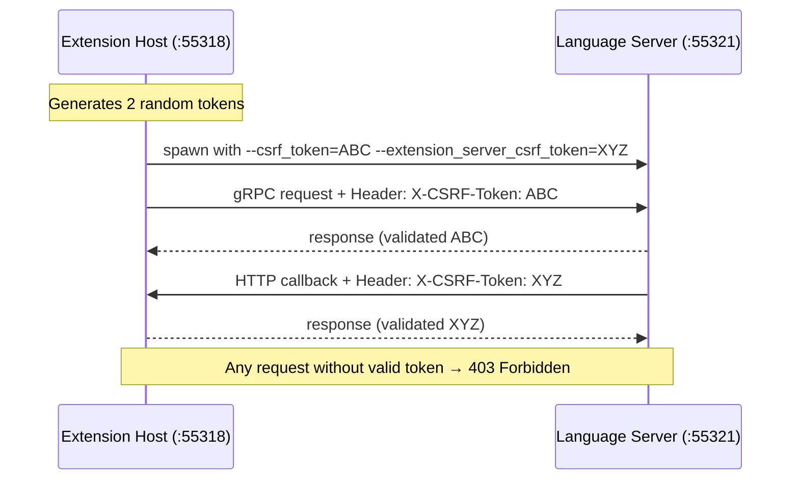
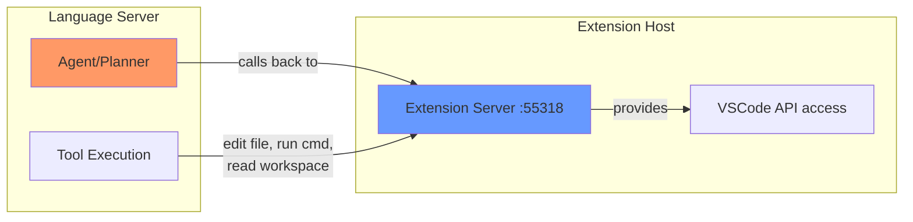
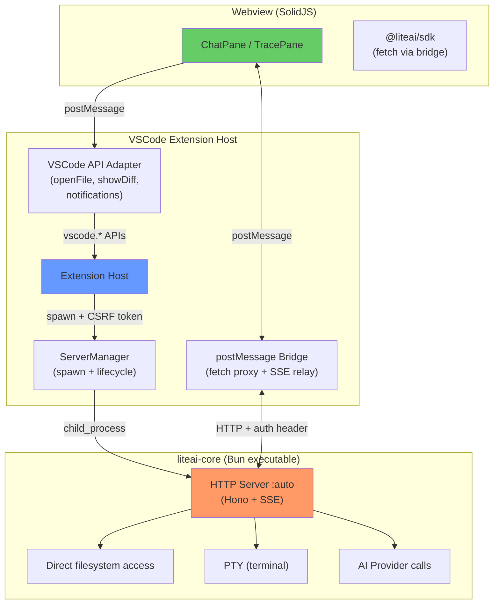

# Antigravity Architecture Analysis & LiteAI Implications

## What Antigravity Do

### The Big Picture



### Key Findings

| Aspect | Detail |
|--------|--------|
| **Language Server binary** | Go compiled, 152MB, single file |
| **Protocol** | gRPC (protobuf) over HTTPS + plain HTTP |
| **Dual ports** | `:55321` (gRPC/HTTPS with TLS cert at `dist/languageServer/cert.pem`) and `:55322` (HTTP) |
| **Extension ↔ LS** | Bidirectional: LS connects BACK to extension's "extension server" on `:55318` |
| **Webview** | React app in `cascade-panel.html`, communicates via postMessage |
| **AI backend** | Google's internal SSE API (`streamGenerateContent`) |
| **Code features** | Supercomplete (inline completions), agent planning, MCP |
| **Security** | CSRF tokens for both directions |

---

## What is the CSRF Token?

**CSRF = Cross-Site Request Forgery** — but in this context it's used as a **shared secret / API key for localhost IPC**.

### Why it exists

When the language server listens on `localhost:55321`, **any process on the machine** could send requests to it. This is a security risk because:
- Malicious browser tabs could call `localhost` APIs
- Other local processes could hijack the AI agent
- In a multi-user system, other users could access the server

### How it works

```
Extension Host generates:
  csrf_token = "e94573176-2bc704932..."           (for LS → Extension requests)
  extension_server_csrf_token = "d41783fe-0105..."  (for Extension → LS requests)

Spawns:
  language_server.exe \
    --enable_lsp \
    --csrf_token e94573176-2bc704932... \
    --extension_server_port 55318 \
    --extension_server_csrf_token d41783fe-0105...
```



> [!IMPORTANT]
> **For LiteAI:** We should adopt this pattern. When the extension spawns `liteai-core`, pass a random token as `--csrf-token <random>`. The core server validates all incoming requests against it. Simple, effective.

---

## What is the Bidirectional Pattern?

This is the most interesting architectural detail. Antigravity uses **two-way communication**:

### Extension → Language Server (standard direction)
- Extension sends gRPC calls to the LS on `:55321`
- Used for: triggering completions, starting agent sessions, sending chat messages

### Language Server → Extension (reverse direction)
- LS connects back to extension's "extension server" on `:55318`
- Used for: applying file edits, running terminal commands, reading files, showing UI notifications
- This is how the agent **acts on the workspace** — it calls back into VSCode's APIs



The LS log confirms this:
```
Created extension server client at port 55318  ← LS connects TO extension
```

**Why?** Because the language server process can't directly access VSCode APIs (file system, terminal, editor). It needs to call back into the extension host, which has the `vscode.*` namespace.

---

## LSP vs HTTP — Should LiteAI Switch?

### What is LSP?

LSP (Language Server Protocol) is a JSON-RPC protocol designed for **code intelligence** features:
- Completions, hover, go-to-definition, diagnostics
- Built into VSCode — native lifecycle management
- Uses `stdio` or sockets for transport

### What Antigravity actually does

Despite the name "language_server", Antigravity's binary is **NOT a pure LSP server**. It's a **hybrid**:

| Feature | Protocol Used |
|---------|--------------|
| Inline completions (Supercomplete) | LSP-like (through `--enable_lsp` flag) |
| Chat / Agent (Cascade) | gRPC (custom protobuf service `exa.language_server_pb.LanguageServerService`) |
| Terminal commands | Callback to extension server |
| File edits | Callback to extension server |
| Streaming AI responses | SSE to Google Cloud |
| MCP integration | MCP protocol (discovered via mDNS) |

They call it "language server" but it's really a **full AI agent runtime** that happens to also provide LSP features.

### Comparison for LiteAI

| | LSP Protocol | HTTP/REST (current LiteAI) | gRPC (Antigravity) |
|---|---|---|---|
| **Chat streaming** | ❌ Not designed for this | ✅ SSE works great | ✅ Server-streaming RPC |
| **Session management** | ❌ No concept of sessions | ✅ REST CRUD | ✅ Custom RPCs |
| **File diffs / review** | ❌ Not a use case | ✅ REST endpoints | ✅ Custom RPCs |
| **Code completions** | ✅ Native VSCode support | ❌ Need custom provider | ✅ Via LSP layer |
| **Diagnostics** | ✅ Native | ❌ Not applicable | ✅ Via LSP layer |
| **Lifecycle** | ✅ VSCode manages it | ⚠️ We manage it | ⚠️ They manage it |
| **Webview support** | ❌ Not designed for UI | ✅ SDK works directly | ❌ Need bridge layer |
| **Existing SDK** | ❌ Would need rewrite | ✅ Already built | ❌ Would need protobuf |

### Verdict

> [!IMPORTANT]
> **Don't switch to LSP for the chat/agent features.** HTTP is the right protocol for LiteAI's use case.

**Why:**
1. LiteAI's entire stack (`@liteai/sdk`, all contexts, the web app) is built on HTTP/REST + SSE
2. LSP is for code intelligence, not chat UIs or session management  
3. Antigravity itself doesn't use LSP for chat — they use gRPC
4. HTTP is simpler, more debuggable, and already working
5. The Pane architecture we designed works perfectly with HTTP through the postMessage bridge

**However**, in the future, LiteAI could add LSP features **alongside** the HTTP server for:
- Inline code completions (like Antigravity's Supercomplete)
- AI-powered diagnostics
- Code actions (quick fixes from AI)

This would be a separate concern from the Pane architecture.

---

## What to Adopt from Antigravity

### ✅ Adopt: CSRF Token Security

```diff
// Current LiteAI plan:
- spawn("liteai-core", ["--port", "0"])

// Updated:
+ const csrfToken = crypto.randomUUID()
+ spawn("liteai-core", ["--port", "0", "--csrf-token", csrfToken])
+ // All HTTP requests include: Authorization: Bearer <csrfToken>
```

### ✅ Adopt: Bidirectional Communication (Extension Server)

For the agent to work properly in VSCode, it needs to **act on the workspace**:
- Read files (for @ mentions in prompt)
- Apply edits (agent writes code)
- Run terminal commands (agent runs tests)
- Search files (for context gathering)

**Two approaches:**

| Approach | Antigravity | LiteAI Proposed |
|----------|------------|-----------------|
| **Direction** | LS calls back to extension | Extension proxies via postMessage + Platform adapter |
| **Protocol** | gRPC callback | HTTP + Platform interface |
| **File access** | Extension exposes file API | Core server accesses filesystem directly (it has `cwd`) |
| **Terminal** | Extension runs commands | Core server has PTY support built-in |

> [!NOTE]
> LiteAI's core server already runs on the same machine and has direct filesystem + PTY access. Unlike Antigravity (which is designed for remote development), LiteAI doesn't need the extension to proxy file operations. The core server can read/write files directly.
>
> The only things the extension needs to expose are **VSCode-specific APIs**:
> - Opening a file in the editor (`vscode.window.showTextDocument`)
> - Showing inline diff decorations
> - Integrating with source control
> - Showing notifications in VSCode's UI

### ✅ Adopt: Platform-Specific Binary Bundling

Antigravity bundles `language_server_windows_x64.exe` (152MB) — same approach we proposed with `liteai-core` (~60MB).

### ⚠️ Consider: Persistent Language Server Option

Antigravity has a setting `"antigravity.persistentLanguageServer"` — keeps the server running even after closing the editor. This could be useful for LiteAI:
- Active sessions keep running
- Faster restart when reopening VSCode
- Shared across multiple VSCode windows (your "shared" preference)

---

## Updated LiteAI Architecture (with learnings)



### Key Differences from Antigravity

| Aspect | Antigravity | LiteAI |
|--------|------------|--------|
| **Server binary** | Go (152MB) | Bun (60MB) |
| **IPC protocol** | gRPC (protobuf) | HTTP/REST + SSE |
| **Chat UI** | React webview | SolidJS Panes (shared with web app) |
| **File access** | Extension proxies to LS | Core server accesses directly |
| **Terminal** | Extension runs commands for LS | Core server has built-in PTY |
| **AI backend** | Google Cloud only | Multi-provider (Anthropic, OpenAI, Google, etc.) |
| **Web app** | None (IDE only) | Full web app + VSCode extension share Panes |
| **Security** | CSRF tokens ✅ | CSRF tokens ✅ (adopt) |
| **Code intelligence** | Supercomplete via LSP | Not yet (future addition) |
