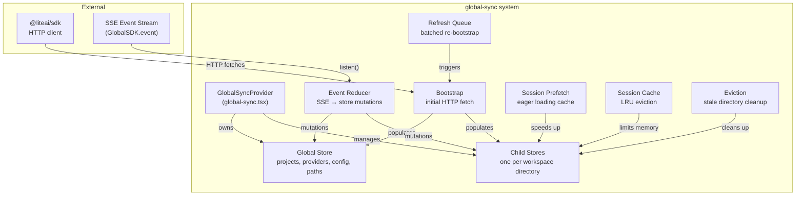
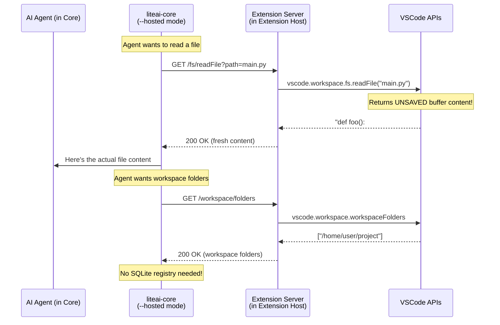

# GlobalSync Deep Dive & Extension Server Rationale

## Part 1: What `global-sync/` Does

The `global-sync/` directory is the **client-side real-time state engine** for the entire LiteAI UI. It's the single source of truth that connects the HTTP/SSE backend to SolidJS reactive components.

### Architecture Overview



### File-by-File Breakdown

| File | Purpose |
|------|---------|
| **types.ts** | Defines `State` — the shape of a per-directory store: sessions, messages, parts, permissions, questions, status, diffs, todos, VCS, MCP, LSP, config, agents, commands |
| **bootstrap.ts** | `bootstrapGlobal()` — fetches health, config, projects, providers, paths on startup. `bootstrapDirectory()` — fetches per-project agents, config, providers, sessions, permissions, VCS, MCP, LSP |
| **event-reducer.ts** | `applyGlobalEvent()` — handles `project.updated`, `server.connected`. `applyDirectoryEvent()` — handles 16+ event types: `session.created/updated/deleted`, `message.updated/removed`, `message.part.updated/removed/delta`, `permission.asked/replied`, `question.asked/replied`, `todo.updated`, `vcs.branch.updated`, `session.status`, `session.diff` |
| **child-store.ts** | Multi-directory store manager. Creates one SolidJS store per workspace directory. Handles LRU eviction (max 30 dirs, 20min idle TTL). Owner-scoped pinning prevents eviction while components use a directory |
| **queue.ts** | Batched refresh queue. Coalesces rapid bootstrap requests (e.g., when SSE reconnects). Processes root refresh + directory refreshes in batches of 2 |
| **session-cache.ts** | LRU cache for session detail data (messages, parts, diffs, todos, permissions). Caps at 40 sessions per directory |
| **session-prefetch.ts** | Eagerly caches message fetch metadata (limit, cursor, complete) with 15s TTL. Prevents redundant fetches when navigating between sessions |
| **session-trim.ts** | Trims session lists to stay within limits while preserving sessions with active permissions (can't evict a session awaiting user approval) |
| **eviction.ts** | LRU eviction strategy for directory stores. Considers pinning, boot state, and active session loads before evicting |
| **session-load.ts** | Root session list fetching with fallback handling |
| **utils.ts** | Helpers: `cmp()` for sorting, `normalizeProviderList()`, `sanitizeProject()` |

### The Two-Level Architecture

```
Level 1: Global Store (one singleton)
├── ready: boolean
├── project: Project[]          ← all registered projects
├── provider: ProviderListResponse
├── provider_auth: ProviderAuthResponse
├── config: Config              ← global config
├── path: PathState             ← home, state, config dirs
└── session_todo: Record<sessionID, Todo[]>

Level 2: Child Stores (one per directory, lazy + LRU)
├── session: Session[]          ← sessions for this project
├── message: Record<sessionID, Message[]>
├── part: Record<messageID, Part[]>
├── session_status: Record<sessionID, SessionStatus>
├── session_diff: Record<sessionID, FileDiff[]>
├── permission: Record<sessionID, PermissionRequest[]>
├── question: Record<sessionID, QuestionRequest[]>
├── todo: Record<sessionID, Todo[]>
├── agent: Agent[]
├── command: Command[]
├── config: Config              ← project-level config
├── provider: ProviderListResponse
├── mcp: Record<name, McpStatus>
├── lsp: LspStatus[]
├── vcs: VcsInfo
└── path: PathState
```

### How Data Flows

```
1. STARTUP
   GlobalSyncProvider mounts
   → bootstrapGlobal() fetches projects, providers, config
   → User navigates to a project
   → child(directory) creates a child store
   → bootstrapDirectory() fetches everything for that project

2. REAL-TIME UPDATES
   SSE stream fires events
   → globalSDK.event.listen() receives them
   → Routes to applyGlobalEvent() or applyDirectoryEvent()
   → event-reducer.ts mutates the SolidJS store
   → Components reactively update (no polling)

3. SESSION NAVIGATION
   User clicks a session
   → sync.session.sync(sessionID) in sync.tsx
   → Checks prefetch cache → fetches if needed
   → Populates message/part stores
   → session-cache.ts evicts old sessions (LRU, cap 40)

4. RECONNECTION
   SSE reconnects after disconnect
   → "server.connected" event fires
   → queue.refresh() re-bootstraps everything
   → All child stores get refreshed in batches of 2
```

---

## Part 2: The Extension Server Problem

Yes, I understand the problem deeply. Let me explain the **precise chain of failures** that makes Phase 3 (Extension Server) necessary.

### The Core Problem: Who Owns "Truth"?

In the **web app**, `liteai-core` is the source of truth for everything:

```
Web App World (works perfectly):

liteai-core owns:
  ├── Filesystem access (fs.readFile, fs.writeFile)
  ├── Project registry (SQLite config.json → which dirs are projects)
  ├── Git status (child_process → git commands)
  ├── File watching (for @ mentions, context)
  └── Terminal/PTY (for running commands)

Global-sync connects to core via HTTP/SSE
  → Everything is consistent
  → Core reads disk, UI reads core. Single source of truth.
```

In **VSCode**, this breaks:

```
VSCode World (conflict):

VSCode already owns:
  ├── Filesystem → vscode.workspace.fs (supports WSL, SSH, DevContainers)
  ├── Open files → vscode.window.activeTextEditor (unsaved buffers!)
  ├── Workspace folders → vscode.workspace.workspaceFolders
  ├── Git → vscode.scm (built-in SCM API)
  ├── Terminal → vscode.window.createTerminal
  └── Dirty files → documents with unsaved changes

liteai-core ALSO claims to own these:
  ├── Filesystem → node fs (reads stale disk, not editor buffers)
  ├── Project registry → SQLite (doesn't know about workspace folders)
  ├── Git → child_process git (duplicates VSCode's SCM)
  ├── Terminal → built-in PTY (separate from VSCode's terminal)
  └── Files → always reads from disk (misses unsaved edits)
```

### The Concrete Failures

**Failure 1: "Project not found in registry"**
You already hit this. Core's SQLite registry doesn't know about the user's workspace folders. The user opens a folder in VSCode, but core hasn't registered it → crash.

**Failure 2: Stale File Reads (the silent data corruption)**
This is the *dangerous* one you haven't hit yet:
```
User edits main.py in VSCode (unsaved)
  → VSCode knows the file has changes (dirty buffer)
  → User asks AI: "refactor the function in main.py"
  → Core reads main.py from DISK (old version)
  → AI sees outdated code, generates wrong diff
  → User applies diff → overwrites their unsaved work
```

**Failure 3: Remote Filesystem Blindness**
```
User works in WSL/SSH/DevContainer via VSCode Remote
  → VSCode handles filesystem transparently via vscode.workspace.fs
  → Core runs locally, tries fs.readFile()
  → Path doesn't exist on local filesystem → crash
```

**Failure 4: Duplicate Terminals**
```
Core spawns its own PTY for running commands
  → Terminal appears... nowhere in VSCode's UI
  → User can't see the output
  → User can't ctrl+c to stop it
  → Two terminal systems fighting each other
```

### Why the Extension Server Fixes This

The Extension Server pattern says: **"Core, when you need workspace state, don't read it yourself — ask the host."**



### What Specifically Changes in Each Layer

| Layer | Without Extension Server | With Extension Server |
|-------|------------------------|----------------------|
| **Core startup** | Needs pre-registered project in SQLite | Extension pushes workspace folders on spawn |
| **File reads** | `fs.readFile()` → stale disk | Callback to extension → `vscode.workspace.fs` → live buffers |
| **Git status** | `child_process("git status")` | Callback → `vscode.scm` API |
| **Terminal** | Core's PTY (invisible to user) | Callback → `vscode.window.createTerminal` (visible in VSCode) |
| **File watching** | Core's own watcher | VSCode's `workspace.onDidChangeTextDocument` (catches saves AND unsaved edits) |
| **Remote dev** | ❌ Broken (no local filesystem) | ✅ Works (vscode.workspace.fs is remote-aware) |

### Why Not Just Skip It?

You could technically ship a "basic" VSCode extension that just embeds the web UI in a webview and talks to core like the browser does. That's essentially what you have now after Phase 1+2.

But the AI agent will be **blind to the real workspace state**. Every file read will be stale, every project needs manual registration, and it won't work over Remote SSH/WSL/DevContainers at all. That's not enterprise-grade — that's a demo.

Phase 3 is what makes it a **real** IDE extension.
