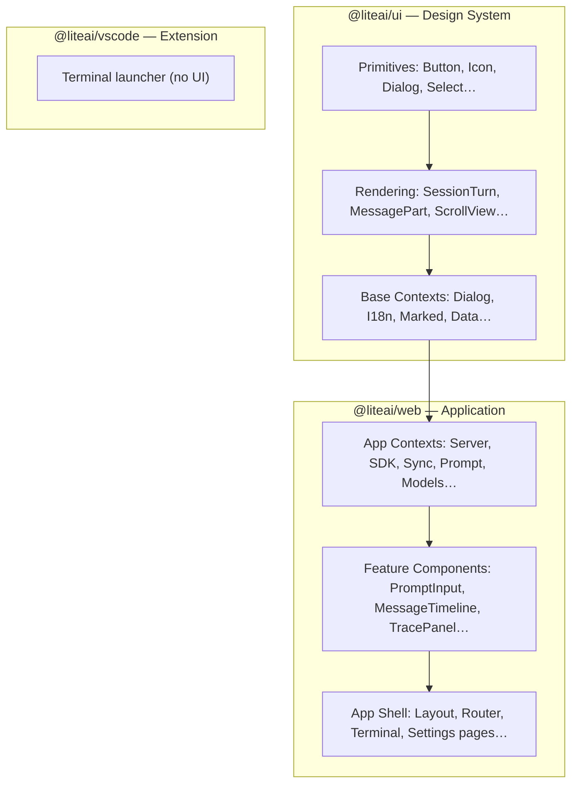
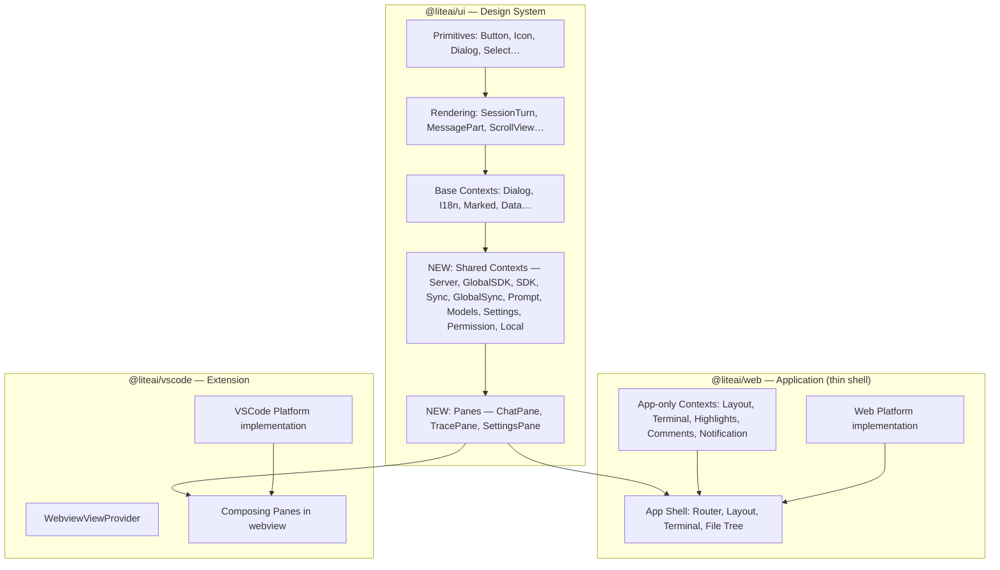
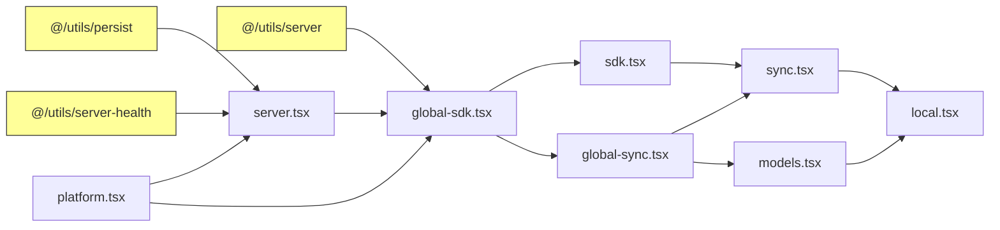

# Pane Architecture: Reusable Composable UI Units

> [!IMPORTANT]
> **Recommended name: `Pane`** — a self-contained, embeddable UI feature area that can be mounted in any host (web app, VSCode webview, future Electron, etc.)

## Why "Pane"?

| Option | Verdict | Reason |
|--------|---------|--------|
| **Block** | ❌ | Overloaded (CSS blocks, Notion blocks, Gutenberg blocks). Too generic. |
| **Panel** | ❌ | Conflicts with existing `TracePanel`, `TerminalPanel`, `SessionSidePanel`. Also implies a layout slot, not a portable unit. |
| **View** | ❌ | Overloaded (MVC, React views). Too generic for the composable unit concept. |
| **Surface** | ❌ | Conflicts with existing `DockSurface`. Material Design "surface" is about visual planes, not features. |
| **Widget** | ❌ | Dated, implies small/secondary. |
| **Pane** ✅ | ✅ | Short, no conflicts with existing code, maps naturally to VSCode's concept of panes. Implies a self-contained view area (like a window pane). Natural naming: `ChatPane`, `TracePane`, `SettingsPane`. |

---

## Proposed Architecture

### Current Layer Cake



### Proposed Layer Cake (with Panes)



> [!NOTE]
> The `Pane` is the key new concept. Each pane is a **self-contained SolidJS component** that:
> 1. Wraps its own required context providers
> 2. Accepts host-injected adapters via props (Platform, Router)
> 3. Renders a complete feature (chat, trace, settings)
> 4. Can be used standalone or composed into larger layouts

---

## Pane Inventory

### 1. `ChatPane` — Chat Experience (Priority: Now)
The core chat feature: message timeline + prompt input + model selector.

**Bundles:**
- `MessageTimeline` (scroll, history window, turn rendering)
- `PromptInput` (editor, @ mentions, slash commands, file attachments, submit)
- `ModelSelector`
- `NewSessionView` (empty state)
- `SessionHeader` (stripped-down version without app-specific controls)

**Requires from host:**
- `PaneRoute` (projectID, sessionID)
- `Platform` adapter

### 2. `TracePane` — Trace/Debug Inspector (Priority: Future)
Opentelemetry-style span viewer for LLM calls.

**Bundles:**
- Span tree, waterfall chart, detail view, compare mode
- Context breakdown, token metrics
- Session overview stats

**Requires from host:**
- `PaneRoute` (projectID, sessionID)
- `Platform` adapter

### 3. `SettingsPane` — Configuration UI (Priority: Future)
User settings, provider management, model configuration.

**Bundles:**
- Settings sections (general, providers, models, agents, tools, MCP, keybinds)
- Connect/edit provider dialogs

**Requires from host:**
- `Platform` adapter

---

## Key Abstractions

### `PaneRoute` — Host-driven routing

Replaces `@solidjs/router` dependency. Each host drives navigation differently:

```tsx
// ui/src/panes/shared/pane-route.tsx
export type PaneRoute = {
  projectID?: string
  sessionID?: string
}

export const { use: usePaneRoute, provider: PaneRouteProvider } = createSimpleContext({
  name: "PaneRoute",
  init: (props: { route: Accessor<PaneRoute> }) => props.route,
})
```

| Host | Implementation |
|------|---------------|
| **Web** | Derived from `useParams()` — URL-driven |
| **VSCode** | Driven by extension host via `postMessage` — command-driven |

### `Platform` — Host capability injection

Already exists in [platform.tsx](~/Documents/workspace/liteai/packages/web/src/context/platform.tsx). Needs extensions for pane use:

```tsx
export type Platform = {
  platform: "web" | "vscode"
  
  // Existing
  openLink(url: string): void
  storage?: (name?: string) => SyncStorage | AsyncStorage
  fetch?: typeof fetch
  
  // Extensions for Panes
  searchFiles?: (query: string) => Promise<string[]>
  navigateSession?: (projectID: string, sessionID: string) => void
  openFile?: (path: string) => void
}
```

### `PaneProviders` — Shared context stack

A single wrapper that provides all contexts needed by any pane:

```tsx
// ui/src/panes/shared/pane-providers.tsx
export function PaneProviders(props: ParentProps & {
  platform: Platform
  route: Accessor<PaneRoute>
  server: ServerConnection.Key
  servers?: ServerConnection.Any[]
}) {
  return (
    <PlatformProvider value={props.platform}>
      <ServerProvider defaultServer={props.server} servers={props.servers}>
        <GlobalSDKProvider>
          <GlobalSyncProvider>
            <PaneRouteProvider route={props.route}>
              <SettingsProvider>
                <PermissionProvider>
                  <ModelsProvider>
                    <SDKProvider>
                      <SyncProvider>
                        <LocalProvider>
                          <PromptProvider>
                            {props.children}
                          </PromptProvider>
                        </LocalProvider>
                      </SyncProvider>
                    </SDKProvider>
                  </ModelsProvider>
                </PermissionProvider>
              </SettingsProvider>
            </PaneRouteProvider>
          </GlobalSyncProvider>
        </GlobalSDKProvider>
      </ServerProvider>
    </PlatformProvider>
  )
}
```

---

## File Structure

```
ui/src/
├── components/          # existing primitives (Button, Icon, etc.)
├── context/             # existing base contexts (Dialog, I18n, Marked)
│
├── panes/               # ← NEW
│   ├── index.ts         # public exports
│   │
│   ├── shared/          # shared pane infrastructure
│   │   ├── pane-route.tsx
│   │   ├── pane-providers.tsx
│   │   ├── platform.tsx        ← moved from web
│   │   ├── server.tsx          ← moved from web
│   │   ├── global-sdk.tsx      ← moved from web
│   │   ├── sdk.tsx             ← moved from web
│   │   ├── sync.tsx            ← moved from web
│   │   ├── global-sync.tsx     ← moved from web (+ subdirs)
│   │   ├── prompt.tsx          ← moved from web
│   │   ├── models.tsx          ← moved from web
│   │   ├── settings.tsx        ← moved from web
│   │   ├── permission.tsx      ← moved from web
│   │   ├── local.tsx           ← moved from web
│   │   └── language.tsx        ← moved from web
│   │
│   ├── chat/            # ChatPane
│   │   ├── chat-pane.tsx       ← main pane component
│   │   ├── message-timeline.tsx  ← from web/pages/session/
│   │   ├── prompt-input/         ← from web/components/prompt-input/
│   │   │   ├── prompt-input.tsx
│   │   │   ├── submit.ts
│   │   │   ├── slash-popover.tsx
│   │   │   ├── context-items.tsx
│   │   │   ├── editor-dom.ts
│   │   │   ├── history.ts
│   │   │   └── ...
│   │   ├── model-selector.tsx    ← from web
│   │   └── new-session-view.tsx  ← from web
│   │
│   ├── trace/           # TracePane (future)
│   │   ├── trace-pane.tsx
│   │   ├── trace-detail.tsx
│   │   ├── trace-compare.tsx
│   │   └── ...
│   │
│   └── settings/        # SettingsPane (future)
│       ├── settings-pane.tsx
│       └── ...
```

### Export Map Updates

```jsonc
// ui/package.json exports (additions)
{
  "./panes": "./src/panes/index.ts",
  "./panes/chat": "./src/panes/chat/chat-pane.tsx",
  "./panes/trace": "./src/panes/trace/trace-pane.tsx",
  "./panes/settings": "./src/panes/settings/settings-pane.tsx",
  "./panes/shared": "./src/panes/shared/index.ts",
  "./panes/shared/*": "./src/panes/shared/*.tsx"
}
```

---

## Usage Examples

### Web App (thin shell)

```tsx
// web/src/pages/session.tsx (after refactor — dramatically simpler)
import { ChatPane } from "@liteai/ui/panes/chat"
import { TerminalPanel } from "./terminal-panel"
import { FileTree } from "./file-tree"

export default function SessionPage() {
  const layout = useLayout()
  
  return (
    <div class="session-layout">
      <Show when={layout.fileTree.opened()}>
        <FileTree />  {/* stays web-only */}
      </Show>
      
      <ChatPane />  {/* all chat logic is self-contained */}
      
      <Show when={layout.trace.opened()}>
        <TracePane />  {/* future */}
      </Show>
      
      <Show when={layout.terminal.opened()}>
        <TerminalPanel />  {/* stays web-only */}
      </Show>
    </div>
  )
}
```

### VSCode Extension (webview)

```tsx
// vscode/src/webview/entry.tsx
import { PaneProviders } from "@liteai/ui/panes/shared"
import { ChatPane } from "@liteai/ui/panes/chat"
import { vscodePlatform } from "./vscode-platform"

function App() {
  const [route, setRoute] = createSignal<PaneRoute>({
    projectID: initialProjectID,
    sessionID: initialSessionID,
  })

  // Listen for route updates from extension host
  window.addEventListener("message", (e) => {
    if (e.data.type === "route") setRoute(e.data.route)
  })

  return (
    <AppBaseProviders>
      <PaneProviders
        platform={vscodePlatform}
        route={route}
        server={serverKey}
      >
        <div class="vscode-chat">
          <ChatPane />
        </div>
      </PaneProviders>
    </AppBaseProviders>
  )
}
```

---

## Migration Strategy

### Phase 1: Infrastructure (Week 1)
1. Create `ui/src/panes/shared/` directory
2. Move `Platform` interface (already clean — no internal deps)
3. Extract `Persist` + `persisted` utilities from web to ui (dependency of server.tsx and others)
4. Move `server.tsx`, `global-sdk.tsx`, `sdk.tsx` (follow dependency chain)
5. Create `PaneRoute` abstraction
6. Create `PaneProviders` wrapper

### Phase 2: ChatPane (Week 2-3)
1. Move `language.tsx` → shared (extract `@solidjs/router` usage via `PaneRoute`)
2. Move `global-sync.tsx` + subdirectory → shared
3. Move `sync.tsx` → shared
4. Move `prompt.tsx` → shared (replace `useParams()` with `usePaneRoute()`)
5. Move `models.tsx`, `local.tsx`, `settings.tsx`, `permission.tsx` → shared
6. Move `PromptInput` component tree (biggest single piece: 54KB main + ~17KB submit)
7. Move `MessageTimeline` (41KB)
8. Move `ModelSelector`, `NewSessionView`
9. Create `ChatPane` wrapper component
10. Update `web/src/pages/session.tsx` to use `ChatPane`

### Phase 3: VSCode Webview (Week 4)
1. Add SolidJS + Vite build for webview in `packages/vscode`
2. Create `VSCodePlatform` adapter
3. Create `WebviewViewProvider` (sidebar chat)
4. Wire up `postMessage` bridge for route changes and file operations
5. Build and bundle webview assets

### Phase 4: TracePane + SettingsPane (Future)
1. Extract trace components into `TracePane`
2. Extract settings components into `SettingsPane`

---

## Dependency Moves Required

The critical path of dependencies that need to move from `web` → `ui`:



Yellow nodes are utility files that also need to move. These are small (< 300 lines total):
- `persist.ts` — localStorage wrapper with `persisted()` helper
- `server.ts` — SDK factory function (`createSdkForServer`)
- `server-health.ts` — Health check utility

---

## What Stays in Web (not moving)

| Module | Reason |
|--------|--------|
| `layout.tsx` (33KB) | Multi-panel sizing, file tree state — web app orchestration |
| `terminal.tsx` | Ghostty terminal integration — web-only |
| `highlights.tsx` | Shiki highlighting config — web-only |
| `comments.tsx` | Line comments for review — web-only |
| `notification.tsx` | System notifications — web-only |
| `command.tsx` | Command palette + keybinds — web-specific |
| `file.tsx` context | File content cache with server-backed search — web-specific |
| All `settings-*.tsx` pages | Web-only settings UI (move to SettingsPane later) |
| All dialog components | App-specific (connect provider, edit project, etc.) |
| Terminal/File tabs | Web layout components |

---

## Package.json Impact

### `@liteai/ui` — New dependencies needed

```jsonc
// These would move from @liteai/web → @liteai/ui
{
  "@solid-primitives/event-bus": "...",     // for global-sdk.tsx
  "@solid-primitives/storage": "...",       // for persist utilities  
  "zod": "...",                             // for global-sdk.tsx
  "effect": "..."                           // only if ConnectionGate moves (probably not)
}
```

> [!WARNING]
> `@liteai/ui` already has `@solidjs/router` as a dependency, so that's not a blocker. The `PaneRoute` abstraction will decouple the actual routing so panes don't import `useParams()` directly.

---

## Open Questions

1. **Should `PaneProviders` auto-connect or require explicit server?**
   The web app has `ConnectionGate` for health checks. Should panes include this or leave it to the host?
   
   **Recommendation:** Leave it to the host. The pane assumes a healthy connection.

2. **Storybook integration?**
   Should panes have stories? If so, the storybook package needs mock providers.
   
   **Recommendation:** Yes — create a `MockPaneProviders` in storybook that provides fake SDK/Sync data.

3. **CSS isolation?**
   Panes in VSCode webviews need to work with VSCode's CSS variables. Should panes have their own scoped styles?
   
   **Recommendation:** Panes inherit from the existing `@liteai/ui/styles` design tokens. VSCode platform provides a CSS bridge that maps VSCode variables to liteai tokens.
