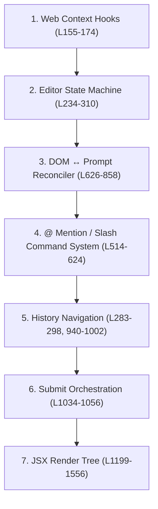

# Web `PromptInput` — Full Anatomy

> [!NOTE]
> Source: [prompt-input.tsx](~/Documents/workspace/liteai/packages/web/src/components/prompt-input.tsx) (1559 lines)

---

## Overview: 7 Functional Layers

The component is a monolith with 7 distinct functional layers, all inside a single `Component`:



---

## Layer 1: Web Context Hooks (Lines 155-174)

```typescript
const sdk = useSDK()          // SDK client, project directory, projectID
const sync = useSync()        // Real-time SSE sync store (sessions, messages, agents, commands)
const local = useLocal()      // Local preferences: selected agent, model, variant
const prompt = usePrompt()    // Shared prompt state: current parts, cursor, context items
const dialog = useDialog()    // Dialog/modal manager
const providers = useProviders() // Provider list (paid vs free detection)
const permission = usePermission() // Auto-accept (YOLO) state
const language = useLanguage()   // i18n translations
const _platform = usePlatform() // OS detection (mac/win/linux)
```

**Why it matters:** These are ALL web-specific. They read from HTTP/SSE providers and SolidJS router. The UI package doesn't have any of these — it uses `useChatController()` and `useSelectionController()` instead.

**Portability:** ❌ Cannot copy as-is. Must be abstracted to interfaces/props.

---

## Layer 2: Editor State Machine (Lines 234-310)

### Store (L235-251)
```typescript
const [store, setStore] = createStore({
  popover: null,          // "at" | "slash" | null — which autocomplete popover is open
  historyIndex: -1,       // Current position in prompt history (-1 = not navigating)
  savedPrompt: null,      // Stashed current prompt when entering history navigation
  placeholder: 0,         // Index into rotating placeholder examples
  draggingType: null,     // "image" | "@mention" | null — drag-and-drop state
  mode: "normal",         // "normal" | "shell" — prompt mode (! prefix = shell)
  applyingHistory: false, // Guard flag to prevent reconcile loops during history apply
})
```

### Spring Animations (L253-262)
```typescript
const buttonsSpring = useSpring(...)  // Animates normal↔shell transition
const motion = (value) => ({...})     // opacity, scale, blur, pointer-events
const buttons = createMemo(...)       // Normal mode button styles
const shell = createMemo(...)         // Shell mode label styles
const control = createMemo(...)       // Tray button styles (height: 28px + animation)
```

### Derived State (L264-300)
- `commentCount` — number of context items with non-empty comments
- `contextItems` — filtered context items (hides comments in shell mode)
- `hasUserPrompt` — whether session has any user messages (for placeholder logic)
- `suggest` — show suggestion placeholder when no user messages yet
- `placeholder` — computed placeholder text based on mode, comments, suggestions

**Portability:** ✅ Fully portable. No web-specific deps. The UI version already has most of this.

---

## Layer 3: DOM ↔ Prompt Reconciler (Lines 626-858)

This is the **most complex** and **most important** part. It keeps the `contentEditable` div in sync with the `Prompt` data model.

### 3a. Pill Creation (L626-636)
```typescript
const createPill = (part: FileAttachmentPart | AgentPart) => {
  const pill = document.createElement("span")
  pill.textContent = part.content          // e.g. "@file.ts" or "@agent"
  pill.setAttribute("data-type", part.type) // "file" or "agent"
  pill.setAttribute("contenteditable", "false") // Non-editable inline element
  return pill
}
```
Pills are inline `<span>` elements rendered inside the contentEditable. They represent `@file` and `@agent` mentions and are non-editable atoms within the editor.

### 3b. Editor Normalization Check (L638-655)
```typescript
const isNormalizedEditor = () =>
  Array.from(editorRef.childNodes).every((node) => {
    // Ensures each node is one of: text, pill, BR, or trailing ZWS
  })
```
Checks whether the DOM is in "clean" state (no browser-inserted wrappers, no stale nodes). If not normalized, a full re-render is triggered.

### 3c. Editor Rendering (L657-673)
```typescript
const renderEditor = (parts: Prompt) => {
  clearEditor()
  for (const part of parts) {
    if (part.type === "text") editorRef.appendChild(createTextFragment(part.content))
    if (part.type === "file" || part.type === "agent") editorRef.appendChild(createPill(part))
  }
  // Trailing BR gets a zero-width space for cursor placement
}
```
One-way render: takes a `Prompt` array and rebuilds the entire editor DOM. Used when the prompt signal changes externally (history navigation, edit loading, etc.).

### 3d. DOM → Prompt Parser (L730-809)
```typescript
const parseFromDOM = (): Prompt => {
  // Walks all childNodes of editorRef
  // Text nodes → buffer → flush as TextPart
  // data-type="file" spans → FileAttachmentPart
  // data-type="agent" spans → AgentPart
  // BR elements → "\n" in buffer
  // DIV/P wrappers (browser auto-format) → "\n" between blocks
  // Strips \r\n → \n, strips \u200B (zero-width space)
}
```
This is the reverse: reads the browser DOM and produces a `Prompt[]` array. Called on every `input` event.

### 3e. Reconciler (L705-728)
```typescript
const reconcile = (input: Prompt) => {
  if (mirror.input) {
    // We triggered this change ourselves (handleInput set it)
    mirror.input = false
    if (isNormalizedEditor()) return  // DOM is clean, no re-render needed
    renderEditorWithCursor(input)     // DOM got dirty, fix it
    return
  }
  // External change (history, edit load, etc.)
  const dom = parseFromDOM()
  if (isNormalizedEditor() && isPromptEqual(input, dom)) return  // Already matches
  renderEditorWithCursor(input)  // Force re-render
}
```
The `mirror.input` flag prevents infinite loops: when `handleInput` parses DOM → updates prompt signal → triggers `createEffect` → would re-render DOM → would trigger input event → loop. The flag breaks the cycle.

### 3f. IME Composition Handling (L494-512)
```typescript
const [composing, setComposing] = createSignal(false)
const isImeComposing = (event) => event.isComposing || composing() || event.keyCode === 229

const handleCompositionStart = () => setComposing(true)
const handleCompositionEnd = () => {
  setComposing(false)
  requestAnimationFrame(() => {
    if (composing()) return  // New composition started
    reconcile(prompt.current().filter(...))  // Now safe to reconcile
  })
}
```
Critical for CJK (Chinese/Japanese/Korean) input. During IME composition:
- `handleInput` still fires but the DOM contains partial composition text
- `reconcile` must NOT re-render (would destroy IME state)
- `handleKeyDown` must NOT capture Enter (used to confirm IME selection)
- Only after `compositionend` is it safe to reconcile

### 3g. Input Handler (L812-858)
```typescript
const handleInput = () => {
  const rawParts = parseFromDOM()          // Read current DOM
  const cursorPosition = getCursorPosition(editorRef)
  
  // If editor is empty (only whitespace/ZWS), reset to DEFAULT_PROMPT
  if (shouldReset) { prompt.set(DEFAULT_PROMPT, 0); return }
  
  // Check for @ mention trigger: text before cursor ends with @
  // Check for / slash trigger: text matches /^\/(\\S*)$/
  // Update popover state accordingly
  
  mirror.input = true  // Flag to prevent reconcile loop
  prompt.set([...rawParts, ...images], cursorPosition)
}
```

### 3h. addPart — Inserting content at cursor (L860-939)
```typescript
const addPart = (part: ContentPart) => {
  // For file/agent pills:
  //   - Find @query text before cursor
  //   - Replace @query range with pill element + trailing space
  //   - Update selection to after the space
  
  // For text:
  //   - Insert text fragment at cursor position
  //   - Handle trailing BR + ZWS edge cases
  
  handleInput()  // Re-parse DOM → update prompt state
}
```

**Portability:** ✅ Fully portable. Zero web-specific deps. Pure DOM manipulation.
The UI version already has a simplified version of this, but **lacks**: pill creation, DOM parsing, addPart, IME handling, the full reconciler.

---

## Layer 4: @ Mention / Slash Command System (Lines 514-624)

### @ Mention (L514-569)
```typescript
// Agent list from sync store
const agentList = createMemo(() => sync.data.agent.filter(...).map(...))

// Uses useFilteredList hook for fuzzy search + keyboard navigation
const { flat: atFlat, active: atActive, ... } = useFilteredList<AtOption>({
  items: async (query) => {
    const agents = agentList()
    const open = recent()           // Recently opened files
    const paths = await props.searchFiles(query)  // File search API
    return [...agents, ...pinned, ...fileOptions]
  },
  groupBy: (item) => item.type === "agent" ? "agent" : item.recent ? "recent" : "file",
  onSelect: handleAtSelect,
})
```

### Slash Commands (L571-624)
```typescript
const slashCommands = createMemo(() => {
  const builtin = commandOptions.filter(opt => opt.slash).map(...)  // From command palette
  const custom = sync.data.command.map(...)                          // Custom /commands
  return [...custom, ...builtin]
})

const { flat: slashFlat, ... } = useFilteredList<SlashCommand>({
  items: slashCommands,
  onSelect: handleSlashSelect,  // Custom → set editor text; Builtin → trigger command
})
```

**Portability:** ⚠️ Partially portable. The `useFilteredList` hook is from `@liteai/ui/hooks` (portable). But data sources (`sync.data.agent`, `sync.data.command`, `props.searchFiles`) are web-specific. The UI version uses a simpler approach with inline filtering.

---

## Layer 5: History Navigation (Lines 283-298, 940-1002)

```typescript
// Two separate histories: normal mode and shell mode
const [history, setHistory] = persisted(Persist.global("prompt-history"), ...)
const [shellHistory, setShellHistory] = persisted(Persist.global("prompt-history-shell"), ...)

// Adding to history on submit
const addToHistory = (prompt, mode) => {
  const next = prependHistoryEntry(currentHistory.entries, prompt, comments)
  setCurrentHistory("entries", next)
}

// Navigating with arrow keys
const navigateHistory = (direction) => {
  const result = navigatePromptHistory({...})
  if (result.handled) {
    setStore("historyIndex", result.historyIndex)
    applyHistoryPrompt(result.entry, result.cursor)
  }
}
```

Also includes comment-aware history (L312-368): saves/restores line comments alongside prompt text.

**Portability:** ⚠️ The navigation logic is portable (already in UI). But `persisted()` uses web's localStorage wrapper, and `props.commentActions` is web-specific.

---

## Layer 6: Submit Orchestration (Lines 1034-1056)

```typescript
const { abort, handleSubmit } = createPromptSubmit({
  info,                    // Current session info
  imageAttachments,        // Image files in prompt
  commentCount,            // Number of comments
  autoAccept: () => accepting(),  // YOLO mode
  mode: () => store.mode,  // normal/shell
  working,                 // Is session busy
  editor: () => editorRef, // DOM ref
  // ... 15+ more params
})
```

This delegates to `submit.ts` which handles:
- Session creation (if new)
- Worktree creation/waiting
- Slash command dispatch
- Shell command dispatch
- Message building via `buildRequestParts`
- Optimistic UI updates
- Error recovery with input restoration

**Portability:** ❌ Completely web-specific. The UI version uses `props.handler.submit()` instead.

---

## Layer 7: JSX Render Tree (Lines 1199-1556)

### Structure:
```
div.relative.size-full           ← Outer wrapper
├── PromptPopover                ← Autocomplete dropdown (floats above)
│
├── DockShellForm                ← Raised lighter surface
│   ├── PromptDragOverlay        ← Full-overlay when dragging files
│   ├── PromptContextItems       ← File mention chips with comments
│   ├── PromptImageAttachments   ← Image thumbnail row
│   ├── div.relative             ← Editor container with click-to-focus
│   │   ├── div.overflow-y-auto  ← Scrollable editor wrapper
│   │   │   ├── div[contenteditable] ← The actual text editor
│   │   │   └── Show(!dirty) → placeholder overlay
│   │   ├── div (gradient fade)  ← Bottom fade-out gradient
│   │   ├── div (bottom-right)   ← Submit/Stop button [↑/■]
│   │   └── div (bottom-left)    ← Attach file button [+]
│   └── /DockShellForm
│
└── DockTray attach="top"        ← Darker surface tucked under shell
    └── div.flex                 ← Selector row
        ├── Shell mode label     ← Animated "Shell" label (shell mode only)
        ├── Agent Select ▾       ← Agent dropdown
        ├── Model button ▾       ← Model selector (paid/unpaid branching)
        ├── Variant Select ▾     ← Variant/effort dropdown
        └── YOLO button 🛡️       ← Auto-accept toggle
```

### Notable UI details:
- **Gradient fade** (L1317-1325): `linear-gradient(to top, var(--surface-raised-stronger-non-alpha) calc(100% - 20px), transparent)` — fades editor content behind the floating buttons
- **Shell mode animation** (L1411-1420): Spring-animated label that cross-fades with the agent selector
- **Model selector branching** (L1443-1506): Shows `ModelSelectorPopover` if user has paid providers, otherwise shows `DialogSelectModelUnpaid`
- **Click-to-focus** (L1258-1269): Clicking anywhere in the container focuses the editor, unless clicking a button

**Portability:** ⚠️ The structure is portable, but the model selector needs `providers.paid()`, `ModelSelectorPopover`, `DialogSelectModelUnpaid` — all web-specific.

---

## Summary: What the UI version is MISSING

| Feature | Web | UI (current) | Portable? |
|---------|-----|-------------|-----------|
| Pill creation (`createPill`) | ✅ | ❌ | ✅ |
| DOM → Prompt parser (`parseFromDOM`) | ✅ | ❌ | ✅ |
| Full reconciler (`reconcile`) | ✅ | ❌ simplified | ✅ |
| IME composition handling | ✅ | ❌ | ✅ |
| `addPart` (insert at cursor) | ✅ | ❌ simplified | ✅ |
| Shell mode + spring animation | ✅ | ❌ | ✅ |
| `useFilteredList` for @ mention | ✅ | ❌ inline filter | ✅ |
| Slash command system | ✅ | ❌ empty array | ⚠️ needs data |
| Comment-aware history | ✅ | ❌ | ⚠️ needs commentActions |
| Shell history (separate) | ✅ | ❌ | ✅ |
| Gradient fade overlay | ✅ | ❌ | ✅ |
| Model paid/unpaid branching | ✅ | ❌ simple selector | ❌ web-only |
| YOLO button | ✅ | ❌ | ❌ needs permission ctx |
| DockShell→DockTray layout | ✅ siblings | ❌ nested | ✅ |
| `createPromptSubmit` | ✅ | ❌ handler prop | ❌ web-only |
| Command palette integration | ✅ | ❌ | ❌ web-only |

---

## Two Approaches

### A: Copy & Paste (exact replica)
- Copy the entire 1559-line file to UI
- Replace web context hooks with UI controller equivalents
- Stub out web-only features (submit → handler prop, model selector → simple, YOLO → prop)
- **Pro:** Exact visual match, all editor behaviors preserved
- **Con:** Large file, some dead code paths for features that can't work in UI

### B: Refactor Web First, Then Share
- Extract the portable layers (DOM reconciler, IME, pills, addPart) into shared modules
- Extract the render tree into a configurable component
- Both web and UI import the same component with different "backend" props
- **Pro:** Single source of truth, no drift
- **Con:** More upfront work, risk of breaking web

