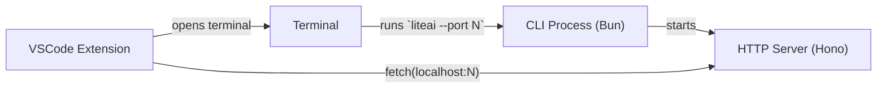
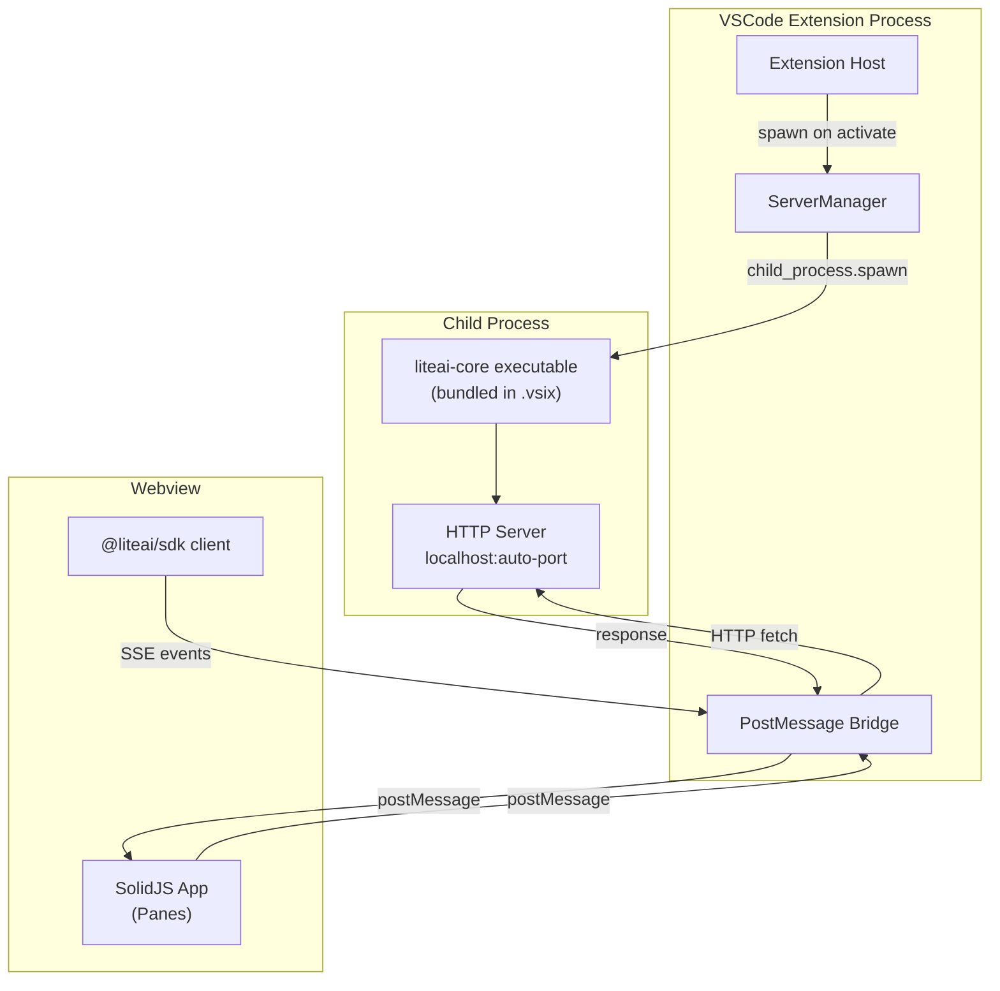
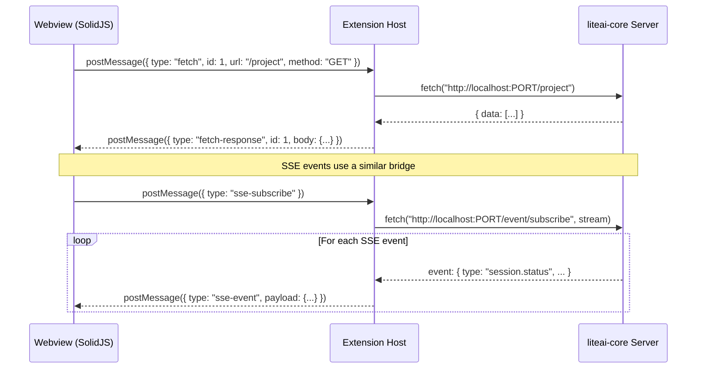
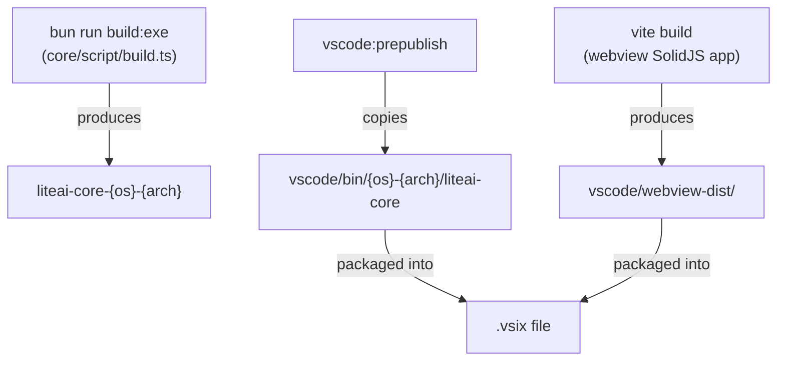
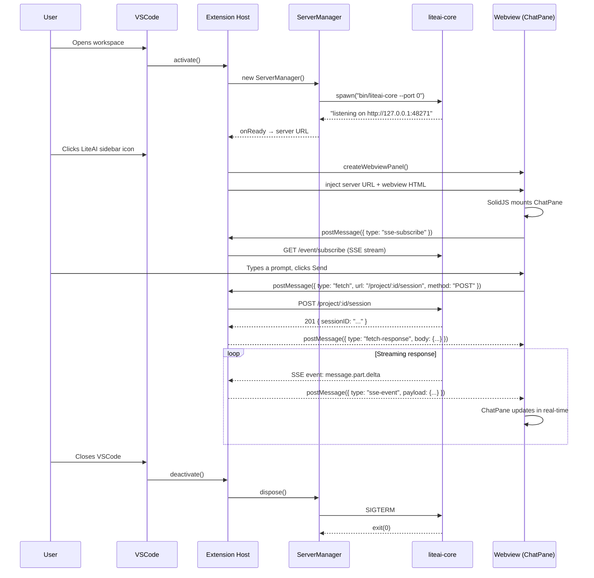

# VSCode Extension: Server Lifecycle & Communication

> [!IMPORTANT]
> **Question**: How does the VSCode webview talk to the LiteAI server?
> **Answer**: The extension **bundles the `liteai-core` executable** and auto-launches it as a managed child process. The webview communicates with it via the extension host as a proxy.

---

## Current Architecture



**Today**, the VSCode extension:
1. Opens a **terminal** tab
2. Runs `liteai --port <random>` (assumes `liteai` CLI is installed globally)
3. Polls `localhost:<port>/app` until it responds
4. Sends `appendPrompt` HTTP requests to the server

**Problems:**
- Requires the user to have `liteai` CLI pre-installed
- Uses a **terminal** — not a webview panel (no rich UI)
- No server lifecycle management (if the terminal closes, the server dies)
- No way to embed Panes as a webview sidebar

---

## Proposed Architecture



### Key Decisions

| Decision | Choice | Rationale |
|----------|--------|-----------|
| **How to bundle the server** | Pre-built `liteai-core` binary in `.vsix` | Already builds as standalone Bun executable via `core/script/build.ts`. No runtime dependency on Bun/Node. |
| **How to start it** | `child_process.spawn` on activation | Extension host controls lifecycle. Graceful shutdown on deactivate. |
| **How webview talks to server** | Extension host proxies via `postMessage` ↔ `fetch` | Webviews can't make `localhost` requests directly in some VSCode variants (web, remote). The extension host bridges. |
| **Port selection** | Auto-assign (port 0) | Core server supports `--port 0` for auto-assign. Server prints the port to stdout. |

---

## Server Manager

The core of the extension — manages the `liteai-core` process lifecycle:

```typescript
// vscode/src/server-manager.ts
import * as vscode from "vscode"
import { spawn, type ChildProcess } from "child_process"
import path from "path"

export class ServerManager implements vscode.Disposable {
  private process: ChildProcess | undefined
  private _port: number | undefined
  private _url: string | undefined
  private _ready = false
  private readonly _onReady = new vscode.EventEmitter<string>()
  readonly onReady = this._onReady.event

  constructor(private readonly context: vscode.ExtensionContext) {}

  /** Resolve the platform-specific binary path bundled in the extension */
  private get binaryPath(): string {
    const platform = process.platform  // "win32" | "darwin" | "linux"
    const arch = process.arch          // "x64" | "arm64"  
    const os = platform === "win32" ? "windows" : platform
    const ext = platform === "win32" ? ".exe" : ""
    
    // The binary is at: <extension>/bin/<platform>-<arch>/liteai-core[.exe]
    return path.join(
      this.context.extensionPath,
      "bin",
      `${os}-${arch}`,
      `liteai-core${ext}`,
    )
  }

  /** Start the server if not already running */
  async start(): Promise<string> {
    if (this._ready && this._url) return this._url

    const bin = this.binaryPath
    const workspaceDir = vscode.workspace.workspaceFolders?.[0]?.uri.fsPath

    return new Promise((resolve, reject) => {
      this.process = spawn(bin, [
        "--port", "0",           // auto-assign port
        "--hostname", "127.0.0.1",
      ], {
        cwd: workspaceDir,
        stdio: ["ignore", "pipe", "pipe"],
        env: {
          ...process.env,
          LITEAI_CALLER: "vscode",
        },
      })

      // Parse port from stdout: "liteai core server listening on http://127.0.0.1:XXXXX"
      this.process.stdout?.on("data", (data: Buffer) => {
        const line = data.toString()
        const match = line.match(/listening on (http:\/\/[\d.]+:(\d+))/)
        if (match) {
          this._url = match[1]
          this._port = parseInt(match[2], 10)
          this._ready = true
          this._onReady.fire(this._url)
          resolve(this._url)
        }
      })

      this.process.stderr?.on("data", (data: Buffer) => {
        console.error("[liteai-core]", data.toString())
      })

      this.process.on("exit", (code) => {
        this._ready = false
        this._url = undefined
        this._port = undefined
        if (code !== 0 && code !== null) {
          console.error(`[liteai-core] exited with code ${code}`)
        }
      })

      this.process.on("error", (err) => {
        reject(err)
      })

      // Timeout after 10s
      setTimeout(() => {
        if (!this._ready) reject(new Error("Server startup timeout"))
      }, 10_000)
    })
  }

  get url(): string | undefined { return this._url }
  get port(): number | undefined { return this._port }
  get ready(): boolean { return this._ready }

  /** Graceful shutdown */
  dispose() {
    if (this.process) {
      this.process.kill("SIGTERM")
      // Force kill after 3s if still alive
      setTimeout(() => this.process?.kill("SIGKILL"), 3000)
      this.process = undefined
    }
    this._ready = false
    this._onReady.dispose()
  }
}
```

---

## Webview ↔ Extension Host Bridge

The webview (SolidJS) can't call `localhost` directly in all VSCode environments (Remote SSH, Codespaces, web). The extension host acts as a proxy:



### Extension Host Side

```typescript
// vscode/src/webview-bridge.ts
export function setupBridge(
  webview: vscode.Webview,
  serverUrl: string,
) {
  let sseAbort: AbortController | undefined

  webview.onDidReceiveMessage(async (msg) => {
    switch (msg.type) {
      case "fetch": {
        try {
          const res = await fetch(`${serverUrl}${msg.url}`, {
            method: msg.method,
            headers: msg.headers,
            body: msg.body ? JSON.stringify(msg.body) : undefined,
          })
          const body = await res.json()
          webview.postMessage({
            type: "fetch-response",
            id: msg.id,
            status: res.status,
            body,
            headers: Object.fromEntries(res.headers),
          })
        } catch (err) {
          webview.postMessage({
            type: "fetch-response",
            id: msg.id,
            error: String(err),
          })
        }
        break
      }

      case "sse-subscribe": {
        sseAbort?.abort()
        sseAbort = new AbortController()
        // Stream events from server to webview
        streamEvents(serverUrl, sseAbort.signal, (event) => {
          webview.postMessage({ type: "sse-event", payload: event })
        })
        break
      }

      case "sse-unsubscribe": {
        sseAbort?.abort()
        sseAbort = undefined
        break
      }
    }
  })
}
```

### Webview Side (Platform adapter)

```typescript
// vscode/src/webview/vscode-platform.ts
// This creates a custom `fetch` that goes through postMessage

const vscodeApi = acquireVsCodeApi()
let nextId = 0
const pending = new Map<number, { resolve: Function; reject: Function }>()

window.addEventListener("message", (e) => {
  const msg = e.data
  if (msg.type === "fetch-response") {
    const p = pending.get(msg.id)
    if (!p) return
    pending.delete(msg.id)
    if (msg.error) p.reject(new Error(msg.error))
    else p.resolve(new Response(JSON.stringify(msg.body), {
      status: msg.status,
      headers: msg.headers,
    }))
  }
})

/** Custom fetch that routes through extension host */
export const vscodeFetch: typeof fetch = (input, init) => {
  const id = nextId++
  const url = typeof input === "string" ? input : input.url
  
  return new Promise((resolve, reject) => {
    pending.set(id, { resolve, reject })
    vscodeApi.postMessage({
      type: "fetch",
      id,
      url: new URL(url).pathname + new URL(url).search,
      method: init?.method ?? "GET",
      headers: init?.headers,
      body: init?.body,
    })
  })
}
```

This `vscodeFetch` is injected via the **Platform** interface:

```typescript
export const vscodePlatform: Platform = {
  platform: "vscode",
  fetch: vscodeFetch,
  openLink: (url) => vscodeApi.postMessage({ type: "open-link", url }),
  notify: async (title, desc) => vscodeApi.postMessage({ type: "notify", title, desc }),
  // ...
}
```

---

## Binary Bundling in .vsix

### Build Pipeline



### Directory Structure (built)

```
vscode/
├── dist/
│   └── extension.js           ← esbuild output (extension host code)
├── bin/                        ← bundled server binaries
│   ├── windows-x64/
│   │   └── liteai-core.exe
│   ├── darwin-arm64/
│   │   └── liteai-core
│   ├── darwin-x64/
│   │   └── liteai-core
│   ├── linux-x64/
│   │   └── liteai-core
│   └── linux-arm64/
│       └── liteai-core
├── webview-dist/               ← Vite-built SolidJS app
│   ├── index.html
│   ├── assets/
│   └── ...
├── images/
├── package.json
└── README.md
```

### .vscodeignore Updates

Per-platform VSIX publish (only include the matching binary):

```gitignore
# Exclude all binaries by default
bin/**

# Include only the current platform's binary during CI
# (handled by the publish script, not .vscodeignore)
```

> [!TIP]
> **Alternative: Universal VSIX (~200MB)** — Include all platform binaries. Simpler but larger.
> **Alternative: Platform-specific VISXs (~60MB each)** — Publish separate VISXs via `--target`. Smaller, more complex CI.
> The `liteai-core` binary is roughly 50-60MB per platform (Bun compiled executable).

---

## Full Extension Flow



---

## Alternative Approaches Considered

| Approach | Pros | Cons | Verdict |
|----------|------|------|---------|
| **Bundled binary (proposed)** | Self-contained, no user setup, managed lifecycle | Larger VSIX (~60MB), need platform-specific builds | ✅ **Recommended** |
| **Use pre-installed CLI** | Smaller VSIX, users already have it | Requires `liteai` installed, version mismatch risk, terminal-dependent | Current approach, fragile |
| **Spawn via `bun run`** | Simpler, no binary bundling | Requires Bun runtime installed, can't control lifecycle cleanly | ❌ Extra dependency |
| **Embed as Node.js module** | No child process, direct API calls | Core uses Bun APIs (Bun.serve, Bun.sql), won't run in Node.js | ❌ Incompatible |
| **Remote HTTP (user configures URL)** | No bundling needed | Poor UX, requires external server setup | ❌ For power users only |

---

## Open Questions

1. **Multi-workspace support**: If the user opens multiple workspace folders, should we spawn one server per workspace or one shared server?
   
   **Recommendation:** One server per extension instance (i.e., per VSCode window). The server already handles multiple projects via `projectID`.

2. **Server sharing with CLI**: If the user also has the CLI running, should the extension reuse that server?
   
   **Recommendation:** Start fresh. Detecting and connecting to an existing CLI server adds complexity and version-mismatch risk. The extension owns its own server lifecycle.

3. **Auto-update**: When the extension updates, the bundled binary updates too. Should we warn the user about active sessions?
   
   **Recommendation:** Yes — show a toast "LiteAI updated. Restart to apply." Let the user restart when ready.

4. **VSIX size**: Each platform binary is ~50-60MB. Options:
   - **Universal VSIX** (~300MB with all platforms): Simple but large
   - **Platform-specific VISXs**: Use `vsce package --target win32-x64` etc.
   - **Download on first run**: Extension downloads the binary on activation
   
   **Recommendation:** Platform-specific VISXs for marketplace. Universal for private distribution. Download-on-first-run adds fragility.

5. **Auth/Security**: The server listens on `127.0.0.1` only. Is this sufficient?
   
   **Recommendation:** Yes for local use. The core server already has auth middleware. For Remote SSH scenarios, the extension host runs on the remote machine, so localhost is still valid.
