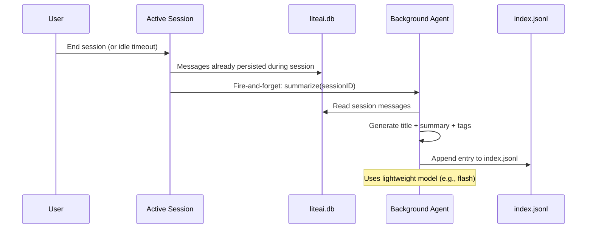
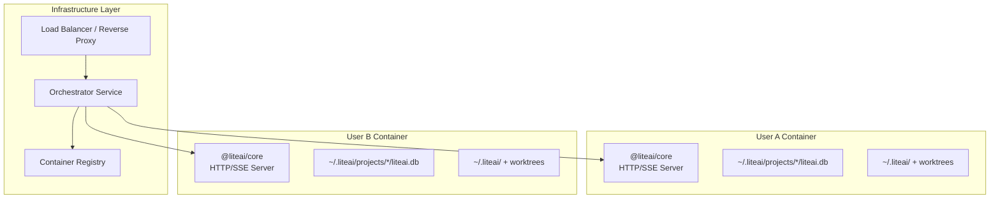

# Project-Scoped Persistence Architecture

> Design document for migrating LiteAI's persistence layer to project-scoped,
> container-isolated, hybrid DB+filesystem architecture.

## 1. Problem Statement

LiteAI's agent memory is monolithic — all projects, sessions, and histories live in a single global SQLite database. This creates:

- No project-level data isolation
- No portability (can't move/backup a project's AI context)
- No clear multi-user isolation model
- Agent memory is not part of the project (can't be committed to git)
- No conversation history recall across sessions

## 2. Architectural Decisions

### 2.1 Multi-Tenant Isolation: Container Per User

**Decision:** Each user gets their own container/VM with an isolated runtime.

**Rationale:** LiteAI agents execute developer tools — shell commands, git operations, file I/O — that inherently require per-user credentials and filesystem access. Row-level security (RLS) in a shared process cannot safely manage multiple users' SSH keys, git configs, or shell environments simultaneously.

| Concern | Container per User |
|---|---|
| Shell execution | ✅ Native — runs as user |
| Git credentials | ✅ User's `~/.ssh`, `~/.gitconfig` |
| Filesystem access | ✅ Native OS permissions |
| Data isolation | ✅ Guaranteed by OS/container |
| Code complexity | ✅ Zero multi-tenant logic in `packages/core` |

**Implication:** `packages/core` remains a **single-user, multi-project backend** — one core process per container, handling multiple projects simultaneously. A user can have multiple UI/CLI sessions pointing at different projects, all served by the same container. Multi-user orchestration is an infrastructure concern (container lifecycle), not a core concern.

> **Why NOT single-project?** A developer works on multiple projects concurrently. Spinning up separate containers per project would waste resources and fragment the user's environment (SSH keys, git config, shell history). The container boundary isolates *users*, not projects. Project isolation is achieved via `project_id` scoping in the database and per-project filesystem directories.

### 2.2 Hybrid Persistence: Single SQLite + Filesystem Memory

**Decision:** One global SQLite database for all structured/relational data (scoped by `project_id`). Human-readable, git-committable artifacts use the filesystem.

**In global SQLite** (`~/.liteai/liteai.db`):
- Project metadata (id, path, name, timestamps)
- Sessions (id, project_id, title, slug, timestamps, mode)
- Messages + Parts (full chat history)
- FTS5 index (`message_fts`)
- Permissions, Todos
- Checkpoints (serialized for cross-restart resume)

> **Why single DB, not DB-per-project?** See §8.1 for the full evaluation. Summary: a single-user
> backend gains nothing from physical DB isolation — `project_id` WHERE clauses provide logical
> isolation with zero migration cost, trivial cross-project session listing, and simpler connection
> management.

**On filesystem** (user-private under `~/.liteai/projects/<id>/`):
- Agent memory (`memory/MEMORY.md` + topic files) → **user-private**
- Conversation history index (`conversation-history/index.jsonl`) → **user-private**
- File snapshots (`snapshot/`) → **user-private**

**On filesystem** (in project worktree `.liteai/`):
- Skills/custom tools → **git-committable**
- Project settings → **git-committable**

### 2.3 Project Registry: Directory Scan

**Decision:** No `projects.json` registry file. Discover projects by scanning `~/.liteai/projects/` at startup.

**Rationale:** Project metadata is stored in the global `liteai.db` (path, name, timestamps). The `~/.liteai/projects/` directory scan validates that filesystem artifacts (memory, conversation history) still exist. The DB is the source of truth for project listing.

**Project ID derivation:** SHA-256 hash of the canonical git root (or worktree path if not a git repo), truncated to 12 hex chars. Worktrees sharing a git root share a project ID.

---

## 3. Directory Structure

```
~/.liteai/                                    # Global user home (Brand.home)
├── settings.json                             # Global user settings
├── AGENTS.md                                 # Global user instructions (context, not memory)
├── liteai.db                                 # Single SQLite: all projects, sessions, messages, FTS
├── projects/
│   └── <project-id>/                         # Per-project filesystem data (private to user)
│       ├── memory/                           # Agent memory (user-private, NOT in git)
│       │   ├── MEMORY.md                     # Memory index (loaded into system prompt)
│       │   └── <topic>.md                    # Topic files (accessed JIT by agent via read_file)
│       ├── conversation-history/             # Summarized conversation index
│       │   └── index.jsonl                   # Append-only: {id, title, summary, tags, ts}
│       └── snapshot/                         # Git-based file checkpoints
│           └── .git/
│
<project-worktree>/                           # The actual project directory
└── .liteai/                                  # Git-committable project config
    ├── settings.json                         # Project settings
    ├── skills/                               # Custom project skills
    │   └── <skill-name>/
    │       └── SKILL.md
    └── agents/                               # Custom agent definitions
```

> **No worktree memory.** Both Claude Code and Gemini CLI keep agent memory
> outside the worktree (user-private). Only context instructions (AGENTS.md)
> live in the worktree. See §4.2–4.3 for detailed references.

---

## 4. Context Instructions vs Agent Memory

There are **two distinct systems** that superficially look similar but serve fundamentally different purposes. Mixing them up is the most common design mistake in AI coding tools.

### 4.1 The Two Systems

```
┌─────────────────────────────────────────────────────────────────────┐
│  CONTEXT INSTRUCTIONS (Static, Human-Authored)                     │
│  Files: AGENTS.md / GEMINI.md / CLAUDE.md / .claude/rules/*.md    │
│  Purpose: Rules, constraints, project conventions                  │
│  Written by: Humans (developers)                                   │
│  Loaded: Into system prompt at session start                       │
│  Mutability: Read-only for agents (humans edit via git)            │
│  Git: ✅ Always committed                                         │
├─────────────────────────────────────────────────────────────────────┤
│  AGENT MEMORY (Dynamic, Agent-Written)                             │
│  Files: MEMORY.md + topic files in memory/ directory               │
│  Purpose: Learned knowledge, user preferences, project state       │
│  Written by: Agents (via save_memory tool or background extraction)│
│  Loaded: Into system prompt at session start + JIT                 │
│  Mutability: Read/write for agents                                 │
│  Git: Depends on scope (project=yes, user=no)                     │
└─────────────────────────────────────────────────────────────────────┘
```

### 4.2 How Claude Code Separates Them

**CLAUDE.md (Context Instructions):**
- Loaded from: `~/.claude/CLAUDE.md` (global), `<worktree>/CLAUDE.md` + `.claude/rules/*.md` (project), `CLAUDE.local.md` (local)
- Written by: Humans only. Agent has NO write access to CLAUDE.md
- Purpose: "Codebase and user instructions... you MUST follow them exactly as written"
- Content: Build commands, coding style, forbidden patterns, project conventions

**MEMORY.md (Agent Memory / "memdir"):**
- Stored at: `~/.claude/projects/<sanitized-git-root>/memory/MEMORY.md` (always private, never in worktree)
- Written by: Agent autonomously (via background extraction or `save_memory` tool)
- Purpose: "Context NOT derivable from the current project state"
- Content: 4 typed categories: `user` (who the user is), `feedback` (corrections/confirmations), `project` (ongoing work/goals), `reference` (external system pointers)
- Explicit exclusions: "Code patterns, conventions, architecture, file paths... can be derived by reading the project" — i.e., don't duplicate what CLAUDE.md already covers
- Index cap: 200 lines / 25KB max for MEMORY.md entrypoint, with overflow into topic files

**Key insight:** Claude Code NEVER puts agent memory in the worktree. `MEMORY.md` lives in `~/.claude/projects/<id>/memory/`, always private. Only `CLAUDE.md` is in the worktree.

### 4.3 How Gemini CLI Separates Them

**GEMINI.md (Context Instructions):**
- Loaded from: `~/.gemini/GEMINI.md` (global), `<worktree>/GEMINI.md` (project, recursive up dirs), extension-provided files
- Written by: Humans only
- Purpose: Static project instructions injected into system prompt
- Supports JIT: subdirectory `GEMINI.md` files loaded lazily when agent accesses a path

**User Project Memory (save_memory tool):**
- Stored at: `~/.gemini/tmp/<project-id>/memory/MEMORY.md`
- Written by: Agent via `save_memory` tool (appends `- fact` lines under `## Gemini Added Memories` header)
- Always private (under `~/.gemini/`, not in worktree)
- Sanitized for injection attacks (XML tags collapsed, newlines stripped)

**Skill Extraction (Background Memory):**
- Stored at: `~/.gemini/tmp/<project-id>/skills/` (inbox for review)
- Written by: Background subagent (scans past sessions after idle period)
- Separate from `save_memory` — this is about extracting reusable *skills*, not facts

### 4.4 LiteAI's Current System: Per-Agent Memory

LiteAI currently has:

**AGENTS.md (Context Instructions):**
- Loaded from: `~/.liteai/AGENTS.md` (global), `<worktree>/AGENTS.md` (project, traverses up)
- Platform-aware: different platforms can register their own instruction filenames
- Written by: Humans only

**Per-Agent Memory (via `AgentMemory` namespace):**
- Each agent type (e.g., `coder`, `reviewer`) gets its own memory directory
- 3 scopes: `user` (`~/.liteai/memory/<agent>/`), `project` (`<worktree>/.liteai/memory/<agent>/`), `local` (worktree-specific)
- Written by: Agent via `memory_read`, `memory_write`, `memory_edit` tools
- Supports snapshot: project memory can be copied to local for private overrides

### 4.5 Proposed Design: LiteAI v-Next

Keeping the two systems **strictly separate**:

#### Context Instructions (AGENTS.md) — No Changes Needed
```
~/.liteai/AGENTS.md                          # Global user instructions
<worktree>/AGENTS.md                          # Project instructions (git-committed)
<worktree>/.liteai/rules/*.md                 # Per-topic rules (git-committed)
```
- Loaded into system prompt at session start
- JIT loading for subdirectory instruction files (when agent touches a path)
- Agent has NO write access

#### Agent Memory (MEMORY.md) — Simplified

**Decision: No per-agent memory. No worktree memory.**

Both Claude Code and Gemini CLI use a single unified memory system where only the root/main agent stores and loads memory. Neither uses per-agent memory directories. We follow the same approach.

**Decision: Memory is user-private by default.**

Both Claude Code (`~/.claude/projects/<id>/memory/`) and Gemini CLI (`~/.gemini/tmp/<id>/memory/`) store agent memory **outside the worktree**, always user-private. We follow this pattern. Team-sharing is an opt-in configuration (see §8.2).

```
~/.liteai/projects/<id>/memory/               # User-private memory (NOT in git)
├── MEMORY.md                                 # Memory INDEX (loaded into system prompt)
├── user-profile.md                           # Topic: who the user is
├── feedback.md                               # Topic: corrections and confirmations
├── project-context.md                        # Topic: ongoing work, goals, decisions
└── references.md                             # Topic: pointers to external systems
```

**MEMORY.md is an index, not the memory itself.** Following Claude Code's pattern:
- `MEMORY.md` contains one-line pointers: `- [User Profile](user-profile.md) — senior engineer, bun preference`
- Topic files (`user-profile.md`, `feedback.md`, etc.) contain the actual memory content
- Capped at ~200 lines / 25KB (Claude Code's limit) to avoid bloating the system prompt
- Agent accesses topic files JIT via `read_file` / `write_file` when it needs full details

**Resolution chain at session start:**
```
Starting session for project X:

1. Load global instructions:    ~/.liteai/AGENTS.md
2. Load project instructions:   <worktree>/AGENTS.md + .liteai/rules/*.md
3. Load memory INDEX:           ~/.liteai/projects/<id>/memory/MEMORY.md  ← index only
4. Load conversation history:   ~/.liteai/projects/<id>/conversation-history/index.jsonl (last 50)
```

**Topic files are NOT pre-loaded.** The agent reads them on-demand:
```
During session, agent decides it needs user context:
  → read_file(~/.liteai/projects/<id>/memory/user-profile.md)

During session, agent learns user prefers bun:
  → write_file(~/.liteai/projects/<id>/memory/user-profile.md, updated content)
  → update MEMORY.md index if new topic file created
```

> **No cross-project memory.** Memory is scoped to the project because agents
> learn about the project — architecture, team decisions, ongoing work. User
> preferences (coding style, communication style) are `user`-type memories
> stored per-project. This matches Claude Code where all memory is
> project-scoped under `~/.claude/projects/<sanitized-path>/memory/`.

**Memory types** (following Claude Code's taxonomy — ref: `memoryTypes.ts`):
- `user` — who the user is, their expertise, preferences (always private)
- `feedback` — corrections and confirmed approaches (default private)
- `project` — ongoing work, goals, deadlines, decisions (default private, optionally team)
- `reference` — pointers to external systems (default private, optionally team)

**What NOT to save** (ref: Claude Code `memoryTypes.ts:183-195`):
- Code patterns, conventions, architecture, file paths — derivable from the project
- Git history, recent changes — `git log`/`git blame` are authoritative
- Debugging solutions — the fix is in the code, the commit has context
- Anything already documented in AGENTS.md files
- Ephemeral task details, in-progress work, current conversation context
- These exclusions apply **even when the user explicitly asks** to save

### 4.6 Memory Access Control

**Only the root/main agent** has access to the memory tools (`memory_read`, `memory_write`, `memory_edit`). Subagents inherit read-only memory from the parent's context but cannot write to it.

```
Root/Main Agent
├── reads: Instructions (AGENTS.md) + Memory (MEMORY.md + topics)
├── writes: Memory via save_memory tool
│
└── Subagent (e.g., code review, test runner)
    ├── reads: Instructions + Memory (inherited in system prompt)
    ├── writes: NONE to persistent memory
    └── can propose: Memory additions via tool result (parent decides)
```

**Rationale:** Neither Claude Code nor Gemini CLI gives subagents memory write access. Claude Code's `extractMemories.ts:532` explicitly checks `if (context.toolUseContext.agentId) return` — skipping subagents entirely.

### 4.7 Background Memory Extraction

Two patterns from reference implementations:

**Claude Code pattern (Session Memory / extract-memories):**
1. Trigger: Token threshold + tool-call threshold met during active session
2. Forked subagent runs in background, updates `MEMORY.md` in-place
3. 4 typed categories: user, feedback, project, reference
4. Explicitly excludes code patterns (derivable from project)

**Gemini CLI pattern (Skill Extraction):**
1. Trigger: Session idle for 3+ hours, 10+ user messages
2. Background subagent scans completed sessions
3. Extracts reusable *skills* (not facts) — writes to skills inbox
4. User reviews via `/memory inbox` command

**LiteAI approach:** Both systems coexist with different triggers and outputs:

#### Memory Extraction (during session)
- **Trigger:** After each query loop completes (following Claude Code's pattern)
- **Process:** Forked subagent reviews new messages since last extraction
- **Output:** Updates `~/.liteai/projects/<id>/memory/` (index + topic files)
- **Scope:** Only root agent; skips if agent already wrote to memory in this turn
- **Explicit command:** `/remember <fact>` → agent writes to memory immediately

#### Skills Extraction (post-session)
- **Trigger:** On session end, if session had 10+ user messages and contained tool usage patterns
- **Process:** Background subagent scans completed session from DB
- **What it looks for:**
  - Repeating multi-step workflows (e.g., "typecheck → lint → test" sequences)
  - Custom tool chains that could be abstracted into a skill
  - Domain-specific procedures the agent learned during the session
- **Output:** Writes proposed skill to inbox directory:

```
~/.liteai/projects/<id>/skills-inbox/
└── <skill-name>/
    ├── SKILL.md              # Skill definition (name, description, steps)
    └── metadata.json         # Source session ID, extraction timestamp, confidence
```

- **User review:** `/skills inbox` command lists pending extractions
  - `/skills accept <name>` → moves to `<worktree>/.liteai/skills/<name>/` (git-committable)
  - `/skills reject <name>` → removes from inbox
  - `/skills edit <name>` → opens for editing before accepting

**Skills vs Memory distinction:**
- **Memory** = facts and context (who the user is, what feedback they gave, what they're working on)
- **Skills** = reusable procedures (how to deploy, how to run a specific test workflow, how to handle a particular error pattern)

---

## 5. Conversation History & Recall

### 5.1 Overview

Conversation history enables agents to recall past interactions. This is a **summarized index layer** on top of the existing database, not a duplicate of the raw message storage.

**The DB already stores full message history** (sessions, messages, parts). The conversation history system adds:
- A lightweight `index.jsonl` with titles + summaries for **context injection**
- Agent-accessible metadata so the agent knows what was discussed before

### 5.2 Storage Format

```
~/.liteai/projects/<project-id>/conversation-history/
└── index.jsonl                    # Lightweight manifest (append-only, last 50 loaded)
```

**`index.jsonl`** — One line per conversation, appended when session ends:
```jsonc
{
  "id": "session-abc123",
  "title": "Fixing memory leak in TUI",           // Background-generated
  "summary": "Diagnosed RSS growth caused by...",  // Background-generated
  "tags": ["debugging", "ink", "memory"],          // Auto-extracted
  "startedAt": "2026-05-07T07:08:38Z",
  "endedAt": "2026-05-07T08:14:48Z",
  "messageCount": 42
}
```

> **No separate transcript files.** Full conversation recall reads from the
> existing DB (`messages` + `parts` tables). The index only stores the summary
> for lightweight context injection.

### 5.3 Summarization Pipeline



**Title generation:** The summarizer extracts a concise title from the first user message and the overall conversation flow.

**Summary generation:** A 2-4 sentence summary capturing:
- What was the objective
- What was accomplished
- Key files/components touched
- Unresolved issues or next steps

### 5.4 Recall Mechanism

#### Ambient Awareness (via index)
The last 50 entries from `index.jsonl` are loaded into the system prompt at session start:

```markdown
<conversation_history>
You have access to previous conversations for this project.

## Recent Conversations (last 50)
1. [2026-05-07] Fixing memory leak in TUI
   Summary: Diagnosed RSS growth caused by unstable selectors...

2. [2026-05-06] Dynamic Model Resolution Update
   Summary: Refactored model fetching to prioritize local APIs...
</conversation_history>
```

#### Full Recall (from DB)
When the agent needs full conversation details, it reads from the database using the session ID from the index. This is a DB query, not a file read.

---

## 6. Orchestration Layer

### 6.1 Architecture



### 6.2 Container Lifecycle

| Phase | Action | Implementation |
|---|---|---|
| **Provision** | User signs up / first login | Orchestrator creates container from base image |
| **Start** | User opens IDE / web client | Orchestrator starts container, mounts volumes |
| **Route** | Client connects to `/api/...` | Reverse proxy routes by user ID → container |
| **Suspend** | Idle timeout (30 min) | Container paused (not destroyed), volumes persist |
| **Resume** | User reconnects | Container unpaused, SSE reconnects |
| **Destroy** | User deletes account | Container + volumes destroyed |

### 6.3 Volume Mounts

Each container mounts:

| Mount | Source | Target | Purpose |
|---|---|---|---|
| User home | `vol-<user-id>-home` | `/home/<user>` | SSH keys, git config, `~/.liteai/` |
| Projects | `vol-<user-id>-projects` | `/workspace` | Git worktrees (project source code) |

### 6.4 Implementation Options

#### Option A: Docker Compose (Small Team / Self-Hosted)
```yaml
# docker-compose.override.yml (per user)
services:
  liteai-user-alice:
    image: liteai/core:latest
    volumes:
      - alice-home:/home/alice
      - alice-projects:/workspace
    environment:
      - LITEAI_USER=alice
    ports:
      - "3001:3000"
```

#### Option B: Kubernetes (Enterprise / Cloud)
```yaml
apiVersion: apps/v1
kind: Deployment
metadata:
  name: liteai-user-{{ .user_id }}
spec:
  replicas: 1
  template:
    spec:
      containers:
        - name: core
          image: liteai/core:latest
          volumeMounts:
            - name: user-home
              mountPath: /home/{{ .user_id }}
            - name: user-projects
              mountPath: /workspace
      volumes:
        - name: user-home
          persistentVolumeClaim:
            claimName: pvc-{{ .user_id }}-home
        - name: user-projects
          persistentVolumeClaim:
            claimName: pvc-{{ .user_id }}-projects
```

#### Option C: Defer (Local Single-User)
For the immediate use case (local CLI/VSCode), no orchestration is needed. `packages/core` runs directly on the developer's machine. The container architecture is a deployment concern for when multi-user is needed.

### 6.5 Routing

The orchestrator exposes a thin API proxy:

```
Client Request:
  POST /api/v1/session
  Authorization: Bearer <jwt-with-user-id>

Proxy Logic:
  1. Extract user_id from JWT
  2. Lookup container endpoint for user_id
  3. If no container → provision one (or return 503)
  4. Forward request to container
  5. For SSE: maintain persistent connection (WebSocket bridge if needed)
```

### 6.6 What to Implement Now vs Defer

| Component | Now | Defer |
|---|---|---|
| Per-project database scoping | ✅ (already have `project_id`) | |
| Filesystem memory layer | ✅ | |
| Conversation history + recall | ✅ | |
| Background memory extraction | ✅ | |
| Background skills extraction | ✅ | |
| Directory scan for project registry | ✅ | |
| Container orchestrator service | | ✅ Phase 2 |
| Reverse proxy / routing | | ✅ Phase 2 |
| Volume provisioning automation | | ✅ Phase 2 |
| Kubernetes manifests | | ✅ Phase 3 |

---

## 7. Migration Strategy

### 7.1 Phase 1: Filesystem Structure + Memory

1. Create `~/.liteai/projects/<id>/` directory structure on project registration
2. Create `memory/` subdirectory with initial empty `MEMORY.md`
3. Implement `save_memory` tool with type parameter (user/feedback/project/reference)
4. Remove per-agent memory (`AgentMemory` namespace, `memory/<agent>/` directories)
5. Restrict memory tools to root/main agent only (check `agentId` before allowing)
6. Inject `MEMORY.md` index into system prompt at session start

### 7.2 Phase 2: Conversation History

1. Implement background summarization agent (fires on session end)
2. Background agent reads session messages from DB, generates title + summary + tags
3. Create `~/.liteai/projects/<id>/conversation-history/` on first summary
4. Append entry to `index.jsonl`
5. Load last 50 entries from index into system prompt at session start
6. Implement DB-backed full recall for when agent needs complete conversation details

### 7.3 Phase 3: Background Extraction

1. Implement memory extraction (forked agent, runs during session)
2. Implement skills extraction (background agent, runs post-session)
3. Implement `/skills inbox`, `/skills accept`, `/skills reject` commands
4. Implement `/remember <fact>` explicit memory command

> **No DB migration needed.** The current global `liteai.db` with `project_id` columns
> is the target architecture. We add filesystem layers (memory, conversation history,
> skills inbox) alongside the existing DB, not replacing it.

---

## 8. Resolved Design Decisions

1. **Conversation history size:** Keep last **50 conversations** in `index.jsonl`. Older entries remain on disk but are not loaded into context. No cold storage rotation.

2. **FTS scope:** Search is **open-project only**. FTS queries include `WHERE project_id = ?`. No cross-project search.

3. **Team memory conflicts:** **No special handling.** Memory is user-private (under `~/.liteai/`), so git conflicts don't apply.

4. **Checkpoint persistence:** **Yes.** Serialize checkpoints to `liteai.db` for cross-restart session resume.

5. **Per-agent memory:** **Removed.** Only root/main agent stores and loads memory. Subagents inherit read-only memory from parent.

6. **Database architecture:** **Single global DB** (`~/.liteai/liteai.db`). See §8.1 for evaluation.

7. **Memory scope:** Default is **user-level** (`~/.liteai/projects/<id>/memory/`). Memory types `user` and `feedback` always go to user level. Types `project` and `reference` go to user level by default, with opt-in team sharing.

8. **Conversation history vs DB:** Summarized index (`index.jsonl`) on top of existing DB. Full recall reads from DB.

9. **Skills extraction:** Post-session background agent extracts reusable skills to inbox. User reviews and accepts/rejects before promotion to project's `.liteai/skills/`.

---

### 8.1 Single DB vs DB-per-Project Evaluation

| Concern | Single DB (`~/.liteai/liteai.db`) | DB per project (`projects/<id>/liteai.db`) |
|---|---|---|
| **Connection mgmt** | ✅ One connection, simple | ❌ Pool of connections, lifecycle |
| **Cross-project queries** | ✅ `SELECT * FROM sessions ORDER BY updated_at` | ❌ Must scan N databases |
| **Session listing (UI)** | ✅ One query shows all projects | ❌ Need aggregation layer |
| **Migration from current** | ✅ **Zero** — already have `project_id` | ❌ Must split DB, update callers |
| **Project isolation** | ⚠️ Logical (`WHERE project_id = ?`) | ✅ Physical (separate files) |
| **Corruption blast radius** | ⚠️ One corrupt DB = all projects | ✅ One corrupt DB = one project |
| **SQLite size** | ⚠️ Grows with all projects | ✅ Small per-project files |
| **Portability** | ⚠️ Can't export one project's data | ✅ Self-contained project dir |
| **Backup** | ⚠️ All or nothing | ✅ Per-project backup |

**Decision: Single DB.** For a single-user backend, per-project DB isolation solves a problem that doesn't exist (user isolation is at the container level). The downsides of single DB (corruption, size) are edge cases, while the benefits (zero migration, trivial cross-project queries, simpler code) are immediate and significant.

**Implementation:** The current `Database.Path` continues to resolve to `~/.liteai/liteai.db`. All queries use `WHERE project_id = ?` for scoping. No code changes needed for the DB layer.

---

### 8.2 DB Connection Lifecycle

The current `Database.Path` resolves to `~/.liteai/liteai.db`. **No changes needed.**

One connection serves all projects. Project scoping via `WHERE project_id = ?`:
```
Core starts → opens ~/.liteai/liteai.db (single connection, WAL mode)
User opens project A → all queries include WHERE project_id = <id-A>
User opens project B → same connection, WHERE project_id = <id-B>
Both projects served simultaneously via same DB connection
```

### 8.3 Memory Scope Configuration

Following Claude Code's pattern where memory type determines scope:

| Memory Type | Default Scope | Configurable? | Reference |
|---|---|---|---|
| `user` | User-private (`~/.liteai/projects/<id>/memory/`) | No — always private | Claude Code: "always private" (memoryTypes.ts:45) |
| `feedback` | User-private | Optionally team (if clearly a project convention) | Claude Code: "default to private" (memoryTypes.ts:59) |
| `project` | User-private | Optionally team (bias toward team) | Claude Code: "private or team, strongly bias toward team" (memoryTypes.ts:77) |
| `reference` | User-private | Optionally team | Claude Code: "usually team" (memoryTypes.ts:92) |

**Claude Code reference (memoryTypes.ts):**
> "Code patterns, conventions, architecture, file paths, or project structure — these can be derived by reading the current project state." — These are explicitly excluded from memory. They belong in CLAUDE.md (our AGENTS.md).

> "Ephemeral task details: in-progress work, temporary state, current conversation context." — Also excluded. These belong in session state, not memory.

> "These exclusions apply even when the user explicitly asks you to save." — The agent should push back on saving derivable information.
