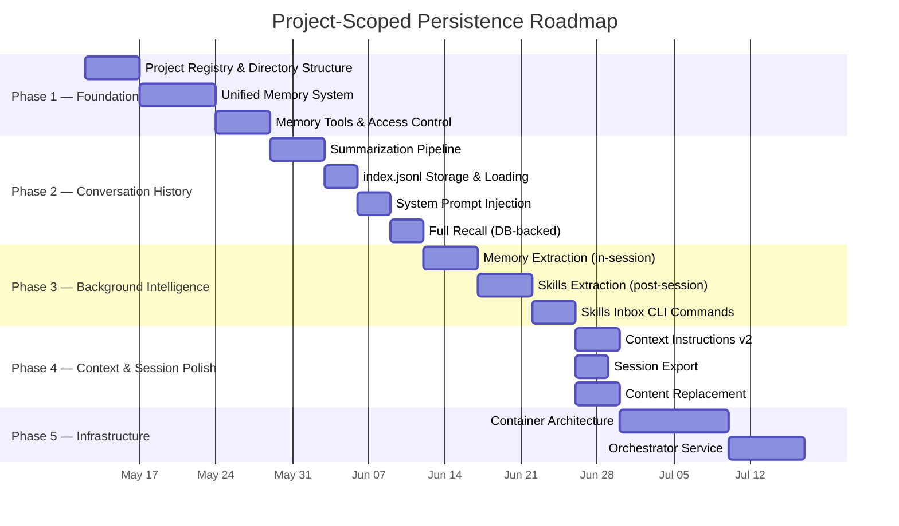
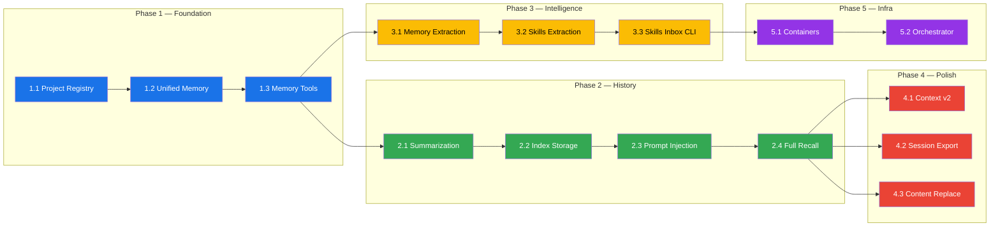

# Project-Scoped Persistence — Implementation Roadmap

> Phased execution plan derived from [00-architecture.md](./00-architecture.md) and [01-feature-comparison.md](./01-feature-comparison.md).
> Last updated: 2026-05-09

---

## Overview

This roadmap breaks the project-scoped persistence migration into **5 phases**, ordered by dependency chain and value delivery. Each phase is self-contained — it produces a shippable increment that can be tested and validated independently before the next phase begins.



---

## Phase 1 — Foundation: Project Registry & Unified Memory

**Goal:** Establish the per-project filesystem structure and replace the per-agent memory system with a unified, user-private memory layer.

**Architectural References:** §2.2, §2.3, §3, §4.5, §4.6, §7.1

**Why First:** Every subsequent phase depends on the `~/.liteai/projects/<id>/` directory structure and the unified memory model. This is the load-bearing foundation.

---

### 1.1 — Project Registry & Directory Bootstrap

> 📋 **Detailed implementation plan:** [03-phase1a-project-registry.md](./03-phase1a-project-registry.md)

**Deliverables:**
- [ ] Project ID derivation: SHA-256 of canonical git root (or worktree path), truncated to 12 hex chars
- [ ] `~/.liteai/projects/<id>/` directory auto-creation on project registration
- [ ] Subdirectory scaffolding: `memory/`, `conversation-history/`, `snapshot/`
- [ ] Startup scan of `~/.liteai/projects/` to validate filesystem artifacts against DB records
- [ ] `Brand.home` / `Brand.projectDir(id)` path resolution utilities

**Key Decisions:**
| Decision | Choice | Rationale |
|---|---|---|
| Project ID source | SHA-256(git root) truncated 12 hex | Deterministic, collision-resistant, stable across renames |
| Registry mechanism | DB + directory scan (no `projects.json`) | DB is source of truth; scan validates filesystem |
| Worktree handling | Shared ID for same git root | Worktrees sharing a root share a project ID |

**Verification:**
- Unit test: project ID is deterministic and stable across invocations
- Unit test: directory structure created correctly for new projects
- Integration test: startup scan detects orphaned directories and missing projects

---

### 1.2 — Unified Memory System

> 📋 **Detailed implementation plan:** [04-phase1b-unified-memory.md](./04-phase1b-unified-memory.md)

**Deliverables:**
- [ ] Create `~/.liteai/projects/<id>/memory/MEMORY.md` (index file, capped at 200 lines / 25KB)
- [ ] Create default topic files: `user-profile.md`, `feedback.md`, `project-context.md`, `references.md`
- [ ] Memory type taxonomy: `user`, `feedback`, `project`, `reference`
- [ ] `MEMORY.md` as index (one-line pointers to topic files), not content storage
- [ ] Inject `MEMORY.md` index into system prompt at session start (after instructions, before history)

**What NOT to Save (Enforced):**
- Code patterns, conventions, architecture, file paths (derivable from project)
- Git history, recent changes (git is authoritative)
- Debugging solutions (the fix is in the code)
- Anything already in AGENTS.md
- Ephemeral task details, current conversation context
- These exclusions apply **even when the user explicitly asks**

**Verification:**
- Unit test: memory index respects 200-line / 25KB cap
- Unit test: memory type classification produces correct topic file routing
- Integration test: system prompt includes memory index at session start

---

### 1.3 — Memory Tools & Access Control

> 📋 **Detailed implementation plan:** [05-phase1c-memory-tools.md](./05-phase1c-memory-tools.md)

**Deliverables:**
- [ ] New `save_memory` tool with `type` parameter (user / feedback / project / reference)
- [ ] JIT topic file access via `read_file` / `write_file` (no pre-loading of topic files)
- [ ] Root-agent-only access control: check `agentId` before allowing memory writes
- [ ] Subagent memory inheritance: read-only memory in system prompt, no write access
- [ ] `/remember <fact>` command: explicit user-triggered memory save
- [ ] **Remove** `AgentMemory` namespace and per-agent memory directories (`memory/<agent>/`)

**Access Control Matrix:**

| Agent Type | Read Memory | Write Memory | Via |
|---|:---:|:---:|---|
| Root / Main | ✅ | ✅ | `save_memory` tool, `read_file` / `write_file` |
| Subagent | ✅ (inherited) | ❌ | System prompt injection only |
| Subagent proposal | — | ⚠️ Propose only | Tool result → parent decides |

**Breaking Changes:**
- `AgentMemory` namespace removed entirely
- `memory_read`, `memory_write`, `memory_edit` tools replaced by `save_memory` + file I/O
- Per-agent memory directories (`memory/<agent>/`) no longer created or scanned
- Subagents lose direct memory write access

**Verification:**
- Unit test: `save_memory` routes to correct topic file by type
- Unit test: subagent memory write attempts are rejected
- Integration test: end-to-end memory save → restart → memory loaded in prompt
- Regression test: existing sessions don't break with legacy memory directories removed

---

## Phase 2 — Conversation History & Recall

**Goal:** Enable agents to recall past interactions via a lightweight summarized index layer on top of the existing SQLite message store.

**Architectural References:** §5.1–5.4, §7.2

**Why Second:** Memory (Phase 1) gives agents project knowledge. Conversation history gives agents temporal context — what was discussed before, what was resolved, what's still open. Together they form the complete agent context.

---

### 2.1 — Summarization Pipeline

**Deliverables:**
- [ ] Background summarization agent: fires on session end (or idle timeout)
- [ ] Reads session messages from `liteai.db` (existing `messages` + `parts` tables)
- [ ] Generates: title (concise), summary (2–4 sentences), tags (auto-extracted)
- [ ] Uses lightweight model (e.g., flash / mini) for cost efficiency
- [ ] Fire-and-forget: session end is not blocked by summarization

**Summary Content (per entry):**
```jsonc
{
  "id": "session-abc123",
  "title": "Fixing memory leak in TUI",
  "summary": "Diagnosed RSS growth caused by unstable selectors...",
  "tags": ["debugging", "ink", "memory"],
  "startedAt": "2026-05-07T07:08:38Z",
  "endedAt": "2026-05-07T08:14:48Z",
  "messageCount": 42
}
```

**Verification:**
- Unit test: summarizer produces valid JSON entries with all required fields
- Unit test: summarizer handles edge cases (empty sessions, single-message sessions)
- Integration test: session end triggers background summarization without blocking

---

### 2.2 — Index Storage & Loading

**Deliverables:**
- [ ] `~/.liteai/projects/<id>/conversation-history/index.jsonl` — append-only, one line per conversation
- [ ] Directory auto-creation on first summary write
- [ ] Load last 50 entries from `index.jsonl` at session start
- [ ] Entries beyond 50 remain on disk but are not loaded into context

**Verification:**
- Unit test: append-only semantics (no in-place edits)
- Unit test: loading caps at 50 entries
- Performance test: loading 1000+ entry index remains fast (< 50ms)

---

### 2.3 — System Prompt Injection

**Deliverables:**
- [ ] Inject conversation history block into system prompt after memory index
- [ ] Format: numbered list with date, title, summary
- [ ] Resolution chain order: Instructions → Memory → Conversation History

```markdown
<conversation_history>
You have access to previous conversations for this project.

## Recent Conversations (last 50)
1. [2026-05-07] Fixing memory leak in TUI
   Summary: Diagnosed RSS growth caused by unstable selectors...

2. [2026-05-06] Dynamic Model Resolution Update
   Summary: Refactored model fetching to prioritize local APIs...
</conversation_history>
```

**Verification:**
- Integration test: system prompt contains conversation history block
- Unit test: formatting matches expected template

---

### 2.4 — Full Recall (DB-Backed)

**Deliverables:**
- [ ] Agent can request full conversation details using session ID from the index
- [ ] Reads from existing DB tables (`sessions`, `messages`, `parts`) — not file reads
- [ ] Tool or internal API: `recall_conversation(sessionId)` → returns formatted transcript
- [ ] Respects project scoping: `WHERE project_id = ?`

**Verification:**
- Unit test: recall returns messages in chronological order
- Unit test: cross-project recall is blocked (project_id filter enforced)
- Integration test: agent can reference a past conversation by ID from the index

---

## Phase 3 — Background Intelligence: Memory & Skills Extraction

**Goal:** Implement autonomous background agents that extract persistent knowledge (memory) during sessions and reusable procedures (skills) after sessions.

**Architectural References:** §4.7, §7.3

**Why Third:** Phases 1–2 establish the storage and retrieval layers. Phase 3 populates them autonomously, closing the loop from "agent uses memory" to "agent builds memory."

---

### 3.1 — Memory Extraction (In-Session)

**Deliverables:**
- [ ] Forked subagent runs after each query loop completes (Claude Code pattern)
- [ ] Reviews new messages since last extraction
- [ ] Updates `~/.liteai/projects/<id>/memory/` (index + topic files)
- [ ] Skips extraction if root agent already wrote to memory in this turn
- [ ] Root-agent-only: extraction agent inherits parent context but writes as root
- [ ] Trigger conditions: token threshold + tool-call threshold met during active session

**Design Constraints:**
- Must not block the main response loop
- Must not duplicate information already in AGENTS.md
- Must respect the "What NOT to Save" exclusion list from Phase 1.2
- Must handle concurrent writes safely (append-only or lock-based)

**Verification:**
- Unit test: extraction identifies correct memory type for each fact
- Unit test: extraction skips when agent already wrote memory
- Integration test: extraction runs in background without blocking response
- Integration test: extracted memories appear in next session's system prompt

---

### 3.2 — Skills Extraction (Post-Session)

**Deliverables:**
- [ ] Background subagent fires on session end
- [ ] Trigger: session had 10+ user messages AND contained tool usage patterns
- [ ] Scans completed session from DB for repeating multi-step workflows
- [ ] Writes proposed skills to inbox:

```
~/.liteai/projects/<id>/skills-inbox/
└── <skill-name>/
    ├── SKILL.md              # Skill definition (name, description, steps)
    └── metadata.json         # Source session ID, extraction timestamp, confidence
```

**What It Looks For:**
- Repeating multi-step workflows (e.g., "typecheck → lint → test" sequences)
- Custom tool chains that could be abstracted
- Domain-specific procedures learned during the session

**Skills vs Memory Distinction:**
| | Memory | Skills |
|---|---|---|
| **Content** | Facts and context | Reusable procedures |
| **Examples** | "User prefers bun" | "How to deploy: run X, then Y, then Z" |
| **Trigger** | During session | After session ends |
| **Storage** | `memory/` | `skills-inbox/` → `.liteai/skills/` |

**Verification:**
- Unit test: trigger conditions correctly filter sessions (10+ messages, tool usage)
- Unit test: generated SKILL.md follows valid format
- Integration test: skills inbox populated after qualifying session ends

---

### 3.3 — Skills Inbox CLI Commands

**Deliverables:**
- [ ] `/skills inbox` — list pending skill extractions with metadata
- [ ] `/skills accept <name>` — move from inbox to `<worktree>/.liteai/skills/<name>/` (git-committable)
- [ ] `/skills reject <name>` — remove from inbox
- [ ] `/skills edit <name>` — open for editing before accepting
- [ ] Inbox cleanup: auto-expire rejected/stale entries after configurable period

**Verification:**
- Integration test: full lifecycle — extract → inbox → accept → skill available
- Integration test: rejected skills are removed and not re-proposed
- Unit test: accepted skills appear in correct directory structure

---

## Phase 4 — Context & Session Polish

**Goal:** Close the remaining feature gaps identified in the competitive analysis. These are independent enhancements that build on the foundation from Phases 1–3.

**Architectural References:** §4.5 (rule files, JIT loading), Feature Comparison §6, §9, §11

**Why Fourth:** These are polish items that enhance the experience but don't block the core persistence architecture. They can be parallelized.

---

### 4.1 — Context Instructions v2

**Deliverables:**
- [ ] `.liteai/rules/*.md` — modular rule file organization (closing gap vs Claude Code)
- [ ] JIT / subdirectory instruction loading: load lazily when agent touches a path
- [ ] `AGENTS.local.md` — private local instructions (not committed to git)

**Feature Comparison Gap Closed:**
| Feature | Before | After |
|---|---|---|
| Rule Files | 🔜 | ✅ `.liteai/rules/*.md` |
| JIT / Subdirectory | ❌ | ✅ Lazy loading on path access |
| Local Instructions | ❌ | ✅ `AGENTS.local.md` |

**Verification:**
- Integration test: rule files are loaded and injected into system prompt
- Integration test: subdirectory instructions load only when agent reads from that path
- Unit test: local instructions are excluded from git tracking

---

### 4.2 — Session Export

**Deliverables:**
- [ ] `/export` command: export current session as formatted Markdown
- [ ] Export includes: messages, tool calls (summarized), timestamps
- [ ] Output: clipboard or file path
- [ ] API endpoint: `GET /session/:id/export`

**Feature Comparison Gap Closed:**
| Feature | Before | After |
|---|---|---|
| Session Export | ❌ | ✅ `/export` command + API |

**Verification:**
- Unit test: exported markdown contains all message content
- Integration test: export from CLI and API produce identical output

---

### 4.3 — Content Replacement

**Deliverables:**
- [ ] Store full tool results in DB, inject compressed summary into context window
- [ ] Replacement trigger: tool result exceeds configurable threshold (e.g., 10KB)
- [ ] On-demand expansion: agent can request full result via tool call
- [ ] Integration with existing compaction hooks

**Feature Comparison Gap Closed:**
| Feature | Before | After |
|---|---|---|
| Content Replacement | ❌ | ✅ Full result stored, summary injected |

**Verification:**
- Unit test: large tool results are replaced with summaries
- Unit test: on-demand expansion retrieves full result
- Integration test: context window usage decreases with replacement active

---

## Phase 5 — Infrastructure: Container Orchestration

**Goal:** Enable multi-user deployment via container-per-user isolation. This phase is infrastructure-only — `packages/core` requires **zero changes** (it's already a single-user, multi-project backend).

**Architectural References:** §2.1, §6.1–6.6

**Why Last:** This is a deployment concern, not a core concern. All persistence features (Phases 1–4) work identically in local single-user mode. Container orchestration enables the same architecture for multi-user hosting.

> [!IMPORTANT]
> **Phase 5 is deferred until Phases 1–3 are complete and validated.** It requires no changes to `packages/core`. Implementation priority depends on hosting/deployment timeline.

---

### 5.1 — Container Architecture

**Deliverables:**
- [ ] Base container image: `liteai/core:latest`
- [ ] Volume mount strategy: user-home + project workspace
- [ ] Container lifecycle: provision → start → route → suspend → resume → destroy
- [ ] Idle timeout: 30-minute suspend (container paused, volumes persist)

**Volume Mounts:**
| Mount | Source | Target | Purpose |
|---|---|---|---|
| User home | `vol-<user-id>-home` | `/home/<user>` | SSH keys, git config, `~/.liteai/` |
| Projects | `vol-<user-id>-projects` | `/workspace` | Git worktrees |

---

### 5.2 — Orchestrator Service

**Deliverables:**
- [ ] Thin API proxy: extracts `user_id` from JWT, routes to correct container
- [ ] Container lookup and provisioning (503 if no container and can't provision)
- [ ] SSE connection bridging (WebSocket bridge if needed)
- [ ] Health checks and container status monitoring

**Implementation Options:**
| Option | Target | Notes |
|---|---|---|
| Docker Compose | Small team / self-hosted | Per-user service in compose override |
| Kubernetes | Enterprise / cloud | StatefulSet per user with PVCs |
| Local (no orchestrator) | Single developer | `packages/core` runs directly on machine |

---

## Dependency Graph



---

## Risk Register

| Risk | Impact | Mitigation |
|---|---|---|
| Memory index bloat (MEMORY.md exceeds 25KB) | Inflated system prompts, higher cost | Hard cap at 200 lines / 25KB; overflow into topic files |
| Background extraction races (concurrent writes to memory) | Corrupted memory files | Append-only writes or file-level locking; extraction skips if agent already wrote |
| Skills extraction false positives | Inbox noise, user fatigue | Confidence threshold; auto-expire stale inbox entries |
| `index.jsonl` unbounded growth | Slow startup loading | Only load last 50; older entries remain on disk, not in memory |
| Legacy per-agent memory removal | Breaking existing workflows | Phase 1.3 includes migration path; no adapters (per v-Next mandate) |
| Single DB corruption | All projects affected | WAL mode + periodic backups; corruption is edge case for single-user |

---

## Feature Gap Closure Tracker

Mapping from [01-feature-comparison.md](./01-feature-comparison.md) §LiteAI Gaps to roadmap phases:

| Gap | Phase | Status |
|---|---|---|
| Memory System (per-agent → unified) | Phase 1 | 🔜 |
| Conversation Recall (cross-session injection) | Phase 2 | 🔜 |
| Background Memory Extraction | Phase 3.1 | 🔜 |
| Background Skills Extraction + Inbox | Phase 3.2–3.3 | 🔜 |
| Rule Files (`.liteai/rules/*.md`) | Phase 4.1 | 🔜 |
| JIT / Subdirectory Instructions | Phase 4.1 | 🔜 |
| Session Export | Phase 4.2 | 🔜 |
| Content Replacement | Phase 4.3 | 🔜 |
| Sandbox | **Out of scope** | — |
| Git Workflow (commit/PR/review) | **Out of scope** | — |
| Container-per-user | Phase 5 | 🔜 (deferred) |

> [!NOTE]
> **Sandbox** and **Git Workflow** are not addressed in this roadmap. They are separate architectural domains that should be tracked in their own roadmap documents.
