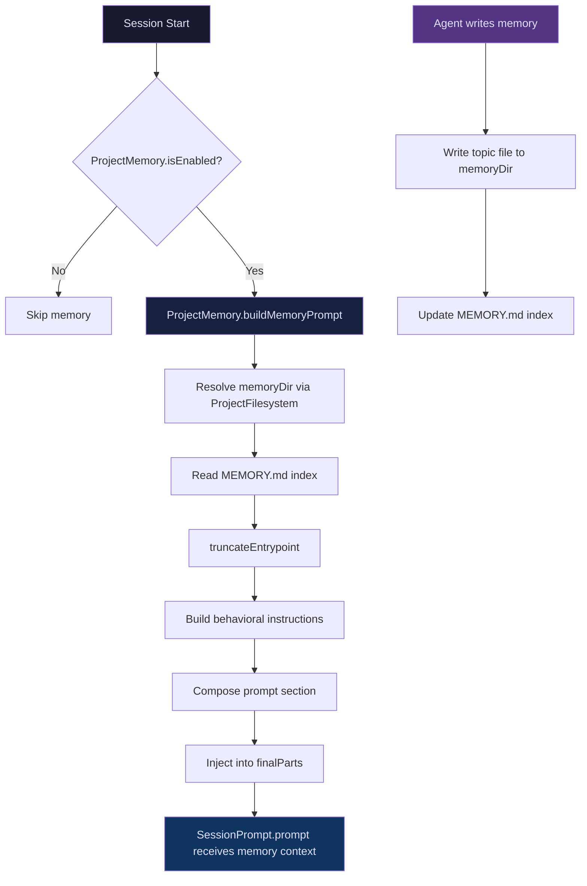

# Phase 1B — Unified Memory System

> Sub-phase of [02-roadmap.md](./02-roadmap.md) Phase 1.
> Dependencies: Phase 1A (project directory scaffold).
> Estimated effort: 8 days.

---

## Goal

Replace the per-agent `AgentMemory` system with a unified, project-scoped memory layer. Memory is stored as markdown files in `~/.liteai/projects/<id>/memory/` using a `MEMORY.md` index + topic files pattern. Memory is owned by the root agent only — sub-agents inherit read-only access via system prompt injection.

---

## Current State (LiteAI)

### What Must Be Replaced

| Component | File | Issue |
|---|---|---|
| `AgentMemory` namespace | [agent/memory.ts](file:///d:/liteai/packages/core/src/agent/memory.ts) | Per-agent scoping; creates `~/.liteai/agents/<type>/memory/` directories. Must be deprecated. |
| `AgentMemory.loadAgentMemoryPrompt()` | [agent/memory.ts#L44-L78](file:///d:/liteai/packages/core/src/agent/memory.ts#L44-L78) | Called from `runner.ts:L331-L340`. Must be redirected to unified memory. |
| `AgentMemory.getAgentMemoryDir()` | [agent/memory.ts#L13-L33](file:///d:/liteai/packages/core/src/agent/memory.ts#L13-L33) | Computes per-agent paths. Must be replaced by project-scoped paths. |
| `AgentMemory.isAutoMemoryEnabled()` | [agent/memory.ts#L83-L89](file:///d:/liteai/packages/core/src/agent/memory.ts#L83-L89) | Feature flag check. Kept but relocated. |
| Memory tools (read/write/edit) | [tool/memory.ts](file:///d:/liteai/packages/core/src/tool/memory.ts) | Currently wired to `AgentMemory` paths. Must be rewired. |

### Integration Point in Runner

The runner ([agent/runner.ts#L331-L340](file:///d:/liteai/packages/core/src/agent/runner.ts#L331-L340)) currently loads agent memory:

```typescript
const { AgentMemory } = await import("@/agent/memory")
if (await AgentMemory.isAutoMemoryEnabled()) {
  const defaultScope = Instance.worktree ? "local" : "project"
  const scope = agentDef.memory === "local" || agentDef.memory === "project" || agentDef.memory === "user"
    ? agentDef.memory : defaultScope
  const memPrompt = await AgentMemory.loadAgentMemoryPrompt(agentName, scope)
  finalParts.unshift({ type: "text", text: memPrompt })
}
```

This will be replaced to load from the unified `ProjectMemory` namespace instead.

---

## Reference Implementations

### Claude Code — MEMORY.md Index + Topic Files

**Source:** [memdir.ts](file:///d:/claude-code/src/memdir/memdir.ts)

Claude Code's memory architecture:

```
~/.claude/projects/<slug>/memory/
├── MEMORY.md          ← index file (200 lines max, 25KB max)
├── user_role.md       ← topic file with frontmatter
├── feedback_testing.md
└── project_deadlines.md
```

Key implementation details we adopt:

1. **Index entrypoint** (`MEMORY.md`):
   - [memdir.ts#L34-L36](file:///d:/claude-code/src/memdir/memdir.ts#L34-L36): `ENTRYPOINT_NAME = 'MEMORY.md'`, `MAX_ENTRYPOINT_LINES = 200`, `MAX_ENTRYPOINT_BYTES = 25_000`
   - [memdir.ts#L57-L103](file:///d:/claude-code/src/memdir/memdir.ts#L57-L103): `truncateEntrypointContent()` — truncates at line AND byte caps, appends a warning. We adopt this pattern directly.
   - The index is loaded into system prompt on every turn. Topic files are only read when the agent decides they're relevant.

2. **Memory behavioral instructions** ([memdir.ts#L199-L266](file:///d:/claude-code/src/memdir/memdir.ts#L199-L266)):
   - `buildMemoryLines()` — constructs the full prompt section including:
     - Directory path (with `DIR_EXISTS_GUIDANCE` to prevent model from running `mkdir`)
     - Type taxonomy (from `memoryTypes.ts`)
     - "How to save" (two-step: write topic file → update index)
     - "When to access" and "Before recommending from memory" sections
   - The prompt is ~3K tokens. Heavy but effective — Claude Code invested significant eval effort.

3. **Topic file frontmatter** ([memoryTypes.ts#L261-L271](file:///d:/claude-code/src/memdir/memoryTypes.ts#L261-L271)):
   ```yaml
   ---
   name: {{memory name}}
   description: {{one-line description}}
   type: {{user, feedback, project, reference}}
   ---
   ```
   - Description field is critical for recall relevance scoring
   - Type field enables the taxonomy-based filtering

4. **Memory prompt loading** ([memdir.ts#L419-L507](file:///d:/claude-code/src/memdir/memdir.ts#L419-L507)):
   - `loadMemoryPrompt()` — async entry point, calls `ensureMemoryDirExists()` once per session
   - Returns the full prompt string for system prompt injection
   - Dispatches between auto-only, team+auto, and KAIROS daily-log modes

5. **Memory file scanning** ([memoryScan.ts](file:///d:/claude-code/src/memdir/memoryScan.ts)):
   - `scanMemoryFiles()` — reads `.md` files recursively, parses frontmatter, returns `MemoryHeader[]` sorted by mtime
   - `formatMemoryManifest()` — formats headers as `- [type] filename (timestamp): description`
   - Used by both recall (findRelevantMemories) and extraction (extractMemories)

### Gemini CLI — save_memory Tool + MEMORY.md

**Source:** [base-declarations.ts#L92-L95](file:///d:/gemini-cli/packages/core/src/tools/definitions/base-declarations.ts#L92-L95), [snippets.ts#L381-L418](file:///d:/gemini-cli/packages/core/src/prompts/snippets.ts#L381-L418)

Gemini CLI's approach:
- `save_memory` tool with `fact` (string) and `scope` (`global` | `project`) parameters
- The tool appends facts to `~/.gemini/GEMINI.md` (global) or `~/.gemini/tmp/<hash>/memory/MEMORY.md` (project)
- Loaded via `memoryDiscovery.ts` hierarchical discovery (global → extension → project → user-project-memory)
- User project memory is presented in the prompt wrapped in `<user_project_memory>` tags:
  ```
  <user_project_memory>
  --- Private Project Memory Index (private, not committed to repo) ---
  ...
  --- End Private Project Memory Index ---
  </user_project_memory>
  ```

**What we adopt from GC:**
- The `scope` parameter concept (`global` vs `project`). We extend to `user`, `feedback`, `project`, `reference` as a type taxonomy instead.
- The hierarchical memory injection pattern (global context + project memory as separate prompt sections)
- The `userProjectMemoryPath` concept — exposing the exact path in the prompt so the model can write directly

**What we DON'T adopt:**
- The flat append-only model (CC's index + topic files is superior for organization)
- The `GEMINI.md` naming (we use `MEMORY.md` consistent with CC)
- The `tmp/` path placement (ours is in `projects/`)

---

## Memory Type Taxonomy

**Source of truth:** [memoryTypes.ts](file:///d:/claude-code/src/memdir/memoryTypes.ts#L14-L31)

We adopt Claude Code's four-type taxonomy verbatim. This is battle-tested with extensive eval validation:

| Type | Description | When to Save | CC Source |
|---|---|---|---|
| `user` | User's role, goals, preferences, knowledge | Learning about the user | [memoryTypes.ts#L119-L131](file:///d:/claude-code/src/memdir/memoryTypes.ts#L119-L131) |
| `feedback` | Behavioral guidance — corrections AND confirmations | User corrects or validates approach | [memoryTypes.ts#L132-L148](file:///d:/claude-code/src/memdir/memoryTypes.ts#L132-L148) |
| `project` | Non-derivable project context (deadlines, decisions) | Learning context not in code/git | [memoryTypes.ts#L149-L162](file:///d:/claude-code/src/memdir/memoryTypes.ts#L149-L162) |
| `reference` | Pointers to external systems | Learning about external resources | [memoryTypes.ts#L163-L177](file:///d:/claude-code/src/memdir/memoryTypes.ts#L163-L177) |

> **Critical anti-pattern from CC:** The "What NOT to save" section ([memoryTypes.ts#L183-L195](file:///d:/claude-code/src/memdir/memoryTypes.ts#L183-L195)) explicitly excludes: code patterns, architecture, file paths, git history, debugging solutions, CLAUDE.md content, ephemeral task details. We adopt this directly to prevent prompt bloat.

> **Origin:** 🟢 Adopted from Claude Code. The taxonomy, examples, and anti-patterns are CC's design. The `INDIVIDUAL` variant (no team/private scope tags) is what we use since LiteAI is single-user in Phase 1.

---

## Implementation Plan

### 1. Create `ProjectMemory` namespace

**File:** `src/project/memory.ts` (NEW)

This replaces `AgentMemory` as the single entry point for memory operations.

```typescript
export namespace ProjectMemory {
  export const ENTRYPOINT_NAME = "MEMORY.md"
  export const MAX_ENTRYPOINT_LINES = 200
  export const MAX_ENTRYPOINT_BYTES = 25_000

  export const MEMORY_TYPES = ["user", "feedback", "project", "reference"] as const
  export type MemoryType = (typeof MEMORY_TYPES)[number]

  /** Resolve memory directory for the current project */
  export function memoryDir(projectId?: string): string { ... }

  /** Load MEMORY.md content with truncation */
  export async function loadEntrypoint(projectId?: string): Promise<EntrypointContent> { ... }

  /** Build the full memory prompt for system prompt injection */
  export async function buildMemoryPrompt(projectId?: string): Promise<string> { ... }

  /** Scan memory directory for topic file headers */
  export async function scanTopicFiles(projectId?: string): Promise<MemoryHeader[]> { ... }

  /** Format topic file headers as a text manifest */
  export function formatManifest(headers: MemoryHeader[]): string { ... }

  /** Check if auto memory is enabled */
  export function isEnabled(): boolean { ... }
}
```

> **Origin:** 🟡 Hybrid. The `loadEntrypoint` and `truncateEntrypointContent` patterns are from [memdir.ts#L57-L103](file:///d:/claude-code/src/memdir/memdir.ts#L57-L103). The `scanTopicFiles` pattern is from [memoryScan.ts#L35-L77](file:///d:/claude-code/src/memdir/memoryScan.ts#L35-L77). The namespace structure, project-ID-based path resolution, and integration with `ProjectFilesystem` are LiteAI own design.

---

### 2. Create `MemoryPrompt` module

**File:** `src/project/memory-prompt.ts` (NEW)

Extracted prompt-building logic — the behavioral instructions injected into the system prompt.

```typescript
export namespace MemoryPrompt {
  /** Build the full typed-memory behavioral instructions */
  export function buildInstructions(memoryDir: string): string[] { ... }

  /** Build the "Types of memory" section */
  export function buildTypesSection(): string[] { ... }

  /** Build the "What NOT to save" section */
  export function buildExclusionSection(): string[] { ... }

  /** Build the "How to save memories" section (two-step: write file → update index) */
  export function buildHowToSave(memoryDir: string): string[] { ... }

  /** Build the "When to access" section */
  export function buildAccessSection(): string[] { ... }

  /** Build the "Before recommending from memory" section */
  export function buildVerificationSection(): string[] { ... }
}
```

> **Origin:** 🟢 Content adopted from Claude Code. The text of each section is directly derived from:
> - Types: [memoryTypes.ts#L113-L177](file:///d:/claude-code/src/memdir/memoryTypes.ts#L113-L177) (`TYPES_SECTION_INDIVIDUAL`)
> - Exclusions: [memoryTypes.ts#L183-L195](file:///d:/claude-code/src/memdir/memoryTypes.ts#L183-L195) (`WHAT_NOT_TO_SAVE_SECTION`)
> - How to save: [memdir.ts#L218-L234](file:///d:/claude-code/src/memdir/memdir.ts#L218-L234) (two-step process)
> - When to access: [memoryTypes.ts#L216-L222](file:///d:/claude-code/src/memdir/memoryTypes.ts#L216-L222)
> - Verification: [memoryTypes.ts#L240-L256](file:///d:/claude-code/src/memdir/memoryTypes.ts#L240-L256) (`TRUSTING_RECALL_SECTION`)
>
> We adapt CC's branding (CLAUDE.md → AGENTS.md), directory paths, and tool names to LiteAI equivalents. The structure and taxonomy text are kept as-is since they're eval-validated.

---

### 3. Rewire the Runner's memory loading

**File:** [agent/runner.ts#L331-L340](file:///d:/liteai/packages/core/src/agent/runner.ts#L331-L340)

Replace the per-agent memory block:

```typescript
// BEFORE (per-agent)
const { AgentMemory } = await import("@/agent/memory")
if (await AgentMemory.isAutoMemoryEnabled()) {
  const memPrompt = await AgentMemory.loadAgentMemoryPrompt(agentName, scope)
  finalParts.unshift({ type: "text", text: memPrompt })
}

// AFTER (unified, root agent only)
const { ProjectMemory } = await import("@/project/memory")
if (ProjectMemory.isEnabled()) {
  // Only root agent (no parent context) gets the full memory prompt
  const isRootAgent = !storeContext?.agentId
  if (isRootAgent) {
    const memPrompt = await ProjectMemory.buildMemoryPrompt()
    finalParts.unshift({ type: "text", text: memPrompt })
  }
  // Sub-agents could get a read-only summary in future phases
}
```

> **Origin:** 🔵 LiteAI own implementation. CC's `loadMemoryPrompt()` is called from the system prompt builder, not the runner. GC injects memory via `renderFinalShell()` in the prompt provider. LiteAI injects via `finalParts` in the runner, which is unique to our architecture.

---

### 4. Deprecate `AgentMemory` namespace

**File:** [agent/memory.ts](file:///d:/liteai/packages/core/src/agent/memory.ts)

Mark as deprecated, redirect all callers:

```typescript
/**
 * @deprecated Use `ProjectMemory` from `@/project/memory` instead.
 * This namespace is retained for backward compatibility during migration.
 * It will be removed in the next major version.
 */
export namespace AgentMemory {
  /** @deprecated Use ProjectMemory.isEnabled() */
  export async function isAutoMemoryEnabled(): Promise<boolean> {
    const { ProjectMemory } = await import("@/project/memory")
    return ProjectMemory.isEnabled()
  }

  /** @deprecated Use ProjectMemory.buildMemoryPrompt() */
  export async function loadAgentMemoryPrompt(
    _agentType: string,
    _scope: string,
  ): Promise<string> {
    const { ProjectMemory } = await import("@/project/memory")
    return ProjectMemory.buildMemoryPrompt()
  }
}
```

> **Origin:** 🔵 LiteAI own implementation. Neither CC nor GC had a per-agent memory system to deprecate.

---

### 5. Entrypoint truncation logic

**File:** Part of `src/project/memory.ts`

Adopt CC's dual-cap truncation ([memdir.ts#L57-L103](file:///d:/claude-code/src/memdir/memdir.ts#L57-L103)):

```typescript
export interface EntrypointContent {
  content: string
  lineCount: number
  byteCount: number
  wasLineTruncated: boolean
  wasByteTruncated: boolean
}

export function truncateEntrypoint(raw: string): EntrypointContent {
  // Line-truncate first (natural boundary), then byte-truncate
  // at last newline before cap to avoid cutting mid-line.
  // Append warning naming which cap fired.
}
```

> **Origin:** 🟢 Adopted from Claude Code. The algorithm is taken directly from [memdir.ts#L57-L103](file:///d:/claude-code/src/memdir/memdir.ts#L57-L103). The constants (200 lines, 25KB) are CC's tuned values.

---

### 6. Topic file scanning

**File:** Part of `src/project/memory.ts`

Adopt CC's scanning pattern ([memoryScan.ts#L35-L77](file:///d:/claude-code/src/memdir/memoryScan.ts#L35-L77)):

```typescript
export interface MemoryHeader {
  filename: string
  filePath: string
  mtimeMs: number
  description: string | null
  type: MemoryType | undefined
}

export async function scanTopicFiles(projectId?: string): Promise<MemoryHeader[]> {
  // Read .md files recursively, parse frontmatter, sort by mtime
  // Cap at 200 files (MAX_MEMORY_FILES)
}

export function formatManifest(headers: MemoryHeader[]): string {
  // "- [type] filename (timestamp): description" per line
}
```

> **Origin:** 🟢 Adopted from Claude Code. The `scanMemoryFiles()` algorithm and `formatMemoryManifest()` output format are from [memoryScan.ts](file:///d:/claude-code/src/memdir/memoryScan.ts). We replace CC's `readFileInRange()` with standard `Bun.file().text()` since we only need the first ~30 lines for frontmatter.

---

## Data Flow Diagram



---

## File Change Summary

| File | Action | Origin |
|---|---|---|
| `src/project/memory.ts` | NEW — `ProjectMemory` namespace | 🟡 Hybrid (CC patterns + LiteAI integration) |
| `src/project/memory-prompt.ts` | NEW — prompt section builders | 🟢 Adopted from CC memoryTypes.ts |
| [agent/runner.ts](file:///d:/liteai/packages/core/src/agent/runner.ts) | MODIFY — rewire memory loading | 🔵 LiteAI |
| [agent/memory.ts](file:///d:/liteai/packages/core/src/agent/memory.ts) | MODIFY — deprecate, redirect | 🔵 LiteAI |

---

## Verification Plan

### Unit Tests
- `ProjectMemory.memoryDir()` resolves to `~/.liteai/projects/<id>/memory/`
- `truncateEntrypoint()` truncates at 200 lines and 25KB correctly
- `truncateEntrypoint()` appends appropriate warning when truncated
- `scanTopicFiles()` parses frontmatter correctly
- `scanTopicFiles()` filters non-.md files and MEMORY.md
- `formatManifest()` produces correct `[type] filename (timestamp): description` format
- `MemoryPrompt.buildInstructions()` produces valid prompt text
- Deprecated `AgentMemory` methods redirect to `ProjectMemory`

### Integration Tests
- Runner injects memory prompt for root agent only
- Runner does NOT inject memory prompt for sub-agents
- Memory prompt contains MEMORY.md content when index exists
- Memory prompt shows "currently empty" message when no index exists
- `isEnabled()` respects feature flags and environment variables

### Manual Verification
- Start a session → verify memory section appears in system prompt
- Write a topic file to `~/.liteai/projects/<id>/memory/test_topic.md` → verify it appears in next session's scan
- Write >200 lines to MEMORY.md → verify truncation warning appears
