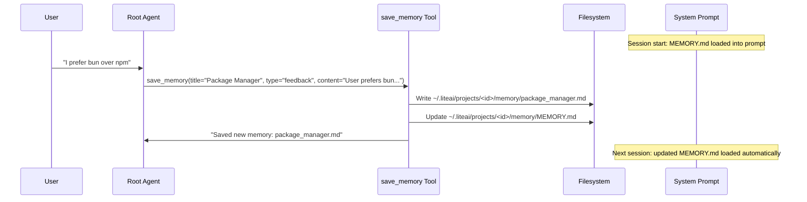

# Phase 1C — Memory Tools & Agent Integration

> Sub-phase of [02-roadmap.md](./02-roadmap.md) Phase 1.
> Dependencies: Phase 1B (unified memory system).
> Estimated effort: 6 days.

---

## Goal

Implement the `save_memory` tool that enables the root agent to write typed memories, refactor the existing memory tool surface (read/write/edit) to target the unified project-scoped directory, and wire the memory prompt into the session engine so context persists across conversations.

---

## Current State (LiteAI)

### Existing Memory Tools

| Tool | File | Current Behavior | Disposition |
|---|---|---|---|
| `memory_read` | [tool/memory.ts#L7-L25](file:///d:/liteai/packages/core/src/tool/memory.ts#L7-L25) | Reads from per-agent memory dir | Refactor → read from project memory dir |
| `memory_write` | [tool/memory.ts#L27-L50](file:///d:/liteai/packages/core/src/tool/memory.ts#L27-L50) | Writes to per-agent memory dir | Replace with `save_memory` |
| `memory_edit` | [tool/memory.ts#L52-L73](file:///d:/liteai/packages/core/src/tool/memory.ts#L52-L73) | Edits files in per-agent memory dir | Refactor → edit in project memory dir |

### Integration Points

The memory tools are registered via the tool system and used by agents. The key integration points:
- Tool registration in the agent tool resolver
- Permission model (currently unrestricted — agents can read/write freely)
- The runner's memory prompt injection (rewired in Phase 1B)

---

## Reference Implementations

### Claude Code — Prompt-Driven Memory (No Dedicated Tool)

**Key insight:** Claude Code does NOT have a `save_memory` tool. Memory writing is purely prompt-driven — the behavioral instructions in the system prompt tell the model to use the generic `Write` and `Edit` file tools to write to the memory directory.

**Source:** [memdir.ts#L218-L234](file:///d:/claude-code/src/memdir/memdir.ts#L218-L234)

The "How to save" prompt instructs a two-step process:
1. **Step 1** — Write the memory to its own topic file with frontmatter
2. **Step 2** — Add a pointer to that file in `MEMORY.md`

The model uses existing `FileWriteTool` and `FileEditTool` — the memory system doesn't need its own tools because the behavioral instructions are sufficient to guide the model.

**Permission guard** ([extractMemories.ts#L171-L222](file:///d:/claude-code/src/services/extractMemories/extractMemories.ts#L171-L222)):
- `createAutoMemCanUseTool()` — restricts the background extraction agent to:
  - `Read/Grep/Glob` — unrestricted (read-only)
  - `Bash` — read-only commands only
  - `Edit/Write` — ONLY for paths within the auto-memory directory (`isAutoMemPath()`)
- This guard is for the background extraction agent, not the main agent

### Gemini CLI — Dedicated `save_memory` Tool

**Source:** [base-declarations.ts#L92-L95](file:///d:/gemini-cli/packages/core/src/tools/definitions/base-declarations.ts#L92-L95)

```typescript
export const MEMORY_TOOL_NAME = 'save_memory';
export const MEMORY_PARAM_FACT = 'fact';
export const MEMORY_PARAM_SCOPE = 'scope';
```

Gemini CLI's `save_memory` tool:
- Parameters: `fact` (string content) and `scope` (`global` | `project`)
- Appends the fact as a bullet point to the appropriate memory file
- Global scope → `~/.gemini/GEMINI.md`
- Project scope → `~/.gemini/tmp/<hash>/memory/MEMORY.md`

**Prompt integration** ([snippets.ts#L381-L418](file:///d:/gemini-cli/packages/core/src/prompts/snippets.ts#L381-L418)):

The `renderOperationalGuidelines` function conditionally includes memory tool guidance when `memoryV2Enabled` is true:
- Exposes `userProjectMemoryPath` — the exact path for project-scoped notes
- Exposes `globalMemoryPath` — the exact path for cross-project preferences
- The prompt tells the model to use `save_memory` for structured saves

**What we adopt from GC:**
- The dedicated `save_memory` tool concept (rather than CC's pure-prompt approach) because:
  1. A dedicated tool gives us structured input validation (type, description)
  2. It enables server-side consistency enforcement (dedup, index update)
  3. It's observable — we can log/meter memory writes without parsing file tool calls
  4. It simplifies the permission model — we don't need `isAutoMemPath()` checks on every file write

**What we combine from CC:**
- The topic file + index pattern (from CC) via the dedicated tool (from GC)
- The four-type taxonomy (from CC) as the `type` parameter (extending GC's `scope`)
- The frontmatter format (from CC) auto-generated by the tool

---

## Implementation Plan

### 1. Design the `save_memory` Tool

**File:** `src/tool/save-memory.ts` (NEW)

#### Tool Schema

```typescript
{
  name: "save_memory",
  description: "Save a memory to your persistent memory system. Memories persist across conversations and help you build understanding over time.",
  parameters: {
    type: "object",
    required: ["content", "title", "memory_type"],
    properties: {
      content: {
        type: "string",
        description: "The memory content to save. For feedback/project types, structure as: rule/fact, then **Why:** and **How to apply:** lines."
      },
      title: {
        type: "string",
        description: "A short, descriptive title for the memory. Used as the topic filename."
      },
      memory_type: {
        type: "string",
        enum: ["user", "feedback", "project", "reference"],
        description: "The type of memory being saved."
      },
      description: {
        type: "string",
        description: "A one-line description used to decide relevance in future conversations. Be specific."
      }
    }
  }
}
```

> **Origin:** 🟡 Hybrid.
> - Tool name and concept: GC's `save_memory` ([base-declarations.ts#L93](file:///d:/gemini-cli/packages/core/src/tools/definitions/base-declarations.ts#L93))
> - `memory_type` taxonomy: CC's `MEMORY_TYPES` ([memoryTypes.ts#L14-L19](file:///d:/claude-code/src/memdir/memoryTypes.ts#L14-L19))
> - `title` + `description` for frontmatter: CC's topic file pattern ([memoryTypes.ts#L261-L271](file:///d:/claude-code/src/memdir/memoryTypes.ts#L261-L271))
> - `content` parameter: GC's `fact` parameter, renamed for clarity
> - Structured input schema: 🔵 LiteAI own design (CC has no tool, GC has only `fact`+`scope`)

#### Tool Execution Logic

```typescript
async function execute(input: SaveMemoryInput): Promise<ToolResult> {
  const memDir = ProjectMemory.memoryDir()

  // 1. Derive filename from title
  const filename = slugify(input.title) + ".md"
  const filePath = path.join(memDir, filename)

  // 2. Check for existing file (update vs create)
  const exists = await Bun.file(filePath).exists()

  // 3. Build frontmatter + content
  const fileContent = buildTopicFile({
    name: input.title,
    description: input.description ?? input.title,
    type: input.memory_type,
    content: input.content,
  })

  // 4. Write topic file
  await Bun.write(filePath, fileContent)

  // 5. Update MEMORY.md index
  await updateIndex(memDir, filename, input.title, input.description)

  return {
    type: "text",
    text: exists
      ? `Updated memory: ${filename}`
      : `Saved new memory: ${filename}`,
  }
}
```

> **Origin:** 🔵 LiteAI own implementation. CC doesn't have a save tool — the model writes files directly. GC's `save_memory` just appends text to a flat file. Our tool implements the full CC-style two-step (topic file + index update) as an atomic operation.

---

### 2. Implement Index Management

**File:** Part of `src/project/memory.ts` (extension)

The MEMORY.md index is a markdown file with one-line entries:

```markdown
- [User Role](user_role.md) — Senior backend engineer with Go expertise
- [Testing Policy](feedback_testing.md) — Integration tests must hit real DB, not mocks
- [Release Freeze](project_release_freeze.md) — Merge freeze begins 2026-03-05
```

```typescript
export namespace ProjectMemory {
  /** Update the MEMORY.md index after writing a topic file */
  export async function updateIndex(
    memDir: string,
    filename: string,
    title: string,
    description?: string,
  ): Promise<void> {
    const indexPath = path.join(memDir, ENTRYPOINT_NAME)
    const hook = description ? `${title} — ${description}` : title
    const entry = `- [${title}](${filename}) — ${hook}`

    // Read existing index
    const existing = await readIndexSafe(indexPath)

    // Check for existing entry for this filename (update case)
    const lines = existing.split("\n")
    const existingIdx = lines.findIndex(l => l.includes(`(${filename})`))

    if (existingIdx >= 0) {
      lines[existingIdx] = entry
    } else {
      lines.push(entry)
    }

    await Bun.write(indexPath, lines.filter(Boolean).join("\n") + "\n")
  }
}
```

> **Origin:** 🔵 LiteAI own implementation. CC leaves index management to the model via prompt instructions. We automate it to ensure consistency — the model only needs to call `save_memory`, and the tool handles both the topic file and the index atomically.

---

### 3. Refactor Existing Memory Tools

**File:** [tool/memory.ts](file:///d:/liteai/packages/core/src/tool/memory.ts)

#### `memory_read` → Read from project memory directory

```typescript
// BEFORE
const memDir = await AgentMemory.getAgentMemoryDir(agentType, scope)

// AFTER
const memDir = ProjectMemory.memoryDir()
```

#### `memory_write` → Deprecate (replaced by `save_memory`)

Mark as deprecated. The `save_memory` tool subsumes this with structured input.

#### `memory_edit` → Edit in project memory directory

Same path refactor as `memory_read`.

> **Origin:** 🔵 LiteAI own implementation. Path rewiring only.

---

### 4. Tool Permission Model

**File:** `src/tool/save-memory.ts` + tool registration

Memory tools are restricted based on agent role:

| Agent Role | `save_memory` | `memory_read` | `memory_edit` |
|---|---|---|---|
| Root agent | ✅ Full access | ✅ Full access | ✅ Full access |
| Sub-agent | ❌ Denied | ✅ Read-only via scan | ❌ Denied |
| Background agent | ❌ Denied (Phase 2: extract) | ✅ Read-only | ❌ Denied |

The permission check uses `AgentExecutionContext`:

```typescript
function canUseMemoryTool(toolName: string): boolean {
  const ctx = AgentExecutionContext.getStore()
  const isRootAgent = !ctx?.agentId // No parent = root

  if (toolName === "save_memory" || toolName === "memory_edit") {
    return isRootAgent
  }
  return true // memory_read is always allowed
}
```

> **Origin:** 🟡 Hybrid.
> - CC's `createAutoMemCanUseTool()` pattern ([extractMemories.ts#L171-L222](file:///d:/claude-code/src/services/extractMemories/extractMemories.ts#L171-L222)) — path-based write restriction. We simplify to role-based since our dedicated tool already scopes writes to the memory directory.
> - Root-agent-only write access is a 🔵 LiteAI design decision from the 00-architecture.md.

---

### 5. Wire Memory Prompt into Session Engine

**File:** Session prompt building chain (wherever system prompt is assembled)

The memory prompt needs to be injected into the system prompt for the root session. The runner (Phase 1B) handles sub-agent injection. For the root session:

```typescript
// In the session prompt builder:
const memorySection = await ProjectMemory.buildMemoryPrompt()
if (memorySection) {
  systemPromptParts.push(memorySection)
}
```

The prompt includes:
1. **Directory path** with existence guarantee (CC's `DIR_EXISTS_GUIDANCE`)
2. **Memory taxonomy** (types with examples)
3. **What NOT to save** (anti-patterns)
4. **How to save** — call `save_memory` tool (adapted from CC's two-step file write instructions to reference our tool)
5. **When to access** — recall guidance
6. **Before recommending** — verification guidance
7. **Current MEMORY.md content** — truncated index

> **Origin:** The prompt content is 🟢 CC-derived. The tool-based "How to save" section replaces CC's file-tool-based instructions. The injection point is 🔵 LiteAI specific.

---

### 6. Adapt CC Prompt Text for LiteAI

Key adaptations from CC's prompt text:

| CC Original | LiteAI Adaptation | Reason |
|---|---|---|
| "Write tool" / "Edit tool" | `save_memory` tool | We use a dedicated tool |
| "~/.claude/projects/..." | "~/.liteai/projects/..." | Branding |
| "CLAUDE.md files" | "AGENTS.md files" | Config naming convention |
| `<scope>private/team</scope>` | Removed | Single-user in Phase 1 |
| "Step 1 — write file, Step 2 — update index" | "Call `save_memory` with content, title, and type" | Tool automates both steps |
| "do not run mkdir" | Kept as `DIR_EXISTS_GUIDANCE` | Same concern applies |

The "How to save" section becomes:

```markdown
## How to save memories

Use the `save_memory` tool to persist information for future conversations:

- **content**: The memory content. For feedback/project types, structure as: fact/rule, then **Why:** and **How to apply:** lines.
- **title**: Short, descriptive title (becomes the filename).
- **memory_type**: One of `user`, `feedback`, `project`, `reference`.
- **description**: One-line hook for relevance scoring in future recalls.

The tool automatically creates the topic file with frontmatter and updates MEMORY.md. You do not need to manage the index manually.

- Keep memories focused on a single topic
- Update or remove memories that turn out to be wrong or outdated
- Do not write duplicate memories. Check MEMORY.md first.
```

> **Origin:** 🟡 Hybrid. Structure from CC's [memdir.ts#L218-L234](file:///d:/claude-code/src/memdir/memdir.ts#L218-L234), content rewritten for tool-based workflow.

---

## Data Flow Diagram



---

## File Change Summary

| File | Action | Origin |
|---|---|---|
| `src/tool/save-memory.ts` | NEW — `save_memory` tool | 🟡 Hybrid (GC tool concept + CC taxonomy + LiteAI schema) |
| `src/project/memory.ts` | MODIFY — add `updateIndex()` | 🔵 LiteAI (CC leaves to model) |
| `src/project/memory-prompt.ts` | MODIFY — adapt CC prompt text | 🟢 CC-derived content, 🔵 LiteAI adaptation |
| [tool/memory.ts](file:///d:/liteai/packages/core/src/tool/memory.ts) | MODIFY — rewire paths, deprecate `memory_write` | 🔵 LiteAI |
| Tool registration | MODIFY — register `save_memory`, add permission checks | 🔵 LiteAI |

---

## Verification Plan

### Unit Tests
- `save_memory` tool validates required parameters (content, title, memory_type)
- `save_memory` tool rejects invalid `memory_type` values
- `save_memory` creates topic file with correct frontmatter format
- `save_memory` updates MEMORY.md index with new entry
- `save_memory` updates existing index entry when overwriting a topic file
- `slugify()` produces filesystem-safe filenames
- Permission check denies `save_memory` for sub-agents
- Permission check allows `memory_read` for sub-agents

### Integration Tests
- Full round-trip: save memory → next session loads it in prompt
- Memory written in session 1 appears in session 2's MEMORY.md content
- Multiple saves accumulate in MEMORY.md index
- Index truncation triggers at 200 lines / 25KB

### Manual Verification
- In a live session, ask the agent to remember something → verify topic file created
- Start a new session → verify the memory appears in system prompt context
- Attempt to save memory from a sub-agent → verify denial
- Save >200 memories → verify MEMORY.md truncation warning
