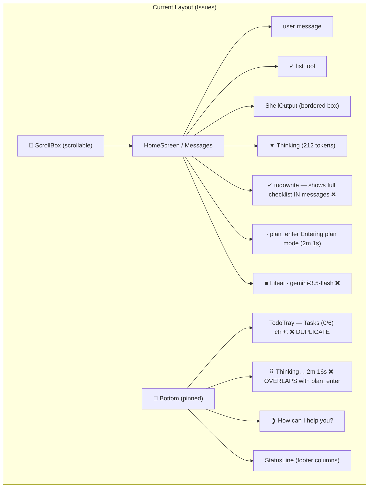
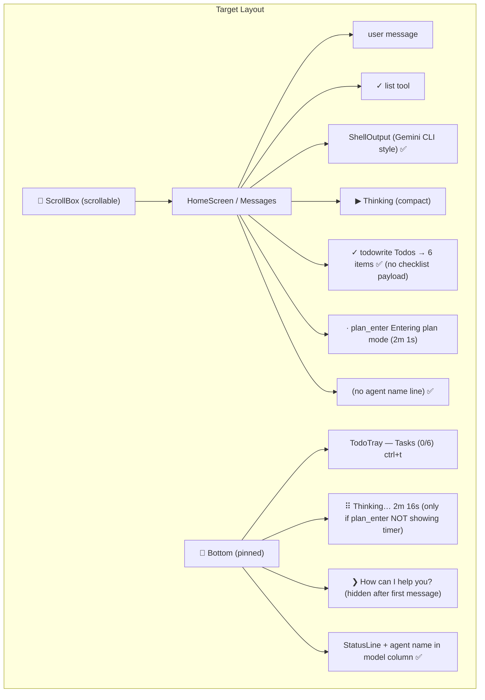

# UI/UX Issues: Layout, Run Command, TodoWrite, Agent Name, Thinking Indicator

**Branch**: `016-message-rendering` | **Date**: 2026-05-22 | **Scope**: 4 discrete UI/UX fixes

## Summary

Four UI/UX issues identified from the screenshot, each requiring different components to be modified. This plan covers all four, with a diagram of the intended layout structure and state-dependent visibility rules.

---

## Current vs Target Layout Diagram

### Current Layout (broken)



### Target Layout (fixed)



---

## Issue 1: Run Command Display — Adapt Gemini CLI Style

### Current Behavior
The `run_command` tool renders via [ShellOutput](file:///d:/liteai/packages/cli/src/tui/components/shell-output.tsx) with a bordered box (`borderStyle="round"`), `$ command` header, spinner, and right-aligned footer showing `exit N ─── Xs`.

The screenshot shows this is visually inconsistent with the rest of the DenseToolMessage pattern. The bordered box stands out too much and takes too much vertical space.

### Gemini CLI Reference
Gemini CLI uses two distinct rendering modes:
1. **ShellToolMessage** ([ShellToolMessage.tsx](file:///D:/gemini-cli/packages/cli/src/ui/components/messages/ShellToolMessage.tsx)): Full bordered box with `StickyHeader`, `ToolStatusIndicator`, `ToolInfo`, embedded `ToolResultDisplay`, and an interactive `ShellInputPrompt`. Uses `borderStyle="round"` with left/right borders only (no top/bottom).
2. **DenseToolMessage** ([DenseToolMessage.tsx](file:///D:/gemini-cli/packages/cli/src/ui/components/messages/DenseToolMessage.tsx)): Single-line `[status] [name] [description] → [summary]` with optional expandable diff payload beneath.

The Gemini CLI shows the shell output inside a bordered container with **left and right borders only** (no top/bottom), giving it a gutter feel. The status line (`✓ shell`) is in a `StickyHeader` row.

### Proposed Change

#### [MODIFY] [shell-output.tsx](file:///d:/liteai/packages/cli/src/tui/components/shell-output.tsx)
Remove the full bordered box. Instead:
1. Use the `DenseToolMessage` header row pattern: `[status] run_command command_text → exit 0 ─── 1.0s`
2. Show command output below with a left-only border (vertical gutter), indented. Similar to Gemini's `borderLeft: true, borderTop: false, borderRight: false, borderBottom: false`.
3. The header becomes: `$ command` inside the gutter, output lines below, and the `exit N ─── Xs` as a right-aligned footer inside the gutter.

```text
   │ v24.15.0
   │ Python 3.13.13
   │                                             exit 0 ─── 1.0s
```

Instead of the current fully-bordered box approach.

#### [MODIFY] [tools.tsx:RunCommandView](file:///d:/liteai/packages/cli/src/tui/routes/session/tools.tsx#L482-L595)
Update `RunCommandView` to always use `DenseToolMessage` with the shell output as a styled payload (left-border gutter). Remove the direct `<ShellOutput>` component usage for the standard case.

---

## Issue 2: TodoWrite Tool — Suppress Message-Area Rendering

### Current Behavior
The `todowrite` tool renders a full checklist as `DenseToolMessage` payload in the messages area ([tools.tsx:TodoWriteView](file:///d:/liteai/packages/cli/src/tui/routes/session/tools.tsx#L675-L701)):
```text
✓ todowrite Todos → 6 items
      [ ] Design the Snake game architecture and UI layout
      [ ] Create index.html...
      ...
```

**Additionally**, the same todos appear in the [TodoTray](file:///d:/liteai/packages/cli/src/tui/components/todo-tray.tsx) above the input prompt (visible via `ctrl+t`). This is redundant.

Gemini CLI confirms this pattern — their [ToolResultDisplay.tsx](file:///D:/gemini-cli/packages/cli/src/ui/components/messages/ToolResultDisplay.tsx#L84-L87) explicitly returns `null` for todo results:
```tsx
if (typeof resultDisplay === 'object' && 'todos' in resultDisplay) {
  // display nothing, as the TodoTray will handle rendering todos
  return null;
}
```

### Proposed Change

#### [MODIFY] [tools.tsx:TodoWriteView](file:///d:/liteai/packages/cli/src/tui/routes/session/tools.tsx#L675-L701)
Remove the payload. The `DenseToolMessage` should only show the header line:
```text
✓ todowrite Todos → 6 items
```
No checklist items in the messages area. The `TodoTray` at the bottom already handles this.

---

## Issue 3: Agent Name Display — Move to Status Bar

### Current Behavior
Below the last tool call in the messages area, there's a line:
```text
■ Liteai · gemini-3.5-flash
```

This appears to be rendered somewhere in the message stream (possibly as part of the assistant message metadata or a custom "agent identity" line). This is **not** how Gemini CLI does it — they put the model name in the [Footer](file:///D:/gemini-cli/packages/cli/src/ui/components/Footer.tsx) status bar.

### LiteAI Status Bar Already Has Model Info
The [StatusLine](file:///d:/liteai/packages/cli/src/tui/components/status-line.tsx#L68-L82) already displays `model` and `provider` columns:
```text
model                 provider
Gemini 3.5 Flash ■    Google
```

### Proposed Change

**Located**: The agent name line is rendered at [message.tsx:L131-L151](file:///d:/liteai/packages/cli/src/tui/routes/session/message.tsx#L131-L151) — the `AssistantMessageContent` component renders this block when `last || final || aborted`:

```tsx
▣ Liteai · gemini-3.5-flash · 12s
```

This shows `message.mode` (e.g., "Liteai") + `message.modelID` (e.g., "gemini-3.5-flash") + optional duration. It appears on the **last** assistant message and on every completed one.

The StatusLine footer at [status-line.tsx:L68-L82](file:///d:/liteai/packages/cli/src/tui/components/status-line.tsx#L68-L82) already shows `model` + `provider` + busy/plan badges, which covers the same information.

#### [MODIFY] [message.tsx:L131-L151](file:///d:/liteai/packages/cli/src/tui/routes/session/message.tsx#L131-L151)
Remove the in-message agent identity line entirely. The StatusLine footer already provides this context.

> [!IMPORTANT]
> **Design decision needed**: This line also shows the **turn duration** (e.g., `· 12s`) which is NOT in the StatusLine. Should we:
> - **Option A**: Remove the line entirely (lose turn duration)
> - **Option B**: Keep the line but make it much more subtle (e.g., just `▣ 12s` without the agent/model)
> - **Option C**: Move the turn duration to the StatusLine footer as a new column

---

## Issue 4: Thinking Indicator — Clear State Hierarchy & Tip Visibility

### Current Behavior (from screenshot)
Three competing indicators visible simultaneously:
1. **In messages**: `· plan_enter Entering plan mode (2m 1s)` — the plan_enter tool call with its elapsed time
2. **Above prompt (TipBanner)**: `⠿ Thinking… 2m 16s` — the loading spinner with a DIFFERENT elapsed time
3. **Prompt placeholder**: `❯ How can I help you?` — still showing even though a conversation is active

### Problems
1. **Two different timers**: The plan_enter tool shows `2m 1s` (tool-level elapsed) while TipBanner shows `2m 16s` (session-level loading elapsed). These are redundant and confusing.
2. **Tip should be hidden**: After the user sends their first message, the generic tip/placeholder should be replaced by the thinking indicator when loading, or hidden entirely.

### Gemini CLI Reference
Gemini CLI's [StatusRow](file:///D:/gemini-cli/packages/cli/src/ui/components/StatusRow.tsx) renders the loading indicator inline with tips. The `LoadingIndicator` shows `Thinking...` with elapsed time and `(esc to cancel, 3s)`. Tips appear on the **right** side of the status row, not as a separate banner above the prompt.

The tip rotates only when idle; during loading, it's replaced by the spinner.

### Proposed Change

#### [MODIFY] [tip-banner.tsx](file:///d:/liteai/packages/cli/src/tui/components/prompt/tip-banner.tsx)
The current behavior is actually correct — `TipBanner` already shows `WorkingBanner` (thinking spinner) when `isLoading` is true, and shows tips when idle. The issue is likely:

1. **The timer discrepancy**: `plan_enter` tool call shows its own timer via `useElapsedTime` in `DenseToolMessage`. The `TipBanner` shows a separate timer. Both run independently, causing confusion.
2. **The tip should hide after first user message**: Add a condition to suppress the tip line when `messages.length > 0` and loading is false, OR always show the tip but make the thinking indicator take priority.

**Proposed state machine for TipBanner visibility:**

```text
┌─────────────────────────────────────────────┐
│ State              │ TipBanner shows         │
├─────────────────────────────────────────────┤
│ No messages, idle  │ ● Tip: Use ctrl+p...    │
│ No messages, load  │ ⠿ Thinking… 3s          │
│ Has messages, idle │ ● Tip: Use ctrl+p...    │
│ Has messages, load │ ⠿ Thinking… 3s          │
│ Cursor mode active │ (hidden)                │
└─────────────────────────────────────────────┘
```

> [!IMPORTANT]
> The confusion is NOT about hiding the tip — it's about **two separate timers** being visible at once. The plan_enter DenseToolMessage already shows `(2m 1s)` in the message area. The TipBanner separately shows `Thinking… 2m 16s`. The user sees TWO timing indicators that differ.

**Fix**: When a tool is currently running (status === "running") AND it's the last tool in the messages, the TipBanner's thinking indicator should display the **tool name** instead of generic "Thinking":
```text
⠿ plan_enter Entering plan mode… 2m 16s
```
This way, the two indicators complement each other instead of competing.

Alternatively, **suppress** the TipBanner thinking indicator entirely when the last tool in messages has its own running timer, since the DenseToolMessage already provides visual feedback.

---

## Open Questions

> [!IMPORTANT]
> 1. **Issue 1 (ShellOutput)**: Should we keep the full bordered box for actively-running commands (streaming output) and only use the gutter style for completed commands? Or always use gutter style?
> 2. **Issue 4 (Thinking)**: Which approach do you prefer for the dual-timer problem?
>    - **Option A**: Make TipBanner show the tool name when a tool is running (e.g., `⠿ plan_enter… 2m 16s`)
>    - **Option B**: Suppress TipBanner entirely when the last tool in messages has a running timer
>    - **Option C**: Remove the per-tool timer from DenseToolMessage and keep only TipBanner's timer
> 3. **Tip visibility**: Should the tip line be hidden after the first user message when idle, or should it always show?

---

## Verification Plan

### Visual Verification
1. Run `bun dev` and verify each fix visually:
   - ShellOutput uses gutter style (left border only)
   - TodoWrite shows only header line, no checklist payload
   - No agent name line in messages area
   - Only one timer visible during tool execution
2. Verify TodoTray still works correctly via `ctrl+t`

### Automated
- `bun typecheck` — must pass
- `bun lint:fix` — must pass
