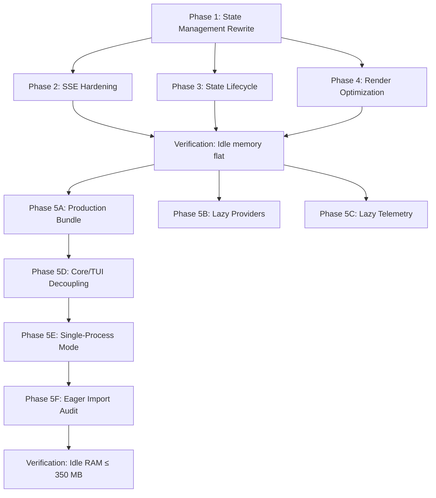

# CLI Memory Leak Resolution — Comprehensive Plan

> [!TIP]
> **Status: Phase 1 COMPLETE. Memory Optimization Phases 2/3/5 COMPLETE.**
> The active 9.8GB leak has been eliminated via the state management rewrite.
> Lazy loading + single-process mode have been shipped, reducing the idle footprint
> from ~1.2GB toward the ~300-350MB target. Phases 1B, 2, 3, 4 below are optimization/polish.

## Problem Statement

Starting the CLI and leaving it idle causes continuous memory accumulation, reaching 9.8 GB. The leak occurs **at startup** — no user interaction required.

## Root Cause: Render Cascade from Monolithic Context

The entire TUI state (`SyncState`) is served through a single React Context provider (`SyncProvider`). Every SSE event — including **idle heartbeats and status polls** — triggers a full re-render cascade across all 39 `useSync()` consumer sites. The cascade happens because:

1. SSE event → `store.setState()` → zustand notifies React
2. `SyncProvider` re-renders → `init()` re-runs
3. `bootstrap`, `syncSession`, `syncWorkspaces` are **plain functions** (not `useCallback`) → new refs every render
4. `useMemo(..., [state, sdk, bootstrap, syncWorkspaces, syncSession])` sees changed deps → **new context value**
5. **All 39 consumer sites** re-render (React Context contract: new value identity → re-render all consumers)
6. Each re-render allocates: closures, JSX elements, arrays, intermediate objects
7. GC pressure exceeds collection rate → unbounded heap growth

This is architecturally identical to the problem Claude Code solved with `useSyncExternalStore` + selector-based subscriptions.

---

## Competitor Analysis

### Claude Code — External Store + Selector Pattern

```
                   ┌──────────────┐
                   │ createStore  │  ← Custom, NOT zustand
                   │  (store.ts)  │  ← 35 lines. Minimal.
                   └──────┬───────┘
                          │
              ┌───────────┼───────────┐
              ▼           ▼           ▼
    useAppState(s =>  useAppState(  useSetAppState()
      s.verbose)       s.mcp)       ← stable ref, no subscription
              │           │
              ▼           ▼
    useSyncExternalStore  useSyncExternalStore
    ← Only re-renders    ← Only re-renders
      when s.verbose       when s.mcp
      changes              changes
```

**Key design decisions:**
- **No zustand, no immer** — 35-line custom store with `Object.is` equality check
- **Selector-based subscriptions** — `useAppState(s => s.verbose)` re-renders ONLY when `s.verbose` changes
- **`useSyncExternalStore`** — React 18 primitive, tear-safe, no extra deps
- **`useSetAppState()` returns stable ref** — components that only write never re-render from state changes
- **`onChangeAppState` side effects** — separated from store, reacts to diffs (old → new)
- **`DeepImmutable<T>` wrapper** — enforces read-only at type level

### Gemini CLI — No Global Store

- Gemini CLI uses **no global state store at all**
- State is prop-drilled or kept in local hooks (`useAgentStream`, `useSlashCommandProcessor`)
- Context providers are lightweight: `SettingsContext`, `MouseContext`, `ScrollProvider`
- ~67 MB idle footprint — minimal architecture wins

### LiteAI Current — Monolithic Context + Zustand/Immer

```
                   ┌──────────────────┐
                   │ createStore      │  ← zustand + immer
                   │ (SyncState)      │  ← ~22 fields, nested maps
                   └──────┬───────────┘
                          │
                   ┌──────▼───────────┐
                   │ useStore(store)   │  ← subscribes to ALL changes
                   │ (line 150)       │  ← triggers SyncProvider re-render
                   └──────┬───────────┘
                          │
                   ┌──────▼───────────┐
                   │ useMemo(value)   │  ← deps include bootstrap, etc.
                   │ (line 569)       │  ← always new ref → always new value
                   └──────┬───────────┘
                          │
        ┌─────────────────┼────────────────────┐
        ▼                 ▼                    ▼
  useSync() x39     All consumers          SessionProvider
  (every component   re-render on         LocalProvider
   in the tree)      EVERY event          PromptInput ...
```

---

## Naming: `useSync` → ?

> [!IMPORTANT]
> `useSync` is non-descriptive — "sync" could mean synchronization, synchronized state, or the SSE sync loop. Here are alternatives modeled on established patterns:

| Name | Rationale | Precedent |
|------|-----------|-----------|
| **`useAppState`** | Describes what it returns — application state | Claude Code's `useAppState` |
| **`useAppStore`** | Describes the underlying store | Claude Code's `useAppStateStore` |
| **`useGlobalState`** | Explicit scope | Common React pattern |
| **`useTuiState`** | Scoped to TUI layer specifically | Domain-specific |
| **`useProjectState`** | Reflects that state is project-scoped via SDK | Semantic |

**Recommendation: `useAppState`** — identical to Claude Code, immediately understood by any React developer, accurately describes purpose. The setter would be `useSetAppState` (write-only, no subscription).

---

## Phase 1: State Management Rewrite (Critical — Fixes the Leak) ✅ COMPLETE

> **Goal:** Replace the monolithic `useSync()` context with a selector-based external store that only re-renders consumers when their selected slice changes.

### Design: Claude Code–Inspired External Store

```typescript
// ── Store (vanilla, no zustand, no immer) ─────────────────────
type Listener = () => void
type OnChange<T> = (args: { newState: T; oldState: T }) => void

export type AppStore<T> = {
  getState: () => T
  setState: (updater: (prev: T) => T) => void
  subscribe: (listener: Listener) => () => void
}

export function createAppStore<T>(
  initialState: T,
  onChange?: OnChange<T>,
): AppStore<T> {
  let state = initialState
  const listeners = new Set<Listener>()
  return {
    getState: () => state,
    setState: (updater) => {
      const prev = state
      const next = updater(prev)
      if (Object.is(next, prev)) return  // ← key: skip if same ref
      state = next
      onChange?.({ newState: next, oldState: prev })
      for (const listener of listeners) listener()
    },
    subscribe: (listener) => {
      listeners.add(listener)
      return () => listeners.delete(listener)
    },
  }
}

// ── Consumer hooks ────────────────────────────────────────────
// Selector: only re-renders when selected value changes (Object.is)
export function useAppState<R>(selector: (state: AppState) => R): R {
  const store = useAppStoreContext()
  const get = useCallback(
    () => selector(store.getState()),
    [selector, store]
  )
  return useSyncExternalStore(store.subscribe, get, get)
}

// Write-only: stable ref, NEVER re-renders from state changes
export function useSetAppState(): AppStore<AppState>['setState'] {
  return useAppStoreContext().setState
}
```

### Why Drop Zustand + Immer?

1. **Zustand's `useStore(store)` (line 150)** subscribes to ALL state changes — it's the same as `useSyncExternalStore(store.subscribe, store.getState)` with no selector. Every `setState` call re-renders `SyncProvider`.
2. **Immer** creates new frozen objects on every `setState` call via structural sharing. This is correct for immutability but means `Object.is(newState, oldState)` is ALWAYS false even when nothing changed — the `store.setState(state => { state.agents[id].activity = 'foo' })` pattern creates a new root object regardless.
3. **Claude Code's 35-line store** achieves the same with explicit `Object.is` short-circuit and no middleware.
4. Without immer, updates use the spread pattern: `setState(prev => ({ ...prev, agents: { ...prev.agents, [id]: { ...prev.agents[id], activity: 'foo' } } }))`. This is slightly more verbose but **only allocates new objects for the changed path**.

### File Changes

---

#### [NEW] [app-store.ts](file:///d:/liteai/packages/cli/src/tui/state/app-store.ts)

The external store implementation (35 lines). Contains `createAppStore`, `AppStore` type.

---

#### [NEW] [app-state.ts](file:///d:/liteai/packages/cli/src/tui/state/app-state.ts)

The `AppState` type definition (renamed from `SyncState`) and `getDefaultAppState()` factory.

```typescript
export interface AppState {
  status: "loading" | "partial" | "complete"
  provider: ProviderListResponse["all"]
  // ... same fields as current SyncState ...
  agents: { [agentId: string]: AgentInfo }
}
```

---

#### [NEW] [app-state-context.tsx](file:///d:/liteai/packages/cli/src/tui/state/app-state-context.tsx)

React integration:
- `AppStoreContext` — React context holding the store instance (NOT the state)
- `AppStateProvider` — creates the store, subscribes to SSE events, provides via context
- `useAppState(selector)` — selector-based consumer (via `useSyncExternalStore`)
- `useSetAppState()` — write-only access (stable ref)
- `useAppStore()` — direct store access for non-React code

The provider encapsulates:
- Store creation (once, via `useState(() => createAppStore(...))`)
- SSE event subscription (via `useEffect` with proper cleanup)
- Bootstrap orchestration
- Session sync

---

#### [NEW] [app-state-events.ts](file:///d:/liteai/packages/cli/src/tui/state/app-state-events.ts)

Event handler logic extracted from `sync.tsx` lines 277-531. Pure function: `(event: Event, setState: AppStore['setState']) => void`. No React dependency.

---

#### [NEW] [app-state-actions.ts](file:///d:/liteai/packages/cli/src/tui/state/app-state-actions.ts)

Action creators extracted from `sync.tsx`:
- `bootstrap(sdk, projectID, setState)` — initial data fetch
- `syncSession(sdk, projectID, sessionID, setState)` — per-session sync
- `syncWorkspaces(sdk, projectID, setState)` — workspace list refresh

Pure async functions, not hooks. Called from `AppStateProvider`'s `useEffect`.

---

#### [DELETE] [sync.tsx](file:///d:/liteai/packages/cli/src/tui/context/sync.tsx)

Replaced entirely by the `state/` module.

---

#### [MODIFY] [app.tsx](file:///d:/liteai/packages/cli/src/tui/app.tsx)

Replace `<SyncProvider>` with `<AppStateProvider>`.

---

#### [MODIFY] All 39 consumer sites

Each `const sync = useSync()` becomes targeted selectors:

```typescript
// Before (re-renders on ANY state change):
const sync = useSync()
const messages = sync.message[sessionID] ?? []

// After (re-renders ONLY when messages for this session change):
const messages = useAppState(s => s.message[sessionID] ?? EMPTY_ARRAY)
```

For components that read multiple fields, use multiple `useAppState` calls:
```typescript
const messages = useAppState(s => s.message[sessionID] ?? EMPTY_ARRAY)
const status = useAppState(s => s.session_status[sessionID])
const config = useAppState(s => s.config)
```

> [!WARNING]
> Selectors MUST return stable references. `useAppState(s => s.message[sessionID] ?? [])` creates a new empty array each call → infinite re-render. Use a module-level `const EMPTY_ARRAY: never[] = []` sentinel.

**Affected files** (each change is mechanical — replace `useSync()` with targeted `useAppState`):

| File | Consumer Count |
|------|---------------|
| `routes/session/tools.tsx` | 3 |
| `routes/session/sidebar.tsx` | 1 |
| `routes/session/parts.tsx` | 1 |
| `routes/session/messages.tsx` | 1 |
| `routes/session/message.tsx` | 1 |
| `routes/session/index.tsx` | 2 |
| `routes/home/index.tsx` | 1 |
| `hooks/use-session-stats.ts` | 1 |
| `context/session.tsx` | 1 |
| `context/local.tsx` | 1 |
| `components/dialog-mcp.tsx` | 2 |
| `components/dialog-model.tsx` | 2 |
| `components/dialog-provider.tsx` | 5 |
| `components/dialog-session-list.tsx` | 1 |
| `components/dialog-status.tsx` | 1 |
| `components/status-line.tsx` | 1 |
| `components/transcript-search.tsx` | 1 |
| `components/virtual-message-list.tsx` | 1 |
| `components/dialog-workspace.tsx` | 2 |
| `components/dialog-stats.tsx` | 1 |
| `components/dialog-session-rename.tsx` | 1 |
| `components/prompt/prompt-input.tsx` | 1 |
| `components/dialog-rewind.tsx` | 1 |
| `components/dialog-permissions.tsx` | 1 |
| `components/dialog-help-v2.tsx` | 1 |
| `components/dialog-manage-models.tsx` | 1 |
| `components/dialog-diff.tsx` | 1 |
| `routes/session/permission.tsx` | 1 |

---

### Verification — Phase 1

1. `bun typecheck` passes
2. `bun lint:fix` passes
3. Start CLI, idle for 60s → memory stays flat (target: no growth beyond ±10 MB)
4. PowerShell monitoring: `while ($true) { (Get-Process bun | Select-Object -ExpandProperty WorkingSet64) / 1MB; Start-Sleep -Seconds 5 }` → values stabilize
5. Send 3 prompts, verify messages and parts render correctly
6. Switch sessions, verify old session data doesn't cause re-renders in new session

---

## Phase 2: SSE Transport Hardening

> **Goal:** Prevent the SSE connection from amplifying the render cascade. Even after Phase 1, a tight SSE reconnection loop would cause unnecessary `setState` calls.

### File Changes

#### [MODIFY] [sdk.tsx](file:///d:/liteai/packages/cli/src/tui/context/sdk.tsx)

1. **Add reconnection delay for normal stream completion** (not just errors):
   ```typescript
   // After for-await loop exits normally:
   await new Promise(resolve => setTimeout(resolve, 1000))
   ```

2. **Exponential backoff** for errors:
   ```typescript
   let backoff = 1000
   // On error:
   await new Promise(resolve => setTimeout(resolve, backoff))
   backoff = Math.min(backoff * 2, 30_000) // cap at 30s
   // On successful connection:
   backoff = 1000 // reset
   ```

3. **Return cleanup from `useEffect`** for the SSE path:
   ```typescript
   useEffect(() => {
     if (props.events) {
       return props.events.on(handleEvent)
     }
     startSSE()
     return () => { sseControllerRef.current?.abort() }
   }, [props.events, handleEvent, startSSE])
   ```

4. **Deduplicate `startSSE` calls** — add a `startedRef` guard so concurrent effect re-runs don't spawn parallel SSE loops.

### Verification — Phase 2

1. Kill the backend server, observe CLI reconnects with exponential backoff (1s, 2s, 4s, ...)
2. Restart backend, observe reconnection succeeds and resets backoff
3. Monitor memory during reconnection cycles — no growth

---

## Phase 3: State Lifecycle Management

> **Goal:** Prevent unbounded accumulation of per-session state objects.

### File Changes

#### [MODIFY] [app-state-events.ts](file:///d:/liteai/packages/cli/src/tui/state/app-state-events.ts)

1. **`agents` map eviction** — Remove agents with `status !== "running"` after 5 minutes:
   ```typescript
   case "agent.completed":
     // ... set status ...
     // Schedule eviction
     setTimeout(() => {
       setState(prev => {
         const { [agentId]: _, ...rest } = prev.agents
         return { ...prev, agents: rest }
       })
     }, 5 * 60 * 1000)
   ```

2. **`session_diff` scoped cleanup** — When navigating away from a session (tracked via a `activeSessionID` field in `AppState`), clear diff/todo/parts for the previous session:
   ```typescript
   // In the route change handler or as a derived effect:
   setState(prev => ({
     ...prev,
     session_diff: { [activeSessionID]: prev.session_diff[activeSessionID] },
     todo: { [activeSessionID]: prev.todo[activeSessionID] },
     // Keep messages but clear parts for non-active sessions
   }))
   ```

3. **`part` map bounded size** — Add a hard cap (e.g., 500 total parts across all messages). When exceeded, evict the oldest message's parts first.

### Verification — Phase 3

1. Open 5 different sessions, verify memory doesn't accumulate per-session state for inactive sessions
2. Run a session with 50+ tool calls, verify parts count stays bounded
3. Spawn 20 agents, wait 6 minutes, verify completed agents are evicted

---

## Phase 4: Render Amplification Reduction

> **Goal:** Further optimize components that derive data from `AppState` to avoid unnecessary intermediate allocations.

### File Changes

#### [NEW] [app-state-selectors.ts](file:///d:/liteai/packages/cli/src/tui/state/app-state-selectors.ts)

Pre-built selector factories for common patterns:

```typescript
// Memoized selector with shallow equality
export function selectMessages(sessionID: string) {
  return (s: AppState) => s.message[sessionID] ?? EMPTY_ARRAY
}

export function selectParts(messageID: string) {
  return (s: AppState) => s.part[messageID] ?? EMPTY_ARRAY
}

export function selectSessionStatus(sessionID: string) {
  return (s: AppState) => s.session_status[sessionID]
}

export function selectIsWorking(sessionID: string) {
  return (s: AppState) => {
    const msgs = s.message[sessionID]
    if (!msgs?.length) return false
    const last = msgs[msgs.length - 1]
    return last.role === "user" || !last.time.completed
  }
}
```

#### [MODIFY] [session.tsx](file:///d:/liteai/packages/cli/src/tui/context/session.tsx)

Replace `useSync()` with targeted selectors:
```typescript
const commands = useAppState(s => s.command)
const isLoading = useAppState(selectIsWorking(sessionID))
```

#### [MODIFY] `components/prompt/prompt-input.tsx`

Split the monolithic `const sync = useSync()` into individual selectors per consumed field:
```typescript
const config = useAppState(s => s.config)
const commands = useAppState(s => s.command)
const agents = useAppState(s => s.agent)
```

### Verification — Phase 4

1. Add a render counter (`useRef(0)` + increment) to `PromptInput` and `Messages`
2. Send a message, verify `PromptInput` render count stays at 0 during streaming (it only cares about `config` and `commands`, not messages/parts)
3. Verify `Messages` render count matches the number of `message.updated` events (1:1, not 1:N)

---

## Phase 5: Memory Optimization Roadmap Integration ✅ COMPLETE (5B, 5C, 5E)

> **Goal:** Execute the 6-phase roadmap from [memory-optimization-roadmap.md](file:///d:/liteai/roadmap/cli_optimization/memory-optimization-roadmap.md) as a continuation.

> [!TIP]
> **Completed phases:**
> 
> | Roadmap Phase | Description | Status |
> |---|---|---|
> | 5A: Production Bundle | ESBuild bundle for tree-shaking | ⚠️ Not started |
> | **5B: Lazy Providers** | **Dynamic `import()` for AI SDK providers** | **✅ Complete** |
> | **5C: Lazy Telemetry** | **Gate OTEL behind `isTelemetryEnabled()`** | **✅ Complete** |
> | 5D: Core/TUI Decoupling | Remove `@liteai/core` imports from TUI | ⚠️ Not started (deprioritized — single-process mode eliminates duplication) |
> | **5E: Single-Process Mode** | **Eliminate Worker for local-only** | **✅ Complete** |
> | 5F: Eager Import Audit | Lazy themes, highlight.js, dialogs | ⚠️ Not started |
>
> **Post-completion hardening (applied 2026-05-03):**
> - `thread.ts`: `local-server.ts` import gated behind dynamic `import()` so ~7 `@liteai/core` modules are not evaluated in Worker mode
> - `factories.ts`: Early return in `getOtlpReaders()` when no metric exporters configured, skipping unnecessary `PeriodicExportingMetricReader` import
> - `local-server.ts`: Exported `LocalRpcApi` interface for type-safe RPC without requiring module evaluation

---

## Open Questions

> [!IMPORTANT]
> **Q1: Naming confirmation**
> Proposed: `useAppState(selector)` + `useSetAppState()` + `AppStateProvider`
> This replaces: `useSync()` + `SyncProvider`
> Please confirm or propose alternative.

> [!IMPORTANT]
> **Q2: Drop zustand + immer entirely or keep zustand with selectors?**
> 
> **Option A (Recommended): Drop both** — 35-line custom store matching Claude Code's pattern. Zero deps, zero middleware overhead, full control.
> 
> **Option B: Keep zustand, add selectors** — Use `useStore(store, selector)` (zustand's built-in selector support). Keeps immer for ergonomic updates. But immer's structural sharing still creates new root objects on every mutation, defeating `Object.is` at the store level.
> 
> My recommendation is Option A. Immer's ergonomic benefit (`state.agents[id].activity = 'foo'`) is not worth the cost of always-new root objects.

> [!IMPORTANT]
> **Q3: `createSimpleContext` pattern — keep or remove?**
> The `createSimpleContext` helper re-executes `init()` on every render, which is fine for hooks but creates unstable references for non-hook values. The new `AppStateProvider` won't use this pattern.
> Other providers (`KVProvider`, `ThemeProvider`, etc.) still use it. Should we migrate them too, or only fix the state provider?

> [!IMPORTANT]
> **Q4: Phase 5 scope**
> The memory optimization roadmap is a separate 6-phase effort. Should I:
> - (A) Keep it as the existing roadmap file and reference it from Phase 5
> - (B) Expand Phase 5 inline with full implementation details here
> - (C) Create a separate plan artifact for Phase 5

---

## Execution Order & Dependencies



**Phase 1 is the critical path** — it fixes the active leak. Phases 2-4 can proceed in parallel after Phase 1. Phase 5 begins after Phases 1-4 are verified.

---

## Verification Plan

### Automated
- `bun typecheck` after each phase
- `bun lint:fix` after each phase
- Scoped tests: `bun test test/sessions` (if applicable)

### Manual — Memory Stability (Post Phase 1-4)
1. Start CLI: `bun dev`
2. Wait 60 seconds (no interaction)
3. Record RSS every 5s via PowerShell: `while ($true) { "{0:N0} MB" -f ((Get-Process bun).WorkingSet64 / 1MB); Start-Sleep 5 }`
4. **Pass criteria:** RSS delta over 60s < 10 MB
5. Send 5 prompts with tool calls
6. Wait another 60s idle
7. **Pass criteria:** RSS returns to within 50 MB of baseline

### Manual — Baseline Measurement (Post Phase 5)
1. Build production bundle
2. Start CLI from bundle
3. Wait 10s
4. **Pass criteria:** RSS ≤ 350 MB
