# LiteAI — Master Roadmap

## Status: IN PROGRESS — Phases 1–4 ✅ Complete, Phase 5 Next

> Consolidates: core-roadmap (formerly plan-mode-redesign), agents-platform-roadmap (remaining), project-scoped-persistence.
> Evaluation source: [implementation_plan.md](file:///C:/Users/ahmed/.gemini/antigravity-ide/brain/5e568eb2-2564-4dee-8e06-fe06e4cb49cb/implementation_plan.md) — Memory/Knowledge/History evaluation of Claude Code + Gemini CLI.

---

## Design Documents Index

| Document | Scope | Status |
|----------|-------|--------|
| [01-agent-taxonomy.md](./01-agent-taxonomy.md) | `task` → `agent` rename, `build` → `liteai` rename, agent roster | ✅ Written |
| [02-plan-mode.md](./02-plan-mode.md) | `plan_enter`/`plan_exit` lifecycle, permission gating, plan subagent | ✅ Written |
| [03-tool-concurrency.md](./03-tool-concurrency.md) | StreamingToolExecutor redesign, per-tool concurrency, sibling abort | ✅ Written |
| [04-kv-cache.md](./04-kv-cache.md) | Provider cache mechanics, deterministic ordering, cache break detection, reasoning tokens | ✅ Written |
| [05-skills.md](./05-skills.md) | Skill system enhancements, superpowers integration | ✅ Written |
| [architecture-decisions.md](./architecture-decisions.md) | Architecture Decision Record (resolved Q&A) | ✅ Written |
| 06-guide-agent.md | Guide agent definition (from agents-platform Phase 6) | ⬜ NOT YET WRITTEN |
| 07-project-registry.md | Project directory scaffold & registry | ⬜ NOT YET WRITTEN |
| 08-unified-memory.md | Unified memory system (CC/GC hybrid design) | ⬜ NOT YET WRITTEN |
| 09-memory-tools.md | `save_memory` tool, permissions, prompt integration | ⬜ NOT YET WRITTEN |
| 10-conversation-history.md | Summarization, history index, cross-session injection, full recall | ⬜ NOT YET WRITTEN |
| 11-background-intelligence.md | In-session memory extraction, post-session skills extraction, inbox CLI | ⬜ NOT YET WRITTEN |
| 12-context-polish.md | Context instructions v2, session export, content replacement | ⬜ NOT YET WRITTEN |

---

## Cross-Reference Analysis

### How Claude Code Does It

| Aspect | Claude Code Implementation |
|--------|---------------------------|
| **Agent tool name** | `AgentTool` (tool name presented to model varies by agent type) |
| **Built-in agents** | `GENERAL_PURPOSE_AGENT`, `EXPLORE_AGENT`, `PLAN_AGENT`, `VERIFICATION_AGENT`, `CLAUDE_CODE_GUIDE_AGENT`, `STATUSLINE_SETUP_AGENT` |
| **Plan mode** | Separate `EnterPlanModeTool` + `ExitPlanModeV2Tool` — state machine on root agent, NOT subagent-based |
| **Plan subagent** | `PLAN_AGENT` is a separate built-in agent spawned via `AgentTool`, distinct from plan mode state machine |
| **Agent spawning** | `registerAsyncAgent()` creates a `LocalAgentTaskState` — runs in background, can be foregrounded. Separate `registerAgentForeground()` for foreground-first agents |
| **Agent lifecycle** | Full state machine: `pending → running → completed/failed/killed`. Background task registry with eviction timers |
| **Tool concurrency** | Per-tool `isConcurrencySafe(input): boolean` method. Active queue-based dispatch. Only BashTool errors abort siblings |
| **Notification** | Completed agents enqueue XML-tagged notifications into parent's message queue |
| **Skills** | Bundled skills as `.ts` modules (debug, verify, batch, loop, remember, stuck, simplify). NOT markdown-based |
| **KV cache** | `splitSysPromptPrefix()`, deterministic tool sort, `promptCacheBreakDetection.ts` (728 lines), `toolSchemaCache.ts` |
| **Reasoning tokens** | Thinking blocks preserved in history with multi-layer safeguards (trailing filter, orphan filter, signature strip) |
| **Key insight** | Plan mode and plan agent are **separate concepts** — plan mode is a permission state, plan agent is a subagent that explores and designs |

### How Gemini CLI Does It

| Aspect | Gemini CLI Implementation |
|--------|-----------------------------|
| **Agent tool name** | `AgentTool` (constant `AGENT_TOOL_NAME`) |
| **Built-in agents** | `codebase_investigator` (read-only explore), `generalist_agent`, `cli_help_agent`, `skill_extraction_agent` |
| **Plan mode** | `EnterPlanModeTool` + `ExitPlanModeTool`. `enter_plan_mode` calls `config.setApprovalMode(ApprovalMode.PLAN)` — pure permission switch, no subagent |
| **Plan exit** | `ExitPlanModeTool` takes `plan_filename`, validates path + content, shows approval dialog. On approve: switches to `DEFAULT` or `YOLO` approval mode |
| **Agent spawning** | `LocalSubagentInvocation` or `RemoteAgentInvocation` via delegate pattern. Agents use `complete_task` tool to return structured output |
| **Agent lifecycle** | Timeout-based (`maxTurns`, `maxTimeMinutes`). `AgentTerminateMode` enum: `ERROR`, `TIMEOUT`, `GOAL`, `MAX_TURNS`, `ABORTED` |
| **No plan subagent** | Gemini has NO plan-specific subagent. Planning is done by the root agent in plan mode (read-only tools) |
| **Key insight** | Plan mode is purely a **permission mode switch** — `ApprovalMode.PLAN` restricts tool confirmation policies. Simpler than Claude Code but less powerful |

### Key Takeaways for LiteAI

1. **Both use `AgentTool` as name** — validates our `task` → `agent` rename
2. **Both separate plan mode (permission) from plan agent (subagent)** — even Claude Code, which has both, treats them independently
3. **Gemini's approach is closest to our target**: `enter_plan_mode` switches permission, `exit_plan_mode` takes a filename + shows approval
4. **Neither uses a blocking subagent-spawn in plan_enter** — plan_enter is always a pure permission switch. The agent (root or subagent) does the planning work
5. **Claude Code's tool concurrency** is input-aware and per-tool, not a static Set
6. **Claude Code's notification system** (XML-tagged background task notifications) is more sophisticated than ours

---

## Decided Architecture (Alt A — Blocking, Thin Orchestration)

```
User: "Create a portfolio app"
  │
  ▼
Root Agent (liteai): Complexity assessment
  │ ask_user tool (optional clarifications)
  │ explore agent (optional research — returns full results, not summary)
  │
  ▼
plan_enter(context)
  ├─ setPermissionMode("plan") — root agent becomes read-only
  ├─ Spawns plan subagent via SessionPrompt.runSubagent() — BLOCKS
  ├─ Plan subagent explores codebase, writes plan to disk, returns FULL plan + path
  └─ Returns {planFilePath, planText} to root agent (no extra read() call needed)
  │
  ▼
plan_exit(plan text)
  ├─ PlanApprovalRequested event (TUI preview)
  ├─ Question.ask("Approve?")
  ├─ On approve: setPermissionMode("default"), store planText for build-phase
  └─ On reject: RejectedError, root re-plans or asks questions
  │
  ▼
Root Agent: Implements plan with full tool access
```

**Key Decisions (Confirmed)**:
- Alt A (blocking, synchronous plan_enter)
- Keep `general` agent
- Hard deny writes in "plan" permission mode
- `plan_enter` blocks until plan subagent completes
- Plan agent writes to disk AND returns full plan text + path (no second read)
- Interview mode dropped — root agent handles all clarification BEFORE plan_enter
- No backward compat alias for `task` tool ID

---

## Phase Overview

| Phase | Name | Design Doc | Spec | Status |
|-------|------|------------|------|--------|
| **P1** | Agent Taxonomy & Rename | [01-agent-taxonomy.md](./01-agent-taxonomy.md) | [012-agent-taxonomy-rename](../../specs/012-agent-taxonomy-rename/) ✅ | ✅ **DONE** |
| **P2** | Plan Mode Lifecycle | [02-plan-mode.md](./02-plan-mode.md) | [013-plan-mode-lifecycle](../../specs/013-plan-mode-lifecycle/) 🔄 | ✅ **DONE** |
| **P3** | yield_turn Removal & State Cleanup | [02-plan-mode.md](./02-plan-mode.md) §3 | [014-yield-turn-removal](../../specs/014-yield-turn-removal/) ✅ | ✅ **DONE** |
| **P4** | Prompt Rewrites | [02-plan-mode.md](./02-plan-mode.md) §4 | [001-unified-system-prompt](../../specs/001-unified-system-prompt/) ✅ | ✅ **DONE** |
| **P5** | Tool Concurrency Redesign | [03-tool-concurrency.md](./03-tool-concurrency.md) | — | ⏳ Ready |
| **P6** | KV Cache Hardening | [04-kv-cache.md](./04-kv-cache.md) | — | ⏳ Blocked on P5 |
| **P7** | Skill System Enhancements | [05-skills.md](./05-skills.md) | — | ⏳ Blocked on P4 |
| **P8** | Verification & Polish | (inline below) | — | ⏳ Final |
| | | | | |
| **P9** | Guide Agent | 06-guide-agent.md ⬜ | — | ⏳ Blocked on P4 |
| **P10A** | Project Registry | 07-project-registry.md ⬜ | — | ⏳ Blocked on P4 |
| **P10B** | Unified Memory System | 08-unified-memory.md ⬜ | — | ⏳ Blocked on P10A |
| **P10C** | Memory Tools & Integration | 09-memory-tools.md ⬜ | — | ⏳ Blocked on P10B |
| **P11A** | Summarization Pipeline | 10-conversation-history.md ⬜ §1 | — | ⏳ Blocked on P10C |
| **P11B** | History Index & Injection | 10-conversation-history.md ⬜ §2–3 | — | ⏳ Blocked on P11A |
| **P11C** | Full Conversation Recall | 10-conversation-history.md ⬜ §4 | — | ⏳ Blocked on P11B |
| **P12A** | In-Session Memory Extraction | 11-background-intelligence.md ⬜ §1 | — | ⏳ Blocked on P10C+P6 |
| **P12B** | Post-Session Skills Extraction | 11-background-intelligence.md ⬜ §2 | — | ⏳ Blocked on P12A |
| **P12C** | Skills Inbox CLI | 11-background-intelligence.md ⬜ §3 | — | ⏳ Blocked on P12B |
| **P13A** | Context Instructions v2 | 12-context-polish.md ⬜ §1 | — | ⏳ Blocked on P11C |
| **P13B** | Session Export | 12-context-polish.md ⬜ §2 | — | ⏳ Blocked on P11C |
| **P13C** | Content Replacement | 12-context-polish.md ⬜ §3 | — | ⏳ Blocked on P11C |
| **P14** | Container Architecture | — | — | ⏳ **Deferred** |

---

## Phase Dependency Graph

```mermaid
flowchart TD
    P1A["P1A: Rename task → agent"]
    P1B["P1B: Rename build → liteai"]
    P1C["P1C: Verify agent taxonomy"]

    P2A["P2A: Harden plan permission mode"]
    P2B["P2B: Rewrite plan_enter tool"]
    P2C["P2C: Modify plan_exit tool"]
    P2D["P2D: Update PlanModeState"]
    P2E["P2E: Update plan agent config"]
    P2F["P2F: keepHistory default"]

    P3A["P3A: yield_turn deletion"]
    P3B["P3B: Plan state cleanup"]
    P3C["P3C: Prompt cleanup"]

    P4A["P4A: System prompt §5 rewrite"]
    P4B["P4B: System prompt §6 agent delegation"]
    P4C["P4C: Plan agent prompt"]
    P4D["P4D: Plan-enter tool description"]
    P4E["P4E: Plan-exit tool description"]
    P4F["P4F: Agent tool description"]

    P5A["P5A: Per-tool isConcurrencySafe method"]
    P5B["P5B: StreamingToolExecutor → active dispatch"]
    P5C["P5C: Sibling abort scope narrowing"]
    P5D["P5D: Parallel agent execution"]

    P6A["P6A: Deterministic tool ordering"]
    P6B["P6B: Static/dynamic prompt boundary"]
    P6C["P6C: Cache break detection"]
    P6D["P6D: Reasoning token handling"]
    P6E["P6E: Fork-path cache sharing for ALL agents"]

    P7A["P7A: Existing skills audit"]
    P7B["P7B: New skills from superpowers"]

    P8["P8: Verification & Polish"]

    %% New phases (sequential after P4)
    P9["P9: Guide Agent"]
    P10A["P10A: Project Registry"]
    P10B["P10B: Unified Memory"]
    P10C["P10C: Memory Tools"]
    P11A["P11A: Summarization Pipeline"]
    P11B["P11B: History Index & Injection"]
    P11C["P11C: Full Recall"]
    P12A["P12A: Memory Extraction"]
    P12B["P12B: Skills Extraction"]
    P12C["P12C: Skills Inbox"]
    P13A["P13A: Context v2"]
    P13B["P13B: Session Export"]
    P13C["P13C: Content Replace"]
    P14["P14: Containers"]

    %% Phase 1 → Phase 2
    P1A --> P2B
    P1B --> P2B
    P1C --> P2B

    %% Phase 2 internal
    P2A --> P2B
    P2B --> P2C
    P2B --> P2D
    P2B --> P2E
    P2B --> P2F

    %% Phase 2 → Phase 3
    P2C --> P3A
    P2D --> P3B

    %% Phase 3 → Phase 4
    P3A --> P4A
    P3B --> P4A
    P3C --> P4A

    %% Phase 4 internal
    P4A --> P4C
    P4A --> P4D
    P4A --> P4E
    P4B --> P4F

    %% Phase 5 (Tool Concurrency) — can start after P1A (rename) since it touches tool definitions
    P1A --> P5A
    P5A --> P5B
    P5B --> P5C
    P5C --> P5D

    %% Phase 6 (KV Cache) — depends on tool concurrency + prompt rewrites
    P5D --> P6E
    P4A --> P6B
    P6A ~~~ P6B
    P6B --> P6C
    P6D ~~~ P6C
    P5A --> P6A

    %% Phase 7 (Skills) — independent, can start any time
    P4C --> P7A
    P7A --> P7B

    %% Everything → P8
    P4F --> P8
    P5D --> P8
    P6C --> P8
    P6E --> P8
    P7B --> P8

    %% P9-P14: Sequential after P4 (Prompt Rewrites)
    P4A --> P9
    P4A --> P10A
    P10A --> P10B --> P10C
    P10C --> P11A --> P11B --> P11C
    P10C --> P12A
    P6E --> P12A
    P12A --> P12B --> P12C
    P11C --> P13A
    P11C --> P13B
    P11C --> P13C
    P12C --> P14

    %% Styling — completed
    style P1A fill:#2ed573,color:#fff,stroke:#1e8449,stroke-width:2px
    style P1B fill:#2ed573,color:#fff,stroke:#1e8449,stroke-width:2px
    style P1C fill:#2ed573,color:#fff,stroke:#1e8449,stroke-width:2px

    %% Styling — active (P2)
    style P2A fill:#ff6b6b,color:#fff
    style P2B fill:#ff6b6b,color:#fff
    style P2C fill:#ff6b6b,color:#fff
    style P2D fill:#ff6b6b,color:#fff
    style P2E fill:#ff6b6b,color:#fff
    style P2F fill:#ff6b6b,color:#fff

    %% Styling — blocked (P3)
    style P3A fill:#ffa502,color:#fff
    style P3B fill:#ffa502,color:#fff
    style P3C fill:#ffa502,color:#fff

    %% Styling — P4 (prompt rewrites)
    style P4A fill:#2ed573,color:#fff
    style P4B fill:#2ed573,color:#fff
    style P4C fill:#2ed573,color:#fff
    style P4D fill:#2ed573,color:#fff
    style P4E fill:#2ed573,color:#fff
    style P4F fill:#2ed573,color:#fff

    %% Styling — P5 (tool concurrency)
    style P5A fill:#e056fd,color:#fff
    style P5B fill:#e056fd,color:#fff
    style P5C fill:#e056fd,color:#fff
    style P5D fill:#e056fd,color:#fff

    %% Styling — P6 (KV cache)
    style P6A fill:#ff4757,color:#fff
    style P6B fill:#ff4757,color:#fff
    style P6C fill:#ff4757,color:#fff
    style P6D fill:#ff4757,color:#fff
    style P6E fill:#ff4757,color:#fff

    %% Styling — P7 (skills)
    style P7A fill:#a55eea,color:#fff
    style P7B fill:#a55eea,color:#fff

    %% Styling — P8 (verification)
    style P8 fill:#1e90ff,color:#fff

    %% Styling — P9 (guide agent)
    style P9 fill:#00d2d3,color:#fff

    %% Styling — P10 (persistence foundation)
    style P10A fill:#0abde3,color:#fff
    style P10B fill:#0abde3,color:#fff
    style P10C fill:#0abde3,color:#fff

    %% Styling — P11 (conversation history)
    style P11A fill:#10ac84,color:#fff
    style P11B fill:#10ac84,color:#fff
    style P11C fill:#10ac84,color:#fff

    %% Styling — P12 (background intelligence)
    style P12A fill:#f9ca24,color:#000
    style P12B fill:#f9ca24,color:#000
    style P12C fill:#f9ca24,color:#000

    %% Styling — P13 (polish)
    style P13A fill:#eb4d4b,color:#fff
    style P13B fill:#eb4d4b,color:#fff
    style P13C fill:#eb4d4b,color:#fff

    %% Styling — P14 (deferred)
    style P14 fill:#9b59b6,color:#fff
```



### Execution Order

All new phases (P9-P14) execute **sequentially after P4** (Prompt Rewrites). P5-P8 can proceed in parallel on their existing tracks.

```
P1 ✅ → P2 🔄 → P3 → P4 → ┬─ P9 (Guide Agent)
                            ├─ P10A → P10B → P10C → ┬─ P11A → P11B → P11C → P13{A,B,C}
                            │                       └─ P12A → P12B → P12C → P14 (deferred)
                            ├─ P5 → P6 → P8
                            └─ P7
```

### Parallelism Opportunities

| Track | Phases | Notes |
|-------|--------|-------|
| **A: Plan Mode** | P1 → P2 → P3 → P4 | Sequential critical path |
| **B: Tool Concurrency** | P1A → P5A → P5B → P5C → P5D | Can start after rename |
| **C: KV Cache** | P5A → P6A, P4A → P6B → P6C, P6D | Depends on A + B |
| **D: Skills** | P7A → P7B | Fully independent |
| **E: Guide Agent** | P4 → P9 | After prompt rewrites |
| **F: Persistence** | P4 → P10A → P10B → P10C | After prompt rewrites |
| **G: History** | P10C → P11A → P11B → P11C | Depends on F |
| **H: Intelligence** | P10C + P6E → P12A → P12B → P12C | Depends on F + C |
| **I: Polish** | P11C → P13{A,B,C} | After history complete |
| **J: Infra** | P12C → P14 | Deferred |

**Critical path:** P1 → P2 → P3 → P4 → P10A → P10B → P10C → P11A → P11B → P11C → P13

---

## Phase 8: Verification & Polish

> **Goal**: End-to-end testing, documentation, CLI/TUI verification.

### 8A. Automated verification

- `bun typecheck` — zero errors
- `bun lint:fix` — clean
- `bun test test/plan-mode` — scoped plan mode tests (will need updates)
- `bun test test/session` — session engine tests
- `bun test test/tools` — tool tests

### 8B. Manual verification

1. **TUI flow**: Send complex task → agent calls `plan_enter` → plan subagent spawns → plan written → `plan_exit` → single Plan Review dialog → approve → agent implements
2. **No dual dialogs**: Only ONE approval dialog at exit (not two)
3. **Permission isolation**: During planning, root agent cannot call write tools
4. **KV cache**: Root agent's conversation history intact after planning
5. **CLI display**: `liteai run "plan something complex"` → subagent progress visible
6. **Rejection flow**: Reject plan → agent asks questions or re-plans
7. **Agent rename**: `@agent` works, `@task` no longer exists
8. **Parallel explore**: Multiple explore agents run concurrently, no sibling abort
9. **Cache metrics**: Cache hit rates logged per session, per agent type

### 8C. Documentation

- Update `roadmap/core-roadmap/` with final implementation notes
- Update any user-facing docs referencing "task" tool or "build" agent
- Clean up or archive superseded roadmap files

---

## Risk Register

| Risk | Impact | Mitigation |
|------|--------|------------|
| `task` → `agent` rename breaks user configs | High | No backward compat alias — clean break (v-Next major release) |
| `build` → `liteai` rename breaks user `default_agent` config | Medium | Add migration logic: if `default_agent === "build"`, remap to `"liteai"` |
| Plan subagent blocking causes timeout | Medium | Add configurable timeout to `plan_enter`. Reuse agent `timeout` config from plan.md |
| Hard-deny plan permission breaks legitimate read-only commands | Medium | Whitelist safe `run_command` patterns (git log, ls, find, etc.) |
| `PlanApprovalRequested` event not reaching TUI from plan_exit context | Low | Verify event propagation from tool execution context |
| Plan agent returns unstructured text, plan_enter can't parse path | ~~Medium~~ **Mitigated** | Plan file path is deterministic via `state.planFilePath` — `plan_enter` never parses a path from agent output. Plan text is extracted from the last `text` part of the subagent result. No JSON/regex/XML parsing needed |
| StreamingToolExecutor redesign breaks existing tool execution | High | Comprehensive test coverage before refactor. Feature flag for new dispatch mode |
| Reasoning token accumulation inflates prompt cost | Medium | Implement configurable reasoning token budget. Strip reasoning on model switch |
| Cache break detection false positives | Low | Tune threshold (>2000 token drop). Log-only mode before alerting |
| Memory index bloat (MEMORY.md exceeds 25KB) | Medium | Hard cap at 200 lines / 25KB; overflow into topic files (CC pattern) |
| Background extraction races (concurrent writes to memory) | Medium | Append-only writes or file-level locking; extraction skips if agent already wrote (CC mutual exclusion) |
| Skills extraction false positives | Low | Confidence threshold; auto-expire stale inbox entries |
| `index.jsonl` unbounded growth | Low | Only load last 50; older entries remain on disk, not in memory |
| Legacy per-agent memory removal | High | No adapters (v-Next mandate). Clean break from `AgentMemory` namespace |
| Prompt injection via stored memories | Medium | GC's XML bracket sanitization + newline collapse applied on all `save_memory` inputs |

---

## Resolved Decisions

| Question | Decision | Rationale |
|----------|----------|-----------|
| **Q1: Plan agent write access** | **Plan agent writes to disk AND returns full text + path** | No extra read() call needed. Plan agent has write tool for plan file only |
| **Q2: Interview mode** | **Dropped** | Root agent handles all clarification BEFORE plan_enter. Simpler, no bubble permission needed |
| **Q3: Backward compat for `task` tool ID** | **No** | v-Next major release — clean break, no aliases |
| **Q4: Blocking vs async plan_enter** | **Blocking** | Nothing useful to do during planning (root is read-only). Simpler architecture |
| **Q5: Async subagent registry** | **Out of scope** | Not needed for blocking Alt A. Future roadmap item for multi-agent parallelism |
| **Q6: Tool concurrency model** | **Per-tool method, not static Set** | Matches Claude Code. Input-aware (e.g., bash read-only = safe). See [03-tool-concurrency.md](./03-tool-concurrency.md) |
| **Q7: Sibling abort scope** | **Narrow to catastrophic errors only** | Only bash/command errors abort siblings, not all non-read tools. See [03-tool-concurrency.md](./03-tool-concurrency.md) |
| **Q8: KV cache scope** | **ALL agents, not just explore** | Fork-path cache sharing applies to plan, explore, general — any agent inheriting parent prefix. See [04-kv-cache.md](./04-kv-cache.md) |
| **Q9: Memory storage model** | **CC index + topic files via GC dedicated tool** | Hybrid: CC's MEMORY.md + topic files for organization; GC's `save_memory` tool for observability/validation |
| **Q10: Memory type taxonomy** | **CC's `user/feedback/project/reference`** | Eval-validated 4-type system. Adopted verbatim from Claude Code |
| **Q11: Memory save mechanism** | **Dedicated `save_memory` tool** | GC pattern — structured input, observable, diff confirmation. CC's prompt-driven approach lacks validation |
| **Q12: Memory relevance recall** | **LLM side-query on frontmatter manifest** | CC pattern — Sonnet selects ≤5 topic files per query. Avoids loading all memory into prompt |
| **Q13: Background memory extraction** | **Forked agent at query-loop end** | CC pattern — shares parent cache, cursor-based, mutual exclusion with main agent |
| **Q14: Conversation history recall** | **Cross-session summary injection into prompt** | Neither CC nor GC does this. LiteAI original design. `index.jsonl` with last 50 entries |
| **Q15: Execution order for P9-P14** | **Sequential after P4** | User confirmed: work in sequence, not parallel with plan mode |
| **Q16: Guide agent model** | **Cheapest available model (hard-coded)** | Cost-optimized doc lookup doesn't need full reasoning |
| **Q17: VCS memory snapshots** | **Dropped** | Subsumed by unified memory (P10B). Team memory sharing deferred to future roadmap |

---

## Superseded Roadmaps

The following roadmaps are now consolidated into this document. They are retained as reference archives:

| Document | Status | What Was Merged |
|----------|--------|----------------|
| [agents-platform-roadmap.md](../archive/agents-platform-roadmap.md) | ✅ Phases 4–5 complete, Phase 6 partial | Guide agent → P9. Memory snapshots → dropped. Verification agent → ✅ already done |
| [project-scoped-persistence/](../archive/project-scoped-persistence/) | Architecture + detailed phase docs | Phases 1–5 → P10–P14. Detailed docs (03-phase1a, 04-phase1b, 05-phase1c) preserved as reference |

---

## Future Roadmap (Out of Scope)

1. **Async SubagentTaskRegistry**: Claude Code equivalent of `registerAsyncAgent()` for background subagent lifecycle tracking. Needed only if we move to non-blocking subagent spawning.
2. **Structured subagent output**: Typed return schema (like Gemini's `complete_task` tool with output schema). Currently subagent results are raw text.
3. **Per-model cache management**: `saveCacheSafeParams` is per-session, not per-model. Model changes within a session invalidate cache. Acceptable for now.
4. **Team memory sharing (VCS snapshots)**: Export project memory to `.liteai/` in-repo for team sharing via git. Deferred — LiteAI is single-user in this release.
5. **Container-per-user orchestration (P14)**: Multi-user hosting via container isolation. Deferred until P12 is complete and validated.
