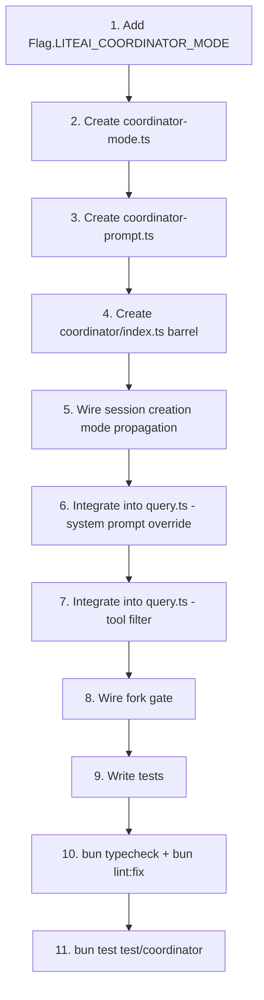

# Part 3: Tool Filtering + Context Injection + Integration Wiring

> **Parent:** [Implementation Plan](file:///C:/Users/ahmed/.gemini/antigravity/brain/47fd34a1-ae4d-4a83-b0d9-2f86648113e9/implementation_plan.md)

---

## 1. Coordinator Tool Filter

#### In [coordinator-mode.ts](file:///d:/liteai/packages/core/src/coordinator/coordinator-mode.ts)

```typescript
/**
 * Tools the coordinator is allowed to use.
 * 
 * This is an explicit allowlist — any tool not in this set is stripped
 * from the coordinator's tool pool. This is safer than a blocklist
 * because new tools added to ToolRegistry are automatically excluded.
 * 
 * Reference: coordinatorMode.ts:29-34 — `INTERNAL_WORKER_TOOLS`
 * (inverted: reference lists worker-internal tools to exclude from the
 *  user context; we list coordinator-allowed tools to include in the pool)
 */
const COORDINATOR_ALLOWED_TOOLS = new Set([
  "task",
  "send_message",
  "yield_turn",
  "task_stop",
  "team_create",
  "team_delete",
])

/**
 * Filter the resolved tool pool to only coordinator-allowed tools.
 * 
 * Called in query.ts after resolveTools() when coordinator mode is active.
 * Returns a new object containing only the allowed tools — does not mutate
 * the input.
 * 
 * MCP tools are explicitly excluded from the coordinator's pool — the
 * coordinator delegates all real work (including MCP tool usage) to workers.
 * 
 * @param tools - The full resolved tool pool from resolveTools()
 * @returns A filtered tool pool containing only coordinator-allowed tools
 */
export function applyCoordinatorToolFilter(
  tools: Record<string, unknown>
): Record<string, unknown> {
  const filtered: Record<string, unknown> = {}
  for (const [name, tool] of Object.entries(tools)) {
    if (COORDINATOR_ALLOWED_TOOLS.has(name)) {
      filtered[name] = tool
    }
  }
  return filtered
}
```

**Why not modify `ToolRegistry.tools()` directly:**
The registry is a shared function used by all sessions. Adding coordinator-awareness to it would require threading session mode through the entire tool resolution chain. A post-filter in `query.ts` is simpler and keeps the coordinator concern isolated.

---

## 2. Worker Context Injection

#### In [coordinator-mode.ts](file:///d:/liteai/packages/core/src/coordinator/coordinator-mode.ts)

```typescript
import { ToolRegistry } from "../tool/registry"

/**
 * Tools that are internal to the coordinator/swarm system and should NOT
 * be listed in the worker capabilities context (workers don't use these).
 */
const INTERNAL_COORDINATOR_TOOLS = new Set([
  "task",
  "send_message",
  "yield_turn",
  // Future:
  // "team_create",
  // "team_delete",
])

/**
 * Build the worker capabilities context string for the coordinator's
 * user context.
 * 
 * Lists the tools that workers have access to, plus MCP server names.
 * This is injected into the coordinator's prompt so it knows what
 * workers can do when writing delegation prompts.
 * 
 * Reference: coordinatorMode.ts:80-109 — `getCoordinatorUserContext()`
 * 
 * @param mcpClients - List of connected MCP clients (for server name listing)
 * @returns Object with `workerToolsContext` key, or empty object if not
 *          in coordinator mode
 */
export function getCoordinatorUserContext(
  sessionMode: Session.Info["sessionMode"],
  mcpClients: ReadonlyArray<{ name: string }>,
): Record<string, string> {
  if (!isCoordinatorMode(sessionMode)) {
    return {}
  }

  // Get all available tool IDs and filter out coordinator-internal ones
  // Note: This is a synchronous snapshot of tool IDs, not the full resolved
  // tool pool. Sufficient for the context string.
  const workerToolNames = Array.from(ASYNC_AGENT_ALLOWED_TOOLS)
    .filter(name => !INTERNAL_COORDINATOR_TOOLS.has(name))
    .sort()
    .join(", ")

  let content = `Workers spawned via the task tool have access to these tools: ${workerToolNames}`

  if (mcpClients.length > 0) {
    const serverNames = mcpClients.map(c => c.name).join(", ")
    content += `\n\nWorkers also have access to MCP tools from connected MCP servers: ${serverNames}`
  }

  return { workerToolsContext: content }
}
```

Where `ASYNC_AGENT_ALLOWED_TOOLS` is imported from `agent/filter.ts` (the existing constant listing tools available to async/background agents).

> [!NOTE]
> The reference has a `scratchpadDir` parameter for cross-worker durable storage. LiteAI doesn't have this feature yet. We omit it from Phase 1 — it can be added when the teammate runner (Phase 3) implements shared state.

---

## 3. Integration Wiring in query.ts

#### [MODIFY] [query.ts](file:///d:/liteai/packages/core/src/session/engine/query.ts)

Two integration points in the query loop:

### 3a. System Prompt Override (~line 404-412)

Currently:
```typescript
// ── Build system prompt ──
const { parts: providerParts, boundary } = await SystemPrompt.resolveSystemPromptSections(model, agent)
const enabledToolNames = new Set(Object.keys(tools))
const skills = await SystemPrompt.skills(agent, enabledToolNames)
const instructions = agent?.omitLiteaiMd ? [] : await InstructionPrompt.system()
const system = [...providerParts, ...(skills ? [skills] : []), ...instructions]
if (format.type === "json_schema") {
  system.push(STRUCTURED_OUTPUT_SYSTEM_PROMPT)
}
```

Modified:
```diff
 // ── Build system prompt ──
+const coordinatorActive = isCoordinatorMode(session.sessionMode)
+
+let system: string[]
+let systemBoundary: number
+
+if (coordinatorActive) {
+  // Coordinator mode: replace entire system prompt with coordinator prompt
+  const { getCoordinatorSystemPrompt } = await import("../../coordinator")
+  const coordinatorPrompt = getCoordinatorSystemPrompt()
+  // Environment info is still valuable for the coordinator (cwd, platform, date)
+  const envParts = await SystemPrompt.environment(model)
+  system = [coordinatorPrompt, ...envParts]
+  systemBoundary = system.length // all static for coordinator
+} else {
   const { parts: providerParts, boundary } = await SystemPrompt.resolveSystemPromptSections(model, agent)
   const enabledToolNames = new Set(Object.keys(tools))
   const skills = await SystemPrompt.skills(agent, enabledToolNames)
   const instructions = agent?.omitLiteaiMd ? [] : await InstructionPrompt.system()
-  const system = [...providerParts, ...(skills ? [skills] : []), ...instructions]
+  system = [...providerParts, ...(skills ? [skills] : []), ...instructions]
+  systemBoundary = boundary
   if (format.type === "json_schema") {
     system.push(STRUCTURED_OUTPUT_SYSTEM_PROMPT)
   }
+}
```

### 3b. Tool Pool Filtering (~line 346-377, after resolveTools)

```diff
 const tools = await resolveTools({ ... })

+// ── Coordinator tool filter ──
+if (coordinatorActive) {
+  const { applyCoordinatorToolFilter } = await import("../../coordinator")
+  const originalCount = Object.keys(tools).length
+  const filteredTools = applyCoordinatorToolFilter(tools)
+  // Replace the tools object (tools is `const` so we reassign individual keys)
+  for (const key of Object.keys(tools)) {
+    if (!(key in filteredTools)) {
+      delete tools[key]
+    }
+  }
+  log.info("coordinator tool filter applied", {
+    sessionID,
+    originalCount,
+    filteredCount: Object.keys(tools).length,
+    allowed: Object.keys(tools),
+  })
+}

 // ── Inject StructuredOutput tool if JSON schema mode enabled ──
```

> [!WARNING]
> The `tools` variable from `resolveTools()` is declared as `const` but it's a mutable `Record<string, AITool>`. We mutate in-place by deleting keys rather than reassigning. An alternative is to change `const tools` to `let tools` and reassign. I lean toward `let` reassignment for clarity.

### 3c. Worker Context Injection (~line 414, in streamInput construction)

The coordinator's user context (listing worker tools) needs to be injected. This happens through the existing user context injection mechanism:

```diff
 const streamInput = {
   user: lastUser,
   agent,
   abort,
   sessionID,
   system,
-  systemBoundary: boundary,
+  systemBoundary,
   step,
   ...
 }
```

The `getCoordinatorUserContext()` output is injected as additional context in the system prompt. It's appended to the `system` array:

```diff
 if (coordinatorActive) {
   const { getCoordinatorUserContext } = await import("../../coordinator")
   const agentCtx = AgentExecutionContext.getStore()
   const mcpClients = agentCtx?.type === "subagent" ? agentCtx.mcpClients ?? [] : []
   const userCtx = getCoordinatorUserContext(session.sessionMode, mcpClients)
   if (userCtx.workerToolsContext) {
     system.push(userCtx.workerToolsContext)
   }
 }
```

---

## 4. Session Creation Mode Propagation

The session creation path needs to detect coordinator mode and set the initial `sessionMode`:

#### In the session start path (wherever `Session.create()` or `Session.createNext()` is called for a new top-level session):

```typescript
import { isCoordinatorMode } from "../../coordinator"

// When creating a new session:
const sessionMode = isCoordinatorMode() ? "Coordinator" : "Normal"
await Session.createNext({
  directory: Instance.directory,
  sessionMode,
})
```

This happens in the HTTP route handler that creates sessions, or in the CLI's session start flow. The exact location depends on where `Session.create()` is called — it's typically in `server/routes/session.ts` or equivalent.

---

## 5. Fork Gate Integration

#### Callers of `isForkSubagentEnabled()`

Need to find all callers and wire `isCoordinator`:

```bash
grep -rn "isForkSubagentEnabled" packages/core/src/
```

Expected locations:
- `runner.ts` or `lifecycle.ts` — where the fork decision is made during task tool execution
- `query.ts` — if fork mode affects the query loop

Each call site gets:
```diff
 isForkSubagentEnabled({
-  isCoordinator: false,
+  isCoordinator: isCoordinatorMode(session.sessionMode),
   isNonInteractive: /* ... */,
 })
```

---

## 6. Test Plan

#### [NEW] `test/coordinator/coordinator-mode.test.ts`

```typescript
import { describe, test, expect, beforeEach, afterEach, mock } from "bun:test"

describe("coordinator-mode", () => {
  describe("isCoordinatorMode", () => {
    test("returns true when sessionMode is 'Coordinator'", () => { ... })
    test("returns false when sessionMode is 'Normal'", () => { ... })
    test("returns false when sessionMode is 'Swarm'", () => { ... })
    test("falls back to Flag when sessionMode is undefined", () => { ... })
  })

  describe("matchSessionMode", () => {
    test("returns stored mode when flag matches", () => { ... })
    test("returns stored mode and warning when flag drifts", () => { ... })
    test("flips env var to match stored coordinator mode", () => { ... })
    test("deletes env var when stored mode is Normal", () => { ... })
    test("returns flag-based mode when sessionMode is undefined", () => { ... })
  })

  describe("applyCoordinatorToolFilter", () => {
    test("keeps only allowed tools", () => {
      const tools = {
        task: {},
        send_message: {},
        read: {},
        edit: {},
        yield_turn: {},
        run_command: {},
      }
      const filtered = applyCoordinatorToolFilter(tools)
      expect(Object.keys(filtered).sort()).toEqual([
        "send_message", "task", "yield_turn"
      ])
    })

    test("returns empty object when no allowed tools present", () => {
      const filtered = applyCoordinatorToolFilter({ read: {}, edit: {} })
      expect(Object.keys(filtered)).toEqual([])
    })

    test("does not mutate input", () => {
      const tools = { task: {}, read: {} }
      applyCoordinatorToolFilter(tools)
      expect(Object.keys(tools)).toEqual(["task", "read"])
    })
  })

  describe("getCoordinatorUserContext", () => {
    test("returns empty when not coordinator mode", () => { ... })
    test("lists worker tools when coordinator mode", () => { ... })
    test("includes MCP server names when present", () => { ... })
    test("excludes coordinator-internal tools from worker list", () => { ... })
  })
})
```

---

## Execution Order


