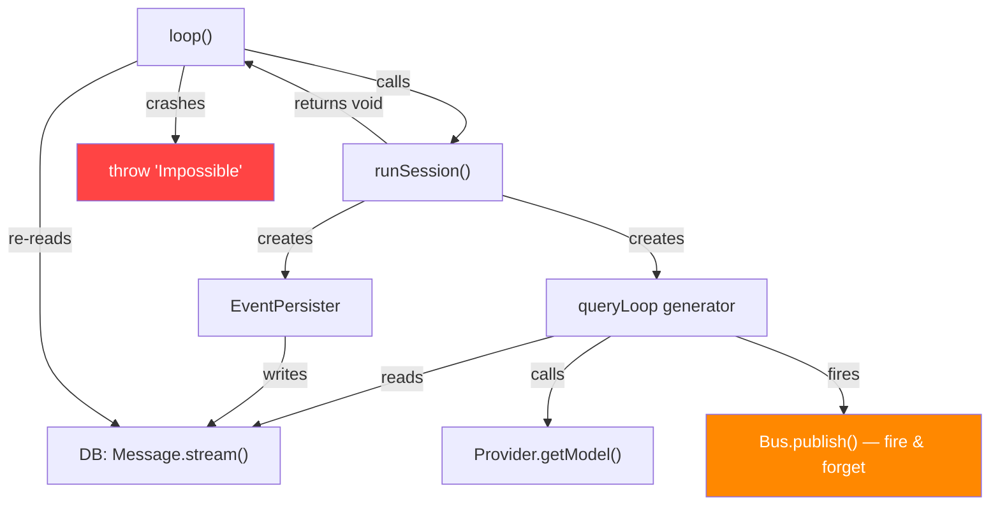
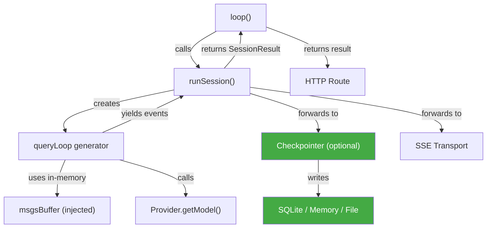

# Engine Loop Decoupling — Architectural Analysis

> **Status**: Phases 1-3 ✅ **DONE** (completed 2026-05-09). Next: Package extraction (Step 2 of extraction roadmap).  
> **Branch**: `engine-loop-decoupling` (TBD)  
> **Scope**: `packages/core/src/session/engine/`  
> **Prerequisite reading**: [langgraph-step-exec-rfc.md](../langgraph-step-exec-rfc.md)

---

## 1. Why the Prior RFC Was Wrong

The existing [langgraph-step-exec-rfc.md](../done/langgraph-step-exec-rfc.md) concluded:

> *"Checkpoints = your per-message SQLite writes (already crash-recoverable)"*  
> *"State = your message DB (single source of truth, append-only, already persistent)"*

This was directionally correct but **architecturally incorrect**. The recent model-resolution crash [`incident-report-model-resolution-crash.md`](../done/model_resolution_crash/incident-report-model-resolution-crash.md) proved that the tight coupling between the loop and the DB is not an asset — it's a liability:

1. **`loop()` re-queries the DB to get its own result** — after `runSession()` finishes, it calls `Message.stream(sessionID)` to find what the orchestrator just computed and discarded. When no assistant message was created (model error), this crashes with `Error: Impossible`.

2. **`queryLoop` depends on `msgsBuffer` loaded from DB** — the generator receives its initial state from a DB read, not from its caller. The loop cannot function without the DB.

3. **`EventPersister` calls `Session.updateMessage()` / `Session.updatePart()` directly** — no abstraction, no interface. The persister IS the DB.

4. **Error notification is done via side-effects** — `Bus.publish(Session.Event.Error)` is called fire-and-forget inside `.catch()` handlers, creating untraceable detached promises through `Database.effect`.

**The root cause**: the prior RFC confused "the loop *reads from* the DB" with "the loop *is already checkpointed*." These are opposite properties. A checkpointed system writes state for external consumption but doesn't need to read it back during forward execution. Our loop does the opposite — it must read from the DB to function, but it doesn't maintain a coherent forward-only state.

---

## 2. LangGraph Architecture — What to Borrow

### Key Insight: The Pregel Loop

After reading `D:\langgraphjs\libs\langgraph-core\src\pregel\loop.ts` and `index.ts`, the critical pattern is:

```
PregelLoop.initialize(params)     ← Load checkpoint (or empty), create channels
  └─ while (loop.tick())          ← Pure forward execution, no DB reads
       └─ runner.tick()           ← Execute tasks (nodes)
  └─ loop.finishAndHandleError()  ← Persist final state, compute output
```

**The loop never reads from the checkpointer during forward execution.** It only reads during `initialize()` (to load a previous state when resuming) and writes during `putWrites()` / `_putCheckpoint()`. Forward execution is purely state-in → state-out via in-memory channels.

### What LangGraph Gets Right

| Concept | LangGraph Implementation | Relevant to LiteAI? |
|---|---|---|
| **Checkpointer as optional interface** | `BaseCheckpointSaver` abstract class with `getTuple`, `put`, `putWrites`, `list`, `deleteThread`. Implementations: `MemorySaver`, `SqliteSaver`, `PostgresSaver` | **Yes** — our `EventPersister` is hardwired to SQLite |
| **Loop returns `output` directly** | `PregelLoop.output` is set in `finishAndHandleError` from channel state | **Yes** — our `loop()` re-queries DB instead |
| **Typed loop status** | `"pending" \| "done" \| "interrupt_before" \| "interrupt_after" \| "out_of_steps"` | **Yes** — our loop has no status concept, just throws |
| **`tick()` returns boolean** | `tick()` → `true` (continue) / `false` (done). Error → throw (caught by `_runLoop`) | **Yes** — clean iteration vs our while(true) with break |
| **Checkpointer promises tracked** | `checkpointerPromises` set + `_trackCheckpointerPromise()` — ensures all async writes complete before stream closes | **Yes** — our `Database.effect` fire-and-forget is the root of unhandled rejections |

### What LangGraph Gets Wrong (For Our Use Case)

| Concept | Why It's Wrong for LiteAI |
|---|---|
| **Channel-based state** | LangGraph models state as named channels with typed reducers. LLM coding agents are message-list-based — the conversation IS the state. Channels add unnecessary indirection. |
| **Graph topology** | LangGraph's `StateGraph` with `addNode` / `addEdge` is designed for complex DAGs. Our loop is fundamentally `Read → Think → Act → Observe` — a sequential loop, not a graph. |
| **Node-as-Runnable** | Every node in LangGraph is a `Runnable` with invoke/stream/batch. Our nodes are just functions. The Runnable abstraction adds overhead without benefit. |
| **LangChain dependency** | `@langchain/core` is a mandatory dependency. It brings `RunnableConfig`, `CallbackManager`, serialization infrastructure. This is unnecessary weight for our runtime. |

---

## 3. Should We Use LangGraphJS?

### Decision: **No.**

| Factor | Assessment |
|---|---|
| **Dependency weight** | `@langchain/langgraph` pulls in `@langchain/core` (callbacks, runnables, serialization). ~200KB+ of abstractions we don't need. |
| **Runtime model** | LangGraph's Pregel model runs "supersteps" where all tasks in a step execute in parallel, then synchronize. Our model is a sequential tool-calling loop. The execution models are fundamentally different. |
| **Streaming** | LangGraph streams via `StreamMode` enum (`values`, `updates`, `messages`, `tools`, `debug`). We stream raw AI SDK events via SSE. The streaming protocols are incompatible. |
| **AI SDK integration** | We use Vercel AI SDK (`ai` package) for model interaction. LangGraph uses LangChain's model interface. Bridging these would require an adapter layer that negates the benefit. |
| **Checkpointer** | The checkpointer interface IS worth borrowing — but as a design pattern, not as a library dependency. A 5-method interface is trivial to implement ourselves. |
| **Testing story** | With our own implementation, we can use `MemoryCheckpointer` in tests without any external dependency. With LangGraphJS, tests would need to mock LangChain internals. |

### What We WILL Borrow (Concepts, Not Code)

1. **`BaseCheckpointSaver` pattern** — abstract class with `getTuple`, `put`, `putWrites`, `list`
2. **Loop status enum** — `"pending" | "done" | "error" | "aborted"`  
3. **Loop returns output directly** — no DB re-query
4. **Checkpointer is optional** — loop functions without one (no persistence = no history, but still works)
5. **Tracked async writes** — checkpointer promises are tracked and awaited before cleanup

---

## 4. Design Principles for the Decoupling

### P1: The loop is a forward-only state machine
The loop receives initial state (messages, config) as input and produces final state (assistant message, parts) as output. During forward execution, it never reads from external storage.

### P2: The checkpointer is an observer, not a participant
The checkpointer receives events and persists them. The loop does not depend on the checkpointer's writes. If the checkpointer is `null`, the loop still completes — but there's no history.

### P3: Results flow through function returns, not side channels
`runSession` returns a typed `SessionResult`. Subagent results flow through the call stack. Error notification is the caller's responsibility, not the generator's.

### P4: The checkpointer interface is storage-agnostic
Implementations: `SqliteCheckpointer` (current behavior), `MemoryCheckpointer` (testing), `FileCheckpointer` (JSONL transcripts). The loop doesn't know or care which one is active.

### P5: Async side-effects are tracked and awaitable
No `Database.effect` fire-and-forget for `Bus.publish`. All async work spawned during the loop is tracked via a promise set and awaited during cleanup.

---

## 5. Current vs Target Architecture

### Current (Coupled)



### Target (Decoupled)



---

## 6. Phase Breakdown

See individual documents:

- [01-checkpointer-interface.md](./01-checkpointer-interface.md) — Define the abstract checkpointer, extract `SqliteCheckpointer`
- [02-self-contained-loop.md](./02-self-contained-loop.md) — Make loop forward-only, typed results, zero DB reads
- [03-event-fan-out.md](./03-event-fan-out.md) — Decouple SSE transport from checkpointer, track async work
- [04-subagent-result-flow.md](./04-subagent-result-flow.md) — Child loops return results directly to parent
- [05-backward-execution.md](./05-backward-execution.md) — Checkpoint-based resume, step-back, replay (future)

---

## 7. Resolved Design Questions

> [!NOTE]
> These questions were identified during the initial analysis and have now been resolved
> through cross-reference analysis of LangGraphJS, Claude Code, and Gemini CLI.

---

### Q1: Compaction in a Forward-Only Loop

**Question**: Currently compaction reads/writes the DB mid-loop. How does it work when the loop never reads from external storage?

#### Reference Analysis

**Claude Code** (`src/services/compact/compact.ts`, `autoCompact.ts`):
- Compaction is a **pure message transformation** — `compactConversation()` takes `messages: Message[]`, sends them to the model for summarization, returns `CompactionResult` containing `boundaryMarker`, `summaryMessages`, `attachments`, `hookResults`.
- The caller (REPL.tsx query loop) **replaces the in-memory message array** with `buildPostCompactMessages(result)`. No DB involved — Claude Code has no DB.
- Auto-compact fires **between turns**, checking `tokenCountWithEstimation(messages)` against `getAutoCompactThreshold(model)`.
- Circuit breaker: `MAX_CONSECUTIVE_AUTOCOMPACT_FAILURES = 3` — stops retrying after 3 failures (prevents 250K+ wasted API calls/day globally).

**Gemini CLI** (`packages/core/src/context/chatCompressionService.ts`):
- `ChatCompressionService.compress()` takes `chat: GeminiChat`, reads `chat.getHistory(true)`, finds a split point via `findCompressSplitPoint()` (70% compress / 30% keep), sends the compressable portion to the model, returns `{ newHistory: Content[], info }`.
- The caller **replaces the chat history** entirely with `newHistory`. Again, pure in-memory transformation.
- Two-phase verification: after initial summary, sends a "probe" to verify no critical info was lost. Novel approach not seen in Claude Code.
- Tool output truncation via `truncateHistoryToBudget()` — clips old function responses exceeding 50K token budget, saving them to disk files.

**LangGraph** (`libs/langgraph-core/src/pregel/loop.ts`):
- State (channels) is always in-memory during forward execution. The checkpointer is an observer that receives `putWrites()` calls — it never feeds data back into the loop mid-execution.
- There is no "compaction" concept — LangGraph manages state via typed channel reducers, not message lists.

#### Design Decision for LiteAI

Compaction becomes a **state transformation on `msgsBuffer`** — consistent with both Claude Code and Gemini CLI:

```
Before: loop → detect overflow → DB.read(messages) → LLM(summarize) → DB.write(summary) → DB.read(newMessages) → continue
After:  loop → detect overflow → LLM(summarize, msgsBuffer.current) → msgsBuffer.current = [marker, summary] → checkpointer.put(msgsBuffer) → continue
```

Specific changes:
1. **`CompactionOrchestrator.process()`** already receives `messages: Message.WithParts[]` from the buffer — it doesn't need DB reads. The remaining DB writes inside `SessionCompaction.process()` (lines creating marker/summary messages via `Session.updateMessage()`) become **checkpointer writes** instead.
2. **`CompactionOrchestrator.createMarker()`** currently calls `Session.updateMessage()` + `Session.updatePart()` — these become checkpointer ops, with the marker appended to `msgsBuffer.current` immediately (already done in loop.ts lines 644-656).
3. **Buffer reset** after compaction already works: `msgsBuffer.current = [markerMsg, summaryWithParts]` (loop.ts line 631). The checkpointer simply persists this new state.
4. **`SessionCompaction.prune()`** remains a post-loop cleanup — it operates on historical data and doesn't affect forward execution. It can stay as a direct DB call (or become a checkpointer lifecycle hook).

**Proactive autocompact** (pipeline.ts `shouldAutocompact()`) already operates on `msgsBuffer` — zero changes needed.

> [!TIP]
> Adopt Gemini CLI's two-phase verification pattern — it adds ~1 extra LLM call but catches lossy summaries that would otherwise degrade session quality over multiple compaction cycles.

---

### Q2: Crash Recovery with Checkpointer

**Question**: Currently, partial writes to DB allow resuming after crash. How is crash recovery preserved in the decoupled model?

#### Reference Analysis

**LangGraph** (`libs/langgraph-core/src/pregel/loop.ts:558-650`):
- **Incremental writes via `putWrites()`**: Every task completion immediately calls `loop.putWrites(taskId, writes)`, which (a) updates in-memory `checkpointPendingWrites`, and (b) if `durability !== "exit"`, asynchronously calls `checkpointer.putWrites(config, writesToSave, taskId)`.
- **Tracked async**: All checkpointer promises go into `checkpointerPromises: Set<Promise<unknown>>` via `_trackCheckpointerPromise()`. Failed promises are kept in the set so `Promise.all()` surfaces errors during cleanup.
- **Full checkpoint on superstep boundary**: After all tasks in a step complete, `_putCheckpoint({ source: "loop" })` writes the full channel state.
- **Resume from checkpoint**: On resume, `PregelLoop.initialize()` calls `checkpointer.getTuple(config)` to load the last consistent state. Pending writes from an interrupted step are replayed by `_prepareSingleTask()`.
- **Durability modes**: `"full"` (write after every task), `"exit"` (write only on graph completion — faster but no mid-run recovery).

**Claude Code** (`src/utils/conversationRecovery.ts`, `sessionStorage.ts`):
- **JSONL append-only transcript**: Every message is appended to `<sessionId>.jsonl` as it's created. This IS the crash recovery mechanism — read the file, chain-walk via `parentUuid`, reconstruct conversation.
- **`deserializeMessagesWithInterruptDetection()`**: On resume, detects whether the session was interrupted mid-turn (user message without assistant response) or mid-tool (tool_use without tool_result). Injects synthetic "Continue from where you left off." messages.
- **`filterUnresolvedToolUses()`**: Strips assistant messages with tool_use blocks that have no matching tool_result — these are artifacts of mid-stream crashes.
- **No atomic consistency**: A crash mid-write can leave a partial JSON line. `loadTranscriptFile()` handles this by catching parse errors per line.

**Gemini CLI** (`packages/core/src`):
- Uses Gemini's `GeminiChat` wrapper with in-memory `Content[]` history. No crash recovery — the session is lost on process exit.
- `chatCompressionService` operates entirely in memory.

#### Design Decision for LiteAI

The current `AsyncPersistenceWriter` already provides incremental writes — it's a proto-checkpointer. The design makes this explicit:

**Crash Recovery Contract:**
1. **During forward execution**: `EventPersister.drainWrites()` produces `PersistenceOp[]` which `AsyncPersistenceWriter.write()` persists. Each write is atomic at the message/part level (SQLite INSERT/UPDATE). A crash between writes loses the current part but all prior writes are durable.

2. **On resume**: `Message.stream(sessionID)` reconstructs the last consistent state from the DB. The loop loads this into `msgsBuffer` (exactly as it does today, loop.ts line 399) and resumes.

3. **What changes**: The `AsyncPersistenceWriter` becomes the `SqliteCheckpointer` implementation. Its `write()` method maps 1:1 to `putWrites()`:

```
PersistenceOp[]  →  CheckpointerOp[]
upsert-part      →  putWrite("part", part)
delta-part       →  putWrite("part-delta", {id, field, delta})
upsert-message   →  putWrite("message", message)
```

4. **What stays the same**: The granularity of crash recovery is unchanged — we recover to the last persisted message/part boundary, same as today. The LangGraph "full checkpoint on superstep boundary" model doesn't apply because our "superstep" is a single LLM turn, and we already persist parts incrementally during streaming.

5. **`MemoryCheckpointer`** for tests: Same interface, writes to `Map<string, Op[]>`. Zero DB dependency in test suites.

> [!IMPORTANT]
> The `processSubtask()` function (loop.ts:867-1089) still calls `Session.updateMessage()` and `Session.updatePart()` directly — 14 raw DB writes. These must be migrated to checkpointer ops. This is the largest single migration task in Phase 1.

**Tracked async adoption** (from LangGraph):
```typescript
// Current: fire-and-forget
await dbWriter.write(ops)

// Target: tracked promises with error surfacing
const promise = checkpointer.putWrites(ops)
this.pendingWrites.add(promise)
promise.then(() => this.pendingWrites.delete(promise))
// In cleanup: await Promise.all(this.pendingWrites)
```

---

### Q3: JSONL Transcripts and FileCheckpointer Unification

**Question**: The existing `SidechainTranscript` writes are a proto-checkpointer. Can `FileCheckpointer` unify with the transcript system?

#### Reference Analysis

**Claude Code** (`src/services/compact/compact.ts:713-717`, `src/utils/sessionStorage.ts`):
- Primary persistence IS the JSONL transcript — `<sessionId>.jsonl` is append-only.
- Each message has `uuid`, `parentUuid`, `timestamp`, `isSidechain` fields.
- **Chain walking**: `buildConversationChain(byUuid, tip)` walks `parentUuid` links from a leaf to reconstruct the conversation. This supports branching (compaction creates new chain heads).
- **Compaction boundary markers**: `SystemCompactBoundaryMessage` with `compactMetadata` records pre-compact token count and preserved segment UUIDs for relinking.
- **Sidechain transcripts**: Written separately before compaction via `writeSessionTranscriptSegment()` — preserves the pre-compaction conversation for audit/replay. This is the KAIROS feature (ant-only).

**LiteAI current** (`src/session/transcript.ts`):
- `SidechainTranscript` is a minimal JSONL writer for subagent conversations.
- Format: `{ isSidechain: true, uuid, parentUuid?, role, content, timestamp }` — same structure as Claude Code's transcript format.
- Write path: `appendFile(path, JSON.stringify(message) + "\n")`.
- Read path: Line-by-line JSON.parse with malformed-line resilience.
- Scope: Only used for subagent transcripts (`agent-${agentId}.jsonl`), not the main session.

#### Design Decision

**No — `FileCheckpointer` should NOT unify with the transcript system.** They serve fundamentally different purposes:

| Concern | Checkpointer | Transcript |
|---|---|---|
| **Purpose** | Crash recovery + state reconstruction | Audit trail + session history |
| **Consistency** | Must be consistent (atomic writes, chain integrity) | Best-effort (malformed lines OK) |
| **Lifecycle** | Mutated by compaction (old state replaced) | Append-only (compaction adds boundary, never deletes) |
| **Read pattern** | Load latest state on resume | Chain-walk from leaf for full history |
| **Scope** | Main session + subagents | Subagents only (currently) |

However, the transcript system SHOULD be extended to serve as the **pre-compaction archive** (Claude Code's `writeSessionTranscriptSegment` pattern):

1. **Before compaction**: Write the full `msgsBuffer.current` to `<sessionId>/transcript.jsonl` as a JSONL chain with `parentUuid` links.
2. **After compaction**: The checkpointer persists the compacted state (marker + summary). The transcript preserves the full pre-compaction history.
3. **On resume (`--resume` / `--continue`)**: Load from checkpointer (fast, compact state), with the transcript available for "replay" or "step-back" operations (Phase 5).

The `SidechainTranscript` format already matches Claude Code's format. Extending it to the main session is trivial — add `isSidechain: false` entries.

> [!TIP]
> The transcript file becomes the foundation for Phase 5 (backward execution / replay). When a user wants to "step back" past a compaction boundary, the system reads the transcript to reconstruct pre-compaction state.

---

### Q4: Plan Mode State Ownership

**Question**: `PlanModeStateRef` is session-scoped in-memory state. Should it be part of the checkpointer's state or remain separate?

#### Reference Analysis

**Claude Code** (`src/bootstrap/state.ts:157-159`, `src/tools/EnterPlanModeTool/`):
- Plan mode is tracked via **process-scoped boolean flags** in the global `STATE` object:
  - `hasExitedPlanMode: boolean` — whether user has exited plan mode this session
  - `needsPlanModeExitAttachment: boolean` — one-time UI notification flag
- Plan mode is NOT part of the message history — it's tracked by the `AppStateStore` and communicated to the model via **attachments** injected into messages.
- On compaction, plan mode state is explicitly preserved via `createPlanModeAttachmentIfNeeded(context)` — injects a plan mode instruction attachment after compaction.
- On resume, plan mode must be re-detected from the conversation history (no persisted flag).

**Gemini CLI** (`packages/core/src/tools/enter-plan-mode.ts`, `config/config.ts`):
- Plan mode is tracked via `Config.setApprovalMode(ApprovalMode.PLAN)` — a global config mutation.
- It controls tool availability (read-only restriction) rather than being a conversation-level state.
- No persistence mechanism — plan mode is lost on process exit.
- No compaction interaction — the compression service doesn't know about plan mode.

**LiteAI current** (`src/session/plan-mode-state.ts`):
- `PlanModeStateRef` is a module-scoped registry keyed by `SessionID`.
- State includes: `active`, `planText`, `planFilePath`, `turnsSincePlanReminder`, `workflowType`.
- Created at session start with defaults, registered in the module-level `Map<SessionID, PlanModeStateRef>`.
- Emits `Session.Event.PlanStateChanged` on `active` transitions.
- `turnsSincePlanReminder` drives the full/sparse reminder injection cycle in `plan-reminder.ts`.
- NOT persisted to DB (was previously in a SQLite JSON column, migrated to in-memory in the plan-mode feature).

#### Design Decision

**Plan mode state should remain SEPARATE from the checkpointer.** The checkpointer owns conversation state (messages, parts). Plan mode is a **session lifecycle concern**, not conversation state.

Rationale:

1. **Orthogonal lifecycle**: Plan mode can be entered/exited multiple times within a single conversation. The `turnsSincePlanReminder` counter resets independently of message state. Embedding it in the checkpointer's state would conflate two independent state machines.

2. **No recovery semantics**: If the process crashes, plan mode state doesn't need to be recovered — the user re-enters plan mode explicitly. Claude Code and Gemini CLI both treat it this way. This is unlike conversation messages, which MUST survive crashes.

3. **Cross-compaction survival**: Plan mode state must survive compaction (the model must stay in plan mode after context is compacted). Both Claude Code and LiteAI handle this via **message injection** (attachments/reminders), not by persisting the flag in the conversation state. The checkpointer would delete it during compaction buffer reset.

4. **Multi-tenant isolation**: `PlanModeStateRef` is keyed by `SessionID` in a process-level registry — it's already properly isolated per session. Moving it into the checkpointer would add unnecessary coupling to the storage layer.

**What SHOULD change:**

The `PlanModeStateRef` should adopt Claude Code's compaction-survival pattern more explicitly:

```typescript
// In CompactionOrchestrator.process(), after buffer reset:
if (planModeStateRef.get().active) {
  // Inject plan mode continuation attachment into post-compaction buffer
  // (currently handled by plan-reminder.ts on next turn, but could miss
  // if the compaction summary doesn't mention plan mode)
  injectPlanModeRestorationAttachment(msgsBuffer, planModeStateRef)
}
```

The `PlanModeStateRef` lifecycle stays as-is:
- Created at session start → registered
- Updated synchronously during turns
- Deregistered at session cleanup
- NOT checkpointed, NOT persisted to DB, NOT part of transcript

> [!WARNING]
> If Phase 5 (backward execution) implements "step back to before plan mode was entered," the `PlanModeStateRef` state at that checkpoint must be reconstructable. This can be done by scanning the message history for `plan_enter` / `plan_exit` tool calls — the state is derived, not stored.
