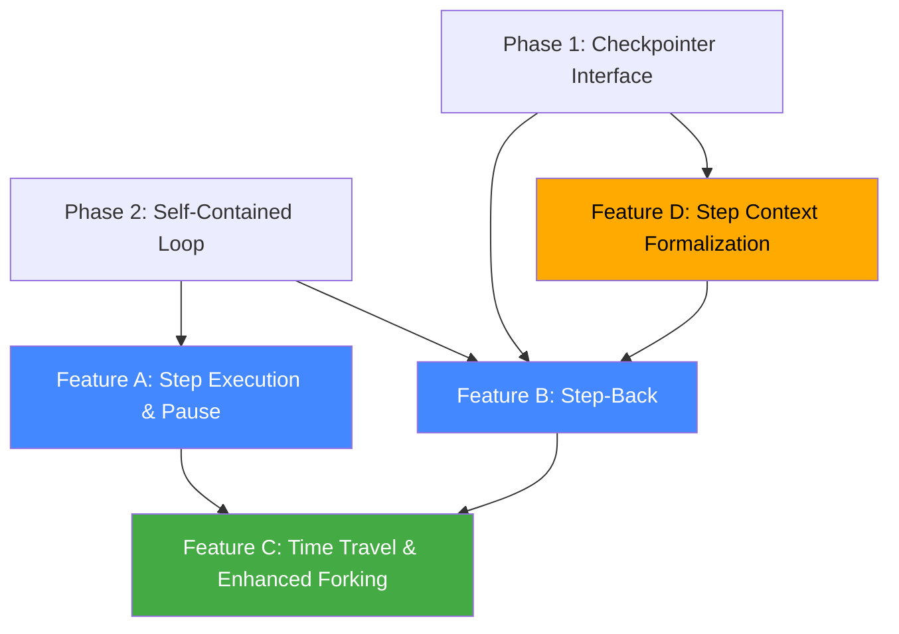

# Phase 5: Backward Execution & Step-Level Control

> **Depends on**: Phase 1 (Checkpointer Interface), Phase 2 (Self-Contained Loop)  
> **Estimated scope**: TBD — requires dedicated design session  
> **Status**: Design phase — not part of the initial branch delivery  
> **Origin**: Incorporates recommendations from the superseded [langgraph-step-exec-rfc.md](../done/langgraph-step-exec-rfc.md) §3, §4, §6

---

## Goal

Enable step-level control over the engine loop: pause between steps, inspect intermediate state, step back to a prior point, and re-execute with different parameters. Together these create an **"agent debugger"** — the highest-value UX feature identified in the prior RFC.

---

## Feature A: Step Execution & Pause

> Origin: [langgraph-step-exec-rfc.md §3](../done/langgraph-step-exec-rfc.md) — rated ✅ "highest-value addition"

### What It Enables

```
User: "Refactor the auth module"

[Step 1] Agent reads files → PAUSE
  User reviews: "Good, it found the right files. Continue."

[Step 2] Agent writes changes → PAUSE
  User reviews: "Wait, that approach is wrong. Step back."

[Step 1 replayed] Agent reads files → PAUSE
  User: "Try using a middleware pattern instead" (injects guidance)

[Step 2] Agent writes different changes → PAUSE
  User: "Perfect. Continue."

[Step 3] Agent runs tests → FINISH
```

### Design Sketch

**Session status extension:**
```typescript
export const Info = z.union([
  z.object({ type: z.literal("idle") }),
  z.object({ type: z.literal("busy") }),
  z.object({ type: z.literal("retry"), ... }),
  z.object({ type: z.literal("paused"), step: z.number() }),  // NEW
])
```

**Loop integration** (enabled by Phase 2's self-contained loop):
- A `stepMode` flag on the prompt input
- The loop yields control between iterations instead of immediately continuing
- A `resume` API that continues from the paused state
- The loop's in-memory state survives the pause (no DB re-read required — Phase 2 guarantee)

**Why this needs Phase 2:** Currently the loop re-reads state from DB on every iteration. In step mode, the loop must hold its state in memory across the pause boundary. Phase 2's forward-only loop makes this possible because the loop owns its state.

### Analysis Tasks

- [ ] Define the pause mechanism: does the loop `await` a resume signal, or does it return and get re-invoked?
- [ ] Design the resume API: HTTP endpoint? Bus event? Direct function call?
- [ ] Determine what state is visible to the user during pause: messages so far? Tool call results? File diffs?
- [ ] Evaluate interaction with Plan Mode: should plan approval be a form of step pause?

---

## Feature B: Step-Back

> Origin: [langgraph-step-exec-rfc.md §4](../done/langgraph-step-exec-rfc.md) — rated ✅ "add this"

### What It Enables

Undo the last LLM step and re-execute. Different from `SessionRevert` (which only undoes file changes) and `Session.fork()` (which creates a new session).

### Design Sketch

```
step-back(sessionID, stepOrMessageID) =
  1. Restore file state:  Snapshot.restore(checkpoint.snapshot)
  2. Delete messages after checkpoint: checkpointer.truncateAfter(checkpointID)
  3. Optionally inject new user guidance
  4. Re-enter loop: runSession({ initialMessages: checkpoint.messages })
```

**Building blocks that already exist:**
- `removeMessage()` — deletes messages from DB
- `Snapshot.restore()` — restores git tree state
- `loop({ resume_existing: true })` — re-enters an existing session
- Step-start/step-finish parts — capture snapshots at step boundaries

**What's missing:** Orchestrating them together, with a clean API.

### Checkpoint Data (extends Phase 1 Checkpointer)

```typescript
interface CheckpointData {
  id: CheckpointID            // uuid6, monotonically increasing
  parentID?: CheckpointID
  sessionID: SessionID
  step: number
  messages: Message.WithParts[]
  snapshot?: string            // git tree hash for file state
  timestamp: number
  metadata: {
    agent: string
    model: { providerID: string; modelID: string }
    trigger: "user" | "subtask" | "compaction" | "retry"
  }
}
```

### Analysis Tasks

- [ ] Define checkpoint granularity: per-turn? per-tool-call? per-step?
- [ ] Design the step-back API: what inputs does the user provide?
- [ ] Evaluate storage cost: full message list per checkpoint vs delta compression
- [ ] Design the relationship between checkpoints and git snapshots (1:1 or independent?)
- [ ] Determine interaction with subagents: does step-back in parent also revert child sessions?

---

## Feature C: Time Travel & Enhanced Forking

> Origin: [langgraph-step-exec-rfc.md §6](../done/langgraph-step-exec-rfc.md) — rated ⚠️ "enhance"

### What Exists

- `Session.fork(messageID)` — copies a session up to a message boundary, creates a new branch
- `SessionRevert.revert(messageID)` — rolls back file changes after a message
- `SessionRevert.unrevert()` — restores file state to before the revert

### What's Missing

**Fork + auto-resume**: Fork a session to a specific point and automatically re-enter the loop (currently fork just copies messages, doesn't re-execute).

**Fork + parameter override**: Fork and change the model/agent for the next step:
```
"The agent went down the wrong path at step 3.
Go back to step 2 and try with a different model."
```

**This is step-back (Feature B) + fork combined** — the combination is more useful than either alone.

### Analysis Tasks

- [ ] Design the API: `fork(sessionID, messageID, { model?, agent?, guidance? })`?
- [ ] Determine if fork creates a new session ID or reuses the existing one
- [ ] Evaluate UI for presenting forked session branches (tree view?)

---

## Feature D: Step Context Formalization

> Origin: [langgraph-step-exec-rfc.md §2](../done/langgraph-step-exec-rfc.md) — rated ⚠️ "partial"

### The RFC's Valid Insight

> *"Don't add a new state object. Instead, promote your existing Trace system to be the 'step checkpoint' concept."*

The Trace system already records per-step:
- Agent name
- Model + provider
- System prompt (with hash dedup)
- Tool schemas (with hash dedup)
- Message context IDs
- Timing

**This IS the step state.** Making it queryable (e.g., "give me the context of step 3") enables step-back and debugging.

### What This Means for the Checkpointer

The `CheckpointData` in Feature B should incorporate Trace data, not duplicate it. The Trace becomes the metadata portion of each checkpoint.

### Analysis Tasks

- [ ] Audit the current Trace system: what does it capture, where is it stored?
- [ ] Design the relationship between Trace and CheckpointData: embed, reference, or merge?
- [ ] Determine if Trace should be exposed via API for debugging UI

---

## Dependency Graph



| Color | Meaning |
|---|---|
| 🔵 Blue | High value, clear design path |
| 🟢 Green | High value, depends on blue items |
| 🟡 Yellow | Moderate value, can be done incrementally |
