# RFC: Plan Mode — System Prompt Reinforcement & Stop-Drift Recovery

**Status**: Approved for implementation  
**Date**: 2026-04-18  
**Scope**: `packages/core` — session engine, plan mode state, bundled prompts  

---

## 1. Problem Statement

When the `plan_enter` tool is executed, the agent transitions into "plan mode" — a read-only phase where the agent explores the codebase and designs an implementation plan before writing any code. Two critical bugs prevent plan mode from working correctly:

**Bug 1 — No system prompt reinforcement**: The workflow instructions (from `plan-interview.md` or `plan-workflow.md`) are delivered **only once** as a tool result from `plan_enter`. On all subsequent turns, the system prompt contains **zero references** to plan mode. The model loses context and drifts from the read-only constraint.

**Bug 2 — Premature stop (stop-drift)**: The model emits `finish=stop` (plain text response) instead of calling `question` or `plan_exit` as required by the workflow. The engine sees `finish=stop` and exits the query loop, ending the session prematurely. The engine has no mechanism to detect or recover from this during active plan mode.

### Evidence (from `trace_plan_mode.json`)

The trace captures a real session where a user asked the agent to build a web app. The agent correctly called `plan_enter(interviewMode: true)` and received the interview workflow instructions. The sequence was:

| Step | Action | Finish Reason | Result |
|------|--------|---------------|--------|
| 2 | `plan_enter` tool executed | `tool-calls` | ✅ Workflow instructions returned as tool result |
| 3 | Model called `write` to create plan skeleton | `tool-calls` | ✅ Plan file created |
| 4 | Model emitted plain text | **`stop`** | ❌ Session ended — model should have called `question` |

Server logs confirm:
```
finish=stop queryLoop exiting: model finished
```

The interview workflow explicitly states:
> "Your turn should only end by either: Using the question tool to gather more information, or calling plan_exit when the plan is ready for approval."

---

## 2. Root Cause Analysis

### 2.1 System Prompt Architecture (Bug 1)

The system prompt is built in `query.ts` (line 362-368) by composing:
1. `SystemPrompt.resolveSystemPromptSections()` — loads sections from `system.md`
2. `SystemPrompt.skills()` — skill descriptions
3. `InstructionPrompt.system()` — user instruction files

**None of these check `planModeState.active`.** The system prompt is identical whether plan mode is active or not.

The existing `injectPlanAttachment()` in `plan-reminder.ts` is designed for the **post-plan build phase** (`active === false` + `planText` set) — it injects plan reminders during implementation, not during the planning phase itself. When `active === true`, it explicitly returns early (line 51):

```typescript
if (planModeState.active || !planModeState.planText) {
  return { messages, updatedState: planModeState }
}
```

### 2.2 Query Loop Exit Logic (Bug 2)

The query loop in `query.ts` has two exit points that check `finish`:

**Lines 111-118 (top of loop):**
```typescript
if (
  lastAssistant?.finish &&
  !["tool-calls", "unknown"].includes(lastAssistant.finish) &&
  lastUser.id < lastAssistant.id
) {
  break
}
```

**Lines 509-517 (end of loop):**
```typescript
const modelFinished = assistantMessage.finish && !["tool-calls", "unknown"].includes(assistantMessage.finish)
if (modelFinished && !assistantMessage.error) {
  break
}
```

Neither exit point checks `planModeState.active`. When the model returns `finish=stop` during plan mode, the engine treats it identically to a normal conversation stop — it exits. There is no feedback loop to tell the model "you must call a tool before stopping."

### 2.3 State Tracking Gap

`PlanModeState` (in `plan-mode-state.ts`) tracks `active`, `planText`, `planFilePath`, and `turnsSincePlanReminder`, but does **not** track which workflow type was selected (`interview` vs `5phase`). This information is needed for future-proofing the system prompt reinforcement (e.g., different constraints for different workflows).

---

## 3. Affected Files

| File | Path | Role |
|------|------|------|
| `plan-mode-state.ts` | `src/session/plan-mode-state.ts` | In-memory plan mode state definition & registry |
| `plan.ts` | `src/tool/plan.ts` | `plan_enter` / `plan_exit` tool implementations |
| `query.ts` | `src/session/engine/query.ts` | Core query loop — system prompt assembly & exit logic |
| `loop.ts` | `src/session/engine/loop.ts` | Event-sourced orchestrator — handles control events |
| `events.ts` | `src/session/events.ts` | Engine event type definitions |
| `plan-reminder.ts` | `src/session/engine/plan-reminder.ts` | Post-plan reminder injection (NOT changed, context only) |
| `system.ts` | `src/session/engine/system.ts` | System prompt section resolver (NOT changed, context only) |
| `instruction.ts` | `src/session/engine/instruction.ts` | Instruction prompt builder (NOT changed, context only) |
| `plan-interview.md` | `src/bundled/prompts/misc/plan-interview.md` | Interview workflow prompt (NOT changed, context only) |
| `plan-workflow.md` | `src/bundled/prompts/misc/plan-workflow.md` | 5-phase workflow prompt (NOT changed, context only) |
| **NEW** `plan-active-reminder.md` | `src/bundled/prompts/misc/plan-active-reminder.md` | Condensed per-turn constraint text |

---

## 4. Implementation Plan

### 4.1 Extend `PlanModeState` with `workflowType`

**File**: `src/session/plan-mode-state.ts`

Add `workflowType` to the `PlanModeState` interface so the system knows which workflow was selected:

```typescript
export interface PlanModeState {
  active: boolean
  planText: string | undefined
  planFilePath: string
  turnsSincePlanReminder: number
  /** Which workflow was selected at plan_enter time. Used to reinforce
   * the correct constraints in the system prompt on every turn. */
  workflowType: "interview" | "5phase" | undefined
}
```

Update `createDefaultPlanModeState()` to include `workflowType: undefined`.

### 4.2 Store `workflowType` in `plan_enter` / Clear in `plan_exit`

**File**: `src/tool/plan.ts`

In `PlanEnterTool.execute()` at the `PlanModeStateRef.update()` call (line 188):

```typescript
PlanModeStateRef.for(ctx.sessionID).update((s) => ({
  ...s,
  active: true,
  turnsSincePlanReminder: 0,
  workflowType: params.interviewMode ? "interview" : "5phase",
}))
```

In `PlanExitTool.execute()` at the `PlanModeStateRef.update()` call (line 84):

```typescript
PlanModeStateRef.for(ctx.sessionID).update((s) => ({
  ...s,
  active: false,
  turnsSincePlanReminder: 0,
  planText: params.plan,
  workflowType: undefined,
}))
```

### 4.3 Create Plan-Active Reminder Prompt

**File (NEW)**: `src/bundled/prompts/misc/plan-active-reminder.md`

A condensed, per-turn system prompt section. Not the full workflow — just the hard constraints that the model must obey:

```markdown
## ACTIVE PLAN MODE — Enforced Constraints

Plan mode is currently active. You MUST follow these rules on EVERY turn:

1. **Read-only**: Do NOT edit, write, or delete any files EXCEPT the designated plan file.
2. **No code execution**: Do NOT run build, test, deploy, or any mutating commands.
3. **Turn termination**: Your turn MUST end by calling one of these tools:
   - `question` — to ask the user for clarification
   - `plan_exit` — when the plan is complete and ready for approval
4. **Do NOT** end your turn with plain text. Always call one of the two tools above.
```

### 4.4 Inject Reinforcement into System Prompt

**File**: `src/session/engine/query.ts`

After the system prompt sections are built (around line 365-368), inject the plan-mode reinforcement when active:

```typescript
// ── Build system prompt ──
const { parts: providerParts, boundary } = await SystemPrompt.resolveSystemPromptSections(model, agent)
const skills = await SystemPrompt.skills(agent)
const system = [...providerParts, ...(skills ? [skills] : []), ...(await InstructionPrompt.system())]
if (format.type === "json_schema") {
  system.push(STRUCTURED_OUTPUT_SYSTEM_PROMPT)
}

// ── Plan mode system prompt reinforcement (per-turn) ──
// When plan mode is active, inject a condensed constraint reminder into
// the system prompt on EVERY turn. This ensures the model maintains
// awareness of its plan mode obligations regardless of context window
// size or conversation length. The full workflow was delivered once via
// the plan_enter tool result — this section reinforces the hard rules.
if (planModeState.active) {
  const planReminder = await Bundled.miscPrompt("plan-active-reminder")
  system.push(planReminder)
}
```

### 4.5 Stop-Drift Recovery in Query Loop

**File**: `src/session/engine/query.ts`

Add a `planStopCorrectionCount` counter at the top of `queryLoop` (alongside `step`) and modify the `modelFinished` exit check (lines 509-517):

```typescript
// At top of queryLoop, alongside existing counters:
const MAX_PLAN_STOP_CORRECTIONS = 2
let planStopCorrectionCount = 0

// Replace the existing modelFinished check:
const modelFinished = assistantMessage.finish && !["tool-calls", "unknown"].includes(assistantMessage.finish)
if (modelFinished && !assistantMessage.error) {
  // ── Plan mode stop-drift recovery ──
  // When plan mode is active, the model MUST call question or plan_exit.
  // A bare "stop" means it drifted. Yield a correction event for the
  // orchestrator, up to MAX_PLAN_STOP_CORRECTIONS times.
  if (planModeState.active && planStopCorrectionCount < MAX_PLAN_STOP_CORRECTIONS) {
    planStopCorrectionCount++
    log.warn("plan mode stop-drift: model stopped without calling question/plan_exit", {
      sessionID,
      correctionCount: planStopCorrectionCount,
      max: MAX_PLAN_STOP_CORRECTIONS,
    })
    yield {
      type: "control",
      action: "plan-stop-correction",
      payload: { correctionCount: planStopCorrectionCount },
    } satisfies EngineEvent.GeneratorResultEvent
    continue
  }
  if (format.type === "json_schema") {
    log.info("queryLoop: structured output missing, ending", { sessionID })
  }
  break
}
```

**Key insight**: After yielding the `plan-stop-correction` event, the `continue` statement takes us back to the top of the `while(true)` loop. The orchestrator in `loop.ts` will have injected a synthetic user message into `msgsBuffer.current` (with a newer ID than the stopped assistant), so the early exit check at lines 111-118 won't trigger because `lastUser.id > lastAssistant.id`.

### 4.6 Handle `plan-stop-correction` in the Orchestrator

**File**: `src/session/engine/loop.ts`

Add a new case to the `control` event switch in `runSessionInner()`, alongside the existing handlers (`subtask`, `overflow`, `loop-detected`, etc.):

```typescript
case "plan-stop-correction": {
  const { correctionCount } = event.payload as { correctionCount: number }
  log.warn("plan mode stop-drift: injecting correction message", {
    sessionID,
    correctionCount,
  })

  const lastUser = findLastUserFromBuffer(msgsBuffer.current)
  if (lastUser) {
    await injectCorrectionMessage({
      sessionID,
      lastUser,
      text: [
        "<system-correction>",
        "You are in plan mode. Your turn MUST end by calling one of these tools:",
        "- `question` — to ask the user for clarification",
        "- `plan_exit` — when your plan is complete",
        "",
        "You stopped without calling either tool. Please continue your planning work",
        "and end your turn with the appropriate tool call.",
        "</system-correction>",
      ].join("\n"),
      msgsBuffer,
    })
  }

  // Clean up instruction prompt before next turn
  if (currentAssistantMessage) {
    await InstructionPrompt.clear(currentAssistantMessage.id)
  }
  break
}
```

**Reuses existing infrastructure**: The `injectCorrectionMessage` helper already exists in `loop.ts` (used by the loop detection recovery system). It creates a persisted synthetic user message and appends it to `msgsBuffer.current`.

### 4.7 Type Extension

**File**: `src/session/events.ts`

Add `"plan-stop-correction"` to the `GeneratorResultEvent.action` discriminated union so the control event is properly typed:

```typescript
// Find the existing action union and add the new variant:
action: "subtask" | "compaction-task" | "overflow" | "compact" | "loop-detected" | "stop" | "continue" | "plan-stop-correction"
```

---

## 5. Architecture Diagram

```mermaid
sequenceDiagram
    participant User
    participant Engine as queryLoop (query.ts)
    participant Orchestrator as runSessionInner (loop.ts)
    participant LLM as LLM Provider

    User->>Engine: "Build me a web app"
    Engine->>LLM: system prompt (no plan mode section)
    LLM-->>Engine: calls plan_enter(interviewMode: true)
    Note over Engine: planModeState.active = true<br/>workflowType = "interview"

    rect rgb(40, 80, 40)
        Note over Engine: Subsequent turns (plan mode active)
        Engine->>LLM: system prompt + ACTIVE PLAN MODE section ✅
        LLM-->>Engine: calls write (plan skeleton) → finishReason: tool-calls
        Engine->>LLM: system prompt + ACTIVE PLAN MODE section ✅
        
        alt Model returns finish=stop (drift)
            LLM-->>Engine: plain text → finishReason: stop
            Engine->>Orchestrator: yield control: plan-stop-correction
            Orchestrator->>Orchestrator: injectCorrectionMessage
            Engine->>LLM: system prompt + ACTIVE PLAN MODE + correction message
            LLM-->>Engine: calls question → finishReason: tool-calls ✅
        end
    end

    LLM-->>Engine: calls plan_exit(plan)
    Note over Engine: planModeState.active = false
    Engine->>LLM: system prompt (no plan mode section)
```



---

## 6. Data Flow Summary

```
plan_enter called
  └─► PlanModeState.active = true, workflowType = "interview"|"5phase"
  └─► Workflow instructions returned as tool result (one-shot)

Every subsequent turn (while active=true):
  └─► query.ts reads planModeState.active
  └─► Injects plan-active-reminder.md into system prompt array
  └─► If LLM returns finish=stop:
        └─► queryLoop yields control: "plan-stop-correction"
        └─► loop.ts injects corrective user message into msgsBuffer
        └─► Loop continues → LLM gets another chance
        └─► After MAX_PLAN_STOP_CORRECTIONS (2), accept stop

plan_exit called
  └─► PlanModeState.active = false, workflowType = undefined
  └─► Plan-active-reminder no longer injected
```

---

## 7. Design Decisions

### Why a system prompt section instead of a user message injection?

The system prompt is **authoritative** — models weight it more heavily than user messages. A system-level constraint ("ACTIVE PLAN MODE") is harder for the model to ignore than a user-level reminder. This is consistent with how `STRUCTURED_OUTPUT_SYSTEM_PROMPT` is handled.

### Why not re-inject the full workflow on every turn?

The full `plan-interview.md` (49 lines) or `plan-workflow.md` (70 lines) would waste context window budget. The workflow was already delivered as a tool result and is in the conversation history. The system prompt section only needs to reinforce the **hard constraints** — the rules the model must never violate.

### Why a correction message instead of tool filtering?

Tool filtering (removing `write`/`edit` tools during plan mode) was considered but rejected for now because:
1. The model needs `write` to create/edit the plan file itself
2. Distinguishing "plan file write" from "arbitrary file write" requires path-based filtering that adds complexity
3. The correction message approach is simpler and follows the existing loop-detection recovery pattern

### Why `MAX_PLAN_STOP_CORRECTIONS = 2`?

The model gets 3 total attempts (original + 2 corrections). This is consistent with the loop detection escalation limit (`loopDetectionCount >= 3` in loop.ts line 461). Two corrections is enough to recover from transient drift without burning excessive tokens.

---

## 8. Verification Plan

### Scoped Tests

```bash
bun test test/session/engine
```

Specific test cases:
1. **System prompt injection**: Mock `planModeState.active = true`, verify `plan-active-reminder` content appears in the `system` array passed to the LLM.
2. **Stop-drift recovery**: Mock LLM returning `finish=stop` during active plan mode. Assert `plan-stop-correction` control event is yielded. Assert the loop continues after correction injection. Assert the loop breaks after `MAX_PLAN_STOP_CORRECTIONS`.
3. **State lifecycle**: Verify `workflowType` is set by `plan_enter`, persisted across turns, and cleared by `plan_exit`.
4. **No regression**: Verify `finish=stop` still exits normally when `planModeState.active = false`.

### Manual Verification

1. Start a session, ask for a complex task that triggers `plan_enter`
2. Check Langfuse trace — verify `ACTIVE PLAN MODE` section appears in system prompt on turns 2+
3. If model stops with `finish=stop`, verify correction message appears in logs and the model retries
4. After `plan_exit`, verify `ACTIVE PLAN MODE` section is gone from system prompt

### Typecheck & Lint

```bash
bun typecheck 2>&1 | Out-String
bun lint:fix
```

---

## 9. Files to Read Before Starting Implementation

These files provide essential context. Read them in this order:

1. **`src/session/plan-mode-state.ts`** (157 lines) — State definition, `PlanModeStateRef` class
2. **`src/tool/plan.ts`** (224 lines) — `PlanEnterTool` and `PlanExitTool` implementations
3. **`src/session/engine/query.ts`** (541 lines) — Core query loop, system prompt assembly, exit logic
4. **`src/session/engine/loop.ts`** (1168 lines) — Event-sourced orchestrator, control event handlers, `injectCorrectionMessage`
5. **`src/session/engine/plan-reminder.ts`** (170 lines) — Post-plan reminder injection (context only, not modified)
6. **`src/session/engine/system.ts`** (151 lines) — System prompt section resolver (context only)
7. **`src/bundled/prompts/misc/plan-interview.md`** (49 lines) — Interview workflow prompt
8. **`src/bundled/prompts/misc/plan-workflow.md`** (70 lines) — 5-phase workflow prompt
9. **`src/session/events.ts`** — Engine event type definitions (for `GeneratorResultEvent.action`)
10. **`docs/trace_plan_mode.json`** — The original trace that exposed these bugs
